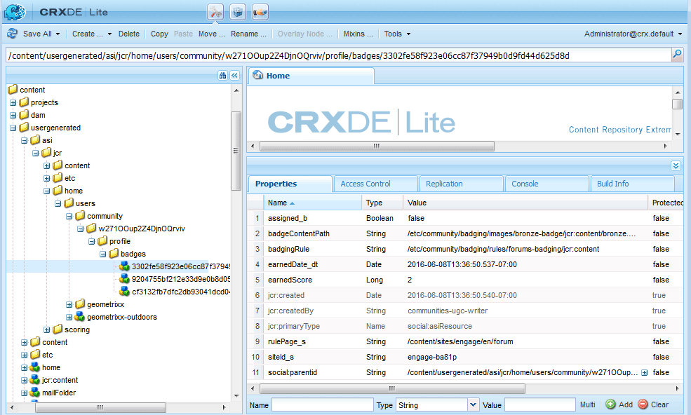

# Scores en Badges Essentials {#scoring-and-badges-essentials}

Met de functie AEM Communities scoring en badges kunnen leden van de gemeenschap worden geïdentificeerd en beloond.

De details van het instellen van de functie worden beschreven op

* [Scores en badges van gemeenschappen](implementing-scoring.md)

Deze pagina bevat aanvullende technische details:

* Hoe kan ik [een badge](#displaying-badges) weergeven als afbeelding of tekst?
* Hoe u uitgebreide [foutopsporingslogbestand](#debug-log-for-scoring-and-badging) kunt inschakelen
* Hoe te om [toegang tot UGC](#ugc-for-scoring-and-badging) met betrekking tot het scoring en het badging

>[!CAUTION]
>
>De in CRXDE Lite zichtbare implementatiestructuur kan worden gewijzigd.

## Badges {#displaying-badges} weergeven

Of een badge als tekst of beeld wordt getoond wordt gecontroleerd op de cliëntkant in het malplaatje van GB.

Zoek bijvoorbeeld naar `this.isAssigned` in `/libs/social/forum/components/hbs/topic/list-item.hbs`:

```
{{#each author.badges}}

  {{#if this.isAssigned}}

    <div class="scf-badge-text">

      {{this.title}}

    </div>

  {{/if}}

{{/each}}

{{#each author.badges}}

  {{#unless this.isAssigned}}

    

  {{/unless}}

{{/each}}
```

Indien waar (true), geeft isAssigned aan dat de badge voor een rol is toegewezen en dat de badge als tekst moet worden weergegeven.

Indien onwaar (false), wordt bij Toewijzen aangegeven dat de badge is toegekend voor een verdiende score en dat het badge moet worden weergegeven als een afbeelding.

Wijzigingen in dit gedrag moeten worden aangebracht in een aangepast script (overschrijven of bedekken). Zie [Aanpassing aan clientzijde](client-customize.md).

## Foutopsporingslogbestand voor scores en Badging {#debug-log-for-scoring-and-badging}

Voor foutopsporing in scores en badging kan een aangepast logbestand worden ingesteld. De inhoud van dit logbestand kan dan aan de klantenondersteuning worden verstrekt als er problemen met de functie worden ondervonden.

Voor gedetailleerde instructies gaat u naar [Aangepast logbestand maken](../../help/sites-deploying/monitoring-and-maintaining.md#create-a-custom-log-file).

U kunt als volgt snel een logbestand instellen:

1. Toegang krijgen tot bijvoorbeeld **[!UICONTROL Adobe Experience Manager Web Console Log Support]**

   * http://localhost:4502/system/console/slinglog

1. Selecteer **[!UICONTROL Add new logger]**

   1. Selecteer `DEBUG` voor **[!UICONTROL Log Level]**
   1. Voer bijvoorbeeld een naam in voor **[!UICONTROL Log File]**

      * logs/scoring-debug.log
   1. Voer twee **[!UICONTROL Logger]** (klasse)-items in (met pictogram `+`)

      * `com.adobe.cq.social.scoring`
      * `com.adobe.cq.social.badging`
   1. Selecteer **[!UICONTROL Save]**


Logboekvermeldingen weergeven:

* Vanuit de webconsole

   * Onder het menu **[!UICONTROL Status]**
   * Selecteer **[!UICONTROL Log Files]**
   * Zoek naar uw naam van het Logdossier, zoals `scoring-debug`

* Op de lokale schijf van de server

   * Het logbestand bevindt zich op &lt;*server-install-dir*>/crx-quickstart/logs/&lt;*log-file-name*>.log
   * Bijvoorbeeld, `.../crx-quickstart/logs/scoring-debug.log`


## UGC voor Scores en Badging {#ugc-for-scoring-and-badging}

Het is mogelijk om UGC met betrekking tot het scoring en het aanbrengen van merktekens te bekijken wanneer gekozen SRP of JSRP of MSRP, maar niet ASRP is. (Zie [Community Content Storage](working-with-srp.md) en [Storage Resource Provider Overview](srp.md) als u niet bekend bent met deze termen.)

In de beschrijvingen voor toegang tot scoring- en merkgegevens wordt JSRP gebruikt, omdat de UGC gemakkelijk toegankelijk is met [CRXDE Lite](../../help/sites-developing/developing-with-crxde-lite.md).

**JSRP bij auteur**: experimenteren in de auteursomgeving resulteert in UGC die alleen zichtbaar is vanuit de auteursomgeving.

**JSRP bij publicatie**: ook als het testen op de publicatieomgeving , is het nodig om toegang te krijgen tot CRXDE Lite met beheerdersrechten voor een publicatie - instantie . Als de publicatie-instantie wordt uitgevoerd in [productiemodus](../../help/sites-administering/production-ready.md) (no samplcontent runmode), is het nodig om CRXDE Lite [in te schakelen.](../../help/sites-administering/enabling-crxde-lite.md)

De basislocatie van UGC op JSRP is `/content/usergenerated/asi/jcr/`.

### API&#39;s voor scores en Badging {#scoring-and-badging-apis}

De volgende API&#39;s zijn beschikbaar voor gebruik:

* [com.adobe.cq.social.scoring.api](https://docs.adobe.com/content/docs/en/aem/6-3/develop/ref/javadoc/com/adobe/cq/social/scoring/api/package-summary.html)
* [com.adobe.cq.social.badging.api](https://docs.adobe.com/content/docs/en/aem/6-3/develop/ref/javadoc/com/adobe/cq/social/badging/api/package-summary.html)

De recentste JavaDocs voor de geïnstalleerde [versies](deploy-communities.md#LatestReleases) zijn beschikbaar aan ontwikkelaars van de bewaarplaats van de Adobe. Zie [Maven gebruiken voor Gemeenschappen: Javadocs](maven.md#javadocs).

**De locatie en indeling van de UGC in de opslagplaats kunnen zonder waarschuwing** worden gewijzigd.

### Voorbeeld-instelling {#example-setup}

De schermafbeeldingen van gegevensopslagruimte zijn afkomstig van het instellen van scoring en badging voor een forum op twee verschillende AEM sites:

1. Een AEM site met een unieke id (een communitysite die met een wizard is gemaakt):

   * De Aan de slag-zelfstudie (Inschakelen) gebruiken die is gemaakt tijdens de [zelfstudie om aan de slag te gaan](getting-started.md)
   * Zoek het knooppunt voor forumpagina

      * `/content/sites/engage/en/forum/jcr:content`
   * Eigenschappen voor scoring en badges toevoegen

      * `scoringRules = [/etc/community/scoring/rules/comments-scoring,`

         `/etc/community/scoring/rules/forums-scoring]`
      * `badgingRules =[/etc/community/badging/rules/comments-scoring,`

         `/etc/community/badging/rules/forums-scoring]`
   * Zoek het knooppunt voor de forumcomponent

      * `/content/sites/engage/en/forum/jcr:content/content/primary/forum`

         ( `sling:resourceType = social/forum/components/hbs/forum`)
   * Eigenschap toevoegen aan weergaveknoppen

      * `allowBadges = true`
   * Een gebruiker ondertekent in, maakt een forumonderwerp en krijgt een bronzen badge toegewezen


1. Een AEM *zonder* een unieke id:

   * Gebruikend [Community Components guide](components-guide.md)
   * Zoek het knooppunt voor forumpagina

      * `/content/community-components/en/forum/jcr:content`
   * Eigenschappen voor scoring en badges toevoegen

      ```
      scoringRules = [/etc/community/scoring/rules/comments-scoring,
      /etc/community/scoring/rules/forums-scoring]
      ```

      ```
      badgingRules =[/etc/community/badging/rules/comments-scoring,
      /etc/community/badging/rules/forums-scoring]
      ```

   * Zoek het knooppunt voor de forumcomponent

      * `/content/community-components/en/forum/jcr:content/content/forum`

         ( `sling:resourceType = social/forum/components/hbs/forum`)
   * Eigenschap toevoegen aan weergaveknoppen

      * `allowBadges = true`
   * Een gebruiker ondertekent in, maakt een forumonderwerp en krijgt een bronzen badge toegewezen


1. Aan een gebruiker wordt een moderatorbadge toegewezen via cURL:

```shell
curl -i -X POST -H "Accept:application/json" -u admin:admin -F ":operation=social:assignBadge" -F "badgeContentPath=/etc/community/badging/images/moderator/jcr:content/moderator.png" http://localhost:4503/home/users/community/w271OOup2Z4DjnOQrviv/profile.social.json
```

Aangezien een gebruiker twee bronzen badges heeft verdiend en een moderatorbadge heeft gekregen, is dit hoe de gebruiker met hun forumingang verschijnt:


>[!NOTE]
>
>In dit voorbeeld worden de volgende aanbevolen procedures niet gevolgd:
>
>* de namen van scoringregels moeten globaal uniek zijn; ze mogen niet met dezelfde naam eindigen.\
   >  Een voorbeeld van wat *not* moet doen:\
   >  /etc/community/scoring/rules/site1/forums-scoring\
   >  /etc/community/scoring/rules/site2/forums-scoring
   >
   >
* maken van unieke badge-afbeeldingen voor verschillende AEM sites

>


### Toegang tot UGC {#access-scoring-ugc}

Het gebruik van de [APIs](#scoring-and-badging-apis) heeft de voorkeur.

Voor onderzoeksdoeleinden, gebruikend JSRP bijvoorbeeld, is de basisomslag die scores bevat

* `/content/usergenerated/asi/jcr/scoring`

Het onderliggende knooppunt van `scoring`is de naam van de scoreregel. Daarom is het verstandig om regelnamen op een server globaal uniek te scoren.

Voor de Geometrixx Engage-site bevinden de gebruiker en de bijbehorende score zich in een pad dat is samengesteld met de naam van de scoreregel, de site-id van de community ( `engage-ba81p`), een unieke id en de id van de gebruiker:

* `.../scoring/forums-scoring/engage-ba81p/6d179715c0e93cb2b20886aa0434ca9b5a540401/riley`

Voor de Community Components-hulplijnsite bevinden de gebruiker en hun score zich in een pad dat is samengesteld met de naam van de scoreregel, een standaard-id ( `default-site`), een unieke id en de id van de gebruiker:

* `.../scoring/forums-scoring/default-site/b27a17cb4910a9b69fe81fb1b492ba672d2c086e/riley`

De score wordt opgeslagen in de eigenschap `scoreValue_tl` die direct alleen een waarde kan bevatten of indirect naar een atomicCounter kan verwijzen.


### Access Badging UGC {#access-badging-ugc}

Het gebruik van de [APIs](#scoring-and-badging-apis) heeft de voorkeur.

Voor onderzoeksdoeleinden, gebruikend JSRP bijvoorbeeld, is de basisomslag die informatie over toegewezen of toegekende badges bevat

* /content/usergenerated/asi/jcr

Wordt gevolgd door het pad naar het gebruikersprofiel en eindigt in een map met badges, zoals

* /home/users/community/w271OOup2Z4DjnOQrviv/profile/badges

#### Toegewezen badge {#awarded-badge}



#### toegewezen badge {#assigned-badge}


## Aanvullende informatie {#additional-information}

Een gesorteerde lijst met leden weergeven op basis van punten:

* [Leaderboard-](functions.md#leaderboard-function) functionaliteit voor opname in een community-site of groepssjabloon.
* [Leaderboard-component](enabling-leaderboard.md), de aanbevolen component van de Leaderboard-functie, voor het ontwerpen van pagina&#39;s.
