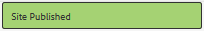

# Auteur van een nieuwe communautaire site {#author-a-new-community-site}

## Een nieuwe Community-site maken {#create-a-new-community-site}

De auteur-instantie gebruiken om een nieuwe communitysite te maken

* Aanmelden met beheerdersrechten
* Vanuit globale navigatie: **[!UICONTROL Navigation > Communities > Sites]**

De console van de Plaatsen van Gemeenschappen verstrekt een tovenaar om door de stappen te begeleiden om een communautaire plaats tot stand te brengen. U kunt verder gaan naar de `Next`stap of `Back`naar de vorige stap voordat u de site in de laatste stap toewijst.

Ga als volgt te werk om een nieuwe communitysite te maken:

* Selecteer de `Create` knop

### Stap 1: Sitesjabloon {#step-site-template}

Voer in de stap [Sjabloon](sites-console.md#step2013asitetemplate)site een titel, beschrijving, naam voor de URL in en selecteer bijvoorbeeld een sjabloon voor een communitysite:

* **[!UICONTROL Community Site Title]**: `Getting Started Tutorial`

* **[!UICONTROL Community Site Description]**: `A site for engaging with the community.`

* **[!UICONTROL Community Site Root]**: (leeg laten voor standaardhoofdmap `/content/sites`)

* **[!UICONTROL Cloud Configurations]**: (leeg laten als er geen cloudconfiguraties zijn opgegeven) het pad naar de opgegeven cloudconfiguraties bieden.
* **[!UICONTROL Community Site Base Language]**: (ongewijzigd laten voor één taal: (Engels) gebruik het keuzemenu om één *of meerdere* basistalen van de beschikbare talen - Duits, Italiaans, Frans, Japans, Spaans, Portugees (Brazilië), Chinees (Traditioneel), en Chinees (Vereenvoudigd) te kiezen. Er wordt één communitysite gemaakt voor elke toegevoegde taal en deze wordt in dezelfde sitemap gebruikt volgens de beste praktijken die worden beschreven in Inhoud [vertalen voor Meerdere sites](../../help/sites-administering/translation.md). De hoofdpagina van elke site bevat een onderliggende pagina met de taalcode van een van de geselecteerde talen, zoals &#39;en&#39; voor Engels of &#39;fr&#39; voor Frans.

* **[!UICONTROL Community Site Name]**: aangaan

   * Controleer de naam tweemaal omdat deze na het maken van de site niet gemakkelijk kan worden gewijzigd
   * De eerste URL wordt onder de naam van de communautaire site weergegeven
   * Voeg voor een geldige URL een basistaalcode + &quot;.html&quot; toe
   * *Bijvoorbeeld* http://localhost:4502/content/sites/ `engage/en.html`

* **[!UICONTROL Template]**: naar beneden halen om te kiezen `Reference Site`

Selecteer **[!UICONTROL Next]**

### Stap 2: Ontwerp {#step-design}

De stap Ontwerp wordt in twee secties weergegeven voor het selecteren van het thema en de brandingbanner:

#### COMMUNAUTAIR SITE-THEMA {#community-site-theme}

Selecteer de gewenste stijl die u op de sjabloon wilt toepassen. Als deze optie is geselecteerd, wordt het thema bedekt met een vinkje.

#### COMMUNAUTAIRE SITOBRANDING {#community-site-branding}

(Optioneel) Upload een bannerafbeelding voor weergave op de sitepagina&#39;s. De banner is vastgezet aan de linkerrand van browser, tussen de communautaire plaatsheader en menu (navigatiekoppelingen). De bannerhoogte wordt bijgesneden tot 120 pixels. Er wordt geen grootte van de banner aangepast aan de breedte van de browser en de hoogte van 120 pixels.

 

Selecteer **[!UICONTROL Next]**.

### Stap 3: Instellingen {#step-settings}

Voor de stap van Montages, alvorens te selecteren `Next`, merk er zeven secties zijn die toegang tot configuraties verlenen die gebruikersbeheer, het etiketteren, moderatie, groepsbeheer, analyses, vertaling en enablement impliceren.

Ga naar de zelfstudie [Aan de slag met AEM Communities for Enablement](getting-started-enablement.md) om te werken met de functies voor activering.

#### GEBRUIKERSBEHEER {#user-management}

Schakel alle selectievakjes voor [gebruikersbeheer in](sites-console.md#user-management)

* Sitebezoekers toestaan zich te registreren
* Site-bezoekers toestaan de site weer te geven zonder zich aan te melden
* Leden toestaan berichten van andere leden van de gemeenschap te verzenden en te ontvangen
* Aanmelden met Facebook toestaan in plaats van zich te registreren en een profiel te maken
* Aanmelden met Twitter toestaan in plaats van zich te registreren en een profiel te maken

>[!NOTE]
>
>Voor een productieomgeving moeten aangepaste Facebook- en Twitter-toepassingen worden gemaakt. Zie [Sociale aanmelding bij Facebook en Twitter](social-login.md).

#### TAGGING {#tagging}

De tags die kunnen worden toegepast op community-inhoud, worden beheerd door AEM naamruimten te selecteren die eerder zijn gedefinieerd via de [Tagingconsole](../../help/sites-administering/tags.md#tagging-console) (zoals de naamruimte [van de](setup.md#create-tutorial-tags)zelfstudie).

Het zoeken naar naamruimten is eenvoudig met &#39;type-ahead&#39;-zoekopdracht. Bijvoorbeeld,

* Type &#39;tut&#39;
* Selecteer `Tutorial`

#### ROLES {#roles}

[De rollen](users.md) van het communautaire lid worden toegewezen door de montages in de sectie van Rollen.

Als u een lid van de gemeenschap (of groep leden) de site wilt laten ervaren als gemeenschapsbeheerder, gebruikt u de typecontrole en selecteert u de naam van het lid of de groep in de keuzelijst.

Bijvoorbeeld,

* Type &quot;q&quot;
* Quinn Harper [selecteren](enablement-setup.md#publishcreateenablementmembers)

>[!NOTE]
>
>[De dienst](https://helpx.adobe.com/experience-manager/6-3/communities/using/deploy-communities.html#tunnel-service-on-author) van de tunnel staat selectie van leden en groepen toe die slechts in publicatiemilieu bestaan.

#### MODERING {#moderation}

Accepteer de standaard algemene instellingen voor het [modereren](sites-console.md#moderation) van door de gebruiker gegenereerde inhoud (UGC).

#### ANALYSE {#analytics}

Als Adobe Analytics een licentie heeft en er een cloudservice en -framework voor Analytics zijn geconfigureerd, is het mogelijk Analytics in te schakelen en het framework te selecteren.

Zie [Analytics Configuration for Communities Features](analytics.md).

#### VERTALING {#translation}

In de [vertaalinstellingen](sites-console.md#translation) wordt de basistaal voor de site opgegeven en wordt aangegeven of UGC kan worden vertaald en in welke taal, indien dat het geval is.

* Vinkje **[!UICONTROL Allow Machine Translation]**
* Laat standaardtalen geselecteerd blijven voor vertaling door de standaardvertaalservice voor machines
* Standaard vertaalprovider en config laten staan
* Er is geen behoefte aan een globale opslag omdat er geen taalexemplaren zijn
* Selecteer **[!UICONTROL Translate entire page]**
* De optie Standaardpersistentie behouden

#### UITSCHAKELING {#enablement}

Laat leeg als u een betrokkenheidsgemeenschap maakt.

Zie [Aan de slag met AEM Communities for Enablement](overview.md#enablement-community)voor een vergelijkbare zelfstudie waarin u snel een [activeringscommunity](getting-started-enablement.md)kunt maken.

Selecteer **[!UICONTROL Next]**.

### Stap 4: Communitysite maken {#step-create-communities-site}

Selecteer **[!UICONTROL Create]**.

Wanneer het proces is voltooid, wordt de map voor de nieuwe site weergegeven in de console Communities - Sites.

## De nieuwe Community-site publiceren {#publish-the-new-community-site}

De gecreeerde plaats zou van de Gemeenschappen - de console van Plaatsen moeten worden beheerd, de zelfde console van waar de nieuwe plaatsen kunnen worden gecreeerd.

Nadat u de map van de communitysite hebt geselecteerd om deze te openen, houdt u de muisaanwijzer boven het sitepictogram, zodat er vier actiepictogrammen worden weergegeven:

Als u het vierde ovalenpictogram selecteert (Meer handelingen), worden de opties Site exporteren en Site verwijderen weergegeven.

Van links naar rechts zijn ze:

* **Site** openenSelecteer het potloodpictogram om de gemeenschapssite te openen in de modus Bewerken door auteur om paginacomponenten toe te voegen en/of te configureren

* **Site** bewerken Selecteer het eigenschappenpictogram om de site van de community te openen voor wijzigingen in eigenschappen, zoals de titel, of om het thema te wijzigen

* **Site** publicerenSelecteer het wereldpictogram om de communitysite te publiceren (bijvoorbeeld als uw publicatieserver op uw lokale computer wordt uitgevoerd en vervolgens standaard naar localhost:4503)

* **Site** exporteren Selecteer het exportpictogram om een pakket van de communitysite te maken dat zowel in [pakketbeheer](../../help/sites-administering/package-manager.md) is opgeslagen als is gedownload.

   UGC is niet opgenomen in het sitepakket.

* **Site verwijderen**

   Selecteer het verwijderpictogram om de community-site vanuit **[!UICONTROL Communities > Sites console]** de site te verwijderen. Met deze actie verwijdert u alle items die aan de site zijn gekoppeld, zoals UGC, gebruikersgroepen, elementen en databaserecords.

>[!NOTE]
>
>Als het gebruiken van standaardhaven 4503 voor publiceer instantie, dan geef de standaard replicatieagent uit om het havenaantal aan de correcte waarde te plaatsen.
>
>In de auteurinstantie, van het belangrijkste menu
>
>1. Ga naar **[!UICONTROL Tools > Operations > Replication]** menu
>1. Selecteer **[!UICONTROL Agents on author]**
>1. Selecteer **[!UICONTROL Default Agent (publish)]**
>1. Volgende om te **[!UICONTROL Settings]** selecteren **[!UICONTROL Edit]**
>1. In pop-up dialoog voor de Montages van de Agent, het uitgezochte lusje van het Vervoer
>1. Wijzig in URI het poortnummer 4503 in het gewenste poortnummer

>
>
Als u bijvoorbeeld poort 6103 wilt gebruiken: `http://localhost:6103/bin/receive?sling:authRequestLogin=1`
>
>1. Selecteer **[!UICONTROL OK]**
>1. (Optioneel) Selecteer `Clear` of `Force Retry` om de replicatiereeks opnieuw in te stellen

### Publiceren selecteren {#select-publish}

Nadat u ervoor hebt gezorgd dat de publicatieserver actief is, selecteert u het wereldpictogram om de communitysite te publiceren.

Wanneer de community-site is gepubliceerd, wordt kort een bericht weergegeven:

### Nieuwe gebruikersgroepen in de Gemeenschap melden {#notice-new-community-user-groups}

Samen met de nieuwe communautaire plaats, worden de nieuwe gebruikersgroepen gecreeerd die de aangewezen toestemmingen hebben die voor diverse administratieve functies worden geplaatst. Ga voor meer informatie naar [Gebruikersgroepen voor communitysites](users.md#usergroupsforcommunitysites).

Voor deze nieuwe communautaire plaats, gezien de plaatsnaam &quot;verbind&quot;in Stap 1, kunnen de vier nieuwe gebruikersgroepen van de console [van](members.md) Groepen (globale navigatie worden gezien: Gemeenschappen, groepen):

* Community Engineeringmanagers
* Community Engineering Group-beheerders
* Samenvoegingsleden van gemeenschap
* Maatschappelijke experts
* Gemoonde leden van Community Engineering
* Community Engineering Sitecontentmanager

Merk op dat [Aaron McDonald](tutorials.md#demo-users) lid is van

* Community Engineeringmanagers
* Maatschappelijke experts
* Community Engage-leden (indirect als lid van de groep Moderatoren)

#### http://localhost:4503/content/sites/engage/en.html {#http-localhost-content-sites-engage-en-html}

## Configureren voor verificatiefout {#configure-for-authentication-error}

Zodra een plaats is gevormd en geduwd om te publiceren, [vorm login afbeelding](sites-console.md#configure-for-authentication-error) ( `Adobe Granite Login Selector Authentication Handler`) op publiceer instantie. Het voordeel is dat wanneer aanmeldingsgegevens niet correct worden ingevoerd, de verificatiefout de aanmeldingspagina van de communautaire site opnieuw weergeeft met een foutbericht.

Een `Login Page Mapping` item toevoegen als

* /content/sites/engc/nl/sign:/content/sites/engc/nl

## Optionele stappen {#optional-steps}

### De standaardstartpagina wijzigen {#change-the-default-home-page}

Als u met de publicatiesite werkt voor demonstratiedoeleinden, is het handig om de standaardstartpagina te wijzigen in de nieuwe site.

Hiervoor moet u [CRXDE](http://localhost:4503/crx/de) Lite gebruiken om de [bronnentoewijzingstabel](../../help/sites-deploying/resource-mapping.md) te bewerken bij publicatie.

Aan de slag:

1. Meld u bij publicatie aan met beheerdersrechten
1. Bladeren naar [http://localhost:4503/crx/de](http://localhost:4503/crx/de)
1. Vouw in de projectbrowser uit `/etc/map`
1. Selecteer het `http` knooppunt

   * Selecteer **[!UICONTROL Create Node]**

      * **Naam** localhost.4503

         ( *niet* gebruiken `:`)

      * **Tekst** [schuintrekken:toewijzen](https://sling.apache.org/documentation/the-sling-engine/mappings-for-resource-resolution.html)

1. Met nieuw aangemaakt `localhost.4503` knooppunt geselecteerd

   * Eigenschap toevoegen

      * **Naam** kiezen:overeenkomst
      * **Tekenreeks**
      * **Value** localhost.4503/\$

         (moet eindigen met &#39;$&#39; teken)
   * Eigenschap toevoegen

      * **Naam** kiezen:internalRedirect
      * **Tekenreeks**
      * **Value** /content/sites/engage/en.html

1. Selecteer **[!UICONTROL Save All]**
1. (optioneel) De browsergeschiedenis verwijderen
1. Bladeren naar http://localhost:4503/

   * Ga naar http://localhost:4503/content/sites/engage/en.html

>[!NOTE]
>
>Als u deze optie wilt uitschakelen, voegt u de waarde van de `sling:match` eigenschap gewoon aan met &#39;x&#39; - `xlocalhost.4503/$` - en **[!UICONTROL Save All]**.

#### Problemen oplossen: Fout bij opslaan van kaart {#troubleshooting-error-saving-map}

Als het niet lukt om wijzigingen op te slaan, moet u ervoor zorgen dat de naam van het knooppunt `localhost.4503`een &#39;punt&#39;-scheidingsteken heeft en niet `localhost:4503` een &#39;dubbele punt&#39;-scheidingsteken, omdat dit geen geldig naamruimtevoorvoegsel `localhost`is.

#### Problemen oplossen: Doorsturen mislukt {#troubleshooting-fail-to-redirect}

De &#39;**$**&#39; aan het einde van de reguliere-expressie- `sling:match`tekenreeks is van cruciaal belang, zodat alleen exact `http://localhost:4503/` wordt toegewezen. Anders wordt de omleidingswaarde toegevoegd aan elk pad dat mogelijk bestaat na de server:poort in de URL. Wanneer AEM probeert om naar de aanmeldingspagina om te leiden, mislukt dit.

### De site wijzigen {#modify-the-site}

Nadat de site voor het eerst is gemaakt, kunnen auteurs het pictogram  Open Site gebruiken om standaard AEM ontwerpactiviteiten uit te voeren.

Daarnaast kunnen beheerders het pictogram [Site](sites-console.md#modifying-site-properties) bewerken gebruiken om eigenschappen van de site, zoals de titel, te wijzigen.

Na om het even welke wijziging, herinner me om de plaats te **bewaren** en **opnieuw te publiceren** .

>[!NOTE]
>
>Als u niet bekend bent met AEM, bekijkt u de documentatie over [basisverwerking](../../help/sites-authoring/basic-handling.md) en een [handleiding voor het ontwerpen van pagina](../../help/sites-authoring/qg-page-authoring.md)&#39;s.