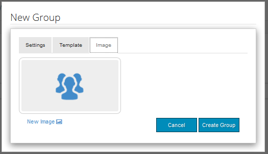

# Communautaire groepen {#community-groups}

De eigenschap van communautaire groepen is de capaciteit voor een subcommunity dynamisch om binnen een communautaire plaats door erkende gebruikers (leden van de gemeenschap en auteurs) van de publicatie en auteursmilieu&#39;s worden gecreeerd.

Deze mogelijkheid is aanwezig wanneer de functie [groups](functions.md#groups-function) aanwezig is in de [communitysite](sites-console.md)-structuur.

Een [communitygroepsjabloon](tools-groups.md) biedt het ontwerp van de communitygroeppagina wanneer een community-groep dynamisch wordt gemaakt.

Een of meer groepssjablonen worden geselecteerd voor de groepsfunctie wanneer de functie wordt toegevoegd aan de structuur van een gemeenschapssite of aan een sjabloon voor een gemeenschapssite. Deze lijst van groepsmalplaatjes wordt voorgesteld aan het lid of de auteur die dynamisch tot een nieuwe groep van binnen de communautaire plaats leidt.

## Nieuwe groep maken {#creating-a-new-group}

De capaciteit om een nieuwe communautaire groep tot stand te brengen baseert zich op het bestaan van een communautaire plaats die de groepsfunctie omvat, zoals die van ` [Reference Site Template](sites.md)` wordt gecreeerd.

De volgende voorbeelden gebruiken de communautaire die plaats van `Reference Site Template` wordt gecreeerd zoals die in [Aan de slag met AEM Communities](getting-started.md) wordt beschreven zelfstudie.

Dit is de pagina die wordt geladen bij het publiceren wanneer de menuoptie **[!UICONTROL Groups]** wordt geselecteerd:

Als u het pictogram **[!UICONTROL New Group]** selecteert, wordt een dialoogvenster voor bewerken geopend.

Onder het tabblad **[!UICONTROL Settings]** geeft u de basiskenmerken van de groep op:

* **[!UICONTROL Group Name]**
De titel van de groep die op de communitysite moet worden weergegeven.

* **[!UICONTROL Description]**
Een beschrijving van de groep die op de communitysite moet worden weergegeven.

* **[!UICONTROL Invite]**
Een lijst met leden die moeten worden uitgenodigd om deel te nemen aan de groep. Bij het zoeken naar vooraf bepaalde typen worden suggesties van leden van de gemeenschap geleverd die u wilt uitnodigen.

* **[!UICONTROL Group URL Name]**
De naam voor de groepspagina die deel van URL wordt.

* **[!UICONTROL Open Group]**
Selecteren 
`Open Group` Hiermee geeft u aan dat een anonieme sitebezoeker de inhoud kan bekijken en de selectie ongedaan zal maken  `Member Only Group`.

* **[!UICONTROL Member Only Group]**
Selecteren 
`Member Only Group` Hiermee geeft u aan dat alleen leden van de groep de inhoud mogen weergeven en dat de selectie wordt opgeheven  `Open Group`.

Onder **[!UICONTROL Template]** lusje is de capaciteit om van de lijst van communautaire groepsmalplaatjes te selecteren die werden gespecificeerd toen de groepsfunctie in de structuur van de communautaire plaats of in een malplaatje van de communautaire plaats werd omvat.

Onder het tabblad **[!UICONTROL Image]** kunt u een afbeelding uploaden die u wilt weergeven voor de groep op de pagina Groepen van de communitysite. De afbeelding wordt op het standaardstijlblad vergroot tot 170 x 90 pixels.

Door de **[!UICONTROL Create Group]** knoop te selecteren, worden de pagina&#39;s voor de groep gecreeerd gebaseerd op het gekozen malplaatje, en een gebruikersgroep wordt gecreeerd voor lidmaatschap en de pagina van Groepen zal worden bijgewerkt om de nieuwe subcommunity te tonen.

De pagina Groepen met een nieuwe subcommunity met de naam &quot;Focus Group&quot;, waarvoor een afbeeldingsminiatuur is geüpload, ziet er bijvoorbeeld als volgt uit (nog steeds aangemeld als beheerder van een communitygroep):

Als u de koppeling `Focus Group` selecteert, wordt de pagina Focus Group in de browser geopend. Deze pagina heeft een initiële weergave op basis van de gekozen sjabloon en bevat een submenu onder het menu van de hoofdsite van de community:

## Component {#community-group-member-list-component} van lijst met leden van communautaire groep

De component `Community Group Member List` is bedoeld voor gebruik door ontwikkelaars van groepssjablonen.

## Aanvullende informatie {#additional-information}

Meer informatie vindt u op de pagina [Community Group Essentials](essentials-groups.md) voor ontwikkelaars.

Voor andere informatie met betrekking tot communautaire groepen, bezoek [Beherende Gebruikers en Gebruikersgroepen](users.md).
