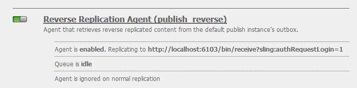

# Gemeenschappen {#deploying-communities} implementeren

## Vereisten {#prerequisites}

* [AEM 6,4 Platform](../../help/sites-deploying/deploy.md)

* AEM Communities-licentie

* Optionele licenties voor:

   * [Functies van Adobe Analytics for Communities](analytics.md)
   * [MongoDB voor MSRP](msrp.md)
   * [Adobe Cloud voor ASRP](asrp.md)

## Controlelijst voor installatie {#installation-checklist}

**Voor het  [AEM](../../help/sites-deploying/deploy.md#what-is-aem)**

* De nieuwste [AEM 6.4-updates installeren](#aem-updates)

* Als het gebruiken van niet de standaardhavens (4502, 4503), dan [vorm replicatieagenten](#replication-agents-on-author)
* [de cryptosleutel repliceren](#replicate-the-crypto-key)
* Bij ondersteuning van globalization [installatie van geautomatiseerde vertaling](../../help/sites-administering/translation.md)

   (voorbeeldinstelling is beschikbaar voor ontwikkeling)

**Voor het vermogen van de  [Gemeenschappen](overview.md)**

* Als het opstellen van [publiceer landbouwbedrijf](../../help/sites-deploying/recommended-deploys.md#tarmk-farm), [identificeer de primaire uitgever](#primary-publisher)

* [De tunnelservice inschakelen](#tunnel-service-on-author)
* [Sociale aanmelding inschakelen](social-login.md#adobe-granite-oauth-authentication-handler)
* [Adobe Analytics configureren](analytics.md)
* Stel een [standaard e-mailservice](email.md) in
* Identificeer de keus voor [gedeelde opslag UGC](working-with-srp.md) (**SRP**)

   * Als MongoDB SRP [(MSRP)](msrp.md)

      * [MongoDB installeren en configureren](msrp.md#mongodb-configuration)
      * [Solr configureren](solr.md)
      * [Selecteer MSRP](srp-config.md)
   * Als relationele database SRP [(DSRP)](dsrp.md)

      * [Installeer het JDBC-stuurprogramma voor MySQL](#jdbc-driver-for-mysql)
      * [Installeer en vorm MySQL voor DSRP](dsrp-mysql.md)
      * [Solr configureren](solr.md)
      * [DSRP selecteren](srp-config.md)
   * Als Adobe SRP [(ASRP)](asrp.md)

      * Met uw accountvertegenwoordiger samenwerken voor provisioning
      * [Selecteer ASRP](srp-config.md)
   * Indien JCR SRP [(JSRP)](jsrp.md)

      * Geen gedeelde UGC-opslag:

         * UGC wordt nooit gerepliceerd
         * UGC is alleen zichtbaar op AEM instantie of cluster waarin de UGC is ingevoerd
      * Standaard is JSRP

   Voor de **[enablement-functie](overview.md#enablement-community)**

   * [Mpeg installeren en configureren](ffmpeg.md)
   * [Installeer het JDBC-stuurprogramma voor MySQL](#jdbc-driver-for-mysql)
   * [AEM Communities SCORM-engine installeren](#scorm-package)
   * [MySQL voor activering installeren en configureren](mysql.md)


## Laatste releases {#latest-releases}

AEM 6.4 Communautaire algemene vergadering omvat het communautaire pakket. Raadpleeg [AEM 6.4 Opmerkingen bij de release](/help/release-notes/release-notes.md#release-information) voor meer informatie over updates van AEM 6.4 [Communities](/help/release-notes/release-notes.md#experience-manager-communities).

### AEM 6.4 Updates {#aem-updates}

Vanaf AEM 6.3 worden updates aan de Gemeenschappen geleverd als onderdeel van AEM Cumulative Fix Packs en Service Packs.

Voor de nieuwste updates van AEM 6.4 moet u [Adobe Experience Manager 6.4 Cumulative Fix Packs and Service Packs](https://helpx.adobe.com/experience-manager/aem-releases-updates.html) controleren.

### Versiehistorie {#version-history}

Net als bij AEM 6.4 en hoger maken AEM Communities-functies en hotfixes deel uit van AEM Communities-pakketten voor cumulatieve probleemoplossingen en servicepacks. Er zijn dus geen aparte kenmerkpakketten.

### JDBC-stuurprogramma voor MySQL {#jdbc-driver-for-mysql}

Twee eigenschappen van Gemeenschappen gebruiken een gegevensbestand MySQL:

* Voor [enablement](enablement.md): SCORM-activiteiten en -studenten opnemen
* Voor [DSRP](dsrp.md): door de gebruiker gegenereerde inhoud opslaan (UGC)

De MySQL-connector moet afzonderlijk worden opgehaald en geïnstalleerd.

De noodzakelijke stappen zijn:

1. Download het ZIP-archief van [https://dev.mysql.com/downloads/connector/j/](https://dev.mysql.com/downloads/connector/j/)

   * Versie moet >= 5.1.38 zijn

1. Extraheer mysql-connector-java-&lt;version>-bin.jar (bundel) uit het archief

1. Gebruik de webconsole om de bundel te installeren en te starten:

   * Bijvoorbeeld http://localhost:4502/system/console/bundles
   * Selecteer **`Install/Update`**
   * Bladeren... om de bundel te selecteren die uit het gedownloade ZIP-archief is geëxtraheerd
   * Controleer of het JDBC-stuurprogramma van *Oracle Corporation voor MySQLcom.mysql.jdbc* actief is en start het programma als dat niet het geval is (of controleer de logboeken)

1. Als het installeren op een bestaande plaatsing nadat JDBC is gevormd, dan opnieuw bindt JDBC aan de nieuwe schakelaar door de configuratie JDBC van de Webconsole op te slaan:

   * Bijvoorbeeld http://localhost:4502/system/console/configMgr
   * `Day Commons JDBC Connections Pool`-configuratie zoeken
   * Selecteren om te openen
   * Selecteer `Save`

1. De stappen 3 en 4 op alle auteur herhalen en instanties publiceren

Meer informatie over het installeren van bundels vindt u op de pagina [Webconsole](/help/sites-deploying/web-console.md#bundles).

#### Voorbeeld: Pakket MySQL-connector geïnstalleerd {#example-installed-mysql-connector-bundle}


### SCORM-pakket {#scorm-package}

Shareable Content Object Reference Model (SCORM) is een verzameling standaarden en specificaties voor e-learning. SCORM definieert ook hoe inhoud kan worden verpakt in een overdraagbaar ZIP-bestand.

De AEM Communities SCORM-engine is vereist voor de functie [enablement](overview.md#enablement-community). Scorepakketten die worden ondersteund in AEM Communities 6.4-versie zijn:

* **[cq -social- scorm -package, versie 1.2.11](https://www.adobeaemcloud.com/content/marketplace/marketplaceProxy.html?packagePath=/content/companies/public/adobe/packages/cq640/social/scorm/cq-social-scorm-pkg)**. Dit SCORM-pakket wordt ondersteund door alle versies van AEM 6.4.

* **[cq -social- scorm -package, versie 2.2.2](https://www.adobeaemcloud.com/content/marketplace/marketplaceProxy.html?packagePath=/content/companies/public/adobe/packages/cq640/social/scorm/cq-social-scorm-2017-pkg)** bevat  [SCORM 2017.1](https://rusticisoftware.com/blog/scorm-engine-2017-released/) -engine. Dit SCORM-pakket wordt ondersteund AEM 6.4.2.x-gemeenschappen.

Voor een nieuwe installatie van de SCORM-engine moet het pakket [SCORM 2017.1](https://rusticisoftware.com/blog/scorm-engine-2017-released/) (dat [ cq -social- scorm -package, versie 2.2.2](https://www.adobeaemcloud.com/content/marketplace/marketplaceProxy.html?packagePath=/content/companies/public/adobe/packages/cq640/social/scorm/cq-social-scorm-2017-pkg) is) worden gebruikt. zodat u de leermiddelen kunt spelen die door SCORM 2017 worden gesteund.

<!--This section used to be an accordion until converted to straight Markdown. When accordions are enabled, revert-->

### Een SCORM-pakket voor de eerste keer installeren

1. Installeer **[cq-social-scorm-package, versie 2.2.2](https://www.adobeaemcloud.com/content/marketplace/marketplaceProxy.html?packagePath=/content/companies/public/adobe/packages/cq640/social/scorm/cq-social-scorm-2017-pkg).**
1. Download **`/libs/social/config/scorm/database_scormengine_data.sql`** van cq instantie en voer het in mysql server uit om een bevorderd schema te creëren scormEngineDB.
1. Voeg `/content/communities/scorm/RecordResults` in Uitgesloten bezit van Wegen in filter CSRF van `https://<hostname>;:<port>/system/console/configMgr` op uitgevers toe.

Bestaande SCORM-installaties kunnen worden geüpgraded naar [**cq-social-scorm-package, versie 2.2.2**](https://www.adobeaemcloud.com/content/marketplace/marketplaceProxy.html?packagePath=/content/companies/public/adobe/packages/cq640/social/scorm/cq-social-scorm-2017-pkg) (gebruikt [SCORM 2017.1](https://rusticisoftware.com/blog/scorm-engine-2017-released/)), als de geschreven cursusinhoud SCORM 2017.1 vereist.

>[!NOTE]
>
>Voor de upgrade naar het SCORM 2017.1-pakket is migratie van de bestaande database vereist (zoals verder wordt uitgelegd).

<!--This section used to be an accordion until converted to straight Markdown. When accordions are enabled, revert-->

### Om versie van uw motor te bevorderen SCORM

1. Maak een back-up van het schema ScormEngineDB.
1. Installeer **[cq-social-scorm-package, versie 2.2.2](https://www.adobeaemcloud.com/content/marketplace/marketplaceProxy.html?packagePath=/content/companies/public/adobe/packages/cq640/social/scorm/cq-social-scorm-2017-pkg).**
1. Download het pakket van `/libs/social/config/scorm/ScormEngine.zip` en extraheer het zelfde.
1. Ga naar **Installatieprogramma** map van de uitgepakte directory.
1. `SystemDatabaseConnectionString` bijwerken met uw `scorm db connection url` in bestand **[!UICONTROL EngineInstall.xml]**.
1. Voer het mysql-schema-upgradeprogramma uit in de installatiemap met de opdracht:

   `java -Dlogback.configurationFile=logback.xml -cp "lib/*" RusticiSoftware.ScormContentPlayer.Logic.Upgrade.ConsoleApp EngineInstall.xml`
1. Bewaak `engine_upgrade.log` bestand voor elke fout en upgradestatus van het schema.
1. Voeg `/content/communities/scorm/RecordResults` in **[!UICONTROL Excluded Paths]** bezit in filter CSRF van `https://<hostname>:<port>/system/console/configMgr` op uitgevers toe.

### SCORM-registratie {#scorm-logging}

Zoals geïnstalleerd, wordt al enablement activiteit uitgebreid geregistreerd aan de systeemconsole.

Indien gewenst, kan het logboekniveau aan WARN voor het `RusticiSoftware.*` pakket worden geplaatst.

Voor het werken met logboeken, zie [Werken met de Verslagen van de Controle en de Dossiers van het Logboek](../../help/sites-deploying/monitoring-and-maintaining.md#working-with-audit-records-and-log-files).

### Geavanceerde MLS AEM {#aem-advanced-mls}

Voor de inzameling SRP (MSRP of DSRP) om geavanceerde meertalige onderzoek (MLS) te steunen, worden nieuwe stop-ins Solr vereist naast een douaneschema en de configuratie Solr. Alle vereiste items worden verpakt in een ZIP-bestand dat kan worden gedownload.

De geavanceerde MLS-download (ook wel &#39;phasetwo&#39; genoemd) is beschikbaar in de gegevensopslagruimte van de Adobe:

* [AEM-SOLR-MLS-fasetwo](https://repo.adobe.com/nexus/content/repositories/releases/com/adobe/tat/AEM-SOLR-MLS-phasetwo/1.2.40/)

   * Versie 1.2.40, 6 april 2016
   * Download AEM-SOLR-MLS-phasetwo-1.2.40.zip

Voor details en installatieinformatie, bezoek [Solr Configuratie](solr.md) voor SRP.

### Info over Koppelingen naar pakket delen {#about-links-to-package-share}

**Pakketten zichtbaar in Adobe AEM Cloud**

Voor de koppelingen naar pakketten op deze pagina is geen actieve versie van AEM vereist, aangezien deze bestemd zijn om gedeelde pakketten op `adobeaemcloud.com` te plaatsen. Terwijl de pakketten zichtbaar zijn, is de `Install`knoop voor het installeren van de pakketten in een Adobe ontvangen plaats. Als u `Install`wilt installeren op een lokale AEM-instantie, resulteert dit in een fout.

**Installeren op lokale AEM**

Als u de pakketten die zichtbaar zijn in `adobeaemcloud.com` op een lokale AEM-instantie wilt installeren, moet het pakket eerst naar een lokale schijf worden gedownload:

* Selecteer het tabblad **[!UICONTROL Assets]**
* Selecteer **[!UICONTROL download to disk]**

Gebruik in de lokale AEM-instantie pakketbeheer (bijvoorbeeld [http://localhost:4502/crx/packmgr/](http://localhost:4502/crx/packmgr/)) om te uploaden naar de lokale AEM pakketopslagplaats.

Als u het pakket ook opent via pakketshare van de lokale AEM-instantie (bijvoorbeeld [http://localhost:4502/crx/packageshare/](http://localhost:4502/crx/packageshare/)), wordt de knop `Download`gedownload naar de pakketopslagplaats van de lokale AEM-instantie.

Eenmaal in de pakketopslagplaats van de lokale AEM-instantie, gebruikt u pakketbeheer om het pakket te installeren.

Voor meer informatie, bezoek [Hoe te met Pakketten](../../help/sites-administering/package-manager.md#package-share) te werken.

## Aanbevolen implementaties {#recommended-deployments}

In AEM Communities, wordt een gemeenschappelijke opslag gebruikt om gebruiker geproduceerde inhoud (UGC) op te slaan en vaak bedoeld als [opslagmiddelleverancier (SRP)](working-with-srp.md). De geadviseerde plaatsingscentra bij het kiezen van een optie SRP voor de gemeenschappelijke opslag.

De gemeenschappelijke opslag steunt moderatie van, en analytische op, UGC in het publicatiemilieu terwijl het elimineren van de behoefte aan [replicatie](sync.md) van UGC.

* [Community Content Store](working-with-srp.md): bespreekt de opslagopties SRP voor AEM gemeenschappen

* [Aanbevolen technologieën](topologies.md): bespreekt de topologie om afhankelijk van gebruiksgeval en keus te gebruiken SRP

## {#upgrading} bijwerken

Wanneer u een upgrade uitvoert naar het AEM 6.4-platform van eerdere versies van AEM, is het belangrijk om Upgrade naar AEM 6.4 te lezen.

Lees [Upgraden naar AEM Communities 6.4](upgrade.md) om meer te weten te komen over de wijzigingen in de Gemeenschappen, naast het upgraden van het platform.

## Configuraties {#configurations}

### Primaire uitgever {#primary-publisher}

Wanneer de gekozen implementatie een [publicatiecentrum](topologies.md#tarmk-publish-farm) is, moet één AEM publicatieexemplaar worden geïdentificeerd als **`primary publisher`** voor activiteiten die niet in alle gevallen zouden moeten voorkomen, zoals eigenschappen die op **meldingen** of **Adobe Analytics** baseren.

Door gebrek, wordt de `AEM Communities Publisher Configuration` configuratie OSGi gevormd met **`Primary Publisher`** gecontroleerd checkbox, zodat alle publiceer instanties in een publicatielandbouwbedrijf zich als primair zou identificeren.

Daarom is het noodzakelijk om **de configuratie op alle secundaire publicatieinstanties** uit te geven om **`Primary Publisher`** checkbox uit te schakelen.


Voor alle andere (secundaire) publiceer instanties in publiceer landbouwbedrijf:

* Aanmelden met beheerdersrechten
* Toegang tot de [webconsole](../../help/sites-deploying/configuring-osgi.md)

   * Bijvoorbeeld [http://localhost:4503/system/console/configMgr](http://localhost:4503/system/console/configMgr)

* `AEM Communities Publisher Configuration` zoeken
* Het bewerkingspictogram selecteren
* Schakel het selectievakje **[!UICONTROL Primary Publisher]** uit
* Selecteer **[!UICONTROL Save]**

### Replicatieagents op auteur {#replication-agents-on-author}

Replicatie wordt gebruikt voor site-inhoud die in de publicatieomgeving is gemaakt, zoals groepen uit de gebruikersgemeenschap, en voor het beheren van leden en lidgroepen vanuit de auteursomgeving met de [tunnelservice](#tunnel-service-on-author).

Voor de primaire uitgever, zorg ervoor [Replication Agent Config](../../help/sites-deploying/replication.md) correct de publicatieserver en geautoriseerde gebruiker identificeert. De standaard gemachtigde gebruiker, `admin,` heeft reeds de aangewezen toestemmingen (is een lid van `Communities Administrators`).

Als een andere gebruiker over de juiste machtigingen beschikt, moet hij of zij als lid worden toegevoegd aan de gebruikersgroep `administrators` (ook een lid van `Communities Administrators`).

Er zijn twee replicatieagenten in het auteursmilieu die de vervoerconfiguratie nodig hebben correct worden gevormd.

* De console van de Replicatie van de toegang op auteur

   * Vanuit globale navigatie: **[!UICONTROL Tools > Deployment > Replication > Agents on author]**

* Volg de zelfde procedure voor beide agenten:

   * **Standaardagent (publiceren)**
   * **Reverse Replication Agent (publiceren reverse)**

      1. Selecteer de agent
      1. Selecteer **[!UICONTROL edit]**
      1. Selecteer het tabblad **[!UICONTROL Transport]**
      1. Als geen poort `4503` is, bewerkt u **[!UICONTROL URI]** om de juiste poort op te geven
      1. Als geen gebruiker `admin`, geef **[!UICONTROL User]** en **[!UICONTROL Password]** uit om een lid van `administrators` gebruikersgroep te specificeren

In de volgende afbeeldingen ziet u de resultaten van het wijzigen van de poort van 4503 in 6103 door:

#### Standaardagent (publiceren) {#default-agent-publish}


#### Reverse Replication Agent (publish reverse) {#reverse-replication-agent-publish-reverse}



### Tunnelservice op auteur {#tunnel-service-on-author}

Wanneer u de auteursomgeving gebruikt om [sites te maken](sites-console.md), [site-eigenschappen te wijzigen](sites-console.md#modifying-site-properties) of [leden van de gebruikersgemeenschap te beheren](members.md), is het nodig om leden (gebruikers) te benaderen die in de publicatieomgeving zijn geregistreerd, niet gebruikers die bij de auteur zijn geregistreerd.

De tunneldienst verleent deze toegang gebruikend de replicatieagent op auteur.

Om de tunneldienst toe te laten:

* Op **auteur**
* Aanmelden met beheerdersrechten
* Als de uitgever niet localhost:4503 is of de vervoergebruiker niet `admin` is,

   Dan [vorm de replicatieagent](#replication-agents-on-author)

* Toegang tot de [webconsole](../../help/sites-deploying/configuring-osgi.md)

   * Bijvoorbeeld [http://localhost:4502/system/console/configMgr](http://localhost:4502/system/console/configMgr)

* `AEM Communities Publish Tunnel Service` zoeken
* Het bewerkingspictogram selecteren
* Schakel het selectievakje **[!UICONTROL enable]** in
* Selecteer **[!UICONTROL Save]**


### Repliceer de Crypto Sleutel {#replicate-the-crypto-key}

Er zijn twee eigenschappen van AEM Communities die alle AEM serverinstanties vereisen om de zelfde encryptiesleutels te gebruiken. Dit zijn [Analytics](analytics.md) en [ASRP](asrp.md).

Vanaf AEM 6.3 wordt het sleutelmateriaal opgeslagen in het bestandssysteem en niet langer in de gegevensopslagruimte.

Om het belangrijkste materiaal van auteur aan alle andere instanties te kopiëren is het noodzakelijk:

* Toegang krijgen tot de AEM instantie, doorgaans een instantie van de auteur, die het te kopiëren toetsmateriaal bevat

   * Zoek de `com.adobe.granite.crypto.file`-bundel in het lokale bestandssysteem

      Bijvoorbeeld,

      * `<author-aem-install-dir>/crx-quickstart/launchpad/felix/bundle21`
      * In het `bundle.info`-bestand wordt de bundel geïdentificeerd
   * Navigeren in de gegevensmap

      Bijvoorbeeld,

      * `<author-aem-install-dir>/crx-quickstart/launchpad/felix/bundle21/data`
   * Kopieer de hoofd- en primaire knoopdossiers


* Voor elke AEM

   * Navigeren in de gegevensmap

      Bijvoorbeeld,

      * `<publish-aem-install-dir>/crx-quickstart/launchpad/felix/bundle21/data`
   * Plak de twee eerder gekopieerde bestanden
   * Het is noodzakelijk om [de graniet Crypto-bundel](#refresh-the-granite-crypto-bundle) te vernieuwen als de doel-AEM momenteel wordt uitgevoerd


>[!CAUTION]
>
>Als een andere veiligheidseigenschap reeds is gevormd die op de crypto sleutels gebaseerd is, dan het herhalen van de crypto sleutels kon de configuratie beschadigen. Neem voor hulp [contact op met de klantenservice](https://helpx.adobe.com/marketing-cloud/contact-support.html).

#### Replicatie opslagplaats {#repository-replication}

Als het sleutelmateriaal in de bewaarplaats wordt opgeslagen, zoals het geval was voor AEM 6.2 en eerder, kan worden behouden door de volgende systeemeigenschap op te geven bij het eerste opstarten van elke AEM instantie (die de initiële opslagplaats creëert):

* `-Dcom.adobe.granite.crypto.file.disable=true`

>[!NOTE]
>
>Het is belangrijk om te verifiëren dat [replicatieagent op auteur](#replication-agents-on-author) correct wordt gevormd.

Met het belangrijkste materiaal dat in de bewaarplaats wordt opgeslagen, is de manier om de crypto sleutel van auteur aan andere instanties te herhalen als volgt:

Met [CRXDE Lite](../../help/sites-developing/developing-with-crxde-lite.md):

* doorbladeren naar [https://&lt;server>:&lt;port>/crx/de](http://localhost:4502/crx/de)
* select `/etc/key`
* tab `Replication` openen
* selecteren `Replicate`

* [De Granite Crypto-bundel vernieuwen](#refresh-the-granite-crypto-bundle)


#### De graniet-cryptobundel vernieuwen {#refresh-the-granite-crypto-bundle}

* Voor elke publicatieinstantie, heb toegang tot [Webconsole](../../help/sites-deploying/configuring-osgi.md)

   * Bijvoorbeeld [https://&lt;server>:&lt;port>/system/console/bundles](http://localhost:4503/system/console/bundles)

* `Adobe Granite Crypto Support`-bundel zoeken (com.adobe.granite.crypto)
* Selecteer **[!UICONTROL Refresh]**


* Na een ogenblik, zou een **Succes** dialoog moeten verschijnen:

   `Operation completed successfully.`

### Apache HTTP Server {#apache-http-server}

Als u de Apache HTTP-server gebruikt, moet u ervoor zorgen dat u de juiste servernaam gebruikt voor alle relevante vermeldingen.

Wees vooral voorzichtig met het gebruik van de juiste servernaam, niet `localhost`, in de `RedirectMatch`.

#### httpd.conf sample {#httpd-conf-sample}

```shell
<IfModule alias_module>
     # XAMPP does not have a favicon; this prevents any 404 errors which may arise.
     Redirect 404 /favicon.ico
     <Location /favicon.ico>
         ErrorDocument 404 "No favicon"
     </Location>

    # Return from "Sign Out" generates response header directing you to "/", generating a 404 error
    # The RedirectMatch resolves it correctly when modified for the target Community Site:
    RedirectMatch ^/$ https://[server name]/content/sites/engage/en.html
 ...
 </IfModule>
```

### Verzending {#dispatcher}

Als u een Dispatcher gebruikt, raadpleegt u:

* AEM [Dispatcher](https://helpx.adobe.com/experience-manager/dispatcher/using/dispatcher.html) documentatie
* [Dispatcher installeren](https://helpx.adobe.com/experience-manager/dispatcher/using/dispatcher-install.html)
* [Dispatcher configureren voor Gemeenschappen](dispatcher.md)
* [Bekende problemen](troubleshooting.md#dispatcher-refetch-fails)

## Documentatie van verwante gemeenschappen {#related-communities-documentation}

* Bezoek [Communitysites beheren](administer-landing.md) voor meer informatie over het maken van een communitysite, het configureren van sjablonen voor communitysites, het moderniseren van community-inhoud, het beheren van leden en het configureren van berichten.

* Bezoek [Developing Communities](communities.md) voor meer informatie over het SCF (Social Component Framework) en het aanpassen van onderdelen en functies van Gemeenschappen.

* Bezoek [Authoring Communities Components](author-communities.md) voor meer informatie over het schrijven en configureren van Community-componenten.

