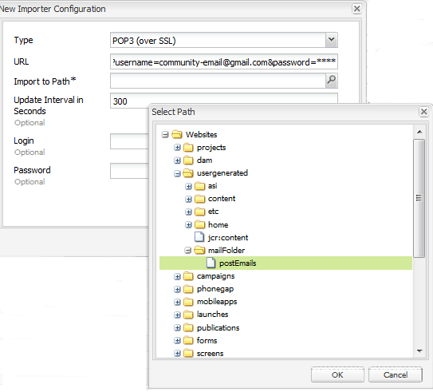

# E-mail {#configuring-email} configureren

AEM Communities gebruikt e-mail voor

* [Publikaties](notifications.md)
* [Communityabonnementen](subscriptions.md)

De e-mailfunctie werkt standaard niet omdat hiervoor een SMTP-server en een SMTP-gebruiker moet worden opgegeven.

>[!CAUTION]
>
>E-mail voor meldingen en abonnementen moet alleen worden geconfigureerd op de [primaire uitgever](deploy-communities.md#primary-publisher).

## Configuratie van standaardmailservice {#default-mail-service-configuration}

De standaardmailservice is vereist voor zowel meldingen als abonnementen.

* Op de primaire uitgever
* Aangemeld met beheerdersrechten
* Toegang tot de [webconsole](../../help/sites-deploying/configuring-osgi.md)

   * Bijvoorbeeld [http://localhost:4503/system/console/configMgr](http://localhost:4503/system/console/configMgr)

* `Day CQ Mail Service` zoeken
* Het bewerkingspictogram selecteren

Dit is gebaseerd op de documentatie voor [Het vormen E-mailbericht](../../help/sites-administering/notification.md), maar met een verschil in dat het gebied `"From" address` *not* wordt vereist en zou leeg moeten worden verlaten.

Bijvoorbeeld (alleen invullen met waarden voor illustratieve doeleinden):

* **[!UICONTROL SMTP server host name]**:  *(vereist)* De te gebruiken server SMTP.

* **[!UICONTROL SMTP server port]** *(vereist)* De SMTP serverhaven moet 25 of hoger zijn.

* **[!UICONTROL SMTP user]**:  *(Vereist)* De SMTP-gebruiker.

* **[!UICONTROL SMTP password]**:  *(vereist)* Het wachtwoord van de gebruiker SMTP.

* **[!UICONTROL "From" address]**: Leeg laten
* **[!UICONTROL SMTP use SSL]**: Als deze optie is ingeschakeld, wordt beveiligde e-mail verzonden. Zorg ervoor dat de poort is ingesteld op 465 of zoals is vereist voor de SMTP-server.
* **[!UICONTROL Debug email]**: Indien gecontroleerd, laat registreren van SMTP serverinteractie toe.

## AEM Communities-e-mailconfiguratie {#aem-communities-email-configuration}

Zodra [standaardpostdienst ](#default-mail-service-configuration) wordt gevormd, worden de twee bestaande instanties van `AEM Communities Email Reply Configuration` OSGi config, inbegrepen in de versie, functioneel.

Slechts moet de instantie voor abonnementen verder worden gevormd wanneer het toestaan van antwoord door e-mail.

1. ` [email](#configuration-for-notifications)` instance

   voor meldingen, die geen ondersteuning bieden voor e-mail met antwoorden, en die niet mogen worden gewijzigd

1. ` [subscriptions-email](#configuration-for-subscriptions)` instance

   vereist configuratie om het creëren van post van antwoord e-mail volledig toe te laten

U bereikt als volgt de e-mailconfiguratieinstanties van de Gemeenschappen:

* Op de primaire uitgever
* Aangemeld met beheerdersrechten
* Toegang tot de [webconsole](../../help/sites-deploying/configuring-osgi.md)

   * Bijvoorbeeld [http://localhost:4503/system/console/configMgr](http://localhost:4503/system/console/configMgr)

* `AEM Communities Email Reply Configuration` zoeken

### Configuratie voor meldingen {#configuration-for-notifications}

De instantie van `AEM Communities Email Reply Configuration` OSGi config met de Naam e-mail is voor de berichteigenschap. Deze functie bevat geen e-mailantwoord.

Deze configuratie moet niet worden gewijzigd.

* `AEM Communities Email Reply Configuration` zoeken
* Het bewerkingspictogram selecteren
* Verifieer **Naam** is `email`

* Verifiëren **Een bericht maken van een antwoorde-mail** is `unchecked`

### Configuratie voor abonnementen {#configuration-for-subscriptions}

Voor Gemeenschapsabonnementen is het mogelijk om de mogelijkheid voor een lid om inhoud te posten in of uit te schakelen door op een e-mail te antwoorden.

* `AEM Communities Email Reply Configuration` zoeken
* Het bewerkingspictogram selecteren
* Verifieer **Naam** is `subscriptions-email`

* **[!UICONTROL Name]** : *(required)* `subscriptions-email`. Niet bewerken.

* **[!UICONTROL Create post from reply email]**: Als deze optie is ingeschakeld, kan de ontvanger van het e-mailbericht met abonnement inhoud posten door een antwoord te verzenden. Standaard is ingeschakeld.
* **[!UICONTROL Add tracked id to header]**: Standaard is dit  `Reply-To`.

* **[!UICONTROL Maximum length of Subject]**: Als tracker-id aan de onderwerpregel wordt toegevoegd, is dit de maximumlengte van het onderwerp, met uitzondering van de bijgehouden id, waarna het wordt bijgesneden. Deze waarde moet zo klein mogelijk zijn om te voorkomen dat bijgehouden id-informatie verloren gaat. De standaardwaarde is 200.
* **[!UICONTROL Email "From" address]**:  *(vereist)* Adres dat bericht e-mail van zou worden geleverd. Waarschijnlijk dezelfde **SMTP-gebruiker** die is opgegeven voor de [standaardmailservice](#configuredefaultmailservice). De standaardwaarde is `no-reply@example.com`.

* **[!UICONTROL Reply-to-Delimiter]**: Als tracker-id wordt toegevoegd aan de header die reageert, wordt dit scheidingsteken gebruikt. De standaardwaarde is `+` (plusteken).

* **[!UICONTROL Tracker Id prefix in subject]**: Als tracker-id aan de onderwerpregel wordt toegevoegd, wordt dit voorvoegsel gebruikt. De standaardwaarde is `post#`.

* **[!UICONTROL Tracker id prefix in message body]**: Als tracker-id aan de hoofdtekst van het bericht wordt toegevoegd, wordt dit voorvoegsel gebruikt. De standaardwaarde is `Please do not remove this:`.

* **[!UICONTROL Email as HTML]**: Als deze optie is ingeschakeld, wordt het inhoudstype van e-mail ingesteld op  `"text/html;charset=utf-8"`. Standaard is ingeschakeld.

* **[!UICONTROL Default user name]**: Deze naam wordt gebruikt voor geen naamgebruikers. De standaardwaarde is `no-reply@example.com`.

* **[!UICONTROL Templates root path]**: De e-mail wordt samengesteld met een sjabloon die op dit hoofdpad is opgeslagen. De standaardwaarde is `/etc/community/templates/subscriptions-email`.

## Opiniepeilingimportmodule {#configure-polling-importer} configureren

Om de e-mail in de gegevensopslagplaats te brengen, is het noodzakelijk om een opiniepeilingimporteur te vormen en zijn eigenschappen in de bewaarplaats manueel te vormen.

### Nieuwe opiniepeilingimportmodule {#add-new-polling-importer} toevoegen

* Op de primaire uitgever
* Aangemeld met beheerdersrechten
* Bladeren naar de pollingimporterconsole
Bijvoorbeeld [http://localhost:4503/etc/importers/polling.html](http://localhost:4503/etc/importers/polling.html)
* Selecteer **[!UICONTROL Add]**

* **[!UICONTROL Type]**:  *(vereist)* Trek naar beneden om te selecteren  `POP3 (over SSL).`

* **[!UICONTROL URL]**:  *(vereist)* De uitgaande postserver. Bijvoorbeeld, `pop.gmail.com:995/INBOX?username=community-emailgmail.com&password=****`

* **[!UICONTROL Import to Path]**&amp;last:  *(vereist)* Stel dit in  `/content/usergenerated/mailFolder/postEmails`
door naar de 
`postEmails`en selecteer  **OK**

* **[!UICONTROL Update Interval in Seconds]**:  *(facultatief)* De postserver die voor de standaard postdienst wordt gevormd kan vereisten betreffende de waarde van het updateinterval hebben. Voor Gmail is bijvoorbeeld mogelijk een interval van `300` vereist.

* **[!UICONTROL Login]**:  *(optioneel)*

* **[!UICONTROL Password]**:  *(optioneel)*

* Selecteer **[!UICONTROL OK]**

### Protocol aanpassen voor nieuwe pollingimportmodule {#adjust-protocol-for-new-polling-importer}

Nadat de nieuwe opiniepeilingsconfiguratie is opgeslagen, moeten de eigenschappen van de e-mailimporter met abonnement verder worden gewijzigd om het protocol te wijzigen van `POP3` in `emailreply`

Met [CRXDE Lite](../../help/sites-developing/developing-with-crxde-lite.md):

* Op de primaire uitgever
* Aangemeld met beheerdersrechten
* Bladeren naar [https://&lt;server>:&lt;port>/crx/de/index.jsp#/etc/importers/polling](http://localhost:4503/crx/de/index.jsp#/etc/importers/polling)
* Selecteer de nieuwe configuratie
* De volgende eigenschappen wijzigen

   * **feedType**: vervangen  `pop3s` door  **`emailreply`**
   * **bron**: protocol van bron vervangen  `pop3s://` door  **`emailreply://`**

De rode driehoeken geven de gewijzigde eigenschappen aan. Sla de wijzigingen op:

* Selecteer **[!UICONTROL Save All]**

