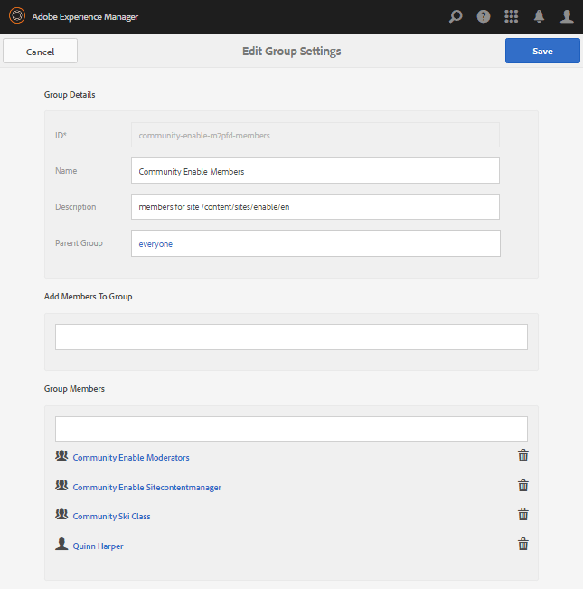
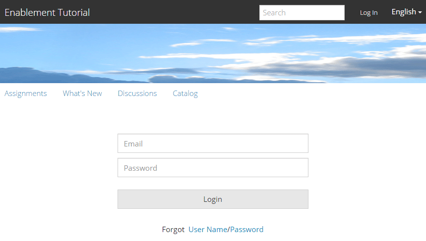

# Auteur een Nieuwe Communautaire Plaats voor Enablement {#author-a-new-community-site-for-enablement}

## Community-site maken {#create-community-site}

[Bij het ](sites-console.md) maken van een Community Site wordt een wizard gebruikt die u begeleidt bij het maken van een communitysite. U kunt naar de `Next`stap of `Back`vorige stap gaan voordat u de site in de laatste stap toewijst.

Ga als volgt te werk om een nieuwe communitysite te maken:

De [auteurinstantie](http://localhost:4502/) gebruiken

* Aanmelden met beheerdersrechten
* Ga naar **[!UICONTROL Communities > Sites]**

* Selecteer **[!UICONTROL Create]**

### Stap 1: Sitesjabloon {#step-site-template}

Voer in de stap **Sitesjabloon** een titel, beschrijving, naam voor de URL in en selecteer bijvoorbeeld een sjabloon voor een communitysite:

* **Titel** van communautaire site:  `Enablement Tutorial`

* **Beschrijving** van communautaire site:  `A site for enabling the community to learn.`

* **Hoofdmap** van gemeenschapssite: (leeg laten voor standaardhoofdmap  `/content/sites`)

* **Cloudconfiguraties**: (leeg laten als er geen cloudconfiguraties zijn opgegeven) het pad naar de opgegeven cloudconfiguraties bieden.
* **Basistaal** van gemeenschapssite: (ongewijzigd laten voor één taal: (Engels) gebruik het keuzemenu om één  *of* meer basistalen te kiezen uit de beschikbare talen: Duits, Italiaans, Frans, Japans, Spaans, Portugees (Brazilië), Chinees (Traditioneel) en Chinees (Vereenvoudigd). Er wordt één communitysite gemaakt voor elke toegevoegde taal en deze wordt in dezelfde sitemap gebruikt volgens de best practices die worden beschreven in [Inhoud vertalen voor meertalige sites](../../help/sites-administering/translation.md). De hoofdpagina van elke site bevat een onderliggende pagina met de taalcode van een van de geselecteerde talen, zoals &#39;en&#39; voor Engels of &#39;fr&#39; voor Frans.

* **[!UICONTROL Community Site Name]**: `enable`

   * de eerste URL wordt onder de naam van de communautaire site weergegeven
   * voor een geldige URL voegt u een basistaalcode + &quot;.html&quot; toe

      *bijvoorbeeld* http://localhost:4502/content/sites/  `enable/en.html`

* **[!UICONTROL Reference Site Template]**: naar beneden halen om te kiezen  `Reference Structured Learning Site Template`

Selecteer **[!UICONTROL Next]**

### Stap 2: Ontwerp {#step-design}

De stap Ontwerp wordt in twee secties weergegeven voor het selecteren van het thema en de brandingbanner:

#### THEMA VAN COMMUNAUTAIRE SITE {#community-site-theme}

Selecteer de gewenste stijl die u op de sjabloon wilt toepassen. Als deze optie is geselecteerd, wordt het thema bedekt met een vinkje.

#### COMMUNAUTAIRE SITEBRANDING {#community-site-branding}

(optioneel) Upload een bannerafbeelding voor weergave op de sitepagina&#39;s. De banner is vastgezet aan de linkerrand van browser, tussen de communautaire plaatsheader en menu (navigatiekoppelingen). De bannerhoogte wordt bijgesneden tot 120 pixels. Er wordt geen grootte van de banner aangepast aan de breedte van de browser en de hoogte van 120 pixels.

 

Selecteer **[!UICONTROL Next]**.

### Stap 3: Instellingen {#step-settings}

Voor de stap van Montages, alvorens `Next` te selecteren, merk er zeven secties zijn die toegang tot configuraties verlenen die gebruikersbeheer, het etiketteren, rollen, moderatie, analyse, vertaling, en enablement impliceren.

#### GEBRUIKERSBEHEER {#user-management}

Aanbevolen wordt [enablement Communities](overview.md#enablement-community) privé te maken.

Een gemeenschapssite is persoonlijk wanneer anonieme sitebezoekers geen toegang krijgen, zich mogelijk niet zelf registreren en geen gebruik maken van sociale aanmelding.

Zorg ervoor dat de meeste selectievakjes zijn uitgeschakeld voor [Gebruikersbeheer](sites-console.md#user-management):

* Websitebezoekers niet toestaan zich te registreren
* Anonieme sitebezoekers mogen de site niet bekijken
* Facultatief al dan niet overseinen onder communautaire leden toestaan
* Aanmelden met Facebook NIET toestaan
* Aanmelden met Twitter niet toestaan

#### TAGS {#tagging}

De tags die kunnen worden toegepast op community-inhoud, worden beheerd door AEM naamruimten te selecteren die eerder zijn gedefinieerd via de [Tagingconsole](../../help/sites-administering/tags.md#tagging-console) (zoals de [Zelfstudie-naamruimte](enablement-setup.md#create-tutorial-tags)).

Als u bovendien Tagnaamruimten selecteert voor de communitysite, beperkt u de selectie die wordt weergegeven bij het definiëren van catalogi en machtigingsbronnen. Zie [Tags toewijzen Bronnen](tag-resources.md) voor belangrijke informatie.

Het zoeken naar naamruimten is eenvoudig met &#39;type-ahead&#39;-zoekopdracht. Bijvoorbeeld,

* Type &#39;tut&#39;
* Selecteer `Tutorial`

### ROLLEN {#roles}

[De communautaire ](users.md) leden worden toegewezen door de montages in de sectie van Rollen.

Als u een lid van de gemeenschap (of groep leden) de site wilt laten ervaren als gemeenschapsbeheerder, gebruikt u de typecontrole en selecteert u de naam van het lid of de groep in de keuzelijst.

Bijvoorbeeld,

* Type &quot;q&quot;
* Selecteer [Quinn Harper](enablement-setup.md#publishcreateenablementmembers)

>[!NOTE]
>
>[Met de tunnelservice ](deploy-communities.md#tunnel-service-on-author) kunt u leden en groepen selecteren die alleen in de publicatieomgeving aanwezig zijn.

#### MODERING {#moderation}

Accepteer de standaard algemene instellingen voor [het modereren](sites-console.md#moderation) door de gebruiker gegenereerde inhoud (UGC).

#### ANALYSE {#analytics}

Selecteer in het keuzemenu het cloudserviceframework Analytics dat voor deze communitysite is geconfigureerd.

De selectie in het schermafbeelding, `Communities`, is het kadervoorbeeld van de [configuratiedocumentatie.](analytics.md#aem-analytics-framework-configuration)

#### TRANSLATION {#translation}

Met de [Vertaalinstellingen](sites-console.md#translation) wordt aangegeven of UGC kan worden vertaald en in welke taal, als dat het geval is.

* Vinkje **[!UICONTROL Allow Machine Translation]**
* De standaardinstellingen gebruiken

#### INSCHAKELEN {#enablement}

Voor een machtigingsgemeenschap is het noodzakelijk om één of meerdere Communautaire Beheerders van Enablement te identificeren.

* **[!UICONTROL Enablement Managers]**
(vereist) Leden van de 
`Community Enablement Managers` Deze groep is beschikbaar om te worden geselecteerd voor het beheer van deze communitysite.

   * Type &quot;s&quot;
   * Selecteer `Sirius Nilson`

* **[!UICONTROL Marketing Cloud Org Id]**
(optioneel) De id voor een Adobe Analytics-account die nodig is wanneer  [Video Heartbeat ](analytics.md#video-heartbeat-analytics) Analytics wordt opgenomen in de rapportage over activering.

Selecteer **[!UICONTROL Next]**.

### Stap 4: Community-site maken {#step-create-community-site}

Selecteer **[!UICONTROL Create]**.

Wanneer het proces is voltooid, wordt de map voor de nieuwe site weergegeven in de console Communities - Sites.

### De nieuwe communautaire site publiceren {#publish-the-new-community-site}

De gecreeerde plaats zou van de Gemeenschappen - de console van Plaatsen moeten worden beheerd, de zelfde console van waar de nieuwe plaatsen kunnen worden gecreeerd.

Nadat u de map van de communitysite hebt geselecteerd, houdt u de muisaanwijzer boven het sitepictogram, zodat er vier actiepictogrammen worden weergegeven:

Als u het pictogram Ovalen selecteert (pictogram Meer handelingen), worden de opties Site exporteren en Site verwijderen weergegeven.

Van links naar rechts zijn ze:

* **Open**
SiteSelecteer het potloodpictogram om de gemeenschapssite te openen in de modus Bewerken door auteur om paginacomponenten toe te voegen en/of te configureren

* **Site bewerkenSelecteer het eigenschappenpictogram om de site van de community te openen voor wijziging van eigenschappen, zoals de titel, of om het thema te wijzigen**

* **Publiceer**
SiteSelecteer het wereldpictogram om de communitysite te publiceren (standaard naar localhost:4503)

* **Exporteer**
SiteSelecteer het exportpictogram om een pakket van de communitysite te maken dat zowel in  [pakketbeheer wordt opgeslagen als wordt ](../../help/sites-administering/package-manager.md) gedownload.

   UGC is niet opgenomen in het sitepakket.

* **Verwijder**
SiteAls u de site van de community wilt verwijderen, selecteert u het pictogram Site verwijderen dat wordt weergegeven wanneer u de muisaanwijzer op de site in de Community Site-console plaatst. Met deze actie verwijdert u alle items die aan de site zijn gekoppeld, zoals UGC, gebruikersgroepen, elementen en databaserecords.

#### Publiceren {#select-publish} selecteren

Selecteer het pictogram van de wereld om de communitysite te publiceren.

Er wordt een indicatie gegeven dat de site is gepubliceerd.

## Community-gebruikers en -gebruikersgroepen {#community-users-user-groups}

### Nieuwe gebruikersgroepen van de Gemeenschap {#notice-new-community-user-groups} melden

Samen met de nieuwe communautaire plaats, worden de nieuwe gebruikersgroepen gecreeerd die de aangewezen toestemmingen hebben die voor diverse administratieve functies worden geplaatst. Voor details, bezoek [Gebruikersgroepen voor Communautaire Plaatsen](users.md#usergroupsforcommunitysites).

Voor deze nieuwe communautaire plaats, gezien de plaatsnaam &quot;laat&quot;in Stap 1 toe, kunnen de nieuwe gebruikersgroepen die in het publiceren milieu bestaan van [de leden &amp; van Groepen van Gemeenschappen console](members.md#groups-console) worden gezien:

### Leden toewijzen aan de groep leden {#assign-members-to-community-enable-members-group} voor Community Enable

Op auteur, met de toegelaten tunneldienst, is het mogelijk om [gebruikers toe te wijzen die tijdens Begeleidende Opstelling](enablement-setup.md#publishcreateenablementmembers) aan de groep van Leden Gemeenschap voor de pas gecreëerde communautaire plaats worden gecreeerd.

Met behulp van de Community Group-console kunnen leden afzonderlijk worden toegevoegd of via lidmaatschap aan een groep worden toegevoegd.

In dit voorbeeld wordt de groep `Community Ski Class` toegevoegd als lid van de groep `Community Enable Members` en als lid `Quinn Harper`.

* Naar **[!UICONTROL Communities > Groups]**-console navigeren
* Groep selecteren **[!UICONTROL Community Enable Members]**
* `ski` invoeren in het zoekvak **[!UICONTROL Add Members To Group]**
* Selecteer **[!UICONTROL Community Ski Class]** (groep studenten)
* `quinn` invoeren in het zoekvak
* Selecteer **[!UICONTROL Quinn Harper]** (resablement resource contact inschakelen)

* Selecteer **[!UICONTROL Save]**

## Configuraties bij publiceren {#configurations-on-publish}

### http://localhost:4503/content/sites/enable/en.html {#http-localhost-content-sites-enable-en-html}

### Configureren voor verificatiefout {#configure-for-authentication-error}

Nadat een site is geconfigureerd en geduwd op publiceren, [configureert u de aanmeldingstoewijzing](sites-console.md#configure-for-authentication-error) ( `Adobe Granite Login Selector Authentication Handler`) op de publicatieinstantie. Het voordeel is dat wanneer aanmeldingsgegevens niet correct worden ingevoerd, de verificatiefout de aanmeldingspagina van de communautaire site opnieuw weergeeft met een foutbericht.

Een `Login Page Mapping` toevoegen als

* /content/sites/enable/nl/sign:/content/sites/enable/nl

### (Optioneel) Wijzig de standaardstartpagina {#optional-change-the-default-home-page}

Als u met de publicatiesite werkt voor demonstratiedoeleinden, is het handig om de standaardstartpagina te wijzigen in de nieuwe site.

Hiervoor moet u [CRX|DE](http://localhost:4503/crx/de) Lite gebruiken om de [bronnentoewijzing](../../help/sites-deploying/resource-mapping.md)-tabel bij publicatie te bewerken.

Aan de slag

1. Bij publiceren, heb toegang tot CRXDE en login met beheerdervoorrechten

   * Blader bijvoorbeeld naar [http://localhost:4503/crx/de](http://localhost:4503/crx/de) en meld u aan met `admin/admin`

1. Vouw `/etc/map` in de projectbrowser uit
1. Selecteer de `http` knoop

   * Selecteer **[!UICONTROL Create Node]**

      * **** Namelocalhost.4503

         (Gebruik *not* `:`)

      * **** [lettertypen:toewijzen](https://sling.apache.org/documentation/the-sling-engine/mappings-for-resource-resolution.html)

1. Met nieuw aangemaakt `localhost.4503`-knooppunt geselecteerd

   * Eigenschap toevoegen

      * **** naamgeving:overeenkomst
      * **** TypeString
      * **** Valuelocalhost.4503/\$

         (Moet eindigen met &#39;$&#39; teken)
   * Eigenschap toevoegen

      * **** naamgeving:internalRedirect
      * **** TypeString
      * **Waarde** /content/sites/enable/en.html

1. Selecteer **[!UICONTROL Save All]**
1. (optioneel) De browsergeschiedenis verwijderen
1. Bladeren naar http://localhost:4503/

   * Ga naar http://localhost:4503/content/sites/enable/en.html

>[!NOTE]
>
>Als u deze optie wilt uitschakelen, voegt u de waarde van de eigenschap `sling:match` gewoon aan met een &#39;x&#39; - `xlocalhost.4503/$` - en **[!UICONTROL Save All]**.

#### Problemen oplossen: Fout bij opslaan van kaart {#troubleshooting-error-saving-map}

Als u wijzigingen niet kunt opslaan, moet u ervoor zorgen dat de knooppuntnaam `localhost.4503` is, met een &#39;punt&#39;-scheidingsteken en niet `localhost:4503` met een &#39;dubbele punt&#39;-scheidingsteken, omdat `localhost`geen geldig naamruimtevoorvoegsel is.

#### Problemen oplossen: Kan {#troubleshooting-fail-to-redirect} niet omleiden

De tekenreeks &#39;**$**&#39; aan het einde van de reguliere expressie `sling:match`is van cruciaal belang, zodat alleen exact `http://localhost:4503/` wordt toegewezen. Anders wordt de omleidingswaarde toegevoegd aan elk pad dat mogelijk bestaat na de server:poort in de URL. Wanneer AEM probeert om naar de aanmeldingspagina om te leiden, mislukt dit.

## Het wijzigen van de Communautaire Plaats {#modifying-the-community-site}

Nadat de site voor het eerst is gemaakt, kunnen auteurs het [pictogram Open Site](sites-console.md#authoring-site-content) gebruiken om standaard AEM ontwerpactiviteiten uit te voeren.

Daarnaast kunnen beheerders het [Sitepictogram bewerken](sites-console.md#modifying-site-properties) gebruiken om eigenschappen van de site, zoals de titel, te wijzigen.

Na om het even welke wijziging, herinner aan **sparen** en re-**Publish** de plaats.

>[!NOTE]
>
>Als u niet bekend bent met AEM, bekijkt u de documentatie over [basisverwerking](../../help/sites-authoring/basic-handling.md) en een [handleiding voor het schrijven van pagina&#39;s](../../help/sites-authoring/qg-page-authoring.md).

### Een catalogus {#add-a-catalog} toevoegen

Het sjabloon voor de communitysite dat voor deze communitysite is gekozen, moet de catalogusfunctie bevatten.

Als dat niet het geval is, kan de catalogusfunctie eenvoudig worden toegevoegd. Hierdoor kunnen andere leden van de gemeenschap die niet zijn toegewezen aan bronnen voor activering of een leerpad, bronnen voor activering selecteren in een catalogus.

Als de sitestructuur al de catalogusfunctie bevat, kan de titel worden gewijzigd.

Als u de structuur van de site wilt wijzigen, navigeert u naar de **[!UICONTROL Communities, Sites]**-console, opent u de map `enable` en selecteert u het pictogram **Site bewerken** om toegang te krijgen tot de eigenschappen van `Enablement Tutorial`.

Selecteer het deelvenster STRUCTUUR om een catalogus toe te voegen of een bestaande catalogus te wijzigen:

* **Titel**:  `Ski Catalog`

* **URL**:  `catalog`

* **Alle naamruimten** selecteren: blijven staan.
* Selecteer **[!UICONTROL Save]**

Gebruik het pictogram Positie om de functie Catalog naar de tweede positie te verplaatsen, na Toewijzingen.

Selecteer **[!UICONTROL Save]** in de hogere juiste hoek om de veranderingen in de communautaire plaats te bewaren.

Vervolgens kunt u de site opnieuw **publiceren**.
