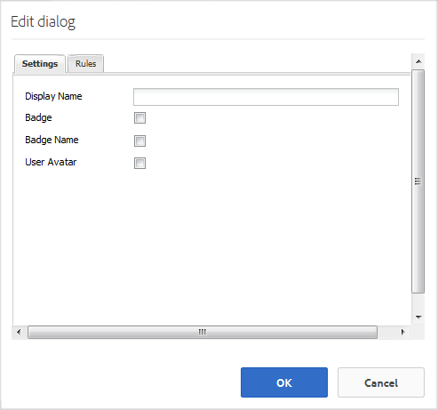

# Leaderboard-functie {#leaderboard-feature}

## Inleiding {#introduction}

De `Leaderboard` component verstrekt de capaciteit om een idee van te verkrijgen hoe de leden binnen de gemeenschap interactie door leden volgens verdiende punten (basis het scoren) of hun deskundigheid (geavanceerde het scoren) te rangschikken.

Voordat de leaderboard-component op een pagina wordt opgenomen, moet u [Communityscores en Badges](implementing-scoring.md) configureren.

In deze sectie van de documentatie wordt beschreven

* De `Leaderboard`-component toevoegen aan een [communitysite](overview.md#community-sites)

* Configuratie-instellingen voor de `Leaderboard`-component

## Leaderboard toevoegen aan een pagina {#adding-a-leaderboard-to-a-page}

Als u een `Leaderboard`-component wilt toevoegen aan een pagina in de ontwerpmodus, zoekt u de component

* `Communities / Leaderboard`

en sleep het naar de juiste plaats op een pagina.

Voor noodzakelijke informatie, bezoek [de Grondbeginselen van Componenten van Gemeenschappen](basics.md).

Wanneer de component voor het eerst op een pagina van een communitysite wordt geplaatst, ziet deze er zo uit:

## Leaderboard {#configuring-leaderboard} configureren

Selecteer de geplaatste `Leaderboard` component en selecteer `Configure` pictogram dat het Edit dialoog opent.

 

### Tabblad Instellingen {#settings-tab}

Geef onder het tabblad **[!UICONTROL Settings]** op welke informatie met betrekking tot het lid wordt weergegeven:

* **[!UICONTROL Display Name]**
Een beschrijvende naam die voor het bord moet worden weergegeven en die de regels weergeeft die zijn geselecteerd voor het weergeven van badges en scores.

   De standaardwaarde is `Leaderboard`, als er niets is ingevoerd.

* **[!UICONTROL Badge]**
Als deze optie is ingeschakeld, wordt een kolom voor badge-pictogrammen opgenomen in het leaderboard.

   De optie Standaard is uitgeschakeld.

* **[!UICONTROL Badge Name]**
Als deze optie is ingeschakeld, wordt een kolom met de naam van de badge opgenomen in het leaderboard.

   De optie Standaard is uitgeschakeld.

* **[!UICONTROL Use Avatar]**
Als deze optie is ingeschakeld, wordt de avatarafbeelding van het lid opgenomen in het leaderboard, naast de naamkoppeling naar het profiel van het lid.

   De optie Standaard is uitgeschakeld.

### Regels, tabblad {#rules-tab}

Onder het tabblad **[!UICONTROL Rules]** vindt u de site van de gebruikersgemeenschap en de bijbehorende regels voor scoring en badging

* **[!UICONTROL Rule Location]**
(Vereist) Plaats waar de het Scoren/het Bedragen regel wordt gevormd.

* **[!UICONTROL Scoring Rule]**
(Vereist) Specifieke regel die de scores genereert die moeten worden weergegeven.

* **[!UICONTROL Badging Rule]**
(Vereist) Specifieke regel die de badge aan vertoning produceert.

* **[!UICONTROL Display Limit]**
Aantal leden dat per pagina moet worden weergegeven.

   De standaardwaarde is 10.

## Voorbeeld: Lederboard van deelnemers {#example-participants-leaderboard}

Deze lederbordrapporten zijn het resultaat van het toepassen van elementaire scoringregels.

Configuratie van de component Leaderboard:

* **[!UICONTROL Settings]** tab:

   * Weergavenaam = `Participation Board`
   * `checked`:

      * Badge
      * Naam badge
      * Avatar gebruiken

* **[!UICONTROL Rules]** tab:

   * Locatie van regel = `/content/sites/communities/jcr:content`
   * Scoreregel = `/etc/community/scoring/rules/forums-scoring`
   * Badging Rule = `/etc/community/badging/rules/reference-badging`
   * Weergavelimiet = `10`

## Voorbeeld: Leaderboard van experts {#example-experts-leaderboard}

Dit leaderboard-rapport is het resultaat van het toepassen van geavanceerde scoreregels.

Configuratie van de component Leaderboard:

* **[!UICONTROL Settings]** tab:

   * Weergavenaam = `Expertise Board`
   * `checked`:

      * Badge
      * Avatar gebruiken

* **[!UICONTROL Rules]** tab:

   * Locatie van regel = `/content/sites/communities/jcr:content`
   * Scoreregel = `/etc/community/scoring/rules/adv-forums-scoring`
   * Badging Rule = `/etc/community/badging/rules/adv-forums-badging`
   * Weergavelimiet = `10`

## Aanvullende informatie {#additional-information}

Meer informatie vindt u op de pagina [Leaderboard Essentials](leaderboard.md) voor ontwikkelaars.

Instructies voor het maken van regels vindt u op de pagina [Community Scoring and Badges](implementing-scoring.md) voor beheerders.
