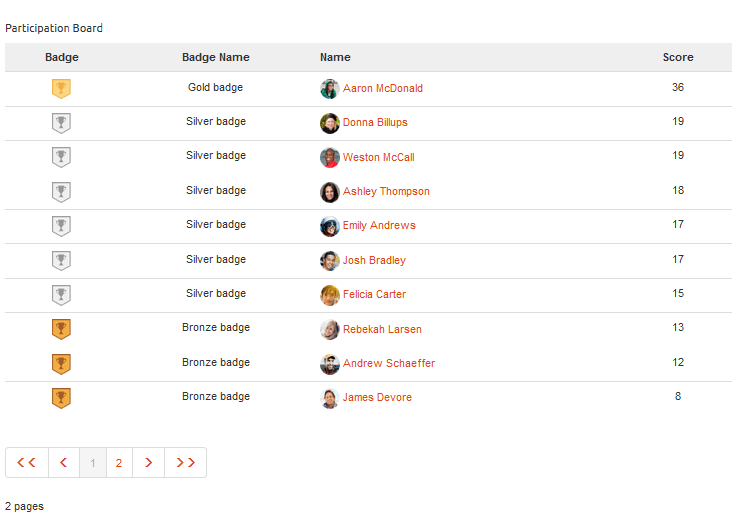
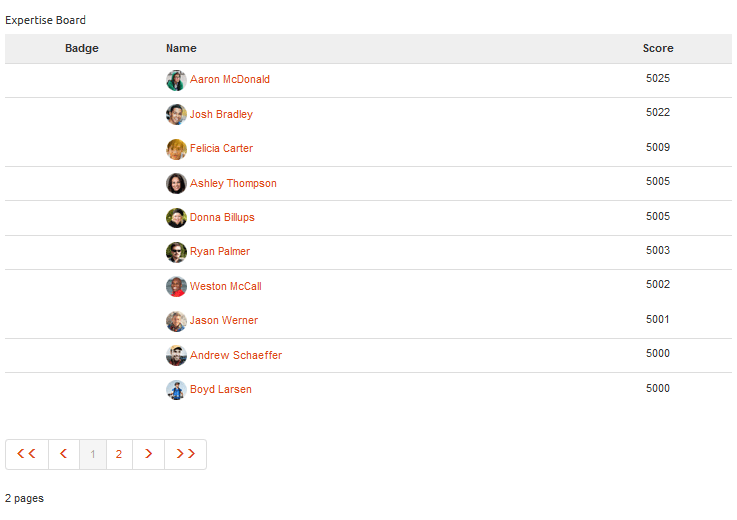

# Leaderboard-functie {#leaderboard-feature}

## Inleiding {#introduction}

De `Leaderboard` component biedt de mogelijkheid om inzicht te krijgen in de manier waarop leden binnen de gemeenschap met elkaar communiceren door leden te rangschikken op basis van verdiende punten (basisscore) of hun expertise (geavanceerde scoring).

Voordat de leaderboard-component op een pagina wordt geplaatst, moet u [Communities Scoring and Badges](implementing-scoring.md)configureren.

In deze sectie van de documentatie wordt beschreven

* De `Leaderboard` component toevoegen aan een [communitysite](overview.md#community-sites)

* Configuratie-instellingen voor de `Leaderboard` component

## Een Leaderboard toevoegen aan een pagina {#adding-a-leaderboard-to-a-page}

Als u een `Leaderboard` component aan een pagina wilt toevoegen in de ontwerpmodus, zoekt u de component

* `Communities / Leaderboard`

en sleep het naar de juiste plaats op een pagina.

Ga voor de benodigde informatie naar [Community Components Basics](basics.md).

Wanneer de component voor het eerst op een pagina van een communitysite wordt geplaatst, ziet deze er zo uit:

## Leaderboard configureren {#configuring-leaderboard}

Selecteer de geplaatste `Leaderboard` component die u wilt openen en selecteer het `Configure` pictogram waarmee het dialoogvenster Bewerken wordt geopend.

 

### Het tabblad Instellingen {#settings-tab}

Geef op onder het tabblad **[!UICONTROL Instellingen]** op welke informatie over het lid wordt weergegeven:

* **[!UICONTROL De Naam]** van de vertoning een beschrijvende naam aan vertoning voor de raad, die de regels weerspiegelt die voor de vertoning van badges en scores worden geselecteerd.

   De standaardwaarde is `Leaderboard`, als er niets is ingevoerd.

* **[!UICONTROL Badge]** Indien ingeschakeld, wordt een kolom voor badge-pictogrammen opgenomen in het leaderboard.

   De optie Standaard is uitgeschakeld.

* **[!UICONTROL Naam]** badge Indien ingeschakeld, wordt een kolom voor de naam van de badge opgenomen in het leaderboard.

   De optie Standaard is uitgeschakeld.

* **[!UICONTROL Gebruik Avatar]** Als deze optie is ingeschakeld, wordt de avatar-afbeelding van het lid opgenomen in het leaderboard, naast de naamkoppeling naar het lidprofiel.

   De optie Standaard is uitgeschakeld.

### Regels, tabblad {#rules-tab}

Op het tabblad **[!UICONTROL Regels]** vindt u de site van de gebruikersgemeenschap en de bijbehorende regels voor scoring en badging

* **[!UICONTROL Locatie]** van regel (vereist) waar de regel voor het classificeren/Badging is geconfigureerd.

* **[!UICONTROL (Vereiste) Specifieke regel voor het scoren]** die de scores genereert die moeten worden weergegeven.

* **[!UICONTROL (Vereiste) Specifieke regel die de badge voor weergave genereert]**.

* **[!UICONTROL Limiet]** aantal leden per pagina weergeven.

   De standaardwaarde is 10.

## Voorbeeld: Lederboard van deelnemers {#example-participants-leaderboard}

Deze lederbordrapporten zijn het resultaat van het toepassen van elementaire scoringregels.

Configuratie van de component Leaderboard:

* **[!UICONTROL Tabblad Instellingen]** :

   * Weergavenaam = `Participation Board`
   * `checked`:

      * Badge
      * Naam badge
      * Avatar gebruiken

* **[!UICONTROL Tabblad Regels]** :

   * Locatie van regel = `/content/sites/communities/jcr:content`
   * Scoreregel = `/etc/community/scoring/rules/forums-scoring`
   * Badgingregel = `/etc/community/badging/rules/reference-badging`
   * Weergavelimiet = `10`

## Voorbeeld: Expert Leaderboard {#example-experts-leaderboard}

Dit leaderboard-rapport is het resultaat van het toepassen van geavanceerde scoreregels.

Configuratie van de component Leaderboard:

* **[!UICONTROL Tabblad Instellingen]** :

   * Weergavenaam = `Expertise Board`
   * `checked`:

      * Badge
      * Avatar gebruiken

* **[!UICONTROL Tabblad Regels]** :

   * Locatie van regel = `/content/sites/communities/jcr:content`
   * Scoreregel = `/etc/community/scoring/rules/adv-forums-scoring`
   * Badgingregel = `/etc/community/badging/rules/adv-forums-badging`
   * Weergavelimiet = `10`

## Additional Information {#additional-information}

Meer informatie vindt u op de pagina [Leaderboard Essentials](leaderboard.md) voor ontwikkelaars.

Instructies voor het maken van regels worden gegeven op de pagina [Community Scoring and Badges](implementing-scoring.md) voor beheerders.
