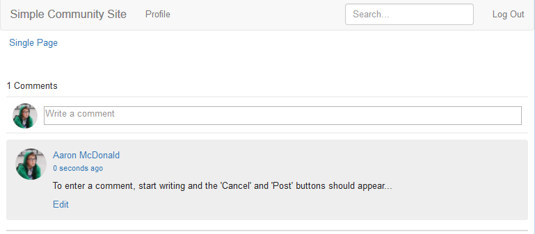

# Opmerking toevoegen aan voorbeeldpagina {#add-comment-to-sample-page}

Nu de componenten voor het aangepaste opmerkingensysteem in de toepassingsmap (/apps) staan, is het mogelijk om de uitgebreide component te gebruiken. De instantie van het opmerkingssysteem in een website die moet worden beïnvloed moet zijn resourceType plaatsen om het systeem van douanecommentaar te zijn en alle noodzakelijke cliëntbibliotheken te omvatten.

## Vereiste clients identificeren {#identify-required-clientlibs}

De clientbibliotheken die nodig zijn voor de stijl en werking van de standaardopmerkingen zijn ook nodig voor uitgebreide opmerkingen.

De [Community Components Guide](components-guide.md) identificeert de vereiste clientbibliotheken. Blader naar de Component Guide en bekijk de component Comments, bijvoorbeeld:

[http://localhost:4502/content/community-components/en/comments.html](http://localhost:4502/content/community-components/en/comments.html)

Let op de drie clientbibliotheken die nodig zijn voor het renderen en correct functioneren van Opmerkingen. Deze moeten worden opgenomen waar naar de uitgebreide opmerkingen wordt verwezen, en in de clientbibliotheek ](extend-create-components.md#create-a-client-library-folder) ( `apps.custom.comments`) van [extended Comments.

## Aangepaste opmerkingen toevoegen aan een pagina {#add-custom-comments-to-a-page}

Aangezien er slechts één systeem van de Commentaar per pagina kan zijn, is het eenvoudiger om een steekproefpagina tot stand te brengen zoals die in het korte [Create a Sample Page](create-sample-page.md) leerprogramma wordt beschreven.

Nadat u een aangepaste component hebt gemaakt, voert u de ontwerpmodus in en stelt u de componentgroep Custom beschikbaar zodat de component `Alt Comments` aan de pagina kan worden toegevoegd.

De opmerking wordt alleen weergegeven en werkt naar behoren als de clientbibliotheken voor opmerkingen worden toegevoegd aan de clientlibslist voor de pagina (zie [Clientlibs for Communities Components](clientlibs.md)).

### Opmerkingen Clientlibs op voorbeeldpagina {#comments-clientlibs-on-sample-page}

### Auteur: Alt-commentaar op voorbeeldpagina {#author-alt-comment-on-sample-page}

### Auteur: Opmerkingen op voorbeeldpagina {#author-sample-page-comments-node}

U kunt het resourceType in CRXDE verifiëren door de eigenschappen van de commentaarknoop voor de steekproefpagina bij `/content/sites/sample/en/jcr:content/content/primary/comments` te bekijken.

### Voorbeeldpagina publiceren {#publish-sample-page}

Nadat de aangepaste component aan de pagina is toegevoegd, is het ook nodig om [de pagina](sites-console.md#publishing-the-site) te publiceren.

### Publiceren: Alt-commentaar op voorbeeldpagina {#publish-alt-comment-on-sample-page}

Nadat u zowel de aangepaste toepassing als de voorbeeldpagina hebt gepubliceerd, moet u een opmerking kunnen invoeren. Als u bent aangemeld met een [demo-gebruiker](tutorials.md#demo-users) of beheerder, moet het mogelijk zijn een opmerking te plaatsen.

Hier aaron.mcdonald@mailinator.com vindt u een opmerking:

 

Nu het lijkt of de uitgebreide component correct werkt met de standaardweergave, is het tijd om de weergave te wijzigen.

