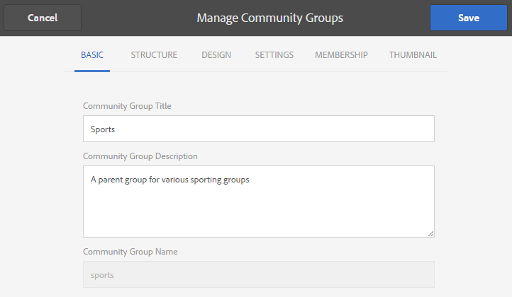

# Console {#community-groups-console} voor groepen van gemeenschappen

De console van Groepen verleent toegang tot het creëren van communautaire groepen wanneer [malplaatjestructuur](sites-console.md#step1) [groepenfunctie](functions.md#groups-function) omvat.

* Groepen kunnen in andere groepen worden genest. Dit gebeurt wanneer [structuur van de nieuwe groep](tools-groups.md) de groepenfunctie bevat.
* Alleen voor de auteursomgeving is er een wizard voor het maken van groepen die lijkt op de wizard voor het maken van sites.
* Of leden groepen kunnen maken van de publicatieomgeving is configureerbaar wanneer een groepsfunctie wordt toegevoegd aan een community-sitestructuur of community-groepsstructuur.

Van de drie meegeleverde groepssjablonen bevat alleen de sjabloon `Reference Group` een groepfunctie in de structuur.

Verschillende facetten van de communautaire groepen zijn:

* Maken: u kunt een nieuwe groep maken bij de auteur en optioneel bij publicatie
* Besturingselement: groep kan open of geheim zijn
* Nesten: een groep kan nul of meer groepen bevatten

>[!NOTE]
>
>Communautaire groepen, die in publicatiemilieu vóór [bestaan van de console van Groepen van de Gemeenschap worden gecreeerd ](https://helpx.adobe.com/in/experience-manager/6-3/communities/using/version-history.html#FeaturePack1FP1), zullen niet in de console van Groepen van de Gemeenschap worden vermeld, en zo, zijn niet veranderbaar gebruikend de console.

>[!NOTE]
>
>Deze console van Groepen, slechts toegankelijk van de console van de Plaatsen van Gemeenschappen, moet niet met het lid [console van Groepen](members.md) voor het beheren van lidgroepen worden verward.
>
>Gebruikersgroepen zijn gebruikersgroepen die zijn geregistreerd in de publicatieomgeving en die vanuit de auteursomgeving worden benaderd met de [tunnelservice](deploy-communities.md#tunnel-service-on-author).

## Groep maken {#group-creation}

De console Groepen openen:

* Meld u aan bij de auteur met beheerdersrechten
* Vanuit globale navigatie: **[!UICONTROL Communities > Sites]**
* Bestaande community-sitemap selecteren om deze te openen
* Selecteer een instantie van een communitysite in de map

   * De structuur van de site van de community moet een groepfunctie bevatten
   * Deze schermafbeeldingen zijn afkomstig uit de zelfstudie Aan de slag nadat [groepen zijn gemaakt voor publicatie](published-site.md)

Selecteer **[!UICONTROL Groups folder]** om het te openen.

Als deze groep wordt geopend, worden alle bestaande groepen weergegeven, ongeacht of deze groepen bij de auteur of bij de publicatie zijn gemaakt.

Van deze console van Groepen, is het mogelijk om nieuwe groepen te ontwerpen.

* Knop **[!UICONTROL Create Group]** selecteren

### Stap 1: Communitygroepsjabloon {#step-community-group-template}

* **[!UICONTROL Community Group Title]**: Een weergavetitel voor de groep.

   De titel wordt op de gepubliceerde site voor de groep weergegeven.

* **[!UICONTROL Community Group Description]**: Een beschrijving van de groep.
* **[!UICONTROL Community Group Root]**: Het hoofdpad naar de groep.

   De standaardhoofdmap is de bovenliggende site, maar de hoofdmap kan naar een willekeurige locatie op de website worden verplaatst. Het wordt afgeraden dit te wijzigen.

* **[!UICONTROL Additional Available Community Group Languages(s)]** menu: Gebruik het keuzemenu om de beschikbare taal of talen voor de groep van de gemeenschap te selecteren. In het menu worden alle talen weergegeven waarin de bovenliggende communitysite is gemaakt. Gebruikers kunnen in deze ene stap uit deze talen kiezen om groepen te maken in meerdere landinstellingen. De zelfde groep wordt gecreeerd in veelvoudige gespecificeerde talen in de console van Groepen van de respectieve communautaire plaatsen.

* **[!UICONTROL Community Group Name]**: De naam van de hoofdpagina van de groep die wordt weergegeven in de URL

   * Controleer de naam tweemaal omdat deze na het maken van de groep niet gemakkelijk kan worden gewijzigd
   * De basis-URL wordt onder `Community Group Name` weergegeven
   * Voor een geldige URL voegt u &quot;.html&quot; toe

      *Bijvoorbeeld*, `http://localhost:4502/content/sites/mysight/en/mygroup.html`

* **[!UICONTROL Community Group Template]** menu: Gebruik het keuzemenu om een beschikbare  [communitygroepsjabloon](tools.md) te kiezen.

### Stap 2: Ontwerp {#step-design}

#### THEMA VAN DE COMMUNAUTAIRE GROEP {#community-group-theme}

Het framework gebruikt [Twitter Bootstrap](https://twitterbootstrap.org/) om de site een responsief, flexibel ontwerp te geven. U kunt een van de vele vooraf geladen Bootstrap-thema&#39;s selecteren om de stijl van de geselecteerde communitygroepsjabloon te bepalen of u kunt een Bootstrap-thema uploaden.

Als deze optie is geselecteerd, wordt het thema bedekt met een ondoorzichtig blauw vinkje.

Het is mogelijk een thema te selecteren dat afwijkt van het thema van de bovenliggende site.

Nadat de communitysite is gepubliceerd, is het mogelijk om de eigenschappen [te bewerken en een ander thema te selecteren.](#modifying-group-properties)

#### COMMUNAUTAIRE GROEPSVERDELING {#community-group-branding}

De branding van de communautaire plaats is een beeld dat als kopbal over de bovenkant van elke pagina wordt getoond. Het is mogelijk om een banner voor de groep weer te geven die afwijkt van andere sitepagina&#39;s.

Het formaat van de afbeelding moet zo breed zijn als de verwachte weergave van de pagina in de browser en 120 pixels hoog.

Houd rekening met het volgende wanneer u een afbeelding maakt of selecteert:

* De afbeeldingshoogte wordt bijgesneden tot 120 pixels, gemeten vanaf de bovenrand van de afbeelding
* De afbeelding is vastgezet aan de linkerrand van het browservenster
* De afbeelding wordt niet vergroot of verkleind, zodat de afbeeldingsbreedte..

   * Minder dan de breedte van de browser wordt de afbeelding horizontaal herhaald
   * Groter dan de breedte van de browser, lijkt de afbeelding te zijn uitgesneden

### Stap 3: Instellingen {#step-settings}

#### MODERING {#moderation}

Door gebrek, wordt de lijst van moderatoren van de oudercommunautaire plaats geërft.

Het is mogelijk moderatoren toe te voegen die specifiek zijn voor de groep:

* Zoeken naar leden (vanuit publicatieomgeving) om deze toe te voegen als moderatoren

#### LIDMAATSCHAP {#membership}

Met de instelling voor lidmaatschap kunt u een van de drie manieren selecteren om een community-groep te beveiligen.

* Optioneel lidmaatschap

   Indien geselecteerd, is de communautaire groep een openbare groep. Siteleden kunnen deelnemen aan de groep en posten zonder expliciet deel te nemen aan de groep. Standaard is geselecteerd.
* Vereist lidmaatschap

   indien deze groep wordt geselecteerd , is zij een open groep . Leden van een Community-site kunnen de inhoud van de groep bekijken, maar moeten lid worden van de groep voordat ze inhoud kunnen plaatsen. Leden kunnen deelnemen door de knop `Join` in de publicatieomgeving te selecteren. Standaard is niet geselecteerd.

* Beperkt lidmaatschap

   indien deze groep wordt geselecteerd , is zij een geheime groep . De leden van de Gemeenschap moeten uitdrukkelijk worden uitgenodigd. Uitgenodigde leden worden ingevoerd in het zoekvak. De leden kunnen later worden toegevoegd gebruikend [Leden en Groepen consoles](members.md) het auteursmilieu. Standaard is niet geselecteerd.

#### MINIATUUR {#thumbnail}

De miniatuur is een afbeelding die bij het ontwerpen en publiceren voor de groep moet worden weergegeven.

De optimale grootte voor een groepsafbeelding is 170 x 90 pixels in een ondersteunde afbeeldingsindeling (zoals JPG of PNG).

Als er geen afbeelding wordt toegevoegd, wordt een standaardafbeelding weergegeven.

### Stap 4: Groep {#step-create-group} maken

Als er aanpassingen nodig zijn, gebruikt u de knop **Terug** om deze aan te brengen.

Wanneer **Create** is geselecteerd en gestart, kan het proces voor het maken van de groep niet worden onderbroken.

Wanneer het proces is voltooid, wordt de kaart voor de nieuwe subcommunity-site (groep) weergegeven in de console Sites Group van Communities, vanwaar auteurs pagina-inhoud kunnen toevoegen of beheerders de eigenschappen van de site kunnen wijzigen.

>[!NOTE]
>
>De groep wordt gecreeerd in alle talen, zoals gespecificeerd in [Stap 1: Template](groups.md#step1communitygrouptemplate) van de Groep van de Gemeenschap in de Extra Beschikbare Talen van de Groep van de Gemeenschap, in de console van de Groepen Gemeenschap van de respectieve communautaire plaatsen.

## Inhoud ontwerpgroep {#authoring-group-content}

De pagina-inhoud van een groep kan met dezelfde gereedschappen worden gemaakt als elke andere AEM. Als u de groep wilt openen voor ontwerpen, selecteert u het pictogram Site openen dat wordt weergegeven wanneer u de muisaanwijzer op de groepskaart plaatst.

## Groepseigenschappen wijzigen {#modifying-group-properties}

De eigenschappen van een bestaande subcommunitysite die tijdens het maken van een community zijn opgegeven, kunnen worden gewijzigd door het pictogram Site bewerken te selecteren dat wordt weergegeven wanneer u de muisaanwijzer op de groepskaart plaatst:

De details van de volgende eigenschappen komen overeen met de beschrijvingen in de sectie [Groep maken](#group-creation). Alle geneste groepen kunnen worden gewijzigd, ongeacht of ze zijn gemaakt in de publicatieomgeving of in de auteursomgeving.

### Basis {#modify-basic} wijzigen

Met het BASIC-deelvenster kunt u

* Titel van communautaire groep
* Omschrijving van de communautaire groep

De naam van de communautaire groep mag niet worden gewijzigd.

Het kiezen van een verschillend malplaatje van de communautaire groep zou geen invloed op een bestaande communautaire groepsplaats hebben aangezien geen verbinding tussen malplaatjes en plaatsen blijft.

In plaats daarvan kan de [STRUCTUUR](#modify-structure) van de subcommunity worden gewijzigd.

### Structuur {#modify-structure} wijzigen

Met het deelvenster STRUCTUUR kunt u de structuur wijzigen die u aanvankelijk hebt gemaakt op basis van de sjabloon voor een groep met gemeenschappen die u hebt geselecteerd bij het maken van de subcommunity-site vanuit de auteur- of publicatieomgeving. Vanuit het deelvenster kunt u

* Aanvullende [communityfuncties](functions.md) slepen en neerzetten in de sitestructuur
* Bij een instantie van een communautaire functie in de sitestructuur:

   * **`gear icon`**

      Instellingen bewerken, waaronder de titel van de weergave en de URL-naam, evenals [geprivilegieerde ledengroepen](users.md#privilegedmembersgroups)

   * **`trashcan icon`**

      Functies verwijderen (verwijderen) uit de sitestructuur

   * **`grid icon`**

      De volgorde van functies wijzigen zoals deze wordt weergegeven op de navigatiebalk op het hoogste niveau van de site

>[!CAUTION]
>
>Hoewel de titel van de weergave zonder bijwerkingen kan worden gewijzigd, wordt het niet aanbevolen de URL-naam te bewerken van een communautaire functie die bij een communautaire site hoort.
>
>Als u bijvoorbeeld de naam van de URL wijzigt, wordt de bestaande UGC niet verplaatst, waardoor de UGC verloren gaat.

>[!CAUTION]
>
>De groepsfunctie moet *niet* eerst of de enige functie *in de sitestructuur zijn.*
>
>Elke andere functie, zoals de [paginafunctie](functions.md#page-function), moet worden opgenomen en als eerste worden vermeld.

#### Voorbeeld: Een kalenderfunctie toevoegen aan een subcommunautaire (Groep) structuur {#example-adding-a-calendar-function-to-a-sub-community-group-structure}

### Ontwerp {#modify-design} wijzigen

In het deelvenster ONTWERP kunt u het thema wijzigen:

* [Communautair groepsthema](#community-group-theme)
* [Community Group Branding](#community-group-branding)

   * Schuif naar de onderkant van het deelvenster om de afbeelding van het merk te wijzigen

### Instellingen {#modify-settings} wijzigen

Met het deelvenster INSTELLINGEN kunt u community [moderators](#moderation) toevoegen.

### Lidmaatschap {#modify-membership} wijzigen

Het deelvenster [LIDMAATSCHAP](#membership) is alleen ter informatie. Het is niet mogelijk om het type groepslidmaatschap dat is ingesteld, te wijzigen, ongeacht of het optioneel, vereist of beperkt is.

### Miniatuur {#modify-thumbnail} wijzigen

Met het deelvenster [MINIATUUR](#thumbnail) kan een afbeelding worden geüpload om de community-groep weer te geven voor sitebezoekers in de publicatieomgeving en in de console Groepen van de Communitysite in de auteuromgeving.

## De groep {#publishing-the-group} publiceren

Nadat u een community-groep hebt gemaakt of gewijzigd, kunt u de groep publiceren (activeren) door het pictogram `Publish Site` te selecteren.

Zodra de groep met succes wordt gepubliceerd, zal een bericht verschijnen:

>[!CAUTION]
>
>De bovenliggende communitysite en bovenliggende groepen hadden al gepubliceerd moeten zijn.
>
>De site van de community en geneste groepen moeten van boven naar beneden worden gepubliceerd.

## De groep {#deleting-the-group} verwijderen

Verwijder een groep uit de console van de Groepen van de gemeenschap door het pictogram van de Groep van de Schrapping te selecteren, dat wanneer het hangen van muis over de groep verschijnt.

Hierdoor worden alle aan de groep gekoppelde items verwijderd. Alle inhoud van de groep wordt bijvoorbeeld permanent verwijderd en gebruikerslidmaatschappen worden uit het systeem verwijderd.
