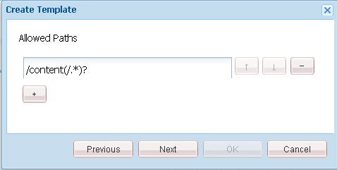

# Aanvankelijke zandbaktoepassing {#initial-sandbox-application}

In deze sectie maakt u het volgende:

* De **[sjabloon](#createthepagetemplate)**die wordt gebruikt om inhoudspagina&#39;s te maken in de voorbeeldwebsite
* De **[component en het script](#create-the-template-s-rendering-component)**waarmee de websitepagina&#39;s worden weergegeven

## De inhoudssjabloon maken {#create-the-content-template}

Een sjabloon definieert de standaardinhoud van een nieuwe pagina. Complexe websites kunnen verschillende sjablonen gebruiken om de verschillende typen pagina&#39;s op de site te maken. Verder, kan de reeks malplaatjes een blauwdruk worden die aan rollout veranderingen in een cluster van servers wordt gebruikt.

In deze exercitie, zijn alle pagina&#39;s gebaseerd op één eenvoudig malplaatje.

1. In het verkendervenster van CRXDE Lite

   * select `/apps/an-scf-sandbox/templates`
   * **[!UICONTROL Maken > Sjabloon maken]**

1. Typ de volgende waarden in het dialoogvenster Sjabloon maken en klik op **[!UICONTROL Volgende]**:

   * Label: `playpage`
   * Titel: `An SCF Sandbox Play Template`
   * Beschrijving: `An SCF Sandbox template for play pages`
   * Type bron: `an-scf-sandbox/components/playpage`
   * Rangschikking: &lt;Als standaard verlaten>
   Het label wordt gebruikt voor de knooppuntnaam.

   Het Type van Middel verschijnt op jcr:content knoop van `playpage`de bron als bezit `sling:resourceType`. Het identificeert de component (bron) die de inhoud teruggeeft wanneer daarom door browser wordt gevraagd.

   In dit geval worden alle pagina&#39;s die met de `playpage`sjabloon zijn gemaakt, door de `an-scf-sandbox/components/playpage` component gerenderd. Volgens conventie is het pad naar de component relatief, zodat Sling eerst naar de bron in de `/apps` map en, indien deze niet wordt gevonden, in de `/libs` map kan zoeken.

   

1. Als u kopiëren/plakken gebruikt, moet u ervoor zorgen dat de waarde van het Type resource geen voorloopspaties of navolgende spaties bevat.

   Click **[!UICONTROL Next]**.

1. &#39;Toegestane paden&#39; verwijst naar de paden van pagina&#39;s die deze sjabloon gebruiken, zodat de sjabloon wordt weergegeven in het dialoogvenster **[!UICONTROL Nieuwe pagina]** .

   Als u een pad wilt toevoegen, klikt u op de plusknop `+` en typt u `/content(/.&ast;)?` in het tekstvak dat wordt weergegeven. Als u kopiëren/plakken gebruikt, dient u ervoor te zorgen dat er geen voorloopspaties of volgspaties zijn.

   Opmerking:De waarde van de toegestane padeigenschap is een *reguliere expressie.* Inhoudspagina&#39;s met een pad dat overeenkomt met de expressie, kunnen de sjabloon gebruiken. In dit geval komt de reguliere expressie overeen met het pad van de map **/content** en alle subpagina&#39;s ervan.

   Wanneer een auteur hieronder een pagina maakt `/content`, wordt de `playpage`sjabloon &#39;Een SCF-sandboxpaginasjabloon&#39; weergegeven in een lijst met beschikbare sjablonen die u kunt gebruiken.

   Nadat de basispagina van de sjabloon is gemaakt, kan de toegang tot de sjabloon worden beperkt tot deze website door de eigenschap zodanig te wijzigen dat het hoofdpad wordt opgenomen in de reguliere expressie, d.w.z...

   `/content/an-scf-sandbox(/.&ast;)?`

   

1. Click **[!UICONTROL Next]**.

   Klik op **[!UICONTROL Volgende]** in het deelvenster **[!UICONTROL Toegestane bovenliggende]** elementen.

   Klik op **[!UICONTROL Volgende]** in de deelvensters **[!UICONTROL Onderliggende]** objecten toestaan.

   Click **[!UICONTROL OK]**.

1. Nadat u op OK hebt geklikt en de sjabloon hebt gemaakt, ziet u dat de hoeken van de waarden op het tabblad Eigenschappen van de nieuwe `playpage`sjabloon rode driehoeken bevatten. Deze rode driehoeken geven bewerkingen aan die niet zijn opgeslagen.

   Klik op Alles **** opslaan om de nieuwe sjabloon op te slaan in de repository.

   

### De renderingcomponent van de sjabloon maken {#create-the-template-s-rendering-component}

Maak de *component* die de inhoud definieert en rendert alle pagina&#39;s die op basis van de [playpagjabloon](#createthepagetemplate)zijn gemaakt.

1. Klik in CRXDE Lite met de rechtermuisknop **`/apps/an-scf-sandbox/components`** en klik op **[!UICONTROL Maken > Component]**.
1. Door de naam van het knooppunt (Label) in te stellen op *playpage*, is het pad naar de component

   `/apps/an-scf-sandbox/components/playpage`

   die overeenkomt met het Resource Type van de playpage-sjabloon (optioneel minus het oorspronkelijke **`/apps/`** deel van het pad).

   Typ de volgende eigenschapswaarden in het dialoogvenster **[!UICONTROL Component]** maken:

   * Label: **playpage**
   * Titel: **Een SCF-sandbox-afspeelcomponent**
   * Omschrijving: **Dit is de component die inhoud voor een SCF Sandbox pagina teruggeeft.**
   * Supertype: *&lt;leeg laten>*
   * Groeperen:
   

1. Klik op **[!UICONTROL Volgende]** totdat het deelvenster **[!UICONTROL Toegestane onderliggende]** items van het dialoogvenster verschijnt

   * Click **[!UICONTROL OK]**
   * Klik op Alles **[!UICONTROL opslaan]**

1. Verifieer dat de weg aan de component en resourceType voor het malplaatje aanpast.

   >[!CAUTION]
   >
   >De overeenstemming tussen de weg aan de playpage component en het sling:resourceType bezit van het playpage malplaatje is essentieel voor het correcte functioneren van de website.

   