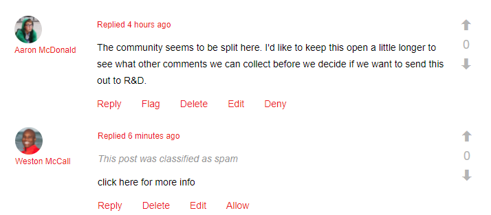

# Communautaire inhoud moderniseren {#moderating-community-content}

## Overzicht {#overview}

Community-inhoud, ook wel door gebruikers gegenereerde inhoud (UGC) genoemd, wordt gemaakt wanneer een lid (dat is aangemeld bij de bezoeker van de site) inhoud van een gepubliceerde communitysite plaatst via interactie met een van de volgende onderdelen van de gemeenschap:

* [Blog](blog-feature.md): leden plaatsen blogartikelen of commentaar
* [Kalender](calendar.md): leden plaatsen een agendagebeurtenis of commentaar
* [Opmerkingen](comments.md): leden plaatsen een opmerking of reageren op een opmerking
* [Forum](forum.md): leden plaatsen een nieuw onderwerp of antwoorden op een onderwerp
* [Ideatie](ideation-feature.md): leden plaatsen een idee of commentaar
* [QnA](working-with-qna.md): leden maken een vraag of beantwoorden deze
* [Revisies](reviews.md): leden plaatsen commentaar wanneer ze een object beoordelen

Moderatie van UGC is nuttig voor het erkennen van positieve bijdragen en het beperken van negatieve bijdragen (zoals spam en misleidende taal). UGC kan vanuit verschillende omgevingen worden gemodereerd:

* [Moderniseringsconsole](moderation.md)

   De console van de Moderatie is toegankelijk door beheerders en [communautaire moderatoren](users.md) in het openbare milieu evenals door beheerders in het auteursmilieu. Dit is mogelijk wanneer inhoud van de gebruikersgemeenschap wordt opgeslagen in een [algemene winkel](working-with-srp.md).

* [Moderatie binnen de context](in-context.md)

   De modernisering in het publicatiemilieu kan door beheerders en communautaire moderatoren direct op de pagina worden uitgevoerd waar de inhoud werd gepost.

## Moderatiehandelingen {#moderation-actions}

De acties die op geposte inhoud (UGC) kunnen worden uitgevoerd variëren afhankelijk van de gebruikersidentiteit en het milieu. In de onderstaande tabel wordt de volgende terminologie gebruikt om de verschillende rollen te beschrijven op basis van de gebruikersidentiteit:

* `Admin`\
   Een gebruiker die lid is van [gemeenschap-beheerders](users.md) groep
* `Moderator`
Een lid van een groep van [communautaire moderatoren](users.md#publishenvironmentusersandgroups) (heeft [moderatortoestemmingen](in-context.md#moderatorpermissions))
* `Creator`\
   De gebruiker die de inhoud heeft gepost
* `Member`\
   Een aangemelde gebruiker zonder speciale machtigingen
* `Visitor`
Een anonieme gebruiker

<table> 
 <tbody>
  <tr>
   <td> </td> 
   <td><strong>Beheer</strong></td> 
   <td><strong>Moderator</strong></td> 
   <td><strong>Creator</strong></td> 
   <td><strong>Lid</strong></td> 
   <td><strong>Bezoeker</strong></td> 
   <td><strong>Gebeurtenis  geactiveerd</strong></td> 
   <td><strong>Voormatig</strong></td> 
  </tr>
  <tr>
   <td><strong>Bewerken/  verwijderen</strong></td> 
   <td>X</td> 
   <td>X</td> 
   <td>X</td> 
   <td> </td> 
   <td> </td> 
   <td> </td> 
   <td> </td> 
  </tr>
  <tr>
   <td><strong>Knippen</strong></td> 
   <td>X</td> 
   <td>X</td> 
   <td> </td> 
   <td> </td> 
   <td> </td> 
   <td> </td> 
   <td> </td> 
  </tr>
  <tr>
   <td><strong>Weigeren</strong></td> 
   <td>X</td> 
   <td>X</td> 
   <td> </td> 
   <td> </td> 
   <td> </td> 
   <td>X</td> 
   <td> </td> 
  </tr>
  <tr>
   <td><strong>Sluiten/  Opnieuw openen</strong></td> 
   <td>X</td> 
   <td>X</td> 
   <td> </td> 
   <td> </td> 
   <td> </td> 
   <td>X</td> 
   <td>X  </td> 
  </tr>
  <tr>
   <td><strong>Markering/  markering opheffen</strong></td> 
   <td>X</td> 
   <td>X</td> 
   <td> </td> 
   <td>X</td> 
   <td> </td> 
   <td>X</td> 
   <td> </td> 
  </tr>
  <tr>
   <td><strong>Toestaan</strong></td> 
   <td>X</td> 
   <td>X</td> 
   <td> </td> 
   <td> </td> 
   <td> </td> 
   <td>X</td> 
   <td>X</td> 
  </tr>
 </tbody>
</table>

### Bewerken/verwijderen {#edit-delete}

Nadat een post is gemaakt, kan het door de schepper, een beheerder of een communautaire moderator worden uitgegeven of worden geschrapt.

Wanneer UGC wordt verwijderd, wordt deze verwijderd uit de opslagplaats en wordt deze mogelijk niet hersteld.

### Knippen {#cut}

Het is mogelijk voor een beheerder of communautaire moderator om één of meerdere forumonderwerpen of vragen QnA van één plaats aan een andere te bewegen. Dit omvat van één communautaire plaats aan een andere communautaire plaats, op voorwaarde dat het zelfde lid moderatie voorrechten op beide plaatsen heeft.

Door de actie Knippen te selecteren, wordt de inhoud gekopieerd naar een klembord. Meerdere posts kunnen als groep naar de nieuwe locatie worden gekopieerd en verplaatst.

 

Op de andere locatie, wanneer inhoud op het klembord aanwezig is, wordt naast Nieuwe advertentie een knop Plakken weergegeven met een nummer dat het aantal te plakken posten aangeeft. Met de knop Plakken kunt u het klembord wissen in plaats van plakken.

 

### Weigeren {#deny}

Een moderator kan toestaan UGC om zichtbaar op de gepubliceerde plaats te blijven. Voor beheerders en moderatoren van de gemeenschap, is de post nog beschikbaar en geannoteerd als spam.

### Sluiten/Opnieuw openen {#close-reopen}

De dichte actie werkt op de volledige draad van gesprek (een forumonderwerp of de aanvankelijke commentaar) en het omvat alle verdere posten of antwoorden.

Wanneer ze gesloten worden, zijn niet alleen geen verdere antwoorden mogelijk, ook geen gematigde acties toegestaan.

Om het even welke verrichtingen uit te voeren, moet het onderwerp of de commentaar opnieuw worden geopend.

De close/Reopen actie kan door beheerders of communautaire moderatoren worden genomen.

### Markering/markering ongedaan maken {#flag-unflag}

Markering is een manier om aan te geven dat er een probleem is met de inhoud van een bericht, met uitzondering van de maker van de inhoud. Als de markering eenmaal is aangebracht, wordt een pictogram onder vlag weergegeven, zodat hetzelfde lid de markering van de inhoud kan opheffen.

In-context de matiging kan worden gevormd om leden toe te staan om een reden te selecteren wanneer het vlaggen van een post. De lijst van selecteerbare vlagredenen is configureerbaar met inbegrip van al dan niet een douanereden kan zijn ingegaan. De vlaggenreden wordt bewaard met UGC maar de reden veroorzaakt geen bepaalde actie. Alleen het aantal markeringen activeert een melding. Op gemarkeerde inhoud is als zodanig geannoteerd, zodat moderatoren hierop kunnen reageren.

Het systeem houdt alle vlaggen bij, die zijn gemarkeerd en de reden van de vlag en verzendt een gebeurtenis wanneer de drempel is bereikt. Als UGC door een communautaire moderator wordt toegestaan, worden deze vlaggen gearchiveerd. Nadat het toestaan en het archiveren, als er verdere vlaggen zijn, zouden zij worden gearchiveerd alsof er geen vorige vlaggen waren geweest.

### Toestaan {#allow}

De actie Toestaan is een optie voor UGC die is gemarkeerd, geweigerd of niet is goedgekeurd in een vooraf gemoderniseerd systeem. Met de actie Toestaan worden alle gemarkeerde of ontkende/spamstatus gewist en worden alle gemarkeerde gegevens gearchiveerd.

## Vaak Moderniseringsconcepten {#common-moderation-concepts}

### Premoderatie {#premoderation}

Wanneer de UGC wordt voorgezeten, zal de post niet op de gepubliceerde plaats verschijnen alvorens door een matigingsactie wordt goedgekeurd. Tijdens het creëren van een [communautaire plaats](sites-console.md), zal het controleren van de doos premoderatie voor de volledige plaats ` [Content is Premoderated](sites-console.md#moderation)` toelaten. Zodra de componenten op een pagina worden geplaatst, kunnen de componenten die matiging steunen voor premoderatie worden gevormd gebruikend het plaatsen in hun uitgeven dialoog:

* [Opmerkingen](comments.md) en [beoordelingen](reviews.md)

   op **[!UICONTROL User Moderation]** tabblad, controleren **[!UICONTROL Pre-Moderation]**

* [Forum](forum.md), [ideatie](ideation-feature.md), [QnA](working-with-qna.md), en [kalender](calendar.md) op **[!UICONTROL Settings]** lusje, controle **[!UICONTROL Moderated]**

### Spam-detectie {#spam-detection}

Spam-detectie is een automatische moderatiefunctionaliteit die ongewenste stukken van door de gebruiker gegenereerde inhoud filtert door deze als spam te markeren. Zodra toegelaten, identificeert het of een gebruiker geproduceerde inhoud spam of niet gebaseerd op een pre-gevormde inzameling van spamwoorden is. De standaardspamwoorden worden verstrekt bij

`/libs/settings/community/sites/moderation/spamdetector-conf/profiles/spam_words.txt`.

Als u echter de standaardspamwoorden wilt aanpassen of uitbreiden, maakt u een set woorden in de map /apps die de structuur volgt van de standaardspamwoorden door middel van [bedekking](overlay-comments.md).

Een door gebruikers gegenereerde post (in alle inhoudstypen, zoals blogs, forums en opmerkingen) met spamwoorden wordt boven de post gemarkeerd met de tekst &quot;Deze post is geclassificeerd als spam&quot;.

De moderator kan zulk een bericht zien en het zelfde merken om toe te staan of te ontkennen om op de plaats te verschijnen. De acties van de modernisering op deze posten kunnen of in-context of door bulkmoderatie UI worden uitgevoerd.

Ga als volgt te werk om de spamdetectieengine in te schakelen:

1. Open [Webconsole](http://localhost:4502/system/console/configMgr)door naar `/system/console/configMgr`te gaan.

1. Zoek de **[!UICONTROL AEM Communities Auto Moderation]** configuratie en bewerk deze.
1. Voeg het `SpamProcess` item toe.

>[!NOTE]
>
>Spam-detectie wordt alleen geïmplementeerd voor de landinstelling Engels.

### Zin {#sentiment}

De waarneming wordt berekend op basis van het aantal positieve en negatieve trefwoorden ([watchwords](#configuringwatchwords)) in een bericht (UGC).

De sentimentanalyse gebruikt een reeks vooraf geconfigureerde regels en berekent het sentiment van de UGC. De standaardregels worden gevestigd bij `/libs/cq/workflow/components/workflow/social/sentiments/rules.`

De waarde die de regels genereren, ligt tussen 1 (alle negatieve woorden, geen positieve woorden) en 10 (alle positieve woorden, geen negatieve woorden). Een sentimentwaarde van 5 is een neutraal sentiment en is de standaardwaarde.

De regels die in de /libs component worden bepaald zijn:

* Regel 1: Stel waarde in op 1 als er geen positieve woorden en ten minste één negatief woord zijn
* Regel 2: Stel waarde in op 10 als er geen negatieve woorden zijn en op minstens één positief woord
* Regel 3: Stel waarde in op 3 als er meer negatieve woorden zijn dan positieve woorden
* Artikel 4: Stel waarde in op 8 als er meer positieve woorden zijn dan negatieve woorden.

Als u regels wilt overschrijven of toevoegen, maakt u een set regels in de map /apps volgens de structuur van de standaardregels. Bewerk de sentimentconfiguratie om de locatie van de regels te bepalen.

Zodra geanalyseerd, wordt het sentiment bewaard met UGC.

Vanuit de [bulksgewijze moderatieconsole](moderation.md), is het mogelijk om UGC te filtreren en te bekijken gebaseerd op of het sentiment negatief, neutraal, of positief is.

#### Wachtwoorden {#watchwords}

AEM gemeenschappen verstrekken een *watchword analysator *als stap in het proces om [sentiment](#sentiment)te evalueren. De bijdrage aan de sentimentwaarde die wordt geboden door watchwords is te wijten aan een vergelijking van negatieve en positieve watchwords die worden gebruikt in de geposte inhoud, en verboden woorden.

#### Sentificatie en wachtwoorden configureren {#configure-sentiment-and-watchwords}

De lijst van positieve en negatieve woorden kan worden aangepast zoals de sentimentregels kunnen zijn.

De standaardlijst van wachtwoorden kan als eigenschappen van een knoop in de folder, gelijkend op het gebrek worden ingegaan of door het gebrek met voeten te treden door de dienst te vormen OSGi `sentimentprocess.name`met de lijst van woorden.

Het **sentimentprocess.name** kan ook worden gewijzigd om de plaats van een douanereeks sentiment te verwijzen.

sentiment en wachtwoorden configureren:

* Op een instantie van een auteur
* Aanmelden als beheerder
* Webconsole [openen](http://localhost:4502/system/console/configMgr)
* Zoeken `sentimentprocess.name`
* Selecteer de configuratie die u wilt openen in de bewerkingsmodus

* **Positive Watchwords** Een door komma&#39;s gescheiden lijst met woorden die bijdragen tot een positief sentiment dat de standaardwaarden overschrijft. Standaard is dit een lege lijst.

* **Negatieve Watchwords** Een door komma&#39;s gescheiden lijst met woorden die bijdragen tot een negatief sentiment dat de standaardwaarden overschrijft. Standaard is dit een lege lijst.

* **Expliciet pad naar watchwords-knooppunt** De opslaglocatie van een knooppunt met standaard 
`positive` en `negative` eigenschappen die standaardwachtwoorden opgeven. Standaard is dit `/libs/settings/community/watchwords/default`.

* **Regels** voorDe locatie in de opslagplaats van de regels voor het berekenen van sentimenten op basis van positieve en negatieve wachtwoorden. Standaard is 
`/libs/cq/workflow/components/workflow/social/sentiments/rules` (er is echter niet langer sprake van een workflow).

Hieronder ziet u een voorbeeld van een aangepast item voor de standaardwachtwoorden wanneer dit `Explicit Path to Watchwords Node` is ingesteld op `/libs/settings/community/watchwords/default`.

### Moderatormachtigingen {#moderator-permissions}

De volgende toestemmingen, wanneer toegewezen aan het zelfde middel, worden collectief bedoeld als **`moderator permissions`**:

* `Read`
* **`Modify`**
* `Create`
* `Delete`
* `Replicate`

