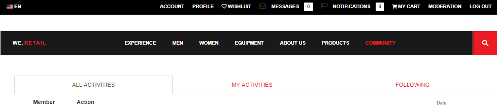
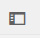
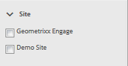

# Moderatieconsole {#moderation-console}

In AEM Communities is grote [moderatie van communautaire inhoud](moderate-ugc.md) mogelijk van zowel auteur als publicatiemilieu&#39;s door beheerders en communautaire moderatoren (vertrouwde op communautaire leden die als moderators worden toegewezen).

Beheerders en moderatoren van de gemeenschap kunnen [contextmoderatie](in-context.md) ook uitvoeren in het publicatiemilieu.

Een functie van alle [communitysites](sites-console.md) is een `Administration`menu-item dat beschikbaar is voor gebruikers die zich aanmelden met beheerdersrechten. De `Administration`verbinding verleent toegang tot de console van de Moderatie.

Van de console van de Moderatie, zullen de beheerders en de communautaire moderatoren toegang tot al gebruiker geproduceerde inhoud (UGC) hebben waarvoor zij toestemming hebben te matigen. Als u meerdere sites wilt gematigd, is het mogelijk om posten op alle sites weer te geven of door geselecteerde communitysites te filteren.

Voor gedetailleerdere informatie gaat u naar [Gebruikers en gebruikersgroepen beheren](users.md).

De console van de Moderatie steunt:
* Het uitvoeren van matigingstaken in bulk
* UGC zoeken
* UGC-details weergeven
* UGC-auteurdetails weergeven

Alleen wanneer u bent aangemeld als beheerder of een lid met ` [moderator permissions](in-context.md#identifyingtrustedmembers)`, kunnen moderatietaken worden uitgevoerd.

## Toegang tot omgeving publiceren {#publish-environment-access}

De toegang tot de console van de Moderatie van een gepubliceerde communautaire plaats is door een verbinding van het Beleid die verschijnt wanneer een communautaire moderator binnen wordt ondertekend.

Door de verbinding van het Beleid te selecteren, verschijnt de console van de Moderatie:

## Toegang tot ontwerpomgeving {#author-environment-access}

In het auteursmilieu, om de console van de Moderatie te bereiken

* Vanuit globale navigatie: **[!UICONTROL Navigation > Communities > Moderation]**

Alleen wanneer u bent aangemeld als beheerder of als lid met ` [moderator permissions](in-context.md#identifyingtrustedmembers)`, kunnen moderatietaken worden uitgevoerd. De enige inhoud van de gemeenschap die wordt weergegeven, is de inhoud die de ondertekenaar mag verkleinen.

>[!NOTE]
>
>UGC van het publicatiemilieu zal slechts op auteur zichtbaar zijn als gekozen SRP een gemeenschappelijke opslag uitvoert. De opslag is standaard bijvoorbeeld JSRP, wat geen algemene opslag is voor auteur en publiceren. Zie [Community Content Storage](working-with-srp.md).

## UI voor moderatieconsole {#moderation-console-ui}

Afgezien van de linkse navigatiespoor (die bij auteur, maar niet bij publicatie verschijnt), heeft de moderatie UI de volgende belangrijkste gebieden:

* **[Bovenste navigatiebalk](#top-navigation-bar)**
* **[Werkbalk](#toolbar)**
* **[Inhoudsgebied](#content-area)**

### Bovenste navigatiebalk {#top-navigation-bar}

De bovenste navigatiebalk is voor alle consoles constant. Zie [Basisverwerking](../../help/sites-authoring/basic-handling.md) voor meer informatie.

### Werkbalk {#toolbar}

De werkbalk, die zich onder de bovenste navigatiebalk bevindt, biedt de volgende schakeloptie aan de linkerkant:

* [Filterrails ](moderation.md#filter-rail) openen een rails waarin u de eigenschappen kunt kiezen waarop u de inhoud wilt filteren.

De werkbalk, die zich onder de bovenste navigatiebalk bevindt, biedt de volgende schakeloptie aan de linkerkant:

[Filterrail](moderation.md#filter-rail)\
Hiermee opent u een rails waarin u de inhoud kunt filteren op de gewenste eigenschappen.

### Inhoudsgebied {#content-area}

Het inhoudsgebied bevat informatie voor gepost UGC:

* De UGC heeft gepost
* Lidnaam
* Member avatar
* Plaats van de post
* Wanneer het is geplaatst
* Aantal reacties op de post
* [Aan het bericht ](moderate-ugc.md#sentiment) gekoppelde melding
* Indien goedgekeurd, wordt een vinkje weergegeven
* Als er een bijlage is, wordt een paperclip weergegeven

>[!NOTE]
>
>Het inhoudsgebied heeft een *oneindige scroll*, zo betekent het dat u zal blijven scrollen tot u het eind van de inhoud hebt bereikt. De werkbalk blijft tijdens het schuiven op een vaste, zichtbare positie boven het inhoudsgebied staan.

### Rail {#filter-rail} filteren

Met het pictogram van het zijpaneel wordt de filterrail geopend. De filterrail, die links van het inhoudsgebied verschijnt, verstrekt verschillende filters, elk die een onmiddellijk effect op referenced UGC hebben die in het inhoudsgebied verschijnt.

De filters binnen elke categorie zijn **OR** ed samen, en de filters in verschillende categorieën zijn **AND** ed samen.

Als u bijvoorbeeld zowel **Vraag** als **Antwoord** controleert, wordt inhoud weergegeven die ofwel een **Vraag** *of* en **Antwoord** is.

Nochtans als u **Vraag** en **In behandeling** controleert, zult u slechts inhoud zien die **Vraag** is en **In behandeling** is.

>[!NOTE]
>
>De moderatoren van de Gemeenschap kunnen referentie de vooraf bepaalde filters op moderatieconsole UI. Aangezien deze filters aan het eind van URL (als parameters van het vraagkoord) worden toegevoegd, kunnen de moderatoren aan de bookmarked filters later terugkomen en deze verbindingen ook delen.

Wanneer de filterrail is geopend, schakelt het zoekpictogram de zijpaneel gesloten. Als u echter de filterrail wilt sluiten en alleen de door de gebruiker gegenereerde inhoud wilt weergeven, klikt u op het pictogram Zoeken en selecteert u de optie Alleen inhoud.

#### Inhoudspad {#content-path}

Met Inhoudspad wordt de referentie-UGC beperkt tot de posten die in de opgegeven opslagplaats voor inhoud zijn geplaatst.

#### Tekstzoekopdracht {#text-search}

Bij zoeken naar tekst wordt de UGC waarnaar wordt verwezen, beperkt tot advertenties waarin de ingevoerde tekst voorkomt.

#### Site {#site}

De site beperkt de UGC waarnaar wordt verwezen, tot advertenties aan geselecteerde communitysites. Als geen plaatsen worden gecontroleerd, dan worden alle verwijzingen naar UGC getoond.

>[!NOTE]
>
>Wanneer de bulkmoderatieconsole door een beheerder wordt betreden, worden alle verwijzingen naar UGC getoond, met inbegrip van plaatsen die niet met [tovenaar van de plaatsverwezenlijking](sites-console.md), zoals de steekproeven van Geometrixx worden gecreeerd.
>
>Wanneer de bulkmoderatieconsole bij publiceren door een vertrouwd communautair lid wordt betreden, dan slechts worden de verwijzingen naar UGC die voor communautaire plaatsen worden gecreeerd het lid aan gematigd wordt toegelaten getoond, en met de filter van de Plaats kunnen worden gefiltreerd.

#### Inhoudstype {#content-type}

Het Type van inhoud beperkt referenced UGC getoond aan posten van het geselecteerde middeltype. Een of meer van de volgende typen kunnen worden geselecteerd. Alle typen worden weergegeven als er geen is geselecteerd.

* **Opmerking**
* **Forum-onderwerp**
* **Forum Reageren**
* **Vraag QnA**
* **Antwoord vragen**
* **Blogartikel**
* **Blogopmerking**
* **Kalendergebeurtenis**
* **Opmerking kalender**
* **Map bestandsbibliotheek**
* **Document bestandsbibliotheek**
* **Idea**
* **Commentaar bij idee**

#### Aanvullende inhoudstypen {#additional-content-types}

Aanvullende bronnen toevoegen waarop moet worden gefilterd:

* Op een instantie van een auteur
* Aanmelden als beheerder
* [Webconsole](http://localhost:4502/system/console/configMgr) openen
* `AEM Communities Moderation Dashboard Filters` zoeken
* Selecteer de configuratie die u wilt openen in de bewerkingsmodus
* Ga het ResourceType van een component in waarop te filtreren
   * Als u bijvoorbeeld wilt filteren op opgenomen stemcomponenten, voert u het volgende in:\
      `Voting=social/tally/components/hbs/voting`

* Selecteer Opslaan
* De Gemeenschappen vernieuwen - Moderniseringsconsole

Het resultaat is een nieuw selecteerbaar filter voor `Voting`onder de `Content Type` filtergroep.

Wanneer dat filter wordt geselecteerd zal de inhoud van het dashboard UGC tonen die om het even welke ingevoerde ResourceTypes aanpast.

#### Status {#status}

De status beperkt de UGC waarnaar wordt verwezen, tot posten van de geselecteerde status, die één of meer van In behandeling, Goedgekeurd, Afgewezen of Gesloten, evenals Ontwerp of Gepland voor Blogartikelen, en Beantwoord of niet Beantwoord voor Vragen QnA kan zijn. Als geen wordt geselecteerd, dan worden allen getoond.

>[!NOTE]
>
>Als slechts de niet Beantwoorde status wordt geselecteerd, dan zal de moderator al inhoud (voor alle inhoudstypes) behalve de beantwoorde vragen zien. Dit komt omdat de eigenschap die verantwoordelijk is voor de beantwoorde vraag niet bestaat in het geval van niet-beantwoorde vragen en andere inhoud zoals het onderwerp van het forum, het blogartikel of opmerkingen.

#### Markering {#flagging}

Als u een vlag voert, wordt de UGC waarnaar wordt verwezen, beperkt tot publicaties die zijn gemarkeerd of verborgen.

Wanneer een stuk inhoud is gemarkeerd, blijft het gemarkeerd totdat u de markering van dat stuk inhoud ongedaan maakt door nogmaals op de knop **[!UICONTROL Flag]** te klikken. Er zijn geen markeringsniveaus, zoals belangrijk of opgevolgd.

#### Leden {#members}

Leden beperken de UGC waarnaar wordt verwezen, die aan UGC wordt weergegeven en die door de ingevoerde lidnaam is gepost.

#### Gepost in laatste {#posted-in-the-last}

Gepost in de Laatste grenzen UGC van verwijzingen aan posten die in het laatste uur, de dag, de week, de maand, of het jaar worden getoond.

#### Sentiment {#sentiment}

[Met ](moderate-ugc.md#sentiment) Sentimentatie beperkt u de UGC waarnaar wordt verwezen tot posten met een sentiment-waarde die positief, negatief of neutraal is.

## Moderatiehandelingen {#moderation-actions}

[Moderatiehandelingen ](moderate-ugc.md#moderation-actions) kunnen worden uitgevoerd op een of meer selecties in het inhoudsgebied of bij het weergeven van de inhouddetails.

Als u de positie in een artikel in bulk wilt verkleinen, klikt u in het inhoudsgebied op het pictogram Selecteren ( ) op een post, dat verschijnt wanneer u de muis (bureaublad) erop plaatst of wanneer u een vinger op de post (mobiel) ingedrukt houdt. Op deze manier opent u de multiselectiemodus en kunt u nu de volgende posts selecteren die bulksgewijs moeten worden gemodereerd door er gewoon op te klikken. Gebruik de knoppen op de werkbalk om moderatiehandelingen uit te voeren op de geselecteerde posten. Alle acties worden ter bevestiging voorgelegd.

Als u één artikel in het inhoudsgebied wilt gematigd, houdt u de muisaanwijzer (bureaublad) of drukt u met een vinger op de post (mobiel), zodat er knoppen op de post verschijnen. Als u op één inhoudsgegeven werkt, wordt alleen een verwijderactie ter bevestiging verzonden.

### Meerdere posts modereren {#moderating-multiple-posts}

Ga de bulkselectiemodus in door op het pictogram `Select` op een post te klikken:

Als u de modus voor bulkselectie wilt afsluiten, selecteert u het pictogram voor annuleren (x) op de werkbalk:

De moderniseringsacties die op meerdere posten kunnen worden uitgevoerd zijn:

* Weigeren
* Verwijderen
* De berichten sluiten/opnieuw openen

De pictogrammen voor deze handelingen worden alleen op de werkbalk weergegeven als er meerdere posts zijn geselecteerd.

### Eén bericht {#moderating-a-single-post} moderniseren

In de enkelvoudige selectiemodus is het mogelijk om

* Gebruikersgegevens weergeven door de gebruikersnaam te selecteren
* Klik op de link naar het bericht in de context bekijken
* [Reageren](#reply)
* [Toestaan](#allow)
* [Weigeren](#deny)
* [Verwijderen](#delete)
* [Sluiten](#close)
* Weergave [Moderatiegeschiedenis](#moderation-history)
* [Details weergeven](#viewdetails)

De tekst van de post op de kaartweergave boven de mageractiepictogrammen is de tekst van de post en hieronder staan de gegevens die aangeven

* Zo ja, voorafgegaan door het aantal antwoorden
* Indien gemarkeerd
* Indien goedgekeurd
* Wanneer de UGC is geplaatst

#### Reageren {#reply}

Wanneer het werken met één enkele post, zal een pictogram van het Antwoord verschijnen als het type UGC antwoorden steunt en wordt gevormd om antwoorden toe te staan.

#### {#allow} toestaan

Wanneer u met één bericht werkt, wordt het pictogram Toestaan weergegeven wanneer de advertentie is gemarkeerd of geweigerd. Als deze optie is gemarkeerd, worden alle markeringen gewist als u Toestaan selecteert.

#### Weigeren {#deny}

De **Weigeren** matigactie is slechts beschikbaar voor inhoud die wordt gematigd, en verschijnt niet op ongematigde inhoud behalve in multi-selectiemodus.

Inhoud die niet wordt gematigd, wordt altijd goedgekeurd.

De inhoud die aanvankelijk wordt gematigd gaat een Hangende staat in, en kan later worden gewijzigd om worden goedgekeurd of worden ontkend.

Inhoud die de status in behandeling verlaat, kan nooit terugkeren naar een status in behandeling. Inhoud die is gemarkeerd als goedgekeurd of geweigerd, kan op elk gewenst moment worden gewijzigd in een andere status.

#### Verwijderen {#delete}

In de modus Enkel selecteren of Samenvoegen kunt u items selecteren en verwijderen. De verwijderactie leidt tot een bevestigingsvenster. Als deze items eenmaal zijn verwijderd, verdwijnen ze direct uit het inhoudsgebied. **Zodra UGC wordt geschrapt, wordt het permanent verwijderd uit de bewaarplaats en kan later niet worden teruggewonnen.**

#### Sluiten {#close}

Wanneer u met één artikel werkt, wordt een pictogram Sluiten weergegeven als het type UGC de mogelijkheid ondersteunt om verdere posten voor die bron te voorkomen.

#### Moderatiegeschiedenis {#moderation-history}

Wanneer u met één bericht werkt, wordt een pictogram Moderatiegeschiedenis weergegeven wanneer u de muisaanwijzer op de desbetreffende post plaatst. Als u het pictogram selecteert, wordt een deelvenster weergegeven met een overzicht van de acties die met betrekking tot de UGC-post zijn uitgevoerd.

Als u wilt terugkeren naar de weergave van het inhoudsgebied van meerdere UGC-posten, selecteert u de X in de rechterbovenhoek van het deelvenster met weergavedetails.

Bijvoorbeeld:

#### Detail {#view-detail} weergeven

Als u met één artikel werkt, kunt u meer details bekijken door de UGC in de detailmodus te openen.

Als u dit wilt doen, plaatst u de muisaanwijzer boven de post om het pictogram `View Detail` weer te geven en selecteert u deze om een deelvenster weer te geven met meer details over de advertentie.

Als u wilt terugkeren naar de weergave van het inhoudsgebied van meerdere UGC-posten, selecteert u de X in de rechterbovenhoek van het deelvenster met weergavedetails.

Bijvoorbeeld:

