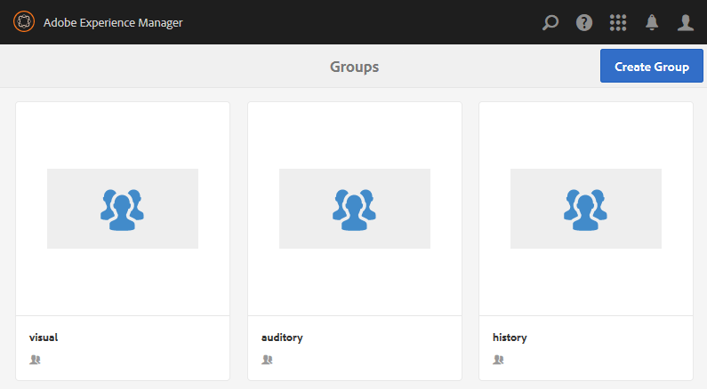

# Geneste groepen {#authoring-nested-groups} ontwerpen

## Groepen maken op auteur {#creating-groups-on-author}

Op auteur, van globale navigatie

* Selecteer **[!UICONTROL Communities > Sites]**
* Selecteer **[!UICONTROL engage folder]** om deze te openen
* Selecteer de kaart voor de **[!UICONTROL Getting Started Tutorial]** Engelse site
   * De kaartafbeelding selecteren
   * *niet* selecteert een pictogram

Het resultaat is om [Groepenconsole](groups.md) te bereiken:

De groepfunctie wordt weergegeven als een map waarin instanties van groepen worden gemaakt. Selecteer de map Groepen om deze te openen. De groep die bij publicatie wordt gemaakt, is zichtbaar.

## Hoofdartgroep maken {#create-main-arts-group}

Deze groep kan worden gemaakt omdat de sitestructuur voor de verbinding een groepfunctie bevat. De configuratie van de functie in de site `Reference Template` staat standaard de selectie van een ingeschakelde groepssjabloon toe. De sjabloon die voor deze nieuwe groep wordt gekozen, is dus `Reference Group`.

Deze consoles lijken erg op de console van de Plaatsen van Gemeenschappen.

* Selecteer **[!UICONTROL Create Group]**
* `1 Community Group Template`:
   * Titel van communautaire groep: Kunst
   * Omschrijving van de communautaire groep: Een bovenliggende groep voor verschillende kunstgroepen.
   * Hoofdmap van communautaire groep: *Als standaard laten*
   * Aanvullende beschikbare talen voor communautaire groepen:gebruik het keuzemenu om de beschikbare talen voor groepen in de gemeenschap te selecteren. In het menu worden alle talen weergegeven waarin de bovenliggende communitysite is gemaakt. Gebruikers kunnen in deze ene stap uit deze talen kiezen om groepen te maken in meerdere landinstellingen. De zelfde groep wordt gecreeerd in veelvoudige gespecificeerde talen in de console van Groepen van de respectieve communautaire plaatsen.
   * Naam communautaire groep: kunst
   * Sjabloon: pull down om `Reference Group` te selecteren
   * Selecteer `Next`

      

Doorloop de andere deelvensters met deze instellingen:

* **2 Ontwerp**
   * U kunt het ontwerp wijzigen of standaard het ontwerp van de bovenliggende site instellen
   * Selecteer **[!UICONTROL Next]**
* **3 Instellingen**
   * **Moderatie**
      * Leeg laten (overerven van bovenliggende site)
   * **Lidmaatschap**
      * standaard `Optional Membership` gebruiken
   * **Miniatuur**
      * `optional`
   * Selecteer `Next`
* Selecteer **[!UICONTROL Create]**

### Groepen nesten in artgroep {#nesting-groups-within-arts-group}

De map `groups` moet nu twee groepen bevatten (mogelijk moet u de pagina vernieuwen).

#### Groep {#publish-group} publiceren

Voordat u groepen maakt die in de `arts`groep zijn genest, plaatst u de aanwijzer op de `arts`-kaart en selecteert u het publicatiepictogram om deze te publiceren.

Wacht op bevestiging dat de groep is gepubliceerd.

De `arts` groep zou ook een `groups` omslag moeten bevatten, maar die leeg is en waarin de nieuwe groepen kunnen worden gecreeerd. Navigeer naar de map met kunstgroepen en maak drie geneste groepen, elk met een andere lidmaatschapsinstelling:

1. Zichtbaar
   * Titel: `Visual Arts`
   * Naam: `visual`
   * Sjabloonmodel: `Reference Group`
   * Lidmaatschap: selecteren `Optional Membership`
Een openbare groep die voor alle leden open is
1. Controleur
   * Titel: `Auditory Arts`
   * Naam: `auditory`
   * Sjabloonmodel: `Reference Group`
   * Lidmaatschap: selecteren `Required Membership`
Een open groep, beschikbaar voor leden om zich bij te voegen

1. Historie

   * Titel: `Art History`
   * Naam: `history`
   * Sjabloonmodel: `Reference Group`
   * Lidmaatschap: selecteren `Restricted Membership`
Een geheime groep, die alleen zichtbaar is voor uitgenodigde leden als voorbeeld, nodigt 
[demo-gebruiker](tutorials.md#demo-users) `emily.andrews@mailinator.com`

Vernieuw de pagina om alle drie geneste groepen (subgemeenschappen) weer te geven.

Indien nodig, om aan de genestelde groepen van de console van de Plaatsen van Gemeenschappen te navigeren:

* Selecteer **[!UICONTROL engage folder]**
* **[!UICONTROL Getting Started Tutorial]**-kaart selecteren
* Selecteer **[!UICONTROL Groups folder]**
* Selecteer **[!UICONTROL arts card]**
* Selecteer **[!UICONTROL Groups folder]**

## Groepen {#publishing-groups} publiceren

Na publicatie van de hoofdsite van de community is het nodig om

* Elke groep afzonderlijk publiceren
   * Wachten op bevestiging van publicatie van de groep
* bovenliggende groep publiceren voordat groepen worden gepubliceerd die zijn genest binnen
   * Alle groepen moeten van boven naar beneden worden gepubliceerd.

## Ervaring met publiceren {#experience-on-publish}

Het is mogelijk om de verschillende groepen te ervaren wanneer u zich aanmeldt, bijvoorbeeld met de [demogebruikers](tutorials.md#demo-users) die worden gebruikt voor

* Groepslid illustratie/geschiedenis: emily.andrews@mailinator.com/password
   * De beperkte (geheime) groep, kunst/geschiedenis, zal zichtbaar zijn
   * Kan optionele (openbare) groepen zien
   * Groepen met beperkingen (open groepen) kunnen worden samengevoegd
* Groepsbeheer: aaron.mcdonald@mailinator.com/password
   * Kan optionele (openbare) groepen zien
   * kan zich bij beperkte (open) groepen aansluiten
   * Zal geen beperkte (geheime) groepen zien

Open de [Samenstellingen leden en groepen](members.md) op auteur om andere gebruikers aan diverse lidgroepen toe te voegen die aan de communautaire groepen beantwoorden.
