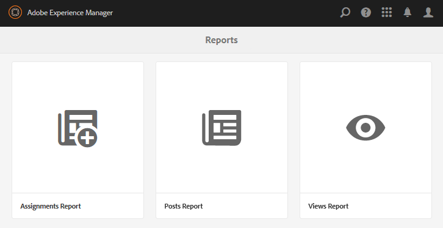

# Rapportconsole {#reports-console}

## Overzicht {#overview}

Voor AEM Communities zijn er diverse rapporten die op verschillende manieren toegankelijk zijn vanuit de auteursomgeving.

In het algemeen zijn de verschillende verslagen:

* [Rapport](#assignments-report)  Toewijzingen - voor een  [machtigingsgemeenschap](overview.md#enablement-community) geeft een overzicht van de vorderingen van studenten bij het toewijzen van hun taken, inclusief een bijbehorende score bij het implementeren van de SCORM-standaard
* [Weergavenrapport](#views-report) : geeft een overzicht van de weergaven van de inhoud door leden van de gebruikersgemeenschap en sitebezoekers voor alle communitysites
* [Post Report](#posts-report)  - biedt een overzicht van verschillende typen berichten van leden van de gemeenschap aan elke site van de gemeenschap

Wanneer [Adobe Analytics is ingeschakeld](sites-console.md#analytics), bevatten rapporten het aantal weergaven, afspelen, opmerkingen en classificaties voor elke activeringsbron in de loop van de tijd

Rapporten in tabelvorm kunnen worden geëxporteerd in de .csv-indeling voor verdere verwerking.

## Consoles {#reporting-consoles} rapporteren

### Rapporten voor communautaire sites {#reports-for-community-sites}

* Vanuit globale navigatie: **[!UICONTROL Navigation > Communities > Reports]**
* Kiezen uit
   * **[!UICONTROL Assignments Report]**
      * Genereer een rapport voor geselecteerde communautaire Plaats, Gebruiker of Groep, en Toewijzing
   * **[!UICONTROL Posts Report]**
      * Genereer een rapport voor een geselecteerde Community Site, Type inhoud en Tijdsperiode
   * **[!UICONTROL Views Report]**
      * Genereer een rapport voor een geselecteerde Community Site, Type inhoud en Tijdsperiode
         

### Rapporten voor Middelen van Enablement en het Leren Wegen {#reports-for-enablement-resources-and-learning-paths}

* Vanuit globale navigatie: **[!UICONTROL Navigation > Communities > Resources]**
* Een bestaande community-site voor inschakelen selecteren
   * Selecteer **[!UICONTROL Report]** pictogram om rapporten te genereren die alle bronnen van activering bestrijken
   * Een leerpad voor inschakelen selecteren
   * Selecteer **[!UICONTROL Report]** pictogram om rapporten voor te produceren
      * De meegeleverde middelen voor activering
      * De leerlingen die zijn toegewezen aan het leerpad
* Deze verslagen bevatten:
   * Tabelgegevens, downloadbaar als CSV
      * Student identificeren
      * Hun status
      * Of toegewezen of benaderd via catalogus
      * Aantal gemaakte opmerkingen
      * Sterrenclassificatie gegeven

Voor meer details, zie [de sectie van Rapporten](resources.md#report) van de console van Middelen.

## Rapport Toewijzingen {#assignments-report}

Met de toewijzingsconsole kunnen rapporten worden gefilterd door de communitysite, gebruikers of groepen en toewijzing in te schakelen.

Het verslag bevat informatie over de voortgang van de activiteiten en eventuele opmerkingen of beoordelingen.

Selecteer de criteria voor het rapport:

* **[!UICONTROL Site]**
Een community-site voor activering selecteren
* **[!UICONTROL User or Group]**
   * Selecteer Gebruiker om een rapport voor één student te genereren
   * Selecteer Groep om een rapport voor een groep studenten te genereren
De tunneldienst zal tot leden en lidgroepen van publicatiemilieu toegang hebben
* **[!UICONTROL Assignment]**
Maak een keuze uit de instellingsbronnen die aan de geselecteerde studenten zijn toegewezen

Selecteer **[!UICONTROL Generate]** om het rapport te maken:

## Rapport {#views-report} weergaven

Met de weergaveconsole kunnen rapporten gedurende een bepaalde periode worden gegenereerd op paginaweergaven door een of meer algemene functies.

Selecteer de criteria voor het rapport:

* **[!UICONTROL Site]**
Een communitysite selecteren
* **[!UICONTROL Content Type]**
Kan Alle inhoud kiezen of een van de functies op de site selecteren
* Tijdskader
Selecteer een van de volgende opties:
   * Laatste 7 dagen
   * Laatste 30 dagen
   * Laatste 90 dagen
   * Vorig jaar

Selecteer **[!UICONTROL Generate]** om het rapport te maken:

## Post Report {#posts-report}

Met de Post-console kunnen rapporten gedurende een bepaalde periode worden gegenereerd op het aantal posten voor een of meer algemene functies.

Selecteer de criteria voor het rapport:

* **[!UICONTROL Site]**
Een communitysite selecteren
* **[!UICONTROL Content Type]**
Kan Alle inhoud kiezen of een van de functies op de site selecteren
* Tijdskader
Selecteer een van de volgende opties:
   * Laatste 7 dagen
   * Laatste 30 dagen
   * Laatste 90 dagen
   * Vorig jaar

Selecteer **[!UICONTROL Generate]** om het rapport te maken:

## Problemen oplossen {#troubleshooting}

### Geen vermelde communitysites {#no-community-sites-listed}

Als er geen community-sites worden vermeld, moet u ervoor zorgen dat Adobe Analytics is ingeschakeld voor een site. Als u rapporten over toewijzingen kiest, moet u ervoor zorgen dat de toewijzingsfunctie zich in de structuur van de gemeenschapssite bevindt.
