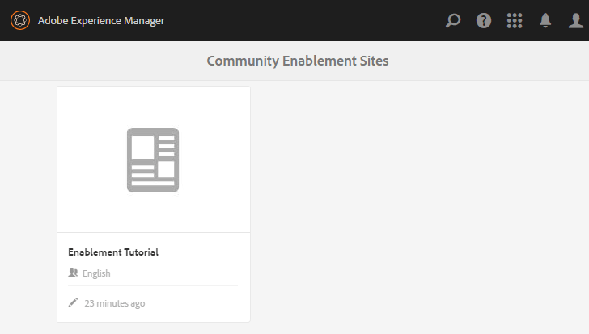
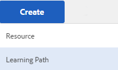

# Creeer en wijs Middelen {#create-and-assign-enablement-resources} toe

## Een Enablement Resource {#add-an-enablement-resource} toevoegen

Om een enablement middel aan de nieuwe communautaire plaats toe te voegen:

* Instantie van auteur
   * Bijvoorbeeld [http://localhost:4502/](http://localhost:4503/)
* Aanmelden als systeembeheerder
* Selecteer **Communities > [Bronnen](resources.md)**

   
   
* Selecteer de communitysite waaraan de activeringsbronnen worden toegevoegd
   * Selecteer `Enablement Tutorial`
* Selecteer ` Create` in het menu
* Selecteer **[!UICONTROL Resource]**

### Basisinformatie {#basic-info}

Vul de basisinformatie voor de Middel in:

* **[!UICONTROL Site Name]**: ingesteld op de naam van de geselecteerde communitysite: Zelfstudie inschakelen
* **[!UICONTROL Resource Name&ast;]**: Skiles 1
* **[!UICONTROL Tags]**: Zelfstudie: Sport/Skieten
* **[!UICONTROL Show in Catalog]**: Aan
* **[!UICONTROL Description]**: Sneeuw schuiven voor beginners
* **[!UICONTROL Add Image]**: Voeg een beeld toe om het Middel aan het lid in hun mening van Toewijzingen te vertegenwoordigen
   
* Selecteer **[!UICONTROL Next]**

### Inhoud toevoegen {#add-content}

Terwijl het lijkt alsof de veelvoudige Middelen zouden kunnen worden geselecteerd, wordt slechts één toegestaan.

Selecteer `'+' icon`, in de hogere juiste hoek, om met het proces te beginnen om het Middel te kiezen door de bron te identificeren.

 

Upload een resource. Als een videobron een aangepaste afbeelding uploadt om weer te geven voordat de video wordt afgespeeld, of als een miniatuur wordt gegenereerd van de video (kan een paar minuten duren - het is niet nodig om te wachten).

* select **[!UICONTROL Next]**

### Instellingen {#settings}

* **[!UICONTROL Social Settings]**
Laat de standaardinstellingen ongewijzigd om het maken van opmerkingen en het beoordelen van activeringsbronnen door studenten te ervaren.
* **[!UICONTROL Due Date]**

   *(Optioneel)* Er kan een datum worden gekozen waarop de toewijzing moet worden voltooid.
* **[!UICONTROL Resource Author]**

   *(Optioneel)* Laat leeg.
* **[!UICONTROL Resource Contact&ast;]**

   *(Vereist)* Gebruik het keuzemenu om lid te selecteren  `Quinn Harper`.
* **[!UICONTROL Resource Expert]**

   *(Optioneel)* Laat leeg.
   **Opmerking**: als gebruikers of groepen niet zichtbaar zijn, controleert u of zij aan de  `Community Enable Members` groep en  ** Bespaar op het publicatieexemplaar zijn toegevoegd.
   
* Selecteer **[!UICONTROL Next]**

### Toewijzingen {#assignments}

* **[!UICONTROL Add Assignees]**
Laat de set ongedaan omdat deze activeringsbron wordt toegevoegd aan een leerpad. Als een leerling aan het individuele enablement middel evenals een learningpPath wordt toegewezen die het enablement middel bevat, zal de leerling tweemaal aan het enablement middel worden toegewezen.

* Selecteer **[!UICONTROL Create]**

Succesvolle verwezenlijking van het Middel keert aan de console van Middelen met het pas gecreëerde Middel geselecteerd terug. Vanuit deze console is het mogelijk studenten te publiceren, toe te voegen en andere instellingen te wijzigen.

Om een nieuwe versie van het enablement middel te uploaden, wordt het geadviseerd om een nieuw Middel tot stand te brengen, en dan leden van de oude versie uit te schrijven en hen in de nieuwe versie in te schrijven.

### De bron {#publish-the-resource} publiceren

Voordat ingeschreven personen de toegewezen cursus kunnen zien, moet deze worden gepubliceerd:

* Het pictogram wereld `Publish`selecteren

Activering wordt bevestigd met een succesbericht:

## Een tweede Enablement Resource {#add-a-second-enablement-resource} toevoegen

Herhaal de bovenstaande stappen om een tweede gerelateerde enablement-resource te maken en te publiceren waaruit een leerpad wordt gemaakt.

**De tweede resource** publiceren.

Keer terug naar de lijst van de Leergids van Enablement van de Middelen van het.

*Tip: als beide Bronnen niet zichtbaar zijn, vernieuwt u de pagina.*

## Een leerpad toevoegen {#add-a-learning-path}

Een leerpad is een logische groepering van bronnen voor activering die een cursus vormen.

* Van de console van Middelen, uitgezocht `+ Create`
* Selecteer **[!UICONTROL Learning Path]**

Voeg **[!UICONTROL Basic Info]** toe:

* **[!UICONTROL Learning Path Name]**: Ski Lessen
* **[!UICONTROL Tags]**: Zelfstudie: Skieten
* **[!UICONTROL Show in Catalog]**: ongecontroleerd laten
* **[!UICONTROL Upload an image]** om de het leren weg in de console van Middelen te vertegenwoordigen

* Selecteer **[!UICONTROL Next]**

Sla het volgende deelvenster over omdat er geen in de eerste plaats leerpaden zijn die u wilt toevoegen.

* Selecteer **[!UICONTROL Next]**

In het deelvenster Bronnen toevoegen

* Selecteer `+ Add Resources` om de 2 skissessies te selecteren die u wilt toevoegen aan het leerpad

   Opmerking: Alleen **published** Bronnen kunnen worden geselecteerd.

>[!NOTE]
>
>U kunt alleen de bronnen selecteren die beschikbaar zijn op hetzelfde niveau als het leerpad. Bijvoorbeeld, voor een leerweg die in een groep wordt gecreeerd slechts zijn de middelen van het groepsniveau beschikbaar; voor een leerpad dat in een gemeenschapssite is gemaakt, zijn de bronnen in die site beschikbaar voor toevoeging aan het leerpad.

* Selecteer **[!UICONTROL Submit]**.

 

* Selecteer **[!UICONTROL Next]**

* **[!UICONTROL Add Assignees]**
Gebruik het keuzemenu om het 
`Community Ski Class` groep, die leden  `Riley Taylor` en  `Sidney Croft.`

* **[!UICONTROL Learning Path Contact&ast;]**

   *(Vereist)* Gebruik het keuzemenu om lid te selecteren  `Quinn Harper`.

* Selecteer **[!UICONTROL Create]**

De succesvolle verwezenlijking van de het leren weg keert aan de console van Middelen met de pas gecreëerde het leren weg geselecteerd terug. Vanuit deze console is het mogelijk studenten te publiceren, toe te voegen en andere instellingen te wijzigen.

**Het leerpad** publiceren.
