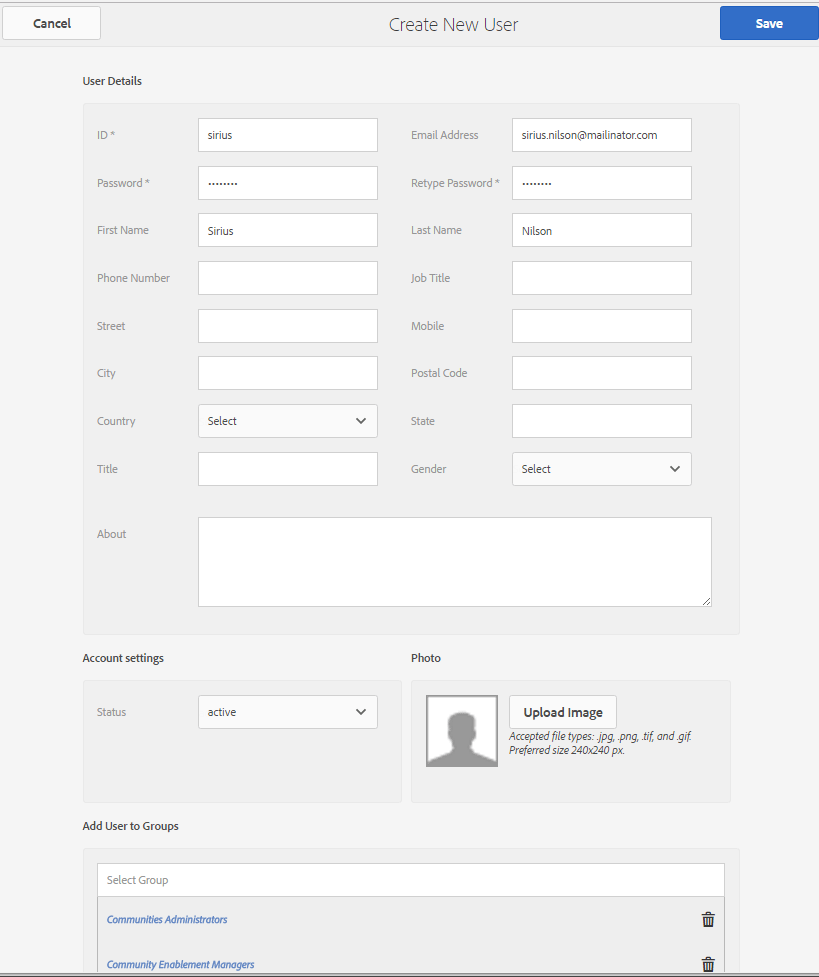

# Eerste instelling {#initial-setup}

## Auteur- en publicatie-instanties starten {#start-author-and-publish-instances}

Voor ontwikkelings- en demonstratiedoeleinden is het nodig één auteur en één publicatieexemplaar uit te voeren.

Volg hiervoor de standaard AEM [Aan de slag](../../help/sites-deploying/deploy.md#getting-started) instructies, die resulteren in

* Auteursomgeving op [localhost:4502](http://localhost:4502/)
* Publiceer milieu op [localhost:4503](http://localhost:4503/)

Voor AEM Communities:

* De auteursomgeving is bedoeld voor

   * Ontwikkeling van sites, sjablonen en componenten
   * Administratieve en configuratietaken

* De publicatieomgeving is bedoeld voor

   * De ervaring van de gemeenschap met het plaatsen en het modereren van inhoud
   * Communautaire groepen, leden en ledengroepen oprichten

>[!NOTE]
>
>Als u niet bekend bent met AEM, bekijkt u de documentatie over [basisverwerking](../../help/sites-authoring/basic-handling.md) en een [handleiding voor het schrijven van pagina&#39;s](../../help/sites-authoring/qg-page-authoring.md).

## Nieuwste communityrelease {#install-latest-communities-release} installeren

Deze zelfstudie maakt een [communitysite voor betrokkenheid](overview.md#engagement-community) en is gebaseerd op AEM Communities 6.2-functiepakket versie 1.10.

Ga voor de installatie van het nieuwste functiepakket naar:

* [Laatste releases](deploy-communities.md#latest-releases)

Voor een zelfstudie waarmee een [communitysite ](overview.md#enablement-community) wordt gemaakt, gaat u [Aan de slag met AEM Communities for Enablement](getting-started-enablement.md).

## Analyses {#configure-analytics} configureren

Wanneer [Adobe Analytics is geconfigureerd voor de communitysite](analytics.md), is informatie beschikbaar over community-activiteiten die de ervaring van het lid van de community verbetert en feedback geeft aan beheerders van de site.

Integratie met Adobe Analytics is optioneel.

## E-mail voor meldingen configureren {#configure-email-for-notifications}

De functie voor meldingen, die standaard beschikbaar is voor alle sites die zijn gemaakt met de console `Communities Sites`, biedt een e-mailkanaal voor meldingen.

Het is nodig dat e-mail correct is geconfigureerd voor de site.

Zie [E-mail configureren](email.md).

## De tunnelservice {#enable-the-tunnel-service} inschakelen

Wanneer het creëren van een communautaire plaats in het auteursmilieu, maakt de tunneldienst de capaciteit mogelijk om rollen aan vertrouwde op communautaire leden toe te wijzen die in het publicatiemilieu worden geregistreerd. De tunnelservice biedt ook toegang tot leden van de gemeenschap vanuit de consoles [Leden en Groepen](members.md) in de auteuromgeving.

De conventie is voor leden en lidgroepen die in de publicatieomgeving zijn gemaakt, om *niet* opnieuw te maken in de ontwerpomgeving. Zie [Gebruikers en gebruikersgroepen beheren](users.md) voor meer informatie.

Voor eenvoudige instructies om de tunneldienst op een **auteur** instantie toe te laten, zie [Tunnel Service](deploy-communities.md#tunnel-service-on-author).

## Rol van communautaire beheerder {#community-administrator-role}

De leden van de groep van Beheerders van de Gemeenschap kunnen communautaire plaatsen tot stand brengen, plaatsen beheren, leden beheren (zij kunnen leden van de gemeenschap verbieden), en gematigde inhoud.

### Gebruiker {#create-user} maken

Creeer een gebruiker op *auteur*, die de rol van Communautaire Beheerder wordt toegewezen:

* Instantie van auteur

   * Bijvoorbeeld [http://localhost:4502/](http://localhost:4503/)

* Aanmelden met beheerdersrechten

   * Bijvoorbeeld gebruikersnaam &#39;admin&#39; / wachtwoord &#39;admin&#39;

* Navigeer vanuit de hoofdconsole naar **[!UICONTROL Tools > Operations > Security > Users]**
* Selecteer **[!UICONTROL Add User]** in het menu **[!UICONTROL Edit]**

* In het dialoogvenster `Create New User`

   * **[!UICONTROL ID&ast;]**: sirius
   * **[!UICONTROL Emai Address]**: sirius.nilson@mailinator.com
   * **[!UICONTROL Password&ast;]**: password
   * **[!UICONTROL Confirm Password&ast;]**: password
   * **[!UICONTROL First Name]**: Sirius
   * **[!UICONTROL Last Name&ast;]**: Nilson

### Sirius toewijzen aan groep Beheerders uit Gemeenschap {#assign-sirius-to-community-administrators-group}

Omlaag schuiven naar `Add User to Groups`:

* Voer C in om te zoeken

   * Selecteer `Community Administrators`
   * Selecteer `Community Enablement Managers`

* Selecteer **[!UICONTROL Save]**

## Sociale aanmelding inschakelen {#enable-social-login}

Voordat de demonstratieversies van sociale aanmelding bij Facebook en Twitter kunnen worden gebruikt, is het noodzakelijk

1. Een reparatiepakket of [nieuwste functiepakket](deploy-communities.md#latestfeaturepack) installeren (voor wijzigingen in Facebook-API van maart 2017)
1. [De OAuth-](social-login.md#adobe-granite-oauth-authentication-handler) provider inschakelen in de publicatieomgeving

Voor productieservers is het nodig de cloudservices te maken die nodig zijn voor het aanbieden van sociale aanmeldingsgegevens.

Zie [Sociale aanmelding bij Facebook en Twitter](social-login.md).

## Zelfstudietags maken {#create-tutorial-tags}

Maak tags die u wilt gebruiken voor de zelfstudies voor toegang en activering met de naamruimte tag van `Tutorial`.

Gebruik de [Tagingconsole](../../help/sites-administering/tags.md#tagging-console) om de volgende tags te maken:

* `Tutorial: Sports / Baseball`
* `Tutorial: Sports / Gymnastics`
* `Tutorial: Sports / Skiing`
* `Tutorial: Arts / Visual`
* `Tutorial: Arts / Auditory`
* `Tutorial: Arts / History`

Volg daarna de instructies op

1. [Tagmachtigingen instellen](../../help/sites-administering/tags.md#setting-tag-permissions)
1. [De labels publiceren](../../help/sites-administering/tags.md#publishing-tags)

Voorbeeld van pakket met tags die zijn gemaakt voor de Tutorials Aan de slag van AEM Communities

[Bestand ophalen](assets/tutorial_tags-v63.zip)

## MongoDB voor UGC Common Store {#mongodb-for-ugc-common-store}

Het wordt geadviseerd, maar facultatief, om [MSRP](msrp.md) (MongoDB) als [gemeenschappelijke opslag](working-with-srp.md) te plaatsen om de flexibiliteit te ervaren om al UGC van of publiceren en/of auteursmilieu&#39;s te modereren.

Voor instructies gaat u naar [MongoDB instellen voor demo](demo-mongo.md).

Door gebrek, resulteert de installatie van de auteur en publiceert AEM instanties in gebruiker geproduceerde inhoud (UGC) die in [JCR Tar opslag](../../help/sites-deploying/platform.md) wordt opgeslagen die gebruikend [JSRP](jsrp.md) wordt betreden. JSRP is geen gemeenschappelijke opslag, wat betekent UGC slechts op de instantie zichtbaar is waarop het was ingegaan. Normaal, is UGC ingegaan op een publicatie instantie en zou niet zichtbaar in het auteursmilieu zijn, resulterend in alle matigingstaken die de publicatieinstantie moeten gebruiken.
