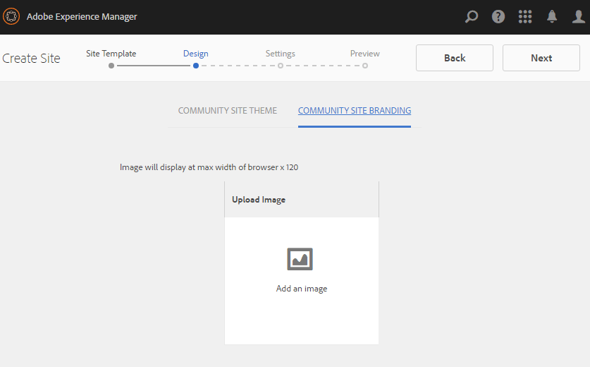

# Sites-console van gemeenschappen {#communities-sites-console}

>[!CAUTION]
>
>AEM 6.4 heeft het einde van de uitgebreide ondersteuning bereikt en deze documentatie wordt niet meer bijgewerkt. Raadpleeg voor meer informatie onze [technische ondersteuningsperioden](https://helpx.adobe.com/support/programs/eol-matrix.html). Ondersteunde versies zoeken [hier](https://experienceleague.adobe.com/docs/).

De console van de Plaatsen van Gemeenschappen verleent toegang tot:

* Site maken
* Site bewerken
* Sitebeheer
* [Geneste groepen maken en bewerken](groups.md) (subgemeenschappen)

Zie [Aan de slag met AEM Communities](getting-started.md) om te ervaren hoe snel een communautaire plaats in het auteursmilieu kan worden gecreeerd, evenals hoe te om communautaire groepen van de auteur tot stand te brengen en milieu&#39;s te publiceren.

>[!NOTE]
>
>De belangrijkste menu&#39;s van de Gemeenschappen voor de oprichting van [communitysites](sites-console.md), [communitysjablonen](sites.md), [communitygroepsjablonen](tools-groups.md) en [communautaire functies](functions.md) zijn alleen bestemd voor gebruik in de ontwerpomgeving.

## Vereisten {#prerequisites}

Voordat u een communitysite maakt, is deze *vereist* tot:

* Zorg ervoor dat een of meer publicatie-instanties actief zijn
* De optie [tunneldienst](deploy-communities.md#tunnel-service-on-author) leden en leden beheren
* Identificeer [primaire uitgever](deploy-communities.md#primary-publisher)
* [Replicatie configureren](deploy-communities.md#replication-agents-on-author) wanneer primaire uitgevershavens niet het gebrek is (4503)

De beste praktijken, om ervoor te zorgen de plaats bereid is om vele eigenschappen te steunen, moeten de volgende stappen nemen:

* Installeer de [nieuwste functiepakket](deploy-communities.md#latestfeaturepack)
* Inschakelen [Adobe Analytics](analytics.md) voor AEM Communities
* Configureren [email](email.md)
* Identificeren [Communautaire administrateurs](users.md#creating-community-members)
* [De handler OAuth inschakelen](social-login.md#adobe-granite-oauth-authentication-handler) voor aanmelden via sociale media

## Toegang tot de console met sites van Gemeenschappen {#accessing-communities-sites-console}

In het auteursmilieu, om de console van de Plaatsen van Gemeenschappen te bereiken:

* Vanuit globale navigatie: **[!UICONTROL Communities > Sites]**

De console van de Plaatsen van Gemeenschappen toont om het even welke bestaande communautaire plaatsen. Vanuit deze console kunnen gemeenschapssites worden gemaakt, bewerkt, beheerd en verwijderd.

Als u een nieuwe communitysite wilt maken, selecteert u de optie **Maken** pictogram.

Als u toegang wilt krijgen tot een bestaande communitysite, ten behoeve van het ontwerpen, wijzigen, publiceren, exporteren of toevoegen van een geneste groep, selecteert u het pictogram voor de sitemap.

In de volgende afbeelding ziet u bijvoorbeeld de hoofdconsole van Communitysites met de mappen voor twee communitysites: [enable](getting-started-enablement.md) en [aangaan](getting-started.md):

## Site maken {#site-creation}

De console van de plaatsverwezenlijking verstrekt een geleidelijke benadering om eigenschappen van de plaats samen te stellen die op een geselecteerde wordt gebaseerd [sjabloon voor community-site](sites.md) en instellingen.

Elke gemaakte site bevat een aanmeldingsfunctie omdat bezoekers van de site zich moeten aanmelden voordat ze inhoud kunnen posten, berichten kunnen verzenden of aan een groep kunnen deelnemen. Andere inbegrepen eigenschappen zijn gebruikersprofielen, overseinen, berichten, plaatsmenu, onderzoek, thema, en branding.

Het proces wordt gestart door de `Create` knoop die bij de bovenkant van de console van de Plaatsen van Gemeenschappen wordt gevestigd.

Het ontwerpproces is een reeks stappen die worden gepresenteerd als deelvensters met een set functies die moeten worden geconfigureerd (weergegeven als subdeelvensters). Het is mogelijk verder te gaan naar de **Volgende** stap of **Vorige** naar de vorige stap voordat u de site in de laatste stap toewijst.

### Stap 1: Sitesjabloon {#step-site-template}

In het deelvenster Sjabloon site worden de titel, beschrijving, hoofdmap van site, basistaal, naam en Sjabloon van site opgegeven:

* **[!UICONTROL Community Site Title]**: Een weergavetitel voor de site.

   De titel wordt weergegeven op de gepubliceerde site en in de interface voor sitebeheer.

* **[!UICONTROL Community Site Description]**: Een beschrijving van de site.

   De beschrijving wordt niet weergegeven op de gepubliceerde site.

* **[!UICONTROL Community Site Root]**: Het hoofdpad naar de site.

   De standaardhoofdmap is `/content/sites`, maar de hoofdmap kan naar een willekeurige locatie op de website worden verplaatst.

* **[!UICONTROL Community Site Base Language]**: (ongewijzigd laten voor één taal: Engels) gebruik het keuzemenu om één te kiezen *of meer* basistalen uit de beschikbare talen: Duits, Italiaans, Frans, Japans, Spaans, Portugees (Brazilië), Chinees (traditioneel) en Chinees (vereenvoudigd). Er wordt één communitysite gemaakt voor elke toegevoegde taal en deze site bestaat in dezelfde sitemap volgens de in [Inhoud vertalen voor meertalige sites](../../help/sites-administering/translation.md). De hoofdpagina van elke site bevat een onderliggende pagina met de taalcode van een van de geselecteerde talen, zoals &#39;en&#39; voor Engels of &#39;fr&#39; voor Frans.

* **[!UICONTROL Community Site Name]**: De naam van de hoofdpagina van de site die wordt weergegeven in de URL

   * Controleer de naam tweemaal omdat deze na het maken van de site niet gemakkelijk kan worden gewijzigd
   * De basis-URL ( `https://*server:port/site root/site name*)` wordt onder de `Community Site Name`
   * Voeg voor een geldige URL een basistaalcode + &quot;.html&quot; toe

      *Bijvoorbeeld*, `http://localhost:4502/content/sites/mysight/en.html`

* **[!UICONTROL Community Site Template]** menu: Kies een beschikbare optie in het keuzemenu [sjabloon voor community-site](tools.md).

Selecteer **[!UICONTROL Next]**

### Stap 2: Ontwerp {#step-design}

Het deelvenster Ontwerp bevat twee subdeelvensters voor het selecteren van het thema en de brandingbanner:

#### COMMUNAUTAIR SITE-THEMA {#community-site-theme}

Het kader gebruikt `Twitter Bootstrap` om een ontvankelijk, flexibel ontwerp aan de plaats te brengen. U kunt een van de vele vooraf geladen Bootstrap-thema&#39;s selecteren om de stijl van de geselecteerde communitysitesjabloon te bepalen of u kunt een Bootstrap-thema uploaden.

Als deze optie is geselecteerd, wordt het thema bedekt met een ondoorzichtig blauw vinkje.

Nadat de communitysite is gepubliceerd, is het mogelijk om [de eigenschappen bewerken](#modifying-site-properties) en selecteer een ander thema.

#### COMMUNAUTAIRE SITOBRANDING {#community-site-branding}

De branding van de communautaire plaats is een beeld dat als kopbal over de bovenkant van elke pagina wordt getoond.

Het formaat van de afbeelding moet zo breed zijn als de verwachte weergave van de pagina in de browser en 120 pixels hoog.

Houd rekening met het volgende wanneer u een afbeelding maakt of selecteert:

* De afbeeldingshoogte wordt bijgesneden tot 120 pixels, gemeten vanaf de bovenrand van de afbeelding
* De afbeelding is vastgezet aan de linkerrand van het browservenster
* De afbeelding wordt niet vergroot of verkleind, zodat de afbeeldingsbreedte..

   * Minder dan de breedte van de browser wordt de afbeelding horizontaal herhaald
   * Groter dan de breedte van de browser, lijkt de afbeelding te zijn uitgesneden

Selecteer **[!UICONTROL Next]**.

### Stap 3: Instellingen {#step-settings}

Het deelvenster Instellingen bevat verschillende subdeelvensters met functies die moeten worden geconfigureerd voordat de laatste stap wordt uitgevoerd om de site te maken.

* [GEBRUIKERSBEHEER](#user-management)
* [TAGS](#tagging)
* [ROLES](#roles)
* [MODERING](#moderation)
* [ANALYSE](#analytics)
* [VERTALING](#translation)
* [UITSCHAKELING](#enablement)

>[!NOTE]
>
>**Tunnelservice inschakelen**
>
>Verscheidene sub-panelen van Montages staan toewijzing van een vertrouwd lid aan gematigde UGC toe, leiden groepen, of zijn contacten voor inschrijvingsmiddelen in het publicatiemilieu.
>
>De conventie is bedoeld voor publicatie [gebruikers en gebruikersgroepen](users.md) (leden en lidgroepen) om niet in het auteursmilieu worden gedupliceerd.
>
>Zo is het bij het maken van de gemeenschapssite in de auteursomgeving en het toewijzen van vertrouwde leden aan verschillende rollen noodzakelijk om lidgegevens op te halen uit de publicatieomgeving.
>
>Dit wordt verwezenlijkt door toe te laten ` [AEM Communities Publish Tunnel Service](deploy-communities.md#tunnel-service-on-author)`voor de auteursomgeving.

#### GEBRUIKERSBEHEER {#user-management}

>[!NOTE]
>
>Het wordt aanbevolen [gemeenschapssites inschakelen](overview.md#enablement-community) privé zijn (neem contact op met uw accountvertegenwoordiger voor meer informatie).
>
>Een gemeenschapssite is persoonlijk wanneer anonieme sitebezoekers geen toegang krijgen, zich mogelijk niet zelf registreren en geen gebruik maken van sociale aanmelding.

* **[!UICONTROL Allow User Registration]**

   Als deze optie ingeschakeld is, kunnen bezoekers van de site leden van de community worden via zelfregistratie.

   Als deze optie uitgeschakeld is, wordt de site van de community *beperkt* en bezoekers van de site moeten worden toegewezen aan de groep leden van de site van de community, een aanvraag indienen of een uitnodiging per e-mail ontvangen. Als deze optie uitgeschakeld is, mag anonieme toegang niet worden toegestaan.

   Uitschakelen voor een *privé* community-site. Standaard is ingeschakeld.

* **[!UICONTROL Allow Anonymous Access]**

   Indien gecontroleerd, is de communautaire plaats *open* en elke bezoeker van de site heeft toegang tot de site.

   Als deze optie is uitgeschakeld, hebben alleen leden met een aanmelding toegang tot de site.

   Uitschakelen voor een *privé* community-site. Standaard is ingeschakeld.

* **[!UICONTROL Allow Messaging]**

   Als deze optie is ingeschakeld, kunnen leden berichten naar elkaar en naar de groep binnen de site van de community verzenden.

   Als niet gecontroleerd, is het overseinen niet opstelling voor de gemeenschap.

   De optie Standaard is uitgeschakeld.

* **[!UICONTROL Allow Social Logins: Facebook]**

   Als deze optie is ingeschakeld, kunnen sitebezoekers zich aanmelden met hun Facebook-accountgegevens. De geselecteerde [Facebook-cloudconfiguratie](social-login.md#create-a-facebook-connect-cloud-service) moeten worden gevormd om gebruikers aan de de ledengroep van de communautaire plaats toe te voegen zodra de communautaire plaats wordt gecreeerd.

   Als deze optie uitgeschakeld is, wordt geen Facebook-aanmelding weergegeven.

   Niet ingeschakeld laten voor een *privé* community-site. De optie Standaard is uitgeschakeld.

* **[!UICONTROL Allow Social Logins: Twitter]**

   Als deze optie is ingeschakeld, kunnen sitebezoekers zich aanmelden met hun Twitter-accountgegevens. De geselecteerde [Twitter-cloudconfiguratie](social-login.md#create-a-twitter-connect-cloud-service) moeten worden gevormd om gebruikers aan de de ledengroep van de communautaire plaats toe te voegen zodra de communautaire plaats wordt gecreeerd.

   Als deze optie uitgeschakeld is, wordt geen Twitter-aanmelding weergegeven.

   Niet ingeschakeld laten voor een *privé* community-site. De optie Standaard is uitgeschakeld.

>[!NOTE]
>
>**[!UICONTROL Allowing Social Logins]**
>
>Hoewel Facebook- en Twitter-configuraties als voorbeeld kunnen bestaan en kunnen worden geselecteerd, geldt voor een [productieomgeving](../../help/sites-administering/production-ready.md)moet u aangepaste Facebook- en Twitter-toepassingen maken. Zie [Sociale aanmelding met Facebook en Twitter](social-login.md).

#### TAGS {#tagging}

De tags die kunnen worden toegepast op community-inhoud, worden beheerd door Tag-naamruimten te selecteren die eerder zijn gedefinieerd via de [Tagingsconsole](../../help/sites-administering/tags.md#tagging-console).

Bovendien beperkt het selecteren van tagnaamruimten voor de site van de community de weergegeven selectie bij het definiëren van catalogi en bronnen. Zie [Tags toewijzen](tag-resources.md) voor belangrijke informatie.

* Tekstzoekvak: beginnen met typen om tags te identificeren die op de site mogen worden gebruikt

#### ROLES {#roles}

De [rol van de leden van de gemeenschap](users.md) worden toegewezen met deze instellingen.

Het zoeken naar leden van een community is eenvoudig met &#39;type-ahead&#39;-zoekopdracht.

* **[!UICONTROL Community Managers]**

   Begin te typen om een of meer leden van de gemeenschap of leden te selecteren die leden van de gemeenschap en leden van groepen kunnen beheren.

* **[!UICONTROL Community Moderators]**

   Begin te typen om één of meerdere leden van de gemeenschap of lidgroepen te selecteren die als moderatoren van gebruiker geproduceerde inhoud moeten worden vertrouwd.

* **[!UICONTROL Community Privileged Members]**

   Begin te typen om een of meer leden van de gemeenschap of lidgroepen te selecteren die de mogelijkheid moeten krijgen om nieuwe inhoud te maken wanneer `Allow Privileged Member` is geselecteerd voor een [gemeenschapsfunctie](functions.md).

#### MODERING {#moderation}

De globale instelling voor het modereren van door gebruikers gegenereerde inhoud (UGC) wordt door deze instellingen beheerd. Individuele componenten hebben extra montages om matiging te controleren.

* **[!UICONTROL Content is Premoderated]**

   Als deze optie is ingeschakeld, wordt de geposte community-inhoud pas weergegeven nadat deze is goedgekeurd door een moderator. De optie Standaard is uitgeschakeld. Zie voor meer informatie [Communautaire inhoud moderniseren](moderate-ugc.md#premoderation).

* **[!UICONTROL Flagging threshold before content is hidden]**

   Als de waarde groter is dan 0, moet het aantal keren dat een onderwerp of bericht moet worden gemarkeerd voordat het wordt verborgen in de openbare weergave. Indien ingesteld op -1, wordt het gemarkeerde onderwerp of de post nooit verborgen voor de openbare weergave. De standaardwaarde is 5.

#### ANALYSE {#analytics}

* **[!UICONTROL Enable Analytics]**

   Alleen beschikbaar als Adobe Analytics is [geconfigureerd](analytics.md) voor communautaire elementen.

   De optie Standaard is uitgeschakeld. Als deze optie is ingeschakeld, wordt een extra selectiemenu weergegeven:

* **[!UICONTROL Cloud Config Framework Reference]**

   Selecteer in het keuzemenu het cloudserviceframework Analytics dat voor deze communitysite is geconfigureerd.

   `Communities`is het kadervoorbeeld van [Analytische configuratie voor functies van Gemeenschappen](analytics.md#aem-analytics-framework-configuration) documentatie.

#### VERTALING {#translation}

* **[!UICONTROL Allow Machine Translation]**
Als deze optie is ingeschakeld (de standaardinstelling is uitgeschakeld), wordt automatische omzetting ingeschakeld voor UGC binnen de site. Dit heeft geen invloed op andere inhoud, zoals pagina-inhoud, zelfs niet als de site is ingesteld als een meertalige site. Zie [Door gebruiker gegenereerde inhoud vertalen](translate-ugc.md) voor informatie over het configureren van een gelicentieerde vertaalservice voor AEM Communities. Zie [Inhoud vertalen voor meertalige sites](../../help/sites-administering/translation.md) voor een volledig overzicht.

* **[!UICONTROL Enable Machine Translation for selected languages]**

   De talen die zijn ingeschakeld voor machinevertaling, worden standaard ingesteld op de systeeminstelling die is opgegeven in het dialoogvenster [configuratie voor vertaalintegratie](translate-ugc.md#translation-integration-configuration). Deze standaardinstellingen kunnen voor deze site worden overschreven door standaardinstellingen te verwijderen en/of andere talen te selecteren in het keuzemenu.

* **[!UICONTROL Choose translation provider]**

   Standaard is de serviceprovider een testservice met `microsoft`alleen voor demonstratie. Indien geen enkele aanbieder van vertaaldiensten een licentie heeft, **Machinevertaling toestaan** moet worden uitgeschakeld.

* **[!UICONTROL Choose global shared store]**

   Voor een website met veelvoudige taalexemplaren, verstrekt een globale gedeelde opslag één enkele draad van gesprek, zichtbaar van elke taalexemplaar. Dit wordt bereikt door een van de talen te selecteren die als een taalkopie worden opgenomen. Standaard is *Geen algemene gedeelde winkel*.

* **[!UICONTROL Choose translation provider config]**

   Kies een [vertaalintegratiekader](../../help/sites-administering/tc-tic.md) gemaakt voor de vertaalbureau met licentie.

* **Selecteer de vertaalopties voor uw communitysite**

   * **[!UICONTROL Translate entire page]**

      Als deze optie is geselecteerd, wordt alle UGC op een pagina vertaald in de basistaal van de pagina.

      Standaard is *niet geselecteerd*.

   * **[!UICONTROL Translate selection only]**

      Als deze optie is geselecteerd, wordt naast elke advertentie een vertaaloptie weergegeven waarmee afzonderlijke posts kunnen worden vertaald in de basistaal van de pagina.

      Standaard is *geselecteerd*.

* **Persistopties selecteren**

   * **[!UICONTROL Translate contributions on user request and persist afterwards]**

      Als deze optie is geselecteerd, wordt de inhoud pas omgezet wanneer een aanvraag wordt ingediend. Nadat de vertaling is vertaald, wordt de vertaling opgeslagen in de opslagplaats.

      Standaard is *niet geselecteerd*.

   * **[!UICONTROL Don't persist translations]**

      Indien geselecteerd, worden de vertalingen niet opgeslagen in de bewaarplaats.

      Als deze optie niet is geselecteerd, blijven de vertalingen behouden.

      Standaard is *niet geselecteerd*.

* **[!UICONTROL Smart Render]**
Selecteer een van de volgende opties

   * `Always show contributions in the original language` (standaard)
   * `Always show contributions in user preferred language`
   * `Show contributions in user preferred language for only logged-in users`

#### UITSCHAKELING {#enablement}

De `ENABLEMENT`de instellingen zijn van toepassing wanneer de gekozen sjabloon voor de communitysite de [toewijzingsfunctie](functions.md#assignments-function), die beschikbaar is wanneer de functies voor activering een licentie hebben en [geconfigureerd](enablement.md). De verwijzingsplaatssjabloon die de toewijzingsfunctie omvat is `Reference Structured Learning Site Template.`

* **[!UICONTROL Enablement Managers]**

   (vereist) Alleen leden van de `Community Enablementmanagers` Er is een groep beschikbaar die u wilt selecteren om deze activeringscommunity te beheren. Enablement managers zijn verantwoordelijk voor het toewijzen van leden aan bronnen. Zie ook [Gebruikers en gebruikersgroepen beheren](users.md).

* **[!UICONTROL Marketing Cloud Org Id]**

   (optioneel) De id voor een [Video-hartslaganalyse](analytics.md#video-heartbeat-analytics) licentie.

Selecteer **[!UICONTROL Next]**.

### Stap 4: Communitysite maken {#step-create-communities-site}

Als er aanpassingen nodig zijn, gebruikt u de **Vorige** om ze te maken.

Eenmaal **Maken** is geselecteerd en gestart, kan het maken van de site niet worden onderbroken.

Nadat de site is gemaakt:

* Het wijzigen van de URL (knooppuntnaam) wordt niet ondersteund
* De toekomstige veranderingen van het malplaatje van de communautaire plaats zullen niet de gecreeerde communautaire plaats beïnvloeden
* Het onbruikbaar maken van het malplaatje van de communautaire plaats zal niet de gecreeerde communautaire plaats beïnvloeden
* Het is mogelijk om de [STRUCTUUR](#modify-structure) van een gemeenschapssite door de eigenschappen ervan te wijzigen

Wanneer het proces is voltooid, wordt de map voor de nieuwe site weergegeven in de console Communitysites, waar auteurs pagina-inhoud kunnen toevoegen of waar beheerders de eigenschappen van de site kunnen wijzigen.

Als u een communitysite wilt wijzigen, selecteert u de projectmap om deze te openen:

Wanneer u met de muis over een site beweegt of een sitekaart aanraakt, worden pictogrammen weergegeven die het mogelijk maken [de site bewerken in de ontwerpmodus](#authoring-site-content), [site-eigenschappen openen voor wijziging](#modifying-site-properties), [publiceren, de site](#publishing-the-site), [site exporteren](#exporting-the-site), en [site verwijderen](#deleting-the-site).

## Site-inhoud ontwerpen {#authoring-site-content}

De inhoud van een site kan met dezelfde gereedschappen worden gemaakt als elke andere AEM website. Als u de site wilt openen voor ontwerpen, selecteert u de optie `Open Site` pictogram dat wordt weergegeven wanneer u de site met de muis beweegt. De site wordt op een nieuw tabblad geopend, zodat de console Communitysites toegankelijk blijft.

>[!NOTE]
>
>Als u niet bekend bent met AEM, kunt u de documentatie raadplegen op [basisbehandeling](../../help/sites-authoring/basic-handling.md) en [snelle handleiding voor het ontwerpen van pagina&#39;s](../../help/sites-authoring/qg-page-authoring.md).

## Site-eigenschappen wijzigen {#modifying-site-properties}

De eigenschappen van een bestaande site die tijdens het maken van de site zijn opgegeven, kunnen worden gewijzigd door de `Edit Site`pictogram dat wordt weergegeven bij het aanwijzen van de site met de muis.

`Details of the following properties match the descriptions provided in the` [Site maken](#site-creation) sectie.

### Basis wijzigen {#modify-basic}

Met het BASIC-deelvenster kunt u

* Titel van gemeenschapssite
* Beschrijving van community-site

De naam van de communautaire site mag niet worden gewijzigd.

Het kiezen van een verschillend malplaatje van de communautaire plaats zou geen invloed op een bestaande communautaire plaats hebben aangezien geen verbinding tussen malplaatjes en plaatsen blijft.

In plaats daarvan [STRUCTUUR](#modify-structure) van het communautaire gebied kan worden gewijzigd.

### Structuur wijzigen {#modify-structure}

In het deelvenster STRUCTUUR kunt u de structuur wijzigen die oorspronkelijk is gemaakt op basis van de geselecteerde communitysitesjabloon. Vanuit het deelvenster kunt u

* Aanvullende slepen en neerzetten [communautaire functies](functions.md) in de sitestructuur
* Bij een instantie van een communautaire functie in de sitestructuur:

   * **`gear icon`**

      bewerkingsinstellingen, waaronder de weergavetoek en de URL-naam&amp;ast;

      alsmede [groepen geprivilegieerde leden](users.md#privilegedmembersgroups)

   * **`trashcan icon`**

      functies verwijderen (verwijderen) uit de sitestructuur

   * **`grid icon`**

      de volgorde van functies wijzigen zoals deze wordt weergegeven op de navigatiebalk op hoofdniveau van de site

>[!NOTE]
>
>U kunt de volgorde van alle functies in de sitestructuur wijzigen, behalve van de functie bovenaan. Daarom kan de homepage van de plaats van gemeenschappen niet worden veranderd.

>[!CAUTION]
>
>Hoewel de titel van de weergave zonder bijwerkingen kan worden gewijzigd, wordt het niet aanbevolen de URL-naam te bewerken van een communautaire functie die bij een communautaire site hoort.
>
>Als u bijvoorbeeld de naam van de URL wijzigt, wordt de bestaande UGC niet verplaatst, waardoor de UGC verloren gaat.

>[!CAUTION]
>
>De groepfunctie moet *niet* zijn *alleen* in de sitestructuur.
>
>Elke andere functie, zoals de [page, functie](functions.md#page-function), moet worden opgenomen en als eerste worden vermeld.

#### Voorbeeld: Een catalogusfunctie toevoegen aan een community-sitestructuur {#example-adding-a-catalog-function-to-a-community-site-structure}

### Ontwerp wijzigen {#modify-design}

In het deelvenster ONTWERP kunt u een nieuw thema toepassen:

* [Thema van communautaire site](#community-site-theme)
* [Gemeenschapsmerk](#community-site-branding)
   * Schuif naar de onderkant van het deelvenster om de afbeelding van het merk te wijzigen

### Instellingen wijzigen {#modify-settings}

In het deelvenster INSTELLINGEN hebt u toegang tot de meeste instellingen onder de subdeelvensters van Stap 3 van het maken van de communitysite:

* [Gebruikersbeheer](#user-management)
* [Tags](#tagging)
* [Moderatie](#moderation)
* [Lidrollen](#roles)
* [Analyse](#analytics)
* [Vertaling](#translation)

### Miniatuur wijzigen {#modify-thumbnail}

In het deelvenster MINIATUUR kunt u een afbeelding uploaden om de site in de console Sites van Gemeenschappen weer te geven.

### Inschakelen wijzigen {#modify-enablement}

Met het deelvenster ENABLEMENT hebt u toegang tot de instellingen die zijn opgegeven tijdens het maken van de site van de community.

Zie de [UITSCHAKELING](#enablement) beschrijving.

## De site publiceren {#publishing-the-site}

Nadat een communitysite opnieuw is gemaakt of gewijzigd, is het mogelijk om de site te publiceren (activeren) door de `Publish Site` die wordt weergegeven wanneer de muisaanwijzer op de site wordt geplaatst.

Er verschijnt een indicatie nadat de site is gepubliceerd.

### Publiceren met geneste groepen {#publishing-with-nested-groups}

Nadat u een communitysite hebt gepubliceerd, moet u elke subcommunity (geneste groep) die met de [Groepsconsole](groups.md).

## De site exporteren {#exporting-the-site}

Selecteer het exportpictogram als u de muisaanwijzer op de site plaatst om een pakket van de communitysite te maken waarin beide sites zijn opgeslagen [pakketbeheer](../../help/sites-administering/package-manager.md) en gedownload.\
UGC is niet opgenomen in het sitepakket.

## De site verwijderen {#deleting-the-site}

Als u de communitysite wilt verwijderen, selecteert u het pictogram Site verwijderen dat verschijnt wanneer u de muisaanwijzer op de site in de Community Site Console plaatst. Met deze actie verwijdert u alle items die aan de site zijn gekoppeld, zoals UGC, gebruikersgroepen, elementen en databaserecords.

## Gemaakte gebruikersgroepen {#created-community-user-groups}

Zodra de nieuwe communautaire plaats wordt gepubliceerd, worden de nieuwe lidgroepen (gebruikersgroepen worden gecreeerd in publicatiemilieu) die de aangewezen toestemmingen hebben die voor diverse administratieve en lidrollen worden geplaatst.

De naam die voor de lidgroepen is gemaakt, bevat de *sitenaam* gegeven in [Stap 1](#step13asitetemplate) (de naam die wordt weergegeven in de URL) en een unieke id om conflicten te voorkomen met sites en groepen uit de gemeenschap die dezelfde sitenaam hebben voor verschillende lokale sites.

Als de naam bijvoorbeeld &quot;connect&quot; was voor een site met de naam &quot;Getting Started Tutorial&quot;, zou de gebruikersgroep voor moderatoren het volgende zijn:

* Titel: Maatschappelijke experts
* Naam: gemeenschap-*toewijding*-moderators

Bericht dat om het even welke leden rollen als moderatoren of groepsbeheerders terwijl het creëren van de plaats toewezen, aan de aangewezen groep zal worden toegewezen evenals aan de lidgroep toegewezen. Deze groepen en lidtoewijzingen worden gemaakt bij publicatie wanneer de nieuwe site wordt gepubliceerd.

Zie voor meer informatie [Gebruikers en gebruikersgroepen beheren](users.md).

>[!NOTE]
>
>Indien [Sociale aanmelding toestaan: Facebook](#user-management) wordt ingeschakeld, zodra de gebruikersgroep
>
>* gemeenschap-*&lt;site-name>*-*&lt;uid>*-members
>
wordt gemaakt, wordt de toepassing [Facebook-cloudservice](social-login.md#createafacebookcloudservice) moet worden geconfigureerd om gebruikers toe te voegen aan deze groep.

## Configureren voor verificatiefout {#configure-for-authentication-error}

Standaard leidt een communitysite naar een voorbeeld van een aanmeldingspagina als de gebruiker de verkeerde gegevens heeft ingevoerd en zich niet heeft aangemeld. Deze voorbeeldaanmelding is niet aanwezig op een [productieserver](../../help/sites-administering/production-ready.md).

Om correct om te leiden, zodra een plaats is gevormd en ertoe aangezet om te publiceren, voltooi deze stappen om authentificatiemislukking te krijgen om aan de communautaire plaats om te leiden:

* Op elke AEM-publicatie-instantie
* Aanmelden met beheerdersrechten
* Toegang krijgen tot [Webconsole](../../help/sites-deploying/configuring-osgi.md)
   * Bijvoorbeeld: [http://localhost:4503/system/console/configMgr](http://localhost:4503/system/console/configMgr)

* Zoeken `Adobe Granite Login Selector Authentication Handler`
* Selecteer `pencil`pictogram om de configuratie voor bewerking te openen
* Voer een **[!UICONTROL Login Page Mappings]** als volgt:

   `/content/sites/<site-name>/path/to/login/page:/content/sites/<site-name>`

   bijvoorbeeld:

   `/content/sites/engage/en/signin:/content/sites/engage/en`

* Selecteer **[!UICONTROL Save]**

### Omleiding van verificatie testen {#test-authentication-redirection}

Op zelfde AEM publiceer instantie die met een login paginaplaat voor de communautaire plaats wordt gevormd:

* Naar de homepage van de website van de community bladeren
   * Bijvoorbeeld: [http://localhost:4503/content/sites/engage/en.html](http://localhost:4503/content/sites/engage/en.html)

* Afmelden selecteren
* Aanmelden selecteren
* Voer duidelijk onjuiste gegevens in, zoals gebruikersnaam &quot;x&quot; en wachtwoord &quot;x&quot;
* De aanmeldingspagina moet worden weergegeven met de fout &quot;Ongeldige aanmelding&quot;

## Toegang tot communitysites vanuit de hoofdsiteconsole {#accessing-community-sites-from-main-sites-console}

Van de globale console van navigatiesites, worden de communautaire plaatsen gevestigd in `Community Sites` map.

Terwijl het mogelijk is om tot een communautaire plaats op deze manier, voor administratieve taken toegang te hebben, zou de communautaire plaats van de console van de Plaatsen van Gemeenschappen moeten worden betreden.

