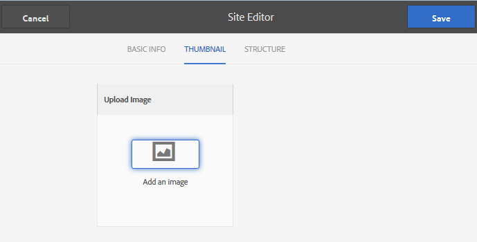

# Sitesjablonen {#site-templates}

>[!CAUTION]
>
>AEM 6.4 heeft het einde van de uitgebreide ondersteuning bereikt en deze documentatie wordt niet meer bijgewerkt. Raadpleeg voor meer informatie onze [technische ondersteuningsperioden](https://helpx.adobe.com/support/programs/eol-matrix.html). Ondersteunde versies zoeken [hier](https://experienceleague.adobe.com/docs/).

De Sitesjabloonconsole lijkt sterk op de [Groepssjablonen](tools-groups.md) console, die gericht is op functies die van belang zijn voor groepen van de Gemeenschap.

>[!NOTE]
>
>De consoles voor het creëren van [communitysites](sites-console.md), [communitysjablonen](sites.md), [communitygroepsjablonen](tools-groups.md) en [communautaire functies](functions.md) zijn alleen bestemd voor gebruik in de ontwerpomgeving.

## Sitesjabloonconsole {#site-templates-console}

In het auteursmilieu, om de console van communautaire plaatsen te bereiken

* Vanuit globale navigatie: **[!UICONTROL Tools > Communities > Site Templates]**

Deze console toont de malplaatjes waarvan een [community-site](sites-console.md) kunnen worden gemaakt en kunnen nieuwe sitesjablonen worden gemaakt.

## Sitesjabloon maken {#create-site-template}

Selecteer `Create`.

Hiermee wordt het deelvenster Site-editor weergegeven met drie subdeelvensters:

### Basisinformatie {#basic-info}

In het deelvenster Basisinformatie worden een naam, beschrijving en of de sjabloon is ingeschakeld of uitgeschakeld, geconfigureerd:

* **[!UICONTROL Community Site Template Name]**
De sjabloonnaam-id

* **[!UICONTROL Community Site Template Description]**
De sjabloonbeschrijving

* **[!UICONTROL Disabled/Enabled]**
Een schakeloptie die bepaalt of naar de sjabloon kan worden verwezen

### Miniatuur {#thumbnail}

(Optioneel) Selecteer het pictogram Afbeelding uploaden om een miniatuur met de naam en beschrijving weer te geven aan makers van gemeenschapssites.

### Structuur {#structure}

Als u communityfuncties wilt toevoegen, sleept u van de rechterkant naar links in de volgorde waarin de koppelingen in het sitemenu moeten worden weergegeven. Stijlen worden toegepast op de sjabloon tijdens het maken van de site.

Als u bijvoorbeeld een homepage wilt, sleept u de functie Pagina uit de bibliotheek en zet u de pagina onder de sjabloonbuilder neer. Hierdoor wordt het dialoogvenster voor paginaconfiguratie geopend. Zie de [functies console](functions.md) voor informatie over de configuratievensters.

U kunt doorgaan met slepen en neerzetten van alle andere communityfuncties die voor een communitysite op basis van deze sjabloon zijn gewenst.

De paginafunctie biedt een lege pagina. De groepsfunctie biedt de mogelijkheid om een groepssite (subcommunity) binnen de communitysite te maken.

>[!CAUTION]
>
>De groepfunctie moet *niet* zijn *alleen* in de sitestructuur.
>
>Elke andere functie, zoals de [page, functie](functions.md#page-function), moet worden opgenomen en als eerste worden vermeld.

### Groepsjablonen voor groepfuncties {#group-templates-for-groups-function}

Wanneer het omvatten van een groepsfunctie in het plaatssjabloon, vereist de configuratie de specificatie van de keuzen van het groepsmalplaatje toegestaan wanneer een nieuwe groep in het publicatiemilieu wordt gecreeerd.

>[!CAUTION]
>
>De functie Groepen moet *niet* zijn *alleen* in de sitestructuur.

Door twee of meer groepsmalplaatjes te selecteren, wordt een keus verstrekt aan de groepsbeheerder wanneer eigenlijk het creëren van een nieuwe groep in de gemeenschap.

## Sitesjabloon bewerken {#edit-site-template}

Bij het weergeven van sitesjablonen in de hoofdmap [Sitesjabloonconsole](#site-templates-console)kunt u een bestaande sitesjabloon selecteren om te bewerken.

Dit proces biedt dezelfde deelvensters als [een sitesjabloon maken](#create-site-template).
