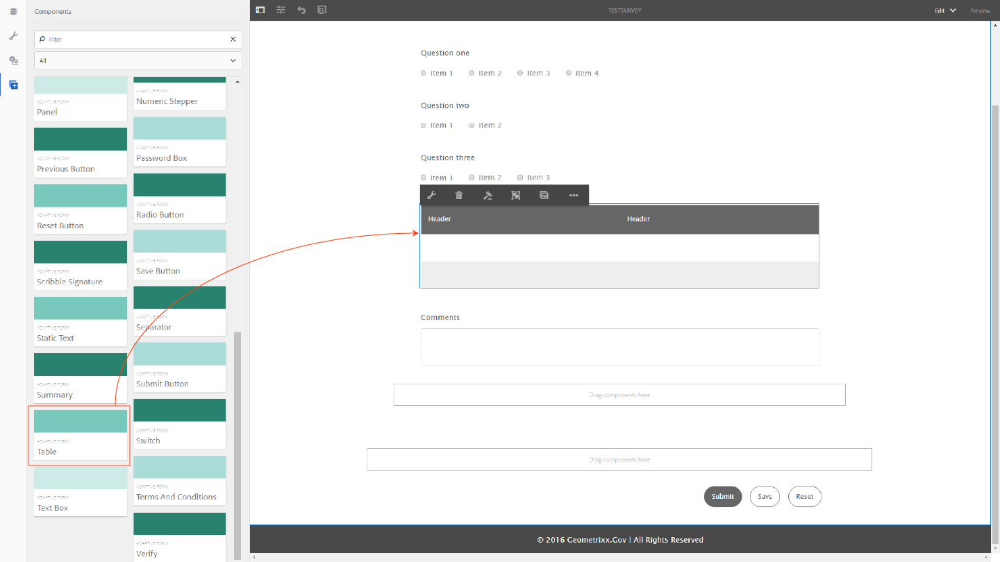
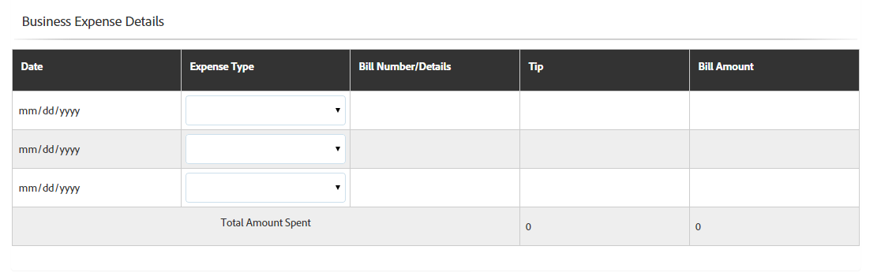

# Tabellen in aangepaste vormen {#tables-in-adaptive-forms}

Het gebruik van tabellen is een effectieve, vereenvoudigde en georganiseerde manier om complexe gegevens weer te geven. Het helpt gebruikers bij het gemakkelijk identificeren van informatie en het verstrekken van input in een geordende regeling van rijen en kolommen. De meeste vormen van financiële diensten en overheidsorganisaties vereisen grote gegevenslijsten om aantallen te zetten en berekeningen uit te voeren.

AEM Forms biedt een component Tabel in de deelvensterbrowser op het zijpaneel waarmee u tabellen kunt maken in adaptieve formulieren. Enkele belangrijke mogelijkheden zijn:

* Responsieve lay-out op mobiele apparaten
* Configureerbare rijen en kolommen
* Dynamische toevoeging en verwijdering van rijen bij uitvoering
* Cellen combineren of samenvoegen en splitsen
* Toegankelijk voor schermlezers
* Aangepaste indeling met CSS
* Compatibel met en toegewezen aan XDP-tabelcomponent
* Ondersteuning voor het toevoegen van rijen of cellen met XSD-elementen van complexe typen
* Gegevens uit een XML-bestand samenvoegen

## Maak een tabel {#create-a-table}

Als u een tabel wilt maken, sleept u de component Tabel uit de componentbrowser in het hulpwerkgebied naar het aangepaste formulier. Standaard bevat de tabel twee kolommen en drie rijen, inclusief de koptekstrij.



### Informatie over koptekst- en lichaamscellen {#about-header-and-body-cells}

De koptekstcellen zijn tekstvelden. Als u het label voor een koptekst wilt wijzigen, klikt u met de rechtermuisknop op de kopcel en klikt u op **Bewerken**. Werk in het dialoogvenster Bewerken het label bij in het veld **Waarde** en klik op **OK**.

De lichaamscellen zijn tekstvakjes, door gebrek. U kunt een hoofdcel vervangen door elke andere adaptieve formuliercomponent die beschikbaar is in het hulpgedeelte, zoals een numeriek vak, een datumkiezer of een vervolgkeuzelijst.

De eerste tekstrij in de volgende tabel bevat bijvoorbeeld tekstvak, datumkiezer en vervolgkeuzelijstcomponenten als cellen.


U kunt twee of meer lichaamscellen samenvoegen door de cellen te selecteren u wilt samenvoegen, met de rechtermuisknop klikken, en **Fusie** selecteren. U kunt ook een samengevoegde cel splitsen door er met de rechtermuisknop op te klikken en **Cellen splitsen** te selecteren.

### Rijen en kolommen toevoegen, verwijderen, verplaatsen {#add-delete-move-rows-and-columns}

U kunt een rij of kolom toevoegen en verwijderen en een rij omhoog en omlaag verplaatsen in een tabel.

Als u een rij of kolom wilt toevoegen of verwijderen of een rij wilt verplaatsen, klikt u op een cel in de rij of kolom. Een vervolgkeuzemenu wordt boven aan de kolom en links van de rij weergegeven. Het menu bovenaan bevat opties voor het toevoegen of verwijderen van de kolom, terwijl u in het menu links de rij kunt toevoegen, verwijderen of verplaatsen.

* Met de bewerking Toevoegen voegt u een rij onder of een kolom rechts van de geselecteerde rij of kolom toe.
* Met de bewerking Verwijderen verwijdert u de geselecteerde rij of kolom.
* Met de bewerking Omhoog en Omlaag verplaatst u de geselecteerde rij omhoog en omlaag.

Het vervolgkeuzemenu voor de rij bevat ook de bewerking Bewerken waarmee u rijeigenschappen, -instellingen en opmaakopties kunt bewerken.


>[!NOTE]
>
>U kunt wel een willekeurig aantal rijen in een tabel toevoegen, maar u kunt maximaal zes kolommen toevoegen. Bovendien kunt u de koptekstrij niet uit de tabel verwijderen.

### Kolombreedte instellen voor een tabel {#set-column-width}

Voer de volgende stappen uit om de kolombreedte voor een tabel in te stellen:

1. Tik op het tabblad **[!UICONTROL Content]** op de **[!UICONTROL Table]**-component en tik op het pictogram Configure ().

1. Voer in het veld **[!UICONTROL Column Width]** de lijst met door komma&#39;s gescheiden waarden in om de proportionele breedte van elke kolom in de tabel op te geven. Bijvoorbeeld, voor een lijst die 3 kolommen omvat, die 2.4.6 als waarde in **[!UICONTROL Column Width]** gebied specificeren resulteert in het plaatsen van de breedte van kolommen als 2/12 voor eerste kolom, 4/12 voor tweede kolom, en 6/12 voor derde kolom. 2/12, aangezien de breedte voor de eerste kolom verwijst naar een zesde van de tabelbreedte. Zo stelt 4/12 de tweede kolombreedte in als een derde van de tabelbreedte en 6/12 stelt de derde kolombreedte in als de helft van de tabelbreedte.

### Tabelbeschrijving toevoegen {#add-table-description}

U kunt een beschrijving van de tabel toevoegen om uit te leggen hoe de informatie is ingedeeld die schermlezers kunnen interpreteren en lezen. De beschrijving toevoegen:

1. Selecteer de tabel en tik  om de eigenschappen ervan in het zijpaneel weer te geven.
1. Geef een overzicht op op het tabblad Toegankelijkheid.
1. Klik **Done**.

## Tabelstijl {#configure} configureren

U kunt de stijl voor een tabel definiëren met de modus Stijl op de paginaboolbalk. Ga als volgt te werk om over te schakelen op de stijlmodus en de tabelopmaak te bewerken

1. Tik op  > **Stijl** op de pagina-werkbalk vóór Voorvertoning.

1. Selecteer in het zijpaneel een tabel en tik op de bewerkknop .

   De opmaakeigenschappen worden weergegeven in het zijpaneel.


>[!NOTE]
>
>U kunt het kleurthema voor koptekst- en tekstrijen wijzigen door de waarden van LESS-variabelen te wijzigen. Zie [Thema&#39;s in AEM Forms](/help/forms/using/themes.md) voor meer informatie.

## Een rij dynamisch toevoegen of verwijderen {#add-or-delete-a-row-dynamically}

Tabellen bieden ondersteuning voor het dynamisch toevoegen of verwijderen van rijen tijdens runtime.

1. Selecteer een tabelrij en tik op .
1. Geef op het tabblad Herhalingsinstellingen het minimale en maximale aantal rijen op om het aantal rijen in de tabel te beperken.
1. Klik **Done**.

Tijdens runtime ziet u de knoppen **`+`** en *`-`* om een rij toe te voegen of te verwijderen.


>[!NOTE]
>
>Het dynamisch toevoegen of verwijderen van een rij wordt niet ondersteund in kopteksten in de mobiele lay-out links van tabellen.

## Expressies in een tabel {#expressions-in-a-table}

Met tabellen in adaptieve formulieren kunt u expressies schrijven in JavaScript om gedrag te induceren, zoals een tabel of een rij tonen of verbergen, alle getallen optellen en het totaal in een cel weergeven, een cel in- of uitschakelen, gebruikersinvoer valideren enzovoort. Deze expressies gebruiken API&#39;s van het adaptieve formulierscriptmodel.

Tabellen en rijen bieden alleen ondersteuning voor zichtbaarheidsexpressies om de zichtbaarheid ervan te bepalen op basis van de waarde die door een expressie wordt geretourneerd, terwijl cellen de volgende expressies ondersteunen:

* **Initialisatiescript:een handeling** voor initialisatie van een veld uitvoeren.
* **Waarde script vastleggen:** om de componenten van een formulier te wijzigen nadat de waarde van een veld is gewijzigd.

>[!NOTE]
>
>Als het XFA change/exit-script ook op hetzelfde veld wordt toegepast, wordt het XFA change/exit-script uitgevoerd vóór het Value Commit-script.

* **Expressies** berekenen: om de waarde van een veld automatisch te berekenen.
* **Validatie-expressies**: om een veld te valideren.
* **Toegang tot expressies**: om een veld in of uit te schakelen.
* **Visibility expression**: om de zichtbaarheid van een veld en deelvenster te regelen.

De zichtbaarheidsexpressie voor een tabel of rij kan worden gedefinieerd op het tabblad Eigenschappen van deelvenster van het corresponderende dialoogvenster van de component Bewerken. De expressies voor een cel kunnen worden gedefinieerd op het tabblad Script van het dialoogvenster dat de component Edit bevat.

Zie [JavaScript Library API reference for adaptive forms](https://helpx.adobe.com/aem-forms/6/javascript-api/index.html) voor de volledige lijst met adaptieve formulierklassen, -gebeurtenissen, -objecten en openbare API&#39;s.

## Mobiele lay-outs {#mobile-layouts}

Tabellen in adaptieve formulieren bieden ongeëvenaarde beleving van mobiele apparaten vanwege hun dynamische en responsieve lay-outs. AEM Forms biedt twee typen mobiele lay-outs voor tabellen: kopteksten aan de linkerkant en Inklapbare kolommen.

U kunt een mobiele lay-out voor een lijst van het Stijllusje van het Edit componentendialoogvenster voor een lijst vormen.

### Kopteksten aan linkerzijde {#headers-on-left}

In de kopteksten op linkerlay-out, wordt de kopbal in de lijst omgezet op de linkerzijde met slechts één cel die op een kopbal verschijnt. Elke rij in deze lay-out wordt weergegeven als een afzonderlijke sectie. In de volgende afbeeldingen wordt een tabel op een desktopcomputer vergeleken met die op een mobiel apparaat.


**desktop viewFigure:** *Desktopmening van een lijst met Kopbal op linkerlay-out*


**headersontheleftFigure:** *Mobiele weergave van een tabel met Koptekst in linkerlay-out*

### Inklapbare kolomindeling {#collapsible-columns-layout}

In de Inklapbare kolomlay-out, de kolommen in de lijst doen ineenstorten om één of twee kolommen, afhankelijk van de apparatengrootte te tonen, terwijl andere kolommen worden doen ineenstorten. U kunt op het pictogram samenvouwen/uitvouwen klikken om andere kolommen in de tabel weer te geven.

>[!NOTE]
>
>Hoewel de Inklapbare kolomlay-out is geoptimaliseerd voor mobiele apparaten, werkt deze ook op het bureaublad als de beschikbare breedte niet voldoende is om alle kolommen in een tabel weer te geven.

De volgende afbeeldingen vergelijken hoe een tabel eruitziet op een apparaat met samengevouwen en uitgevouwen kolommen.


**columnFigure:** *Samengevouwen kolommen van een lijst met slechts twee kolommen die op een mobiel apparaat verschijnen*


**columnFigure:** *Uitgebreide kolom van een lijst op een mobiel apparaat*

## Gegevens in een tabel samenvoegen {#merge-data-in-a-table}

Met tabellen in adaptieve formulieren kunt u de tabel tijdens runtime vullen met gegevens uit een XML-bestand. Het XML-bestand met gegevens kan zich bevinden in het lokale bestandssysteem van de computer waarop de AEM Forms-server wordt uitgevoerd of in de CRX-opslagplaats.

Neem bijvoorbeeld de volgende overzichtstabel met banktransacties die we willen vullen met gegevens uit een XML-bestand.


In dit voorbeeld, het bezit van de Naam van het Element voor:

* de rij is **Rij1**
* de lichaamscel onder de datum van de Transactie is **tableItem1**
* de lichaamscel onder Beschrijving is **tableItem2**
* de lichaamscel onder het type van Transactie is **type**
* de lichaamscel onder Bedrag in USD is **tableItem3**

Het XML-bestand dat gegevens in de volgende indeling bevat:

```xml
<?xml version="1.0" encoding="UTF-8"?><afData>
  <afUnboundData>
    <data>
 <typeSelect>0</typeSelect>
 <Row1>
      <tableItem1>2015-01-08</tableItem1>
      <tableItem2>Purchase laptop</tableItem2>
      <type>0</type>
      <tableItem3>12000</tableItem3>
 </Row1>
 <Row1>
      <tableItem1>2015-01-05</tableItem1>
      <tableItem2>Transport expense</tableItem2>
      <type>0</type>
      <tableItem3>120</tableItem3>
 </Row1>
 <Row1>
      <tableItem1>2014-01-08</tableItem1>
      <tableItem2>Laser printer</tableItem2>
      <type>0</type>
      <tableItem3>500</tableItem3>
 </Row1>
 <Row1>
      <tableItem1>2014-12-08</tableItem1>
      <tableItem2>Credit card payment</tableItem2>
      <type>0</type>
      <tableItem3>300</tableItem3>
 </Row1>
 <Row1>
      <tableItem1>2015-01-06</tableItem1>
      <tableItem2>Interest earnings</tableItem2>
      <type>1</type>
      <tableItem3>12000</tableItem3>
 </Row1>
 <Row1>
      <tableItem1>2015-01-05</tableItem1>
      <tableItem2>Payment from a client</tableItem2>
      <type>1</type>
      <tableItem3>500</tableItem3>
 </Row1>
 <Row1>
      <tableItem1>2015-01-08</tableItem1>
      <tableItem2>Food expense</tableItem2>
      <type>0</type>
      <tableItem3>120</tableItem3>
 </Row1>
 </data>
  </afUnboundData>
  <afBoundData>
    <data/>
  </afBoundData>
  <afBoundData/>
</afData>
```

In de voorbeeld-XML worden de gegevens voor een rij gedefinieerd door de `<Row1>`-tags. Dit is de elementnaam voor de rij in de tabel. Binnen de tag `<Row1>` worden de gegevens voor elke cel gedefinieerd binnen de tag voor de elementnaam, zoals `<tableItem1>`, `<tableItem2>`, `<tableItem3>` en `<type>`.

Als u deze gegevens tijdens runtime wilt samenvoegen met de tabel, moet u het aangepaste formulier met de tabel verwijzen naar de absolute XML-locatie met Wcmmode uitgeschakeld. Als het adaptieve formulier bijvoorbeeld op *http://localhost:4502/myForms/bankTransaction.html* staat en het XML-bestand met gegevens is opgeslagen op *C:/myTransactions/bankSummary.xml*, kunt u de tabel weergeven met gegevens op de volgende URL:

*http://localhost:4502/myForms/bankTransaction.html?dataRef=file:/// C:/myTransactions/bankSummary.xml&amp;wcmmode=disabled*


## XDP-componenten en XSD-complexe typen gebruiken {#use-xdp-components-and-xsd-complex-types}

Als u een adaptief formulier hebt gemaakt op basis van een XFA-formuliersjabloon, zijn de XFA-elementen beschikbaar op het tabblad Gegevensmodel van AEM Content Finder. U kunt deze XFA-elementen, inclusief tabellen, naar het aangepaste formulier slepen.

Het XFA-tabelelement wordt toegewezen aan de component Tabel en werkt in adaptieve formulieren buiten de box. Alle eigenschappen en functies van XDP-tabellen blijven behouden wanneer u deze verplaatst naar een adaptief formulier. U kunt er elke bewerking op uitvoeren, net als bij een native adaptieve formuliertabel. Als een rij in een XDP-tabel bijvoorbeeld herhaalbaar is, wordt deze ook herhaald wanneer deze in adaptieve formulieren wordt verwijderd.

Daarnaast kunt u XDP-subformulier slepen en neerzetten om een nieuwe rij toe te voegen aan de tabel. Het neerzetten van een genest subformulier werkt echter niet.

>[!NOTE]
>
>Een XDP-tabel zonder koptekstrij wordt niet toegewezen aan de adaptieve component Form Table. In plaats daarvan wordt het element toegewezen aan de adaptieve component van het deelvenster Formulier met vloeiende layout. Wanneer u een geneste tabel toevoegt van een XDP naar een adaptief formulier, wordt de buitenste tabel geconverteerd naar een deelvenster met behoud van de binnenste tabel.

Bovendien kunt u een groep XSD-complexe tekstelementen slepen en neerzetten om een tabelrij te maken. Er wordt een nieuwe rij gemaakt net onder de rij waarop u de elementen hebt neergezet. De cellen die zijn gemaakt met de XSD-elementen voor complexe typen behouden een bindingsverwijzing naar de XSD. U kunt een lichaamscel met een XSD complex typeelement ook vervangen door het element op de cel te laten vallen.

>[!NOTE]
>
>Het aantal elementen in een XDP-tabelcomponent, een subformulier of een XSD-complex type kan het aantal cellen in een rij niet overschrijden. U kunt bijvoorbeeld geen vier elementen neerzetten op een rij met slechts drie cellen. Er treedt een fout op.
>
>Als het aantal elementen kleiner is dan het aantal cellen in een rij, voegt de nieuwe rij eerst cellen toe die op de elementen worden gebaseerd, en dan worden de standaardcellen toegevoegd om de resterende cellen in de rij te vullen. Als u bijvoorbeeld een groep van drie elementen in een rij met vier cellen neerzet, zijn de eerste drie cellen gebaseerd op de elementen die u hebt neergezet en is de resterende één cel de standaardtabelcel.

## Belangrijkste overwegingen {#key-considerations}

* Als u rijen omhoog en omlaag verplaatst tijdens het ontwerpen van een op XSD gebaseerde tabel, wordt enig gegevensverlies uit tabelrijen gezien in de gegevens-XML die bij het verzenden van het formulier worden gegenereerd.
* Aan elke cel in een standaardtabel is een vooraf gedefinieerde elementnaam gekoppeld. Als u een andere tabel in het aangepaste formulier toevoegt, hebben de standaardhoofdtekstcellen in de nieuwe tabel dezelfde elementnaam als in de eerste tabel. In dat geval bevatten de gegevens die bij het verzenden van het formulier worden gegenereerd, gegevens in de standaardhoofdtekstcellen van slechts een van de tabellen. Zorg er daarom voor dat u de elementnamen voor standaardlichaamscellen hernoemt om ze uniek te houden in verschillende tabellen en gegevensverlies te voorkomen.

   Merk op dat dit slechts op de standaardlichaamscellen van toepassing is. Als u meer rijen of kolommen aan een tabel toevoegt, worden automatisch unieke elementnamen voor niet-standaardlichaamscellen gegenereerd.
