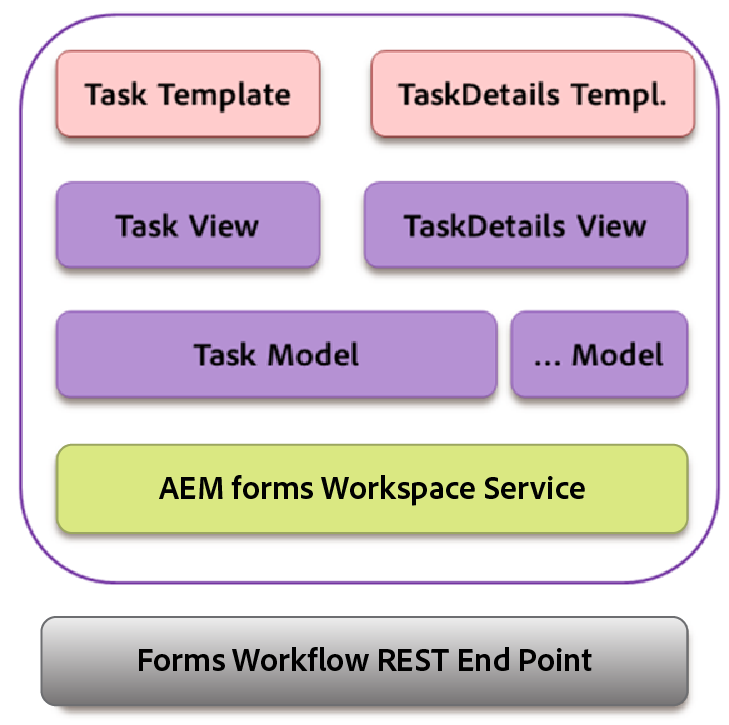

# Backbone-interactie {#backbone-interaction}

Backbone is een bibliotheek die helpt bij het maken en volgen van MVC-architectuur in webtoepassingen. Het basisidee van Backbone is uw interface te organiseren in logische meningen, gesteund door modellen, die elk onafhankelijk kunnen worden bijgewerkt wanneer het model verandert, zonder het moeten de pagina opnieuw tekenen. Voor meer informatie over Backbone, zie [https://backbonejs.org](https://backbonejs.org/).

Enkele belangrijke concepten zijn:

**Backbone** modelContains gegevens, en de meeste logica met betrekking tot deze gegevens.

**Backbone** viewUsed om de staat van het overeenkomstige model te vertegenwoordigen. Een backboneweergave gedraagt zich eigenlijk als een controller, luisterend naar gebruikersinterfacegebeurtenissen zoals klikken door de gebruiker of naar modelgebeurtenissen (zoals gewijzigde gegevens) en wijzigt de gebruikersinterface op de juiste wijze.

**HTML-** sjabloonEen omvattende sjabloon met plaatsaanduidingen die zijn gevuld door het model.

**AEM Forms-** werkruimteBevat verschillende afzonderlijke componenten. Elke component:

* Vertegenwoordigt één logisch interface-element.
* Dit kan een verzameling van vergelijkbare componenten zijn.
* Deze indeling bestaat uit een backbonemodel, een backboneweergave en een HTML-sjabloon.
* Bevat verwijzing naar de dienst.
* Bevat een verwijzing naar vereiste hulpprogramma&#39;s.

Wanneer een component wordt geïnitialiseerd, worden de volgende objecten gemaakt:

* Er wordt een nieuwe instantie van het backbonemodel voor de component gemaakt. De service wordt in het model geïnjecteerd.
* Er wordt een nieuw exemplaar van de backboneweergave gemaakt.
* Instantie van het bijbehorende model, HTML-sjabloon en hulpprogramma&#39;s worden in de weergave geïnjecteerd.

In de backboneweergave is er een gebeurteniskaart die de verschillende gebeurtenissen in kaart brengt die zich als gevolg van gebruikersinterfaceinteractie met een overeenkomstige manager kunnen voordoen. Deze toewijzing wordt in werking gesteld zodra een component wordt geïnitialiseerd.

Wanneer een mening wordt geïnitialiseerd, roept de mening zijn overeenkomstig model om gegevens van server te halen. Zodra alle gegevens die door een weergave worden vereist, beschikbaar zijn, worden de gegevens in de indeling gerenderd die door de HTML-sjabloon is opgegeven. Meerdere weergaven kunnen hetzelfde model voor communicatie delen.

Een voorbeeld:

1. De gebruiker klikt een taakmalplaatje in de takenlijst.
1. De mening van de taak luistert aan de klik, en de vraag geeft functie op het taakmodel terug.
1. Het model van de taak roept daarna de dienst aan die een gemeenschappelijk punt voor al mededeling met de server van AEM Forms is.
1. De klasse van de dienst roept AEM Forms REST eindpunt voor teruggeeft methode via ajax.
1. De succescallback voor deze Ajax aanroeping wordt bepaald in het taakmodel.
1. Het model van de taak heft een backbonegebeurtenis als bericht op dat vraag teruggeeft volledig is.
1. In een andere weergave luistert de weergave met taakdetails naar deze gebeurtenis vanuit het taakmodel.
1. De mening van de details van de taak verandert dan het malplaatje van taakdetails om de teruggegeven taak (vorm, details, gehechtheid, nota&#39;s, etc.) aan de gebruiker te tonen.

