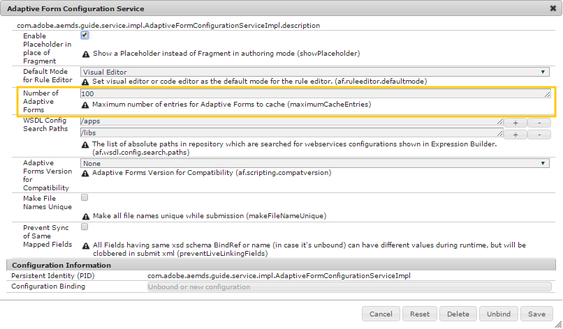

# Cache voor adaptieve formulieren {#configure-adaptive-forms-cache} configureren

Een cache is een mechanisme om de toegangstijd voor gegevens te verkorten, de latentie te verminderen en de invoer-/uitvoersnelheid (I/O) te verbeteren. In de cache van adaptieve formulieren worden alleen HTML-inhoud en JSON-structuur van een adaptief formulier opgeslagen zonder dat vooraf ingevulde gegevens worden opgeslagen. Hierdoor wordt de tijd die nodig is om een adaptief formulier of document op de client te genereren, verkort. Het is specifiek ontworpen voor adaptieve formulieren en ondersteunt ook adaptieve documenten.

>[!NOTE]
>
>Wanneer u de cache voor adaptieve formulieren gebruikt, gebruikt u de AEM Dispatcher om clientbibliotheken (CSS en JavaScript) van een adaptief formulier of document in cache te plaatsen.

>[!NOTE]
>
>Zorg tijdens het ontwikkelen van aangepaste componenten op de server die wordt gebruikt voor ontwikkeling dat de cache van adaptieve formulieren uitgeschakeld blijft.

## De cache {#configure-the-cache} configureren

Voer de volgende stappen uit om de cache voor adaptieve formulieren te configureren:

1. Ga naar AEM webconsoleconfiguratiebeheer op `https://[server]:[port]/system/console/configMgr`.
1. Klik **Aangepaste Vorm en Interactieve Communicatie Configuratie van het Kanaal van het Web** om zijn configuratiewaarden uit te geven.
1. Geef in het dialoogvenster Configuratiewaarden bewerken het maximumaantal formulieren of documenten op dat een instantie van de AEM Forms-server in cache kan plaatsen in het veld **Aantal Adaptieve Forms**. De standaardwaarde is 100.

   >[!NOTE]
   >
   >Als u de cache wilt uitschakelen, stelt u de waarde in het veld Aantal adaptieve Forms in op **0**. De cache wordt opnieuw ingesteld en alle formulieren en documenten worden uit de cache verwijderd wanneer u de cachemonfiguratie uitschakelt of wijzigt.

   

1. Klik **sparen** om de configuratie te bewaren.

