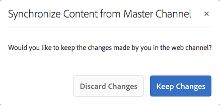

# Een interactieve communicatie maken {#create-an-interactive-communication}

Creeer een Interactieve Mededeling gebruikend de Interactieve Communicatie redacteur. Gebruik de functie voor slepen en neerzetten om de interactieve communicatie te maken en een voorvertoning van zowel afdruk- als webuitvoer weer te geven voor verschillende apparaattypen.

## Overzicht {#overview}

De interactieve Mededelingen centraliseren en beheert de verwezenlijking, de assemblage, en de levering gepersonaliseerde, en interactieve correspondentie. Gebruik afdrukken als master kanaal voor het web om dubbel werk te minimaliseren bij het maken van de webinvoer van de interactieve communicatie.

### Vereisten {#prerequisites}

Het volgende is de eerste vereisten voor het creëren van een Interactieve Mededeling:

* Stel een [Formuliergegevensmodel](/help/forms/using/data-integration.md) in dat testgegevens of een werkelijke gegevensbron bevat, zoals een instantie van Microsoft® Dynamics.
* Zorg ervoor dat u de [Documentfragmenten](/help/forms/using/document-fragments.md) hebt.
* Zorg ervoor dat u [Sjablonen hebt voor afdrukken en webkanaal](/help/forms/using/web-channel-print-channel.md).
* Zorg ervoor dat u het vereiste [thema](/help/forms/using/themes.md) voor het Webkanaal hebt.

## Interactieve communicatie {#createic} maken

1. Meld u aan bij de AEM auteur en navigeer naar **[!UICONTROL Adobe Experience Manager]** > **[!UICONTROL Forms]** > **[!UICONTROL Forms & Documents]**.
1. Tik **[!UICONTROL Create]** en selecteer **[!UICONTROL Interactive Communication]**. De pagina Interactieve communicatie maken wordt weergegeven.

   

1. Voer de volgende gegevens in. :

   * **[!UICONTROL Title]**: Voer de titel van de interactieve communicatie in.
   * **[!UICONTROL Name*]**: De naam van de Interactieve Mededeling wordt afgeleid uit de titel u ingaat. Bewerk indien nodig de selectie.
   * **[!UICONTROL Description]**: Ga een beschrijving over de Interactieve Communicatie in.
   * **[!UICONTROL Form Data Model*]**: Blader naar het gegevensmodel van het formulier en selecteer dit. Zie [AEM Forms Data Integration](/help/forms/using/data-integration.md) voor meer informatie over het formuliergegevensmodel.
   * **[!UICONTROL Prefill Service]**: Selecteer de prefill dienst om de gegevens terug te winnen en de Interactieve Communicatie vooraf in te vullen.
   * **[!UICONTROL Post Process Type]**: U kunt AEM of Forms-workflow selecteren die moet worden geactiveerd wanneer de interactieve communicatie wordt verzonden. Selecteer het type workflow dat moet worden geactiveerd.
   * **[!UICONTROL Post Process]**: Selecteer de naam van de workflow die moet worden geactiveerd. Wanneer u AEM workflow selecteert, moet u het pad naar Bijlage, Lay-out, PDF-pad, Gegevenspad afdrukken en Webgegevenspad opgeven.
   * **[!UICONTROL Tags]**: Selecteer de tags die u wilt toepassen op Interactieve communicatie. U kunt ook een nieuwe/aangepaste tagnaam typen en op Enter drukken om deze te maken.
   * **[!UICONTROL Author]**:De auteursnaam wordt automatisch genomen van de het programma geopende gebruikersnaam.
   * **[!UICONTROL Publish Date:]** Voer de datum in waarop u de interactieve communicatie wilt publiceren.
   * **[!UICONTROL Unpublish Date]**: Voer de datum in waarop u de publicatie van de interactieve communicatie ongedaan wilt maken.

1. Tik op **[!UICONTROL Next]**. Het scherm waarop u afdruk- en webkanaalgegevens wilt opgeven, wordt weergegeven.
1. Voer het volgende in:

   * **[!UICONTROL Print]**: Selecteer deze optie om het afdrukkanaal van de interactieve communicatie te genereren.
   * **[!UICONTROL Print Template*:]** Blader naar een XDP als afdruksjabloon en selecteer deze.
   * **[!UICONTROL Use Print As Master For Web Channel:]** Selecteer deze optie om het webkanaal synchroon met het afdrukkanaal te maken. Als u het afdrukkanaal gebruikt als master voor het webkanaal, zorgt u ervoor dat de inhoud en de gegevensbinding van het webkanaal worden afgeleid van het afdrukkanaal en dat de wijzigingen die u in het afdrukkanaal hebt aangebracht, worden weerspiegeld in het webkanaal wanneer u op Synchroniseren tikt. De auteurs mogen echter desgewenst de overerving voor specifieke componenten in het webkanaal verbreken. Zie [Webkanaal synchroniseren met afdrukkanaal](/help/forms/using/create-interactive-communication.md#synchronize) voor meer informatie.
   * **[!UICONTROL Web:]** Selecteer deze optie om het webkanaal of de responsieve uitvoer van Interactieve communicatie te genereren.
   * **[!UICONTROL Interactive Communication Web Template*:]** Blader naar de websjabloon en selecteer deze.
   * **[!UICONTROL Theme]** en  **[!UICONTROL Select Theme*]**: Blader en selecteer het thema om het webkanaal van de interactieve communicatie op te maken. Zie [Thema&#39;s in AEM Forms](/help/forms/using/themes.md) voor meer informatie.

   Zie [Kanaal en webkanaal afdrukken](/help/forms/using/web-channel-print-channel.md) voor meer informatie over het afdrukkanaal en het webkanaal.

1. Tik op **[!UICONTROL Create]**. De interactieve communicatie wordt gemaakt en er verschijnt een waarschuwingsvenster. Tik **[!UICONTROL Edit]** om de inhoud van de interactieve communicatie op te bouwen, zoals wordt uitgelegd in [Inhoud toevoegen met de interactieve gebruikersinterface voor communicatie ontwerpen](#step2). U kunt ook **[!UICONTROL Done]** tikken en ervoor kiezen om de interactieve communicatie later te bewerken.

## Inhoud toevoegen aan de interactieve communicatie {#step2}

Nadat u een Interactieve Communicatie hebt gecreeerd, kunt u de Interactieve Communicatie auteursinterface gebruiken om zijn inhoud te construeren.

Voor meer informatie over de Interactieve Communicatie auteursinterface, zie [Inleiding aan Interactieve Communicatie creatie](/help/forms/using/introduction-interactive-communication-authoring.md).

1. De Interactieve Communicatie auteursinterface wordt gelanceerd wanneer u Tik geef zoals vermeld in [Interactieve Communicatie](#createic) tot stand brengen. Alternatief, kunt u aan een bestaand Interactief Communicatie middel op AEM navigeren, het selecteren, en tikken **[!UICONTROL Edit]** om de Interactieve Communicatie auteursinterface te lanceren.

   Standaard wordt het afdrukkanaal van de interactieve communicatie weergegeven, tenzij Interactieve communicatie alleen via het web plaatsvindt. In het afdrukkanaal van de interactieve communicatie worden de doelgebieden weergegeven die beschikbaar zijn in de geselecteerde XDP/afdruksjabloon. In deze doelgebieden en -velden kunt u componenten of elementen toevoegen.

1. Selecteer het kanaal Afdrukken en selecteer het tabblad **[!UICONTROL Components]**. De volgende componenten zijn beschikbaar in het afdrukkanaal:

   | **Component** | **Functionaliteit** |
   |---|---|
   | Diagram | Hiermee voegt u een grafiek toe die u in Interactieve communicatie kunt gebruiken voor de visuele weergave van tweedimensionale gegevens die zijn opgehaald uit een verzameling formuliergegevensmodellen. Voor meer informatie, zie [Het gebruiken van grafieken in Interactieve Mededelingen](/help/forms/using/chart-component-interactive-communications.md). |
   | Documentfragment | Staat u toe om een herbruikbare component, zoals tekst, lijst, of voorwaarde, aan een Interactieve Communicatie toe te voegen. De toegevoegde component kan gebaseerd zijn op een formuliergegevensmodel of zonder een formuliergegevensmodel. |
   | Afbeelding | Hiermee kunt u een afbeelding invoegen. |

   Sleep de componenten in uw Interactieve Communicatie en vorm hen zoals vereist.

1. Selecteer het afdrukkanaal en ga naar het tabblad **[!UICONTROL Assets]** en pas het filter toe om alleen de elementen weer te geven die u wilt zien.

   Met behulp van de middelenbrowser kunt u ook rechtstreeks elementen slepen en neerzetten in interactieve communicatiedoelgebieden.

   

1. Sleep de documentfragmenten naar de interactieve communicatie. Hier volgen de typen documentfragmenten die u kunt gebruiken in het afdrukkanaal van de interactieve communicatie.

<table> 
 <tbody> 
  <tr> 
   <td><strong>Type documentfragment</strong></td> 
   <td><strong>Voorbeeld</strong></td> 
  </tr> 
  <tr> 
   <td><a href="/help/forms/using/texts-interactive-communications.md" target="_blank">Tekst</a></td> 
   <td>Tekst voor het toevoegen van het adres, de e-mail van de ontvanger en de platte tekst van de brief </td> 
  </tr> 
  <tr> 
   <td><a href="/help/forms/using/conditions-interactive-communications.md" target="_blank">Voorwaarde</a></td> 
   <td>Voorwaarde om het aangewezen kopbalbeeld aan de mededeling toe te voegen die op het type van het beleid wordt gebaseerd: Standaard of Premium.   </td> 
  </tr> 
  <tr> 
   <td>Lijst</td> 
   <td>Groep documentfragmenten, zoals tekst, voorwaarden, andere lijsten en afbeeldingen.   </td> 
  </tr> 
 </tbody> 
</table>

Zie [Documentfragmenten](/help/forms/using/document-fragments.md) voor meer informatie over documentfragmenten.

1. Tik op een variabele om de binding van variabelen in te stellen en selecteer  (Configure) en stel vervolgens de bindingseigenschappen in het deelvenster Eigenschappen in het zijpaneel in.

   * **[!UICONTROL None]**: De agent zal de waarde voor de variabele invullen.
   * **[!UICONTROL Text Fragment]**: Als deze optie is geselecteerd, kunt u door een tekstdocumentfragment bladeren en dit selecteren waarvan de inhoud in het veld wordt weergegeven. Alleen tekstdocumentfragmenten kunnen worden gebonden aan variabelen die geen variabelen bevatten.
   * **[!UICONTROL Data Model Object]**: Selecteer een eigenschap van het formuliergegevensmodel waarvan de waarde in het veld is ingevuld.

   U kunt ook het desbetreffende tekstdocumentfragment configureren. In het deelvenster Eigenschappen wordt de lijst met variabelen in het tekstdocumentfragment weergegeven. U kunt  (uitgeven) naast een veranderlijke naam tikken om de montages van die variabele voor het uitgeven te tonen.

1. Als u een tabel wilt toevoegen terwijl het afdrukkanaal is geselecteerd, past u op het tabblad **[!UICONTROL Assets]** het filter toe om alleen de layoutfragmenten weer te geven. Sleep het vereiste lay-outfragment naar de interactieve communicatie en zet het neer. Een lay-outfragment is gebaseerd op een XDP en kan worden gebruikt om grafische lay-outs of statische en dynamische lijsten in Interactieve Communicatie tot stand te brengen die met dynamische gegevens worden bevolkt.

   Voorbeeld: Een lay-outlijst om bruto premie, loyaliteitskorting %, en noodhulp langs de weg voor oud en nieuw beleid te tonen.

   Zie [Documentfragmenten](/help/forms/using/document-fragments.md) voor meer informatie over layoutfragmenten.

1. Selecteer het afdrukkanaal en pas op het tabblad **[!UICONTROL Assets]** het filter toe op de weergave van afbeeldingen. Sleep de vereiste afbeeldingen naar de interactieve communicatie, bijvoorbeeld voor het bedrijfslogo.

   Bovendien, beheer het volgende in de Interactieve Mededeling:

   * [Grafieken toevoegen en configureren](/help/forms/using/chart-component-interactive-communications.md)
   * [Webkanaal synchroniseren met afdrukkanaal](/help/forms/using/create-interactive-communication.md#synchronize)

      * Automatisch synchroniseren
      * Overerving annuleren
      * Overerving opnieuw inschakelen
      * Synchroniseren
   * [Bijlagen en bibliotheektoegang](/help/forms/using/create-interactive-communication.md#attachmentslibrary)
   * [Eigenschappen van XDP/Layout-velden](/help/forms/using/create-interactive-communication.md#xdplayoutfieldproperties)
   * [Regels toevoegen aan componenten](/help/forms/using/create-interactive-communication.md#rules)

1. Schakel over naar **[!UICONTROL Web Channel]**. Het webkanaal wordt weergegeven in de interactieve communicatieeditor. Wanneer u voor het eerst van het kanaal van de Druk aan het kanaal van het Web schakelt, vindt de automatische synchronisatie plaats. Zie [Webkanaal synchroniseren vanuit het afdrukkanaal](/help/forms/using/create-interactive-communication.md#synchronize) voor meer informatie.

   Omdat we Afdrukken in dit voorbeeld als master voor het web gebruiken, worden de plaatsaanduidingen, inhoud en gegevensbinding van het kanaal Afdrukken gesynchroniseerd met het webkanaal. U kunt de specifieke inhoud in het webkanaal echter naar wens wijzigen en aanpassen.

   

1. Tik **[!UICONTROL Components]** om extra componenten aan het webkanaal toe te voegen terwijl het webkanaal is geselecteerd. De belemmering-en-dalingscomponenten in het Webkanaal van uw Interactieve Communicatie zoals vereist en ga te werk om hen te vormen.

   | Onderdelen | Functionaliteit |
   |---|---|
   | Diagram | Hiermee voegt u een grafiek toe die u in Interactieve communicatie kunt gebruiken voor de visuele weergave van tweedimensionale gegevens die zijn opgehaald uit een verzameling formuliergegevensmodellen. Voor meer informatie, zie [Het gebruiken van grafiekcomponent](/help/forms/using/chart-component-interactive-communications.md). |
   | Documentfragment | Staat u toe om een herbruikbare component, een tekst, een lijst, of een voorwaarde, aan een Interactieve Communicatie toe te voegen. De herbruikbare component die u toevoegt aan een interactieve communicatie kan gebaseerd zijn op een formuliergegevensmodel of geen formuliergegevensmodel. |
   | Afbeelding | Hiermee kunt u een afbeelding invoegen. |
   | Deelvenster | De component van het Comité is placeholder voor het groeperen van andere componenten samen en controleert hoe een groep componenten, zoals accordeon en lusjes, in de Interactieve Mededeling worden uiteengezet. Met een deelvenstercomponent kunt u ook een groep componenten herhaalbaar maken voor de eindgebruiker, bijvoorbeeld in meerdere items die nodig zijn om de gegevens van het onderwijs in te vullen. |
   | Tabel | Hiermee voegt u een tabel toe waarin u gegevens in rijen en kolommen kunt ordenen. |
   | Doelgebied | Hiermee voegt u een doelgebied in een webkanaal in om de webkanaalspecifieke componenten te ordenen. Het doelgebied is een normale container waarmee u webkanaalspecifieke componenten kunt groeperen. |
   | Tekst | Voegt rijke tekst aan het Webkanaal van een Interactieve Mededeling toe. Tekst kan ook gebruikmaken van formuliergegevensmodelobjecten om de inhoud dynamisch te maken. |

1. Voeg desgewenst elementen in uw webkanaal in.

   U kunt [voorproef uw Interactieve Communicatie](#previewic) om te zien wat de druk en Weboutput van de Interactieve Communicatie kijken als en verder makend veranderingen, zoals vereist.

## Een voorvertoning weergeven van de interactieve communicatie {#previewic}

U kunt de optie **[!UICONTROL Preview]** gebruiken om verschijning van de Interactieve Mededeling te evalueren. Het Webkanaal van Interactieve Communicatie verstrekt ook een optie om ervaring van een Interactieve Mededeling voor diverse apparaten te simuleren. Bijvoorbeeld iPhone, iPad en Desktop. U kunt zowel de **[!UICONTROL Preview]** als **[!UICONTROL Emulator]**  opties in combinatie met elkaar gebruiken om een voorvertoning van de webuitvoer voor apparaten van verschillende schermgrootten weer te geven. De voorbeeldgegevens in de voorbeeldweergave worden gevuld vanuit het opgegeven gegevensmodel voor formulieren.

1. Selecteer het kanaal (afdrukken of web) voor een voorvertoning en tik op de voorvertoning. De interactieve communicatie wordt weergegeven.

   >[!NOTE]
   >
   >Het voorbeeld wordt gevuld met de voorbeeldgegevens van het opgegeven formuliergegevensmodel. Zie [Formuliergegevensmodel gebruiken](/help/forms/using/using-form-data-model.md) en [Werken met formuliergegevensmodel](/help/forms/using/work-with-form-data-model.md) voor meer informatie over het bekijken van een voorbeeld van de interactieve communicatie met andere gegevens of het gebruik van de Prefill-service.

1. Voor het Webkanaal, gebruik  om te bekijken hoe de Interactieve Communicatie op diverse apparaten kijkt.

   

Verder, kunt u [Interactieve Mededeling voorbereiden en verzenden gebruikend de Agent UI](/help/forms/using/prepare-send-interactive-communication.md).

## Eigenschappen configureren in interactieve communicatie {#configuring-properties-in-interactive-communication}

### Bijlagen en bibliotheektoegang {#attachmentslibrary}

In het kanaal van de Druk, kunt u de gehechtheid en bibliotheektoegang vormen om de Agent toe te staan beheer gehechtheid in de Agent UI voor de Interactieve Mededeling:

1. Markeer in het kanaal Afdrukken de documentcontainer en tik **[!UICONTROL Properties]**.

   

   Het deelvenster Eigenschappen wordt weergegeven in het zijpaneel.

   

1. Vouw **[!UICONTROL Attachments]** uit en geef de volgende eigenschappen op:

   * **[!UICONTROL Allow Library Access]**: Selecteer om bibliotheektoegang voor de agent in de Agent UI toe te laten. Indien toegelaten, kan de Agent dossiers van de bibliotheek toevoegen terwijl het voorbereiden van de Interactieve Communicatie.
   * **[!UICONTROL Allow Re-Ordering Of Attachments]**: Selecteer om de Agent toe te laten om de gehechtheid met de Interactieve Mededeling opnieuw in orde te brengen.
   * **[!UICONTROL Max Number Of Attachments Allowed]**: Geef het maximumaantal toegestane bijlagen voor de interactieve communicatie op.
   * **[!UICONTROL Files To Be Attached]**: Tik op de bestanden  **[!UICONTROL Add]** en blader naar de bestanden die u wilt bijvoegen en geef de volgende instellingen op:

      * **[!UICONTROL Attach This File To Document By Default]**: U kunt deze optie wijzigen als alleen de bijlage niet verplicht is.
      * **[!UICONTROL Mandatory:]** De agent zal niet de gehechtheid in de Agent UI kunnen verwijderen.

   

1. Tik op **[!UICONTROL Done]**.

### XDP/Layout-veldeigenschappen {#xdplayoutfieldproperties}

1. Terwijl het uitgeven van het kanaal van de Druk van een Interactieve Mededeling, houd over een gebied, dat in het het kanaalmalplaatje van de Druk wordt gebouwd, en selecteer  (vorm).

   Het dialoogvenster Eigenschappen wordt weergegeven in het zijpaneel.

   

1. Geef het volgende op:

   * **[!UICONTROL Name]**: JCR-knooppuntnaam.
   * **[!UICONTROL Title]**: Ga een titel in die aan de Agent in de Agent UI en in de boom van de Container van het Document zichtbaar zal zijn.
   * **[!UICONTROL Binding Type]**: Selecteer een van de volgende bindingstypen voor het veld.

      * Geen: De agent zal de waarde voor het bezit invullen.
      * Tekstfragment: Als deze optie is geselecteerd, kunt u door een tekstdocumentfragment bladeren en dit selecteren waarvan de inhoud in het veld wordt weergegeven.
      * Gegevensmodelobject: Selecteer een eigenschap van het formuliergegevensmodel waarvan de waarde in het veld is ingevuld.
   * **[!UICONTROL Default Values]**: De standaardwaarde zorgt ervoor dat het veld niet leeg is wanneer er geen waarde wordt opgegeven door het opgegeven gegevensmodelobject of tekstfragment. Als het type gegevensbinding geen is, wordt de standaardwaarde in het veld vooraf ingevuld.
   * **[!UICONTROL Editable By Agent]**: Selecteer om de agent toe te staan om de waarde op het gebied in de Agent UI uit te geven. Deze instelling is niet van toepassing als Type binding tekstfragment is.
   * **[!UICONTROL Label]**: Specificeer een tekstkoord dat met het gebied aan de Agent in Agent UI wordt getoond. Deze instelling is niet van toepassing als Type binding tekstfragment is.
   * **[!UICONTROL Tooltip]**: Ga een tekstkoord in dat op muis over aan de Agent in Agent UI zichtbaar zal zijn. Deze instelling is niet van toepassing als Type binding tekstfragment is.
   * **[!UICONTROL Required]**: Selecteer deze optie om het veld verplicht te maken voor de Agent. Deze instelling is niet van toepassing als Type binding tekstfragment is.
   * **[!UICONTROL Allow multiple lines]**: Selecteer dit veld als u meerdere tekstregels als invoer in het veld wilt toestaan. Deze instelling is niet van toepassing als Type binding tekstfragment is.

1. Tik .

## Pas regels op Interactieve Communicatie componenten {#rules} toe

Als u componenten of inhoud in de interactieve communicatie wilt conditionaliseren, tikt u op de component/het stuk inhoud en selecteert u  (Regel maken) om de Rule Editor te starten.

Meer informatie:

* [Regeleditor](/help/forms/using/rule-editor.md)
* [Inleiding tot interactieve communicatie authoring](/help/forms/using/introduction-interactive-communication-authoring.md)

## Werken met tabellen {#tables}

### Dynamische tabellen in interactieve communicatie {#dynamic-tables-in-interactive-communication}

U kunt dynamische tabellen toevoegen in Interactieve communicatie met behulp van lay-outfragmenten. De volgende stappen gebruiken een voorbeeld van een creditcardverklaring om het gebruik van een lay-outfragment voor het creëren van een dynamische lijst in een Interactieve Mededeling te illustreren.

1. Zorg ervoor dat het vereiste layoutfragment voor het maken van de tabel in AEM beschikbaar is.
1. Sleep in het afdrukkanaal van uw interactieve communicatie een lay-outfragment (met een tabel met meerdere kolommen) in een doelgebied vanuit de browser Asset.

   

   Een tabel wordt weergegeven in het lay-outgebied Interactieve communicatie.

   

1. Geef de gegevensbinding op voor elk van de cellen in de tabel. Als u een herhaalbare rij wilt maken, voegt u eigenschappen van het formuliergegevensmodel in de rij in die bij een algemene eigenschap voor de verzameling horen.

   1. Tik op een cel in de tabel en selecteer  (Configure).

      Het dialoogvenster Eigenschappen wordt weergegeven in het zijpaneel.

      

   1. Configureer de eigenschappen:

      * **[!UICONTROL Name]**: JCR-knooppuntnaam.
      * **[!UICONTROL Title]**: Ga een titel in die in de Interactieve Communicatie redacteur zichtbaar zal zijn.
      * **[!UICONTROL Binding Type]**&amp;last: Selecteer een van de volgende bindingstypen voor het veld.

         * **[!UICONTROL None]**
         * **[!UICONTROL Data model object]**: De waarde van de eigenschap van een formuliergegevensmodel wordt in het veld ingevuld.
      * **[!UICONTROL Data Model Object]**: De eigenschap van het gegevensmodel van het formulier waarvan de waarde in het veld wordt ingevuld.
      * **[!UICONTROL Default Value]**: De standaardwaarde zorgt ervoor dat het veld niet leeg is wanneer het opgegeven gegevensmodelobject geen waarde bevat. De standaardwaarde is vooraf ingevuld in het veld.
      * **[!UICONTROL Editable By Agent]**: Selecteer om de agent toe te staan om de waarde op het gebied in de Agent UI uit te geven.
   1. Tik .

1. Bekijk een voorvertoning van de interactieve communicatie om te zien welke tabel met de gegevens wordt weergegeven.

   

### Alleen webkanaaltabellen {#web-channel-only-tables}

U kunt een Web-kanaal slechts dynamische lijst in een Interactieve Mededeling tot stand brengen gebruikend een bezit van het gegevensmodel van typeinzameling. Een dergelijke tabel is een weergave van de onderliggende eigenschappen van een eigenschap van een verzameling. U kunt alleen de opmaakeigenschappen van de verschillende cellen in de tabel bewerken.

1. Ga naar het webkanaal en kies vervolgens om de browser Gegevensbronnen weer te geven.
1. Sleep een verzamelingseigenschap naar een subformulier.

   Er wordt een tabel gemaakt in het subformulier.

1. Geef een voorvertoning van de tabel weer in de webvoorvertoning van de interactieve communicatie.

## Webkanaal synchroniseren met afdrukkanaal {#synchronize}

Wanneer u Afdrukken als Master voor webkanaal selecteert terwijl u een interactieve communicatie maakt, wordt het webkanaal gemaakt in synchronisatie met het kanaal Afdrukken en worden de inhoud en de gegevensbinding van het webkanaal afgeleid van het afdrukkanaal en worden de wijzigingen weerspiegeld in het webkanaal wanneer u op Synchroniseren tikt.

De auteurs mogen echter desgewenst de overerving voor componenten in het webkanaal verbreken.

[Klik om te vergroten](assets/printweb_2-3.png)

### Automatisch synchroniseren {#auto-sync}

Als u het kanaal van de Druk als master voor het kanaal van het Web gebruikt en u op het kanaal van het Web van het kanaal van de Druk overschakelt, vindt de automatische synchronisatie plaats. De automatische synchronisatie brengt placeholders, de inhoud, en de gegevensband in het kanaal van het Web van het kanaal van de Druk. Afhankelijk van de complexiteit en inhoud van uw interactieve communicatie kan automatische synchronisatie een beetje tijd in beslag nemen.

>[!NOTE]
>
>Als u de kanalen synchroniseert, worden alleen de documentfragmenten, afbeeldingen, voorwaarden, lijsten en layoutfragmenten gesynchroniseerd van het afdrukkanaal naar het webkanaal. De subformulieren of bovenliggende knooppunten van die elementen worden niet gesynchroniseerd.

### Overerving {#cancel-inheritance} annuleren

In het webkanaal worden de componenten ingesloten in de doelgebieden.

Houd de cursor boven het desbetreffende doelgebied in het webkanaal en selecteer  (Overerving annuleren) en tik vervolgens in het dialoogvenster Overerving annuleren op **[!UICONTROL Yes]**.

De overerving van de componenten binnen het doelgebied wordt geannuleerd en u kunt deze nu naar wens bewerken.

### Overerving opnieuw inschakelen {#re-enable-inheritance}

In het kanaal van het Web, als u overerving van een component hebt geannuleerd, kunt u het re-toelaten. Als u overerving weer wilt inschakelen, plaatst u de cursor boven de grens van het desbetreffende doelgebied, dat de component omvat, en tikt u op .

Het dialoogvenster Overerving herstellen wordt weergegeven.

Selecteer **[!UICONTROL Synchronize The Page After Reverting Inheritance]** indien nodig. Selecteer deze optie om de volledige interactieve communicatie te synchroniseren. Als u deze optie niet selecteert, wordt alleen het desbetreffende doelgebied gesynchroniseerd bij het opnieuw instellen van de overerving.

Tik op **[!UICONTROL Yes]**.

### {#synchronize-1} synchroniseren

Als u Afdrukken gebruikt als Master voor webkanaal en wijzigingen aanbrengt in het afdrukkanaal, kunt u op Synchroniseren tikken om de zojuist aangebrachte wijzigingen door te voeren in het webkanaal.

1. Tik op **[!UICONTROL Synchronize]** om het webkanaal te synchroniseren met het kanaal Afdrukken.

   Het dialoogvenster Inhoud synchroniseren vanaf Master kanaal wordt weergegeven.

   

1. Tik op een van de volgende opties:

   * **[!UICONTROL Discard Changes]**: Hiermee worden alle wijzigingen in het webkanaal genegeerd, ongeacht de wijzigingen die in het webkanaal zijn aangebracht.
   * **[!UICONTROL Keep Changes]**: Hiermee wordt de inhoud alleen gesynchroniseerd voor de doelgebieden waarin overerving niet is geannuleerd.

