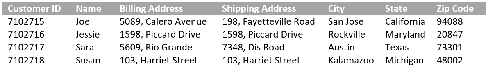

# Uw eerste adaptieve formulier {#do-not-publish-create-your-first-adaptive-form} maken

## Inleiding {#introduction}

Bent u op zoek naar een mobiele **formulierervaring** die het inschrijven vereenvoudigt, de betrokkenheid verhoogt en de doorlooptijd verkort, **adaptieve formulieren** is een perfecte oplossing voor u. Adaptieve formulieren bieden een mobiele, automatiserings- en analysevriendelijke ervaring voor formulieren. U kunt eenvoudig formulieren maken die responsief en interactief van aard zijn, geautomatiseerde processen gebruiken om beheertaken en repetitieve taken te beperken en gegevensanalyses gebruiken om de ervaring die klanten met uw formulieren hebben, te verbeteren en aan te passen.

Deze zelfstudie biedt een end-to-end framework voor het maken van een adaptief formulier. De zelfstudie is ingedeeld in een gebruikscase en meerdere hulplijnen. Met elke handleiding kunt u nieuwe functies toevoegen aan het aangepaste formulier dat in deze zelfstudie wordt gemaakt. U hebt een werkend adaptief formulier na elke hulplijn. De handleiding voor het maken van een adaptief formulier is beschikbaar. Volgende hulplijnen zijn binnenkort beschikbaar. Aan het einde van deze zelfstudie kunt u het volgende doen:

* Maak een adaptief formulier- en formuliergegevensmodel.
* Stijl uw adaptieve formulier.
* Gebruik de adaptieve redacteur van de vormregel om bedrijfsregels te bouwen.
* Test en publiceer een adaptief formulier.

De reis begint met het leren van het gebruiksgeval:

Een website biedt een reeks producten aan voor verschillende klanten. Klanten bladeren door de portal, selecteren en bestellen de producten. Elke klant maakt een account en geeft verzendadres en factuuradres. Een bestaande klant, Sara Rose, probeert haar verzendadres toe te voegen aan de website. De website bevat een onlineformulier voor het toevoegen en bijwerken van verzendadressen.

De website wordt uitgevoerd op Adobe Experience Manager (AEM) en gebruikt AEM Forms voor het vastleggen en verwerken van gegevens. Het formulier voor het toevoegen en bijwerken van adressen is een adaptief formulier. De website slaat klantgegevens in een database op. Zij gebruiken de adrestoevoeging en werken vorm bij om beschikbare adressen terug te winnen en te tonen. Ze gebruiken ook het aangepaste formulier om bijgewerkte en nieuwe adressen te accepteren.

### Vereiste {#prerequisite}

* Stel een AEM auteur-instantie in.
* Installeer [AEM Forms add-on](/help/forms/using/installing-configuring-aem-forms-osgi.md) op auteurinstantie.
* Vraag het JAR-bestand (JDBC-databasestuurprogramma) aan bij de databaseprovider. De voorbeelden in het leerprogramma zijn gebaseerd op gegevensbestand MySQL en gebruiken Oracle [MySQL JDBC gegevensbestandbestuurder](https://dev.mysql.com/downloads/connector/j/5.1.html).

* Stel een database in die klantgegevens bevat met de onderstaande velden. Een database is niet essentieel om een adaptief formulier te maken. Deze zelfstudie gebruikt een database voor het weergeven van het formuliergegevensmodel en de persistentiemogelijkheden van AEM Forms.

## Stap 1: Een adaptief formulier maken {#step-create-an-adaptive-form}

Adaptieve formulieren zijn nieuwe generatie, boeiend, responsief, dynamisch en adaptief van aard. Met behulp van adaptieve formulieren kunt u persoonlijke en doelgerichte ervaringen bieden. AEM Forms beschikt over een WYSIWYG-editor voor slepen en neerzetten waarmee u adaptieve formulieren kunt maken. Zie [Inleiding tot het ontwerpen van adaptieve formulieren](/help/forms/using/introduction-forms-authoring.md) voor meer informatie over adaptieve formulieren.

Doelstellingen:

* Een adaptief formulier maken waarmee een klant een verzendadres kan toevoegen
* Indelingsvelden van een adaptief formulier voor het weergeven en accepteren van informatie van een klant
* Verzendactie maken om een e-mail met formulierinhoud te verzenden
* Een adaptief formulier voorvertonen en verzenden

   

## Stap 2: Formuliergegevensmodel {#step-create-form-data-model} maken

Met een formuliergegevensmodel kunt u een adaptief formulier aansluiten op verschillende gegevensbronnen. Bijvoorbeeld AEM gebruikersprofiel, RESTful Webdiensten, op SOAP-Gebaseerde Webdiensten, OData diensten, en relationele gegevensbestanden. Een gegevensmodel van de Vorm is een verenigd schema van de gegevensvertegenwoordiging van bedrijfsentiteiten en de diensten beschikbaar in verbonden gegevensbronnen. U kunt het formuliergegevensmodel met een adaptief formulier gebruiken om gegevens op te halen, bij te werken, te verwijderen en aan verbonden gegevensbronnen toe te voegen.

Doelstellingen:

* De database-instantie van de website (MySQL-database) configureren als gegevensbronnen
* Maak het formuliergegevensmodel met MySQL-database als gegevensbron
* Gegevensmodelobjecten toevoegen aan formuliergegevensmodel
* Lezen- en schrijfservices configureren voor het gegevensmodel van het formulier
* Formuliergegevensmodel testen en geconfigureerde services met testgegevens

   

## Stap 3: Regels toepassen op aangepaste formuliervelden {#step-apply-rules-to-adaptive-form-fields}

Met adaptieve formulieren kunt u in een editor regels schrijven voor adaptieve formulierobjecten. Met deze regels worden acties gedefinieerd die op formulierobjecten worden geactiveerd op basis van vooraf ingestelde voorwaarden, gebruikersinvoer en gebruikersacties op het formulier. Hierdoor wordt de nauwkeurigheid en snelheid van het invullen van formulieren gegarandeerd.

Doelstellingen:

* Regels maken en toepassen op adaptieve formuliervelden
* Regels gebruiken om services voor formuliergegevensmodellen te activeren voor het bijwerken van gegevens naar een database

## Stap 4: Stijl uw adaptieve formulier {#step-style-your-adaptive-form}

Aangepaste formulieren bieden thema&#39;s en een [editor](/help/forms/using/themes.md) om thema&#39;s voor de aangepaste formulieren te maken. Een thema bevat opmaakgegevens voor componenten en deelvensters en u kunt een thema in verschillende formulieren opnieuw gebruiken. Stijlen omvatten eigenschappen zoals achtergrondkleuren, statuskleuren, transparantie, uitlijning en grootte. Wanneer u het thema toepast op het formulier, weerspiegelt de opgegeven stijl de overeenkomstige componenten van het formulier. Adaptieve formulieren ondersteunen ook inline opmaak voor stijlen die specifiek zijn voor een formulier.

Doelstellingen:

* Een thema uit het vak toepassen op een adaptief formulier
* Een thema maken voor een adaptief formulier met de themaeditor
* Weblettertypen gebruiken in een aangepast thema

   

## Stap 5: Het adaptieve formulier {#step-test-your-adaptive-form} testen

Adaptieve formulieren zijn een integraal onderdeel van de interactie van uw klant. Het is belangrijk dat u de aangepaste formulieren test met elke wijziging die u erin aanbrengt. Het testen van elk veld van een formulier is vervelend. AEM Forms beschikt over een SDK (Calvin SDK) om het testen van adaptieve formulieren te automatiseren. Met Calvin kunt u het testen van uw adaptieve formulieren automatiseren in de webbrowser.

Doelstellingen:

* Calvin SDK installeren
* Testsuite en testcase maken voor het wijzigen van adresformulier

Zie [Werken met geautomatiseerde tests met AEM adaptieve vorm](/help/forms/using/calvin.md) voor meer informatie over SDK.

## Stap 6: Het aangepaste formulier {#step-publish-your-adaptive-form} publiceren

U kunt adaptieve formulieren publiceren als een zelfstandig formulier (toepassing op één pagina), opnemen in AEM [sitepagina](/help/forms/using/embed-adaptive-form-aem-sites.md) of op een AEM site aanbieden met [Forms Portal](/help/forms/using/introduction-publishing-forms.md).

Doelstellingen:

* Het adaptieve formulier publiceren als een toepassing van één pagina

