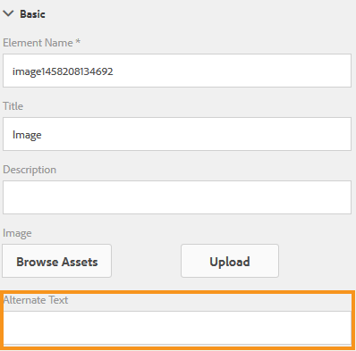

# Toegankelijke aangepaste formulieren {#creating-accessible-adaptive-forms} maken

## Inleiding {#introduction}

Een toegankelijk formulier is een formulier dat iedereen kan gebruiken, inclusief gebruikers met speciale behoeften. Adobe Experience Manager (AEM) bevat een aantal functies en mogelijkheden die de bruikbaarheid van adaptieve formulieren voor gebruikers met verschillende mogelijkheden verbeteren. De oplossing helpt ook formulierauteurs bij het maken van toegankelijke adaptieve formulieren.

Door toegankelijkheid in adaptieve formulieren te creëren, kan niet alleen een zo breed mogelijk publiek voor inhoud worden bereikt, maar is het ook een vereiste bij het verstrekken van documenten in geografische gebieden waar naleving van toegankelijkheidsnormen verplicht is. AEM Forms Help-formulierontwikkelaars voldoen aan de toegankelijkheidsstandaarden.

Tijdens het ontwerpen van een adaptief formulier moet de auteur de volgende punten in overweging nemen om een toegankelijke adaptieve vorm te maken:

* Geef juiste labels voor formulierbesturingselementen
* Verstrek tekstequivalenten voor beelden
* Geef voldoende kleurcontrast op
* Zorg ervoor dat formulierbesturingselementen via het toetsenbord toegankelijk zijn

## Geef juiste labels voor formulierbesturingselementen {#provide-proper-labels-for-form-controls}

Met het label of de titel van een component wordt aangegeven wat de formuliercomponent vertegenwoordigt. De tekst Voornaam geeft bijvoorbeeld aan dat gebruikers hun voornaam in een tekstveld moeten invoeren. Om door schermlezers toegankelijk te zijn, wordt het label programmatisch gekoppeld aan een formuliercomponent. Alternatief, wordt de vormcontrole gevormd met extra toegankelijkheidsinformatie.

Het label dat door schermlezers wordt waargenomen, hoeft niet noodzakelijkerwijs hetzelfde te zijn als het visuele bijschrift. In sommige gevallen, kunt u specifieker over het doel van de controle willen zijn. Voor elk veldobject in een formulier kunnen de toegankelijkheidsopties worden gebruikt om op te geven wat de schermlezer aankondigt om het specifieke formulierveld te identificeren.

Voer de volgende stappen uit om de optie Toegankelijkheid te gebruiken:

1. Selecteer een component en tik .
1. Klik **Toegankelijkheid** in de zijbalk om de gewenste toegankelijkheidsoptie te kiezen.

### Toegankelijkheidsopties in formuliercomponenten {#accessibility-options-in-form-components}

**Aangepaste** TextForm-auteurs geven de inhoud op in het tekstveld Aangepaste toegankelijkheidsoptie. De ondersteunende hulpmiddelen, zoals schermlezers, gebruiken deze aangepaste tekst. Het gebruiken van het plaatsen van de Titel is de beste optie in een meerderheid van de scenario&#39;s. U kunt bijvoorbeeld alleen aangepaste schermtekst maken als Titel of korte beschrijving niet mogelijk is.

**Korte** beschrijvingVoor de meeste componenten wordt de korte beschrijving weergegeven wanneer de gebruiker de aanwijzer op de component plaatst. U kunt deze optie instellen in het veld Korte beschrijving onder de optie Help-inhoud.

**** TitleGebruik deze optie als u wilt dat AEM Forms het visuele label dat aan het formulierveld is gekoppeld, als schermlezertekst gebruikt.

**** NameU kunt een waarde opgeven in het veld Naam van het tabblad Binding. De naam mag geen spaties bevatten.

**Als u** Geen selecteert, heeft het formulierobject geen naam in het gepubliceerde formulier. Geen is een aanbevolen instelling voor formulierbesturingselementen.

>[!NOTE]
>
>Keuzerondje en selectievakje kunnen slechts twee toegankelijkheidsopties hebben, namelijk Aangepaste tekst en Titel.

>[!NOTE]
>
>Voor op XFA gebaseerde adaptieve formulieren wordt de toegankelijkheidsoptie overgenomen van de toegankelijkheidsopties die zijn ingesteld in de XDP. Knopinfo van XDP wordt toegewezen aan Korte beschrijving en Bijschrift wordt toegewezen aan Titel. De andere opties werken zoals is.

## Tekstequivalenten opgeven voor afbeeldingen {#provide-text-equivalents-for-images}

Afbeeldingen kunnen sommige gebruikers helpen het begrip te verbeteren. Voor gebruikers die schermlezers gebruiken, verminderen afbeeldingen echter de toegankelijkheid van het formulier. Als u ervoor kiest om afbeeldingen te gebruiken, geef dan tekstbeschrijvingen op voor alle afbeeldingen.

Zorg ervoor dat in de tekst het object en het doel ervan in het formulier worden beschreven. Een schermlezer leest deze alternatieve tekst wanneer een afbeelding wordt aangetroffen. Voor een afbeelding moet altijd een alternatieve tekst worden opgegeven.

Selecteer een afbeeldingscomponent en tik op . Geef in het zijpaneel onder Eigenschappen alternatieve tekst op voor een afbeelding.

## Geef voldoende kleurcontrast {#provide-sufficient-color-contrast}

Bij het ontwerpen van toegankelijkheid moet u rekening houden met aanvullende richtlijnen voor kleurgebruik. Auteurs van formulieren kunnen kleuren gebruiken om de weergave van formulieren te verbeteren door verschillende formuliercomponenten te markeren. Onjuist gebruik van kleur kan een formulier echter moeilijk of onmogelijk leesbaar maken voor mensen met verschillende mogelijkheden.

Gebruikers met een visuele handicap vertrouwen op een hoog contrast tussen tekst en de achtergrond voor het lezen van digitale inhoud. Zonder voldoende contrast kan een formulier moeilijk, zo niet onmogelijk, leesbaar worden voor sommige gebruikers.

U wordt aangeraden het standaardfont en de standaardachtergrondkleuren te gebruiken, namelijk de zwarte inhoud op een witte achtergrond. Als u de standaardkleuren wijzigt, kiest u een donkere voorgrondkleur op een lichte achtergrondkleur of andersom.

Zie [Aangepaste thema&#39;s maken voor adaptieve formulieren](/help/forms/using/creating-custom-adaptive-form-themes.md) voor meer informatie over het wijzigen van het kleurcontrast en het thema voor adaptieve formulieren.

## Zorg ervoor dat formulierbesturingselementen via het toetsenbord toegankelijk zijn {#ensure-that-form-controls-are-keyboard-accessible}

Een toegankelijk formulier kan volledig worden ingevuld met alleen het toetsenbord of een vergelijkbaar invoerapparaat. Gebruikers met een beperkte mobiliteit of een visuele handicap hebben wellicht geen andere keuze dan het toetsenbord te gebruiken en veel gebruikers die een muis kunnen gebruiken, geven de voorkeur aan invoer via het toetsenbord. Door de verschillende invoermethoden toe te staan, maakt u niet alleen toegankelijke formulieren, maar ook formulieren die beter zijn afgestemd op de voorkeuren van alle gebruikers.

De volgende sneltoetsen zijn beschikbaar in AEM Forms.

| Actie | Sneltoets |
|---|---|
| De cursor door een formulier verplaatsen | Tab |
| De cursor achterwaarts door een formulier verplaatsen | Shift+Tab |
| Naar volgend deelvenster gaan | Alt+Pijl-rechts |
| Naar het vorige deelvenster gaan | Alt+Pijl-links |
| De gevulde gegevens in een formulier opnieuw instellen | Alt+R |
| Een formulier verzenden | Alt+Z | configuring-watched-folder-endpoints.md |