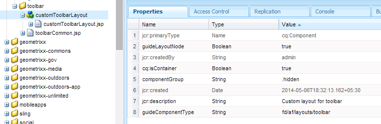

# Aangepaste werkbalkindeling maken {#creating-custom-toolbar-layout}

## Werkbalklay-outs {#layout}

Wanneer u een adaptief formulier maakt, kunt u een werkbalklay-out voor het formulier opgeven. De werkbalkindeling definieert de opdrachten en de indeling van de werkbalk op het formulier.

De indeling van werkbalken is sterk afhankelijk van verwerking op de client door complexe JavaScript- en CSS-code. Het organiseren en optimaliseren van het gebruik van deze code kan een ingewikkeld probleem zijn. Om dit probleem te verhelpen, biedt AEM Client-side bibliotheekmappen, waarmee u uw code aan de clientzijde in de opslagplaats kunt opslaan, deze in categorieën kunt ordenen en kunt bepalen wanneer en hoe elke categorie code aan de client moet worden aangeboden. Het bibliotheeksysteem aan de clientzijde zorgt ervoor dat de juiste koppelingen in de uiteindelijke webpagina worden gemaakt om de juiste code te laden. Voor gedetailleerde informatie, zie [hoe de cliënt-zijbibliotheken in AEM werken.](/help/sites-developing/clientlibs.md)

**Afbeelding:** *Voorbeeldindeling van de werkbalk*

Aangepaste formulieren bieden een set out-of-the-box-indelingen:

**Cijfer:** *Werkbalklay-outs beschikbaar buiten de box*

Bovendien kunt u een aangepaste werkbalklay-out maken.

De volgende procedure beschrijft de stappen voor het maken van een aangepaste werkbalk met drie acties op de werkbalk en de andere acties in een vervolgkeuzelijst op de werkbalk.

Het bijgevoegde inhoudspakket bevat de volledige hieronder beschreven code. Nadat u het inhoudspakket hebt geïnstalleerd, opent u `/content/forms/af/CustomLayoutDemo.html` de aangepaste demo voor de werkbalkindeling.

CustomToolbarLayoutDemo.zip

[Bestandsdemo](assets/customtoolbarlayoutdemo.zip)ophalen, aangepaste werkbalkindeling

## Een aangepaste werkbalklay-out maken {#layout-1}

1. Maak een map om uw aangepaste werkbalklay-outs te behouden. Bijvoorbeeld:

   `/apps/customlayout/toolbar`.

   Als u een aangepaste indeling wilt maken, kunt u een van de in de volgende map beschikbare out-of-the-box werkbalklay-outs gebruiken (en aanpassen):

   `/libs/fd/af/layouts/toolbar`

   Kopieer bijvoorbeeld het `mobileFixedToolbarLayout` knooppunt van de `/libs/fd/af/layouts/toolbar` map naar de `/apps/customlayout/toolbar` map.

   Kopieer ook de toolbarCommon.jsp naar de `/apps/customlayout/toolbar` map.

   >[!NOTE]
   >
   >De map die u maakt om de aangepaste lay-outs te behouden, wordt veel met de `apps` map gemaakt.

1. Wijzig de naam van het gekopieerde knooppunt `mobileFixedToolbarLayout`in `customToolbarLayout.`

   Geef ook een relevante beschrijving voor het knooppunt op. Wijzig bijvoorbeeld jcr:description of the node in **Custom layout for toolbar**.

   De `guideComponentType` eigenschap van het knooppunt bepaalt het lay-outtype. In dit geval is het indelingstype een werkbalk en wordt het daarom weergegeven in het keuzemenu voor de werkbalkindeling.

   

   Een knooppunt met relevante beschrijving

   De nieuwe aangepaste werkbalkindeling wordt weergegeven in het dialoogvenster **Adaptieve werkbalk** .

   

   Lijst met beschikbare werkbalkindelingen

   >[!NOTE]
   >
   >De beschrijving die u in de vorige stap hebt bijgewerkt, wordt weergegeven in de vervolgkeuzelijst Indeling.

1. Selecteer deze aangepaste werkbalkindeling en klik op OK.

   Voeg clientlib (javascript en css) in de `/etc/customlayout` knoop toe en neem de verwijzing van clientlib in `customToolbarLayout.jsp`.

   

   Het pad van het bestand customToolbarLayout.css

   Voorbeeld `customToolbarLayout.jsp`:

   ```php
   <%@include file="/libs/fd/af/components/guidesglobal.jsp" %>
   <cq:includeClientLib categories="customtoolbarlayout" />
   <c:if test="${isEditMode}">
           <cq:includeClientLib categories="customtoolbarlayoutauthor" />
   </c:if>
   <div class="guidetoolbar mobileToolbar mobilecustomToolbar" data-guide-position-class="guide-element-hide">
       <div data-guide-scroll-indicator="true"></div>            
       <%@include file="../toolbarCommon.jsp" %>
   </div>
   ```

   >[!NOTE]
   >
   >Voeg de klasse guidetoolbar voor de lay-out toe. De stijl voor de werkbalk buiten het vak wordt gedefinieerd ten opzichte van de klasse guidetoolbar.

   Voorbeeld `toolBarCommon.jsp`:

   ```php
   <%@taglib prefix="fn" uri="https://java.sun.com/jsp/jstl/functions"%>
   <%--------------------  
   This code iterates over all the tool bar items using the guideToolbar bean.
   If the number of toolbar items are more than 3, then we create a dropdown menu using bootstrap for other actions present in the toolbar.
   In both desktop and mobile devices, the layout is different.    
   ---------------------------------%>
   
   <c:forEach items="${guideToolbar.items}" var="toolbarItem" varStatus="loop">
       <c:choose>
         <c:when test="${loop.index gt 2}">
      <c:choose>
       <c:when test="${loop.index eq 3}">
                     <div class="btn-group dropdown">   
                       <button type="button" class="btn btn-primary dropdown-toggle label" data-toggle="dropdown">Actions <span class="caret"></span></button>
                       <button type="button" class="btn btn-primary dropdown-toggle icon" data-toggle="dropdown"><span class="glyphicon glyphicon-th-list"></span></button>
             <ul class="dropdown-menu" role="menu">
                           <li>
                               <div id="${toolbarItem.id}_guide-item">
                                 <sling:include path="${toolbarItem.path}" resourceType="${toolbarItem.resourceType}"/>
                              </div>
                           </li>
                           <c:if test="${loop.index eq (fn:length(guideToolbar.items)-1)}">
                                </ul>
                                </div>
                           </c:if>
       </c:when>
       <c:when test="${loop.index eq (fn:length(guideToolbar.items)-1)}">
                          <li>
                                     <div id="${toolbarItem.id}_guide-item">
                                         <sling:include path="${toolbarItem.path}" resourceType="${toolbarItem.resourceType}"/>
                                     </div>
                           </li>
                       </ul>
                     </div>
   
       </c:when>
       <c:otherwise>
         <li>
          <div id="${toolbarItem.id}_guide-item">
           <sling:include path="${toolbarItem.path}" resourceType="${toolbarItem.resourceType}"/>
          </div>
         </li>
       </c:otherwise>
      </c:choose>
         </c:when>
         <c:otherwise>         
     <div id="${toolbarItem.id}_guide-item">
           <sling:include path="${toolbarItem.path}" resourceType="${toolbarItem.resourceType}"/>
        </div>
         </c:otherwise>
    </c:choose>   
   </c:forEach>
   ```

   De CSS in het clientlib-knooppunt:

   ```css
   .mobilecustomToolbar .dropdown {
       display: inline-block;    
   }
   
   .mobilecustomToolbar .dropdown {
       float: right;   
   }
   
   .mobilecustomToolbar .dropdown > button {
      padding: 6px 12px;  
   }         
   
   .mobilecustomToolbar .dropdown .guideFieldWidget, .mobilecustomToolbar .dropdown .guideFieldWidget button {
       width: 100%;   
   }         
   
   .mobilecustomToolbar .dropdown .caret{
       border-bottom: 6px solid;
       border-right: 6px solid transparent;
       border-left: 6px solid transparent;
    border-top: transparent;                                     
   }
   
   .mobilecustomToolbar .dropdown-menu{
    top: auto;
    bottom: 100%;                            
   }
   
   .mobilecustomToolbar .btn-group {            
    vertical-align: super;            
   }
   
   .mobilecustomToolbar .glyphicon {
    font-size: 24px;
   }
   
   @media (max-width: 767px){                                       
   
    .mobilecustomToolbar .dropdown .guideButton .iconButton-icon {
      display: none;
       }  
   
       .mobilecustomToolbar .dropdown .guideButton .iconButton-label {
      display: inline-block;
       } 
   
       .mobilecustomToolbar .dropdown .guideButton button {
      background-color: #013853;
       }
   
    .mobilecustomToolbar .btn-group {            
     vertical-align: top;            
    }    
   
   }
   ```

>[!NOTE]
>
>De beschrijving die u in de vorige stap hebt bijgewerkt, wordt weergegeven in de vervolgkeuzelijst Indeling.

**Aangepaste layout:** *Bureaubladweergave van de werkbalk met de aangepaste layout*
