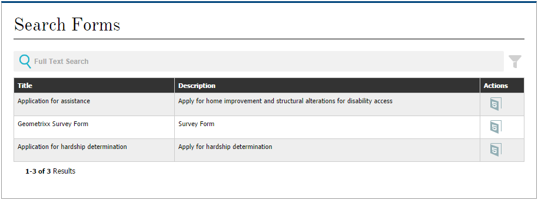

# Een pagina {#creating-a-forms-portal-page} voor een formulierportal maken

Met Forms Portal-componenten kunnen webontwikkelaars componenten gebruiken voor het maken en aanpassen van een formulierportal op websites die zijn ontworpen met Adobe Experience Manager (AEM). Zie [Inleiding tot het publiceren van formulieren op een portal](/help/forms/using/introduction-publishing-forms.md) voor een snel overzicht van het formulierportaal.

## Vereisten {#prerequisites}

Forms Portal-componenten zijn niet standaard beschikbaar voor gebruik. Zorg ervoor dat de volgende categorieën van componenten van het portal Formulieren zijn ingeschakeld zoals beschreven in [Inschakelen van componenten van het portal Formulieren](/help/forms/using/enabling-forms-portal-components.md).

**Document** ServicesIncludes Search &amp; Lister, Link, and Concepts and Submissions components.

**Voorspelden** voor documentservices zijn Datumvoorspelling, Voorspeld voor volledige tekst, Voorspelde eigenschappen en Voorspelde componenten voor labels. Deze componenten worden gebruikt om onderzoek in het Onderzoek &amp; component van de Registratie te vormen.

Zodra zij op een AEM plaatspagina worden toegelaten, zijn deze componentencategorieën beschikbaar voor gebruik in componentenbrowser.

**componentcategorieën browserFigure:** *Forms-portalcomponentcategorieën*

## Onderdeel {#search-amp-lister-component} zoeken

De component Search &amp; Lister, beschikbaar onder de componentencategorie van de Diensten van het Document, wordt gebruikt om vormen op een pagina een lijst te maken en onderzoek op de vermelde vormen uit te voeren. De component bevat twee deelvensters:

* Het deelvenster Lijst waarin de formulieren worden weergegeven.
* Het paneel van het onderzoek waar u de onderzoeksfunctionaliteit toevoegt.

U kunt de component Search &amp; Lister van de de componentencategorie van de Diensten van het Document in componentenbrowser op de pagina slepen. Wanneer de component wordt toegevoegd, ziet deze er ongeveer als volgt uit.

**paginaAfbeelding:Component** *zoeken en opslaan in een pagina met rasterlay-out*

### Lijstvenster {#list-pane}

Het deelvenster Lijst is een gebied waarin uw formulieren worden weergegeven. De component Zoeken en register bevat verschillende configuratieopties waarmee u de weergave van formulieren in het deelvenster Lijst kunt bepalen.

Tik op de component Search and Lister en tik op  om het deelvenster Lijst te configureren. Het dialoogvenster **[!UICONTROL Edit Component]** wordt geopend.

**bewerkingsmodusFiguur:deelvenster** *Lijst in bewerkingsmodus*

Het dialoogvenster **[!UICONTROL Edit]** bevat verschillende tabbladen met configuratieopties die in de onderstaande tabel worden beschreven. Tik **[!UICONTROL OK]** om de configuratie op te slaan wanneer u klaar bent.

<table> 
 <tbody> 
  <tr> 
   <th>Tab</th> 
   <th>Configuratie</th> 
   <th>Beschrijving</th> 
  </tr> 
  <tr> 
   <td><strong>Elementmappen</strong></td> 
   <td>Item toevoegen</td> 
   <td>Hiermee configureert u de mappen waarin elementen worden geüpload met de gebruikersinterface van AEM Forms. Standaard worden alle geüploade elementen weergegeven. Zie <a href="/help/forms/using/introduction-managing-forms.md" target="_blank">Inleiding tot het beheren van formulieren</a> voor meer informatie over de gebruikersinterface van AEM Forms.</td> 
  </tr> 
  <tr> 
   <td>
<strong>Weergave</strong>
 </td> 
   <td>Titeltekst</td> 
   <td>Titel voor de component Search &amp; Lister. De standaardtitel is <strong>Forms Portal.</strong></td> 
  </tr> 
  <tr> 
   <td> </td> 
   <td>Lay-outsjabloon</td> 
   <td>Lay-out van de elementen. </td> 
  </tr> 
  <tr> 
   <td> </td> 
   <td>Geavanceerd zoeken uitschakelen</td> 
   <td>Als deze optie is ingeschakeld, wordt het geavanceerde zoekpictogram verborgen.</td> 
  </tr> 
  <tr> 
   <td> </td> 
   <td>Tekst zoeken uitschakelen</td> 
   <td>Als deze optie is ingeschakeld, wordt de zoekbalk met volledige tekst verborgen.</td> 
  </tr> 
  <tr> 
   <td><strong>Resultaat</strong></td> 
   <td>Aantal resultaten per pagina</td> 
   <td>Hiermee configureert u het maximumaantal formulieren dat u op een pagina wilt weergeven.</td> 
  </tr> 
  <tr> 
   <td> </td> 
   <td>Resultaattekst</td> 
   <td>
Vormt de resultaattekst (bijvoorbeeld, 1-12 van 601 <strong>Results</strong>). De standaardwaarde is <strong>Results</strong>.
 
Als u bijvoorbeeld <strong>Forms </strong>opgeeft in dit veld en er in totaal 601 formulieren zijn, verandert de resultaattekst in 1-12 van 601 <strong>Forms.</strong>
 </td> 
  </tr> 
  <tr> 
   <td> </td> 
   <td>Paginatekst</td> 
   <td>
Vormt de paginatekst (bijvoorbeeld <strong>Pagina </strong>1 van 51). De standaardwaarde is <strong>Pagina</strong>.
 
Als u bijvoorbeeld <strong>Toepassingsformulier </strong>opgeeft in dit veld en er 51 pagina's zijn, verandert de paginatekst in <strong>Toepassingsformulier </strong>1 van 51.
 </td> 
  </tr> 
  <tr> 
   <td> </td> 
   <td>Van tekst</td> 
   <td>
Vervangt het woord <strong>van</strong> door de opgegeven tekst (pagina 1 <strong>van </strong>51). De standaardwaarde is <strong>of</strong>.
 
Als u bijvoorbeeld <strong>van </strong>in dit veld opgeeft, verandert de tekst in Pagina 1 <strong>van </strong>51.
 </td> 
  </tr> 
  <tr> 
   <td><strong>Formulierkoppeling</strong></td> 
   <td>Rendertype</td> 
   <td>Bepaalt het overzicht met formulieren op basis van het opgegeven rendertype. De beschikbare opties zijn PDF en HTML. Als u bijvoorbeeld alleen HTML selecteert als rendertype, worden de PDF forms uitgefilterd.</td> 
  </tr> 
  <tr> 
   <td> </td> 
   <td>HTML-profiel</td> 
   <td>Configureert het HTML-profiel dat voor rendering moet worden gebruikt. Alle beschikbare profielen worden vermeld in de vervolgkeuzelijst.</td> 
  </tr> 
  <tr> 
   <td> </td> 
   <td>URL verzenden</td> 
   <td>
Vormt een servlet waar de vormgegevens worden voorgelegd.
 
<strong>Opmerking:URL </strong> <em>verzenden voor een formulier kan op verschillende plaatsen worden opgegeven en de prioriteitsvolgorde is als volgt:</em>
 
    <ol> 
     <li><em>VerzendURL die is ingesloten in het formulier (in de knop Verzenden) heeft de hoogste prioriteit.</em></li> 
     <li><em>VerzendURL die wordt vermeld in de gebruikersinterface van AEM Forms heeft de op een na hoogste prioriteit.</em></li> 
     <li><em>De laagste prioriteit voor het verzenden van een URL die in het formulierportaal wordt vermeld.</em></li> 
    </ol> </td> 
  </tr> 
  <tr> 
   <td> </td> 
   <td>Knopinfo voor HTML-renderactie</td> 
   <td>Vormt de tekst voor de knopinfo, die wordt weergegeven wanneer de aanwijzer op  (het pictogram HTML5) wordt geplaatst.</td> 
  </tr> 
  <tr> 
   <td> </td> 
   <td>Knopinfo voor PDF-renderactie</td> 
   <td>Hiermee configureert u de tekst voor de knopinfo, die wordt weergegeven wanneer u de aanwijzer op  (het PDF-pictogram) plaatst.</td> 
  </tr> 
  <tr> 
   <td><strong>Stijl</strong></td> 
   <td>Stijltype</td> 
   <td>Hiermee kunt u <strong>Geen stijl, Standaardstijl</strong> of <strong>Aangepaste stijl </strong>opgeven voor het weergeven van de formulieren.</td> 
  </tr> 
  <tr> 
   <td> </td> 
   <td>Pad aangepaste stijl</td> 
   <td>Als u Aangepast hebt geselecteerd als Stijltype, bladert u naar het pad naar de aangepaste CSS, anders selecteert u Standaard.</td> 
  </tr> 
 </tbody> 
</table>

### Deelvenster Zoeken {#search-pane}

In het deelvenster Zoeken kunt u de componenten Datumvoorspelling, Volledig voorspelling van tekst, Voorspelling van eigenschappen en Voorspelling van tags toevoegen uit de categorie Voorspelingen documentservices in AEM Sidetrap. Met deze componenten wordt de zoekfunctionaliteit geïmplementeerd die gebruikers kunnen gebruiken om te zoeken op de weergegeven formulieren.

**Tip:** *u kunt de lijst met formulieren die op uw formulierportal worden weergegeven, instellen op basis van vooraf ingestelde criteria en de zoekfunctionaliteit voor eindgebruikers verbergen. Als u de lijst met formulieren wilt beheren, gebruikt u de componenten Predicate om zoekfilters toe te passen. U kunt ook de standaardfilterwaarden opgeven en de zoekopdracht uitschakelen op het tabblad Weergave van het dialoogvenster Component bewerken.*

**voorspelling van tags:** *Zoeken in deelvenster met datum, volledige tekst, eigenschappen en voorspelling van tags*

#### Datumvoorspelling {#date-predicate}

Met de component Datumvoorspelling kunt u zoeken op de weergegeven formulieren die tijdens een bepaalde periode zijn gewijzigd.

De component Date Predicate configureren:

1. Tik op de component en tik vervolgens op . Het dialoogvenster Bewerken wordt geopend.
1. Geef het volgende op:

   * **[!UICONTROL Type:]** De enige beschikbare optie is  **[!UICONTROL Last Modified Date]**.
   * **[!UICONTROL Text:]** Label of bijschrift voor de component Date Predicate. De standaardwaarde is **[!UICONTROL Last Modified Date]**.
   * **[!UICONTROL Start Date Label:]** Label of bijschrift van begindatumveld.
   * **[!UICONTROL End Date Label:]** Label of bijschrift voor einddatumveld.
   * **[!UICONTROL Hide:]** Standaarddatumfilter toepassen om formulieren weer te geven.

1. Tik op **[!UICONTROL OK]**.

#### Voorspelling van volledige tekst {#full-text-predicate}

De component Full Text Predicate implementeert het zoeken naar volledige tekst op formuliergegevens, zoals naam en beschrijving. Gebruikers kunnen elke tekenreeks doorzoeken om formulieren te retourneren die de tekst in hun naam of beschrijving bevatten.

De component Full Text Predicate configureren:

1. Tik op de component en tik vervolgens op . Het dialoogvenster Bewerken wordt geopend.
1. Geef de titel op in het veld **[!UICONTROL Main Title]**.
1. Tik op **[!UICONTROL Ok]**.

#### Voorspelling eigenschappen {#properties-predicate}

De component Properties Predicate implementeert het zoeken naar formulieren op basis van formuliereigenschappen, zoals titel, auteur en beschrijving.

De component Properties Predicate configureren:

1. Tik op de component en tik vervolgens op . De **[!UICONTROL Edit dialog]** wordt geopend.
1. Geef op het tabblad **[!UICONTROL General]** het zoeklabel op. De standaardwaarde is **[!UICONTROL Properties]**.

1. Tik op het tabblad **[!UICONTROL Options]** op **[!UICONTROL Add Item]**.
1. Selecteer een eigenschap in de vervolgkeuzelijst en geef een zoeklabel voor de eigenschap op in het veld onder de vervolgkeuzelijst.
1. Herhaal stap 4 om meer eigenschappen toe te voegen. U kunt ook een standaardfilterwaarde opgeven om formulieren weer te geven op basis van de opgegeven criteria en de eigenschap verbergen om door eindgebruikers te worden gezocht. Schakel het selectievakje Verbergen voor een eigenschap in en geef de standaardwaarde voor het filter op.

   Als u bijvoorbeeld formulieren met &quot;Reizen&quot; in de titels wilt weergeven, selecteert u Verbergen naast de eigenschap Titel. Geef bovendien het tekstvak Reizen op als standaardfilterwaarde.

1. Tik op **[!UICONTROL OK]**.

#### Voorspelling van labels {#tags-predicate}

De component Voorspelfunctie voor tags implementeert het zoeken naar formulieren op basis van tags die zijn gedefinieerd in Forms Manager.

U configureert als volgt de component Tags voorspellen:

1. Tik op de component en tik vervolgens op . De **[!UICONTROL Edit dialog]** wordt geopend.
1. Tik op de pijl-omlaag naast het veld Codes.
1. Selecteer de juiste tags.
1. Tik op **[!UICONTROL OK]**.

De geselecteerde labels worden samen met de selectievakjes voor selectie weergegeven in het deelvenster Zoeken. Gebruikers kunnen hun zoekopdracht nu beperken op basis van de tags.

## Formulieren weergeven op een pagina {#list-forms-on-a-page-br}

Als u formulieren op een pagina wilt weergeven, voegt u de **[!UICONTROL Search & Lister]**-component aan de pagina toe en configureert u **[!UICONTROL List Pane]**. Als u wilt dat eindgebruikers formulieren met datum, tekst en tags kunnen doorzoeken, voegt u een **[!UICONTROL Search Pane]**-component toe.

Als u een formulier vanaf een willekeurige locatie op de pagina wilt koppelen, gebruikt u de component Koppeling. Zie [Koppelingscomponent insluiten in een pagina](/help/forms/using/embedding-link-component-page.md) voor meer informatie over koppelingscomponent.

Gebruik de component **[!UICONTROL Drafts and Submissions]** om een overzicht te geven van de formulieren in een concept en de formulieren die al zijn verzonden. Zie [Concepten en verzendingen aanpassen](/help/forms/using/draft-submission-component.md) voor meer informatie.

## Apparaatvriendelijkheid van mobiele apparaten {#mobile-device-friendliness}

De component Forms Portal Search &amp; Lister is gebruiksvriendelijk voor mobiele apparaten en past deze dienovereenkomstig aan. Alle drie standaardweergaven: Net-, Kaart- en deelvensteropnieuw indelingen op basis van het apparaat waarin de site wordt geopend, worden geleverd met het feit dat de webpagina ook wordt aangepast. Het eenvoudige feit is dat Zoeken &amp; register alleen een onderdeel is en geen stijl op paginaniveau reguleert.

In de volgende afbeelding ziet u de component Search &amp; Lister wanneer deze wordt geopend op een mobiel apparaat:

**component Search and ListerFigure:component** *Search &amp; Lister*

## Een pagina {#customizing-a-forms-portal-page-br} voor een portal voor formulieren aanpassen

U kunt een pagina voor een portal Formulieren aanpassen om de pagina een andere weergave te geven. U kunt ook metagegevens toevoegen om de zoekervaring te verbeteren, de lay-out van de pagina te wijzigen en aangepaste CSS-stijlen toe te voegen. Zie [Sjablonen aanpassen voor Forms Portal Components](/help/forms/using/customizing-templates-forms-portal-components.md) voor meer informatie.

Met de gebruikersinterface van AEM Forms kunt u aangepaste metagegevens toevoegen aan formulieren. Aangepaste metagegevens zijn handig voor het aanbieden van lijsten en het zoeken in formulieren voor eindgebruikers. Zie [Sjablonen aanpassen voor Forms Portal Components](/help/forms/using/customizing-templates-forms-portal-components.md) voor meer informatie over aangepaste metagegevens.

Het portal Formulieren biedt renderacties. U kunt de portal Formulieren aanpassen om meer acties toe te voegen. Zie [Aangepaste handeling toevoegen aan formulierlisteritems voor gedetailleerde informatie.](/help/forms/using/add-custom-action-form-lister.md)
