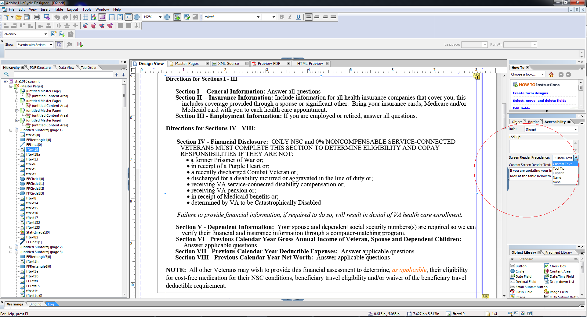

# Toegankelijke HTML5-formulieren ontwerpen {#designing-accessible-html-forms}

>[!CAUTION]
>
>AEM 6.4 heeft het einde van de uitgebreide ondersteuning bereikt en deze documentatie wordt niet meer bijgewerkt. Raadpleeg voor meer informatie onze [technische ondersteuningsperioden](https://helpx.adobe.com/support/programs/eol-matrix.html). Ondersteunde versies zoeken [hier](https://experienceleague.adobe.com/docs/).

HTML5-formulieren maken gebruik van de toegankelijkheidsstandaard van ARIA HTML5 om toegankelijke HTML-formulieren te genereren. Deze formulieren ondersteunen navigatie met tabbladen (behalve Mozilla FireFox) en zijn gecertificeerd voor compatibiliteit met algemene schermlezers. Als u een HTML5-formulier met goede toegankelijkheidsfuncties wilt genereren, ontwerpt u de XFA-formuliersjabloon op basis van enkele [basisrichtlijnen voor ontwerpen](/help/forms/using/best-practices-for-html5-forms.md). De ontwerprichtlijnen omvatten het vormen van de correcte lusjeorde en het verstrekken van de inhoud van de Tekst van de Spreek voor elke vormcontrole. AEM Forms Designer ondersteunt het instellen van deze formulierbesturingskenmerken om een Toegankelijke PDF- en HTML5-vorm te genereren.

*Opmerking:navigatie met tabbladen geldt niet voor beveiligde velden, zoals berekeningsvelden waarin de som van waarden wordt weergegeven. Als u wilt dat de schermlezer de waarde van een beveiligd veld kan lezen, plaatst u een leeg veld Alleen-lezen boven of naast het beveiligde veld. Wijs de waarde van het beveiligde veld toe aan het nieuwe veld Alleen-lezen. De schermlezer of navigatie met tabs kan dit alleen-lezen veld selecteren en dit uitlezen als de waarde van het beveiligde veld.*

AEM Forms Designer bevat een aantal opties voor spraaktekst die aan schermlezers kunnen worden doorgegeven. Voor elk object in een formulier kan de gebruiker een van de volgende instellingen opgeven voor de schermlezertekst:

* Aangepaste schermlezertekst, die kan worden ingesteld met het palet Toegankelijkheid. Auteurs kunnen notities aanbrengen bij de namen van knoppen en velden en bij het doel ervan.
* Knopinfo, die u kunt instellen in het palet Toegankelijkheid.
* Bijschriften voor velden op het formulier.
* Namen van objecten, zoals opgegeven in de optie Naam op het tabblad Binding.

Als er meerdere opties beschikbaar zijn voor een formulierbesturingselement, zoals knopinfo, Reader Tekst en Bijschrift, gebruikt de Reader Scherm slechts een van deze eigenschappen. De standaardvolgorde is Tekst, knopinfo, Bijschrift en Naam van aangepaste Reader voor scherm. U kunt de standaardvolgorde overschrijven met de Reader Scherm **Voorrang** in het palet Toegankelijkheid.
