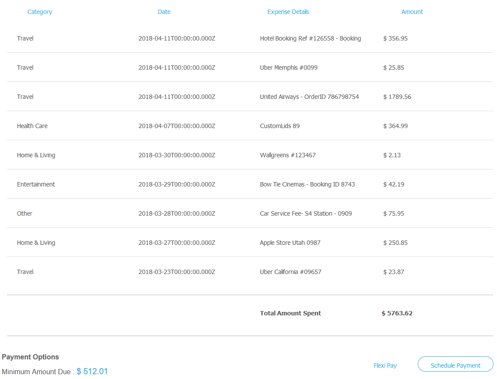

# We.Financiële referentiesite doorlopen {#we-finance-reference-site-walkthrough}

>[!CAUTION]
>
>AEM 6.4 heeft het einde van de uitgebreide ondersteuning bereikt en deze documentatie wordt niet meer bijgewerkt. Raadpleeg voor meer informatie onze [technische ondersteuningsperioden](https://helpx.adobe.com/support/programs/eol-matrix.html). Ondersteunde versies zoeken [hier](https://experienceleague.adobe.com/docs/).

## Voorwaarden {#pre-requisites}

Referentiesites instellen zoals beschreven in [AEM Forms-referentiesites instellen en configureren](/help/forms/using/setup-reference-sites.md).

## We.Financiële referentiescenario&#39;s {#we-finance-reference-site-scenarios}

We.Finance is een toonaangevende organisatie op het gebied van financiële diensten die uitgebreide en gepersonaliseerde financiële oplossingen aanbiedt die voldoen aan de vereisten van diverse klantprofielen. Ze bieden kredietkaarten, woninghypotheken en thuisverzekeringen aan.

Hun doel is om aan bestaande en potentiële klanten op hun aangewezen apparaat te bereiken, de voordelen van hun diensten te verklaren, en hen te helpen zich in hun diensten inschrijven. Bovendien zoeken ze naar meer financiële producten zoals add-on kaarten die klanten interessant kunnen vinden.

Lees verder voor uitgebreide analyses van We.Finance gebruikt cases en begrijp hoe AEM Forms financiële organisaties helpt hun doelstellingen te bereiken. De volgende analyses zijn behandeld:

* [Analyse van creditcardtoepassing](#credit-card-application-walkthrough)
* [Analyse van de hypotheekaanvraag](#home-mortgage-application-walkthrough)
* [Toepassingsanalyse voor Home Mortgauge met Microsoft Dynamics](#home-mortgage-application-walkthrough-with-microsoft-dynamics)
* [Doorloop voor toepassing van thuisverzekering](#home-insurance-application-walkthrough)
* [Analyse van vermogensbeheer](#wealthmanagementwalkthrough)
* [Doorloop voor automatische verzekeringstoepassing](#autoinsuranceapplicationwalkthrough)

## Analyse van creditcardtoepassing {#credit-card-application-walkthrough}

Het scenario van de de creditcardtoepassing van Web.Finance impliceert de volgende personen:

* Sarah Rose, een klant van We.Finance
* Gloria Rios, hoofd van creditcard en hypotheek, We.Finance

De volgende infografische afbeelding toont de stapsgewijze workflow van de creditcardtoepassing.

Laten we het referentiescenario in detail bekijken om te begrijpen hoe de AEM Forms ons.Finance helpt hun doelstellingen te bereiken.

### Sarah ontvangt een nieuwsbrief van We.Finance en vraagt een creditcard aan {#sarah-receives-a-newsletter-from-we-finance-and-applies-for-a-credit-card}

Sarah Rose is een bestaande We.Finance-klant. Ze ontvangt een nieuwsbrief van We.Finance over nieuwe creditcards die aangeboden worden. Ze vindt de aanbiedingen spannend en besluit om een creditcard aan te vragen. Ze klikt op de knop Nu toepassen in de nieuwsbrief, die haar naar de creditcardtoepassing op We.Finance-portal stuurt.

#### Hoe werkt het {#how-it-works}

De nieuwsbrief die naar Sarah wordt verzonden is een aangepaste implementatie die een e-mail naar de opgegeven e-mailid activeert. De knop Nu toepassen in de e-mail is gekoppeld aan de creditcardtoepassing. Dit is een adaptief formulier op een publicatie-exemplaar.

#### Zie het zelf {#see-it-yourself}

Open de volgende URL op de publicatie-instantie om een e-mailbericht voor nieuwsbrieven te activeren. Zorg ervoor dat u `[emailID]` met een geldig e-mailaccount om de nieuwsbrief te ontvangen. De nieuwsbrief openen en klikken **[!UICONTROL Apply Now]** om naar de creditcardaanvraag te gaan.

`https://[publishServer]:[publsihPort]/content/campaigns/we-finance/start.html?app=cc&email=[emailID]&givenName=Sarah&familyName=Rose`

### Sarah vindt het aanbod interessant en kiest ervoor om het toe te passen {#sarah-finds-the-offer-interesting-and-chooses-to-apply}

Sarah besluit een aanvraag in te dienen voor de creditcard en de tikken **[!UICONTROL Apply Now]** in de e-mail. Sarah gaat naar de creditcardapplicatie op We.Finance portal. Het toepassingsformulier wordt ingedeeld in secties met een kaartindeling.

Sarah selecteert een creditcard van de beschikbare opties en klikt **[!UICONTROL Continue]**.

Op de pagina Persoonlijke Informatie, aangezien Sarah haar Aantal van de Sociale Veiligheid verstrekt, krijgt zij een herinnering om met haar geloofsbrieven aan te melden.

Sarah is een bestaande klant van Wij.Financiën. Ze meldt zich aan bij haar accountgegevens van We.Finance en haar persoonlijke gegevens worden automatisch ingevuld in het formulier. Sarah gaat door met het invullen van het aanvraagformulier en dat is wanneer een herinnering verschijnt voor een vergadering die ze moet bijwonen. Ze klikt **[!UICONTROL Save my progress]** op het aanvraagformulier. Het slaat alle informatie op die Sarah tot nu toe heeft ingevuld en er verschijnt een dialoogvenster waarin wordt bevestigd of ze een e-mail wil ontvangen met een koppeling naar haar ontwerptoepassing die later moet worden ingevuld.

Sarah kliks **[!UICONTROL Send mail]**. Ze ontvangt een e-mail met een link om haar creditcardtoepassing te hervatten.

<!--Theses sections used to be an accordion until converted to straight Markdown. When accordions are enabled, revert-->

### Sarah benadert de creditcardtoepassing van haar mobiele apparaat {#a-sarah-access}

Als Sarah de creditcardtoepassing opent vanaf haar mobiele apparaat, wordt de responsieve toepassing geopend in een weergave die is geoptimaliseerd voor mobiele apparaten. In deze weergave wordt het toepassingsformulier weergegeven als één sectie tegelijk. Sarah kan de informatie progressief bekijken en leveren terwijl ze door de toepassing navigeert.

### Hoe werkt het {#a-how-it-works}

De **[!UICONTROL Apply Now]** wordt Sarah naar de creditcardtoepassing geleid. De toepassing is een adaptief formulier dat u in de ontwerpinstanties kunt bekijken op `https://[host]:[Port]/editor.html/content/forms/af/we-finance/cc-app.html`.

Enkele belangrijke functies die u in het aangepaste formulier kunt bekijken, zijn:

* Het is gebaseerd op een XSD-schema.
* Het wordt gebouwd gebruikend Thema A van de Financiën van Wij voor het stileren en wij.Finance malplaatje voor lay-out. Bovendien wordt voor mobiele navigatie de indeling Indeling zonder deelvenstertitels in de indeling van de koptekst van het formulier gebruikt. Er wordt een progressieve mobiele lay-out weergegeven wanneer deze wordt geopend vanaf een mobiel apparaat. U kunt de sjabloon bekijken op `https://[host]:[Port]/libs/wcm/core/content/sites/templates.html/conf/we-finance` en het thema op `https://[host]:[Port]/editor.html/content/dam/formsanddocuments-themes/we-finance/we-finance-theme-a/jcr:content`.
* Het bevat adaptieve formulierregels om services van het formuliergegevensmodel aan te roepen om gebruikersgegevens van aangemelde gebruikers vooraf in te vullen. Er wordt ook een beroep gedaan op services om vooraf informatie te verstrekken aan de hand van het socialezekerheidsnummer of het e-mailadres dat in het formulier is opgegeven. U kunt de modellen met formuliergegevens en de bijbehorende services bekijken op `https://[host]:[Port]/aem/forms.html/content/dam/formsanddocuments-fdm`.
* Er worden verschillende adaptieve formuliercomponenten gebruikt om invoer vast te leggen en zich aan te passen aan de reacties van de gebruiker. Er worden ook componenten gebruikt, zoals E-mail, die HTML5-invoertypen ondersteunen.
* De component Signature Step gebruikt om het ingevulde formulier weer te geven en maakt elektronische ondertekening op het formulier mogelijk.
* Met de knop Mijn voortgang opslaan wordt een unieke id voor de gebruiker gegenereerd en wordt de gedeeltelijk ingevulde toepassing als concept opgeslagen in een knooppunt in AEM opslagplaats. Ook wordt er een dialoogvenster weergegeven waarin u toestemming wordt gevraagd om een e-mail te verzenden met een koppeling naar het knooppunt dat de concepttoepassing bevat. Met de knop E-mail verzenden in het bevestigingsvenster wordt een e-mail geactiveerd met een koppeling naar het knooppunt dat het concept bevat.
* De handeling Invoke AEM Workflow submit wordt gebruikt om de workflow voor creditcardgoedkeuring te activeren. U kunt de workflow die in dit formulier wordt gebruikt, bekijken op `https://[host]:[Port]/editor.html/conf/global/settings/workflow/models/we-finance-credit-card-workflow.html`

U wordt aangeraden het formulier te bekijken om inzicht te krijgen in het schema, de componenten, de regels, de modellen met formuliergegevens, de werkstroom van formulieren en de verzendactie die wordt gebruikt om het formulier samen te stellen.

Zie ook de volgende documentatie voor meer informatie over functies die worden gebruikt in het adaptieve formulier voor creditcardtoepassingen:

* [Inleiding tot het ontwerpen van adaptieve formulieren](/help/forms/using/introduction-forms-authoring.md)
* [Aangepaste formulieren maken met XML-schema](/help/forms/using/adaptive-form-xml-schema-form-model.md)
* [Regeleditor](/help/forms/using/rule-editor.md)
* [Thema&#39;s](/help/forms/using/themes.md)
* [Gegevensintegratie](/help/forms/using/data-integration.md)
* [Acrobat Sign gebruiken in adaptieve formulieren](/help/forms/using/working-with-adobe-sign.md)
* [Forms-centric workflow op OSGi](/help/forms/using/aem-forms-workflow.md)

### Zie het zelf {#a-see-it-yourself}

Als u bent aangemeld als Sarah Rose, klikt u op de knop **[!UICONTROL Apply now]** op de creditcardtoepassing. Vul enkele details in, verken verschillende adaptieve formuliercomponenten en klik op **[!UICONTROL Save my progress]** om een e-mail met een **[!UICONTROL Resume]** knop die een koppeling vormt naar de concepttoepassing. Zorg ervoor dat u uw e-mailadres opgeeft in het toepassingsformulier om de e-mail te ontvangen.

Bekijk het thema Web.Finance dat beschikbaar is op:

`https://<host>:<AuthorPort>/editor.html/content/dam/formsanddocuments-themes/we-Finance/we-Finance-Theme-A/jcr:content`

U kunt het malplaatje bekijken Web.Finance bij:

`https://<host>:<AuthorPort>/editor.html/conf/we-finance/settings/wcm/templates/we-finance-template/structure.html`

### Sarah hervat en dient de aanvraag in {#sarah-resumes-and-submits-the-application}

Sarah komt later terug en zoekt een e-mail van We.Finance. Ze klikt op de knop **[!UICONTROL Resume]** in de e-mail die haar naar haar conceptcreditcardtoepassing brengt. De informatie die ze eerder heeft ingevuld, wordt vooraf ingevuld. Ze vult het resterende aanvraagformulier, ondertekent de toepassing en verzendt het.

Ze kan ook toegang krijgen tot haar ontwerptoepassing onder **[!UICONTROL My Forms]** op We.Finance startpagina.

#### Hoe werkt het {#how-it-works-1}

Met de knop Hervatten in de e-mail wordt Sarah omgeleid naar het knooppunt dat haar concepttoepassing bevat.

#### Zie het zelf {#see-it-yourself-1}

U moet een e-mail met een koppeling naar de ontwerptoepassing op uw e-mailadres hebben ontvangen die u hebt opgegeven tijdens het invullen van het aanvraagformulier. Vul de overige secties in de toepassing in en verzend deze.

### We.Finance ontvangt de aanvraag en keurt deze goed {#approving-the-application}

We.Finance ontvangt de creditcardaanvraag die Sarah heeft ingediend. Gloria Rios wordt belast met een taak. Ze evalueert de taak in haar AEM Inbox en keurt deze goed.

#### Hoe werkt het {#how-it-works-2}

Als Sarah de creditcardaanvraag invult en indient, wordt een Forms Workflow getriggerd en wordt een taak gecreëerd in het AEM van Gloria.

AEM Forms on OSGi biedt op formulieren gebaseerde workflows waarmee u adaptieve op formulieren gebaseerde workflows kunt maken. Deze workflows kunnen worden gebruikt voor revisie en goedkeuringen, bedrijfsprocesstromen, het starten van documentservices, het integreren met de Acrobat Sign-handtekeningworkflow, enzovoort. Zie voor meer informatie [Forms-centric workflow op OSGi](/help/forms/using/aem-forms-workflow.md).

De volgende afbeelding toont de AEM workflow die de creditcardtoepassing verwerkt en een PDF-uitvoer van de toepassing genereert.

#### Zie het zelf {#see-it-yourself-2}

U hebt toegang tot AEM inbox voor de website Web.finance op https://&lt;*hostnaam*>:&lt;*PublishPort*>/content/we-finance/global/en.html. Tik op de pagina op **[!UICONTROL Sign In]**, selecteert u de **[!UICONTROL Login as representative]** selectievakje, aanmelden bij AEM inbox met `grios/password` als de gebruikersnaam/het wachtwoord voor Gloria Rios, en keurt de creditcardtoepassing goed. Voor informatie over het gebruik van AEM Inbox voor op formulieren gerichte workflowtaken raadpleegt u [Forms-toepassingen en -taken beheren in AEM Postvak In](/help/forms/using/manage-applications-inbox.md).

Als u de toepassing goedkeurt, ontvangt Sarah een e-mail met de welkomstkit.

### Sarah ontvangt de welkomstkit en vraagt een add-on kaart aan {#sarah-receives-the-welcome-kit-and-applies-for-an-add-on-card}

Aangezien Sarah&#39;s creditcardtoepassing wordt goedgekeurd, ontvangt zij een e-mail met een verbinding aan het Welkome Kit. Ze opent de welkomstkit, die haar creditcardgegevens bevat. In de welkomstkit worden ook promotieaanbiedingen weergegeven die op Sarah zijn afgestemd. Terwijl ze omlaag schuift, bevat de welkomstkit een ingesloten formulier om een add-on kaart aan te vragen. Sarah vulde de vereiste details snel in vanuit de welkomstkit en past de add-on kaart toe. Er verschijnt een bevestigingsvenster voor de toepassing van de add-on kaart.

De welkomstkit is gepersonaliseerd voor Sarah en toont informatie die relevant is voor haar. Het biedt haar een optie om een PDF versie van de welkomstkit te downloaden.

De welkomstkit bevat een ander toepassingsformulier dat Sarah kan invullen en verzenden om een add-on kaart aan te vragen vanuit de welkomstkit zonder het Web.Finance-portaal te bezoeken.

#### Hoe werkt het {#how-it-works-3}

De welkomstkit is een interactieve communicatie die is opgenomen in de `cq-we-finance-content-pkg.zip` pakket. De interactieve kaarten in de desktopversie om de voordelen van de creditcard in de welkomstkit te laten zien, zijn een aangepaste lay-out die is gemaakt met de standaardkaartlay-out van een documentfragment.

De add-on kaarttoepassing is een ingesloten adaptief formulier in de welkomstkit-interactieve communicatie.

#### Zie het zelf {#see-it-yourself-3}

Klik op de knop **[!UICONTROL Resume]** in de e-mail die u in de vorige stap hebt ontvangen. De concepttoepassing wordt geopend. Vul alle gegevens in en verzend de aanvraag. U ontvangt dan een welkomstkit. Controleer de welkomstkit.

U kunt de welkomstkit ook weergeven op de volgende URL:

https://&lt;*host*>:&lt;*poort*>/content/aemforms-refsite/doclink.html?document=/content/forms/af/we-finance/credit-card/creditcardwelcomekit&amp;customerId=197&amp;channel=web

U kunt deze openen op auteur- en publicatieinstanties.

### Sarah ontvangt een creditcardafschrift {#sarah-receives-a-credit-card-statement}

Aangezien Sarah de creditcard begint te gebruiken, ontvangt ze nog een e-mail van We.Finance met haar creditcardafrekening. In de volgende afbeeldingen ziet u het e-mailbericht met een koppeling naar het creditcardafschrift op mobiele apparaten.

Sarah klikt op Instructie weergeven in de e-mail om de creditcardafrekening te bekijken. De instructie is een interactieve communicatie. Het heeft zowel Web als van de Druk (PDF) versies. De verklaring integreert met het Model van Gegevens van Forms om gegevens, specifiek voor de klant, van het gegevensbestand terug te winnen. De interactieve verklaring bestaat uit verschillende elementen:

* Overzicht van statement
* Gedetailleerd kostenrapport
* Grafische kostenanalyse
* Optie om een betaling voor het verschuldigde bedrag uit te voeren vanuit het overzicht
* Het betaalontvangstbewijs downloaden

Sarah hoeft niet naar de portal te gaan of door haar e-mails te zoeken naar een PDF-versie van de creditcardverklaring voor offline archivering. Ze klikt gewoon op de downloadinstructie om een PDF-versie van de instructie te downloaden.

De gedetailleerde verklaring wordt uiteengezet in een ontvankelijke lijst. Het overzicht biedt ook de mogelijkheid om een deel of het volledige verschuldigde bedrag uit het overzicht te betalen.

Sarah plant betaling van binnen de afrekening. Sarah kan ook de optie Flexi Pay gebruiken om betaling in gelijke delen te verdelen.

#### Hoe werkt het {#how-it-works-4}

De creditcardafrekening is een interactieve communicatie. De gedetailleerde uitgavenlijst in het overzicht is een ontvankelijke lijst. Grafisch voor uitgavenanalyse is een grafiekcomponent en leest de uitgavenlijst en produceert het cirkeldiagram.

#### Zie het zelf {#see-it-yourself-4}

U kunt de interactieve creditcardverklaring bekijken bij volgende URL:

https://&lt;*hostnaam*>:&lt;*poort*>/content/aemforms-refsite/doclink.html?document=/content/forms/af/we-finance/credit-card/credit-card-statement&amp;customerId=197&amp;channel=web

U kunt deze openen op auteur- en publicatieinstanties.

Op de creditcardafrekening worden promotieaanbiedingen tegen het einde van de afrekening weergegeven. U kunt Adobe Target integreren met AEM Forms Interactive Communication om speciale aanbiedingen te bieden op basis van specifieke klantsegmenten. Als u uw interactieve communicatie zodanig wilt configureren dat Adobe Target wordt gebruikt voor aangepaste en doelgerichte aanbiedingen, raadpleegt u [doelgerichte ervaringen creëren](/help/forms/using/experience-targeting-forms.md).

### We.Finance analyseert de prestaties van de creditcardtoepassing {#we-finance-analyzes-the-performance-of-the-credit-card-application}

Wij.Financiën, van tijd tot tijd, herziet de prestaties van hun creditcardtoepassing om op om het even welke kwesties te controleren die klanten zouden kunnen worden geconfronteerd. Zij gebruiken deze analyse om geïnformeerde beslissingen te nemen over de wijzigingen die vereist zijn in de creditcardtoepassing om de gebruikerservaring te verbeteren, het aantal afgedankte formulieren te verlagen en zo de conversie te verbeteren. Zij maken gebruik van de integratie van AEM Forms met Adobe Analytics voor hun analyse. In de volgende afbeelding ziet u het dashboard voor de analysemogelijkheden.

Ga voor meer informatie over het interpreteren van het dashboard Analytics naar [AEM Forms-analyserapporten weergeven en begrijpen](/help/forms/using/view-understand-aem-forms-analytics-reports.md).

#### Hoe werkt het {#how-it-works-5}

De prestatiemetriek voor het formulier voor creditcardtoepassingen wordt bijgehouden met behulp van Adobe Analytics. Voor meer informatie over het configureren van Adobe Analytics en het weergeven van rapporten raadpleegt u [Analyses voor formulieren en documenten configureren](/help/forms/using/configure-analytics-forms-documents.md).

#### Zie het zelf {#see-it-yourself-br}

Voor u om het analytische rapport te bekijken en te onderzoeken, verstrekken wij zaadgegevens voor de creditcardtoepassing in de verwijzingsplaats. Voordat u zaadgegevens gebruikt, raadpleegt u [Analyses configureren](/help/forms/using/setup-reference-sites.md#configureanalytics). Voer de volgende stappen in auteurinstantie uit om het rapport met de zaadgegevens te bekijken:

1. Ga naar **[!UICONTROL Forms & Documents]** UI op https://&lt;*hostnaam*>:&lt;*AuthorPort*>/aem/forms.html/content/dam/formsanddocuments.

1. Klik om het dialoogvenster **[!UICONTROL We.Finance]** Map.
1. Selecteren **[!UICONTROL Application for Credit Card]** adaptief formulier en klik vervolgens op de werkbalk op **[!UICONTROL Enable Analytics]**.

1. Selecteer het aangepaste formulier opnieuw en klik op **[!UICONTROL Analytics Report]** in de werkbalk om het rapport te genereren. Er wordt eerst een leeg rapport weergegeven.

Analytische rapporten genereren met zaadgegevens:

1. Typ in de adresbrowser van de CRXDE-lijst: `/apps/we-finance/demo-artifacts/analyticsTestData/Credit card Analytics Test Data`
1. De testgegevens worden geselecteerd in de structuur van de linkerzijmap.
1. Dubbelklik op het geselecteerde bestand om de inhoud ervan in het rechterdeelvenster te openen.
1. Kopieer alle inhoud in het bestand met zaadgegevens.
1. Navigeer in CRXDE naar: `/content/dam/formsanddocuments/we-finance/cc-app/jcr:content/analyticsdatanode/lastsevendays`
1. In de **[!UICONTROL analyticsdata]** veld onder **[!UICONTROL Properties]** plakken, plakt u de gekopieerde inhoud van het bestand met zaadgegevens.

1. Selecteren **Aanvraag voor creditcard** adaptief formulier en klik op **[!UICONTROL Analytics Report]** in de toolbar om het rapport met zaadgegevens te produceren.

**A/B-tests van de creditcardaanvraag**

Naast het analyseren van de prestaties van de creditcardtoepassing en het voortdurend verbeteren ervan, gebruiken wij.Finance de integratie van AEM Forms met Target om A/B tests te creëren. Hierdoor kunnen zij verschillende ervaringen opdoen met het aanvraagformulier voor een creditcard en kunnen zij de ervaring identificeren die leidt tot een betere conversiegraad in termen van het invullen en verzenden van formulieren.

Als u Target in de AEM Forms-server wilt configureren, raadpleegt u [Doel instellen en integreren in AEM Forms](/help/forms/using/ab-testing-adaptive-forms.md#set%20up%20and%20integrate%20target%20in%20aem%20forms).

Voer de volgende stappen uit om de creatie van A/B test voor Wij.Finance de toepassingsvorm van de creditcard te ervaren:

1. Ga naar **[!UICONTROL Forms & Documents]** op https://&lt;*hostnaam*>:&lt;*AuthorPort*>/aem/forms.html/content/dam/formsanddocuments.

1. Klik om het dialoogvenster **[!UICONTROL We.Finance]** map.
1. Selecteren **[!UICONTROL Application for Credit Card]** adaptieve vorm.
1. Klikken **[!UICONTROL More]** in werkbalk en selecteer **[!UICONTROL Configure A/B Testing]**. De Configure A/B testende pagina opent.

1. Geef een **[!UICONTROL Activity Name]**.
1. Selecteer in de vervolgkeuzelijst Publiek een publiek voor wie u verschillende ervaringen met het formulier wilt gebruiken. Bijvoorbeeld: **Bezoekers met Chrome**.
1. In de **[!UICONTROL Experience Distribution]** in de velden voor de ervaringen A en B de spreiding, uitgedrukt in percentage, van de ervaringen over het totale publiek. Als u bijvoorbeeld 40, 60 opgeeft voor respectievelijk de ervaringen A en B, zal de ervaring A worden benut voor 40% van het publiek en zal de resterende 60% de ervaring B zien.
1. Klikken **Configureren**. Er verschijnt een dialoogvenster waarin de aanmaak van de A/B-test wordt bevestigd.
1. Klikken **Gereed**.
1. Selecteer **Aanvraag voor creditcard** formulier en klik op **Bewerken**. Het biedt de mogelijkheid om een van de ervaringen te openen. Klikken **Ervaring B**. Het formulier wordt geopend in de bewerkingsmodus.

1. Wijzig het formulier naar wens om een andere ervaring op te doen dan met de standaardeigenschap A.
1. Ga naar de gebruikersinterface van Forms en Documenten, selecteer het formulier, klik op **Meer** en selecteert u **A/B-tests starten**.

1. Open het formulier nu diverse keren in de chroombrowser met behulp van de volgende URL:

   `https://[hostname]:[port]/content/dam/formsanddocuments/we-finance/cc-app/jcr:content?wcmmode=disabled`

   >[!NOTE]
   >
   >Het cookie met de naam verwijderen **mbox** van browsercookie persistentie voordat het formulier de volgende keer wordt geopend. U ziet willekeurig A en B van het formulier.

1. Selecteer het formulier en klik op **Meer** en klik op **Testrapport A/B**. U vindt niet veel gegevens in het rapport omdat u net met het testen bent begonnen. Laten we nu enkele zaadgegevens leveren om te zien hoe een A/B-testrapport eruit ziet.

1. Open CRXDE Lite en maak een back-up van het volgende bestand: /libs/fd/fmaddon/gui/components/admin/targetreport/clientlibs/targetreport/js/targetreport.js
1. De definitie van functie vervangen `onReportLoadSuccess` in het bovenstaande bestand met de functiedefinitie in het volgende bestand: /apps/we-finance/demo-artifacts/targetreport.js

   **Opmerking:** Deze wijzigingen gelden alleen voor demo-doeleinden. Zorg ervoor dat u de bestandsinhoud herstelt nadat u deze procedure hebt voltooid.

1. Vernieuw het rapport dat u hebt gegenereerd en u ziet iets als het volgende. Controleer het rapportdashboard.

Als u de A/B-test wilt beëindigen, klikt u op **Einde A/B-test** op het rapportdashboard. Op dit moment wordt u gevraagd een ervaring te declareren. Kies een winnaar en bevestig om de A/B-test te beëindigen.

Als u ervoor kiest om A als winnaar te ervaren, wordt de A/B-test beëindigd en in de toekomst alleen Experience A aan alle doelgroepen, inclusief die op Chrome, beschikbaar gesteld.

## Analyse van de hypotheekaanvraag {#home-mortgage-application-walkthrough}

Het scenario van de woninghypotheek van We.Finance omvat de volgende personen:

* Sarah Rose, een klant van We.Finance
* Gloria Rios, hoofd van creditcard en hypotheek, We.Finance
* John Doe, Customer Care-vertegenwoordiger, We.Finance

De volgende informatie geeft een stapsgewijze workflow van een hypotheektoepassing voor thuiswoningen weer.

Laten we nu in detail de stappen in het referentiescenario bekijken om te zien hoe de AEM Forms We.Finance helpt hun doelstellingen te bereiken.

### Sarah bezoekt We.Finance website en vraagt om een hypotheek op een woning {#sarah-visits-we-finance-website-and-applies-for-home-mortgage}

Sarah Rose is van plan een huis te kopen en op zoek naar een hypotheekplan voor thuis. Zij is een klant van Wij.Financiën en bezoekt daarom het portaal van Wij.Financiën om huizenhypotheekaanbiedingen te onderzoeken. Ze gaat naar de afdeling Leningen en vindt een hypotheekcalculator op het portaal. Ze vult de details in en klikt op Berekenen van mijn hypotheek, die een hypotheekplan retourneert.

 
**Afbeelding:** *Hypotheekcalculator*

**Afbeelding:** *Resultaat hypotheekcalculator*

#### Hoe werkt het {#how-it-works-6}

De hypotheekcalculator voor woningen op de pagina Leningen is een ingesloten adaptief formulier op de pagina AEM Sites. U kunt de pagina Leningen bekijken in de bewerkingsmodus op `https://[authorHost]:[authorPort]/editor.html/content/we-finance/global/en/loan-landing-page.html`.

De ingebedde hypotheekcalculator, die een adaptieve vorm is, gebruikt regels om het EMI - bedrag te berekenen op basis van de leningsdetails die worden verstrekt in de rekenmachinevelden. U kunt het aangepaste formulier bekijken op `https://[authorHost]:[authorPort]/editor.html/content/forms/af/we-finance/hm-calc.html`.

#### Zie het zelf {#see-it-yourself-5}

Ga naar We.Finance portal op `https://<publishHost>:<publishPort>/content/we-finance/global/en.html` en klik op **[!UICONTROL Loans]**. Geef details in de hypotheekcalculator en bekijk de resultaten.

### Sarah vindt het aanbod interessant en kiest ervoor om het toe te passen {#sarah-finds-the-offer-interesting-and-chooses-to-apply-1}

Sarah wil een aanvraag indienen voor een woninghypotheek en klikt **[!UICONTROL Apply Now]** op de resultaten van de hypotheekcalculator voor woningen. Het opent de aanvraag voor woninghypotheken.

Als Sarah de hypotheektoepassing thuis opent vanaf haar mobiele apparaat, wordt het aanvraagformulier geopend in een weergave die is geoptimaliseerd voor weergave op een mobiel apparaat. In deze weergave rendert het toepassingsformulier één sectie per keer. Sarah kan hiermee progressief informatie weergeven en leveren terwijl ze door het aanvraagformulier navigeert.

De volgende afbeeldingen tonen de workflow terwijl Sarah door de hypotheektoepassing op haar mobiele apparaat navigeert.

Als Sarah klikt **Nu toepassen** vanaf haar bureaublad wordt het hypotheekaanvraagformulier als volgt geopend . De informatie die Sarah in de hypotheekcalculator wordt verstrekt is vooraf ingevuld in het aanvraagformulier. Sarah vult de resterende details in en klikt op **Doorgaan**.

Op basis van de informatie die Sarah in de hypotheekcalculator heeft ingevuld, heeft ze een paar hypotheekplannen. Ze kiest het plan dat aan haar vereisten voldoet en de toepassing blijft vullen. Ze ondertekent en dient de aanvraag in.

De ingediende aanvraag gaat naar We.Finance voor goedkeuring.

#### Hoe werkt het {#how-it-works-7}

De **Nu toepassen** De knop leidt Sarah naar de woninghypotheekapplicatie. De toepassing is een adaptief formulier dat u in de ontwerpinstanties kunt bekijken op `https://[host]:[Port]/editor.html/content/forms/af/we-finance/hm-app.html`.

Enkele belangrijke functies die u in het aangepaste formulier kunt bekijken, zijn:

* Het is gebaseerd op een XSD-schema, `homeMortgageApplication.xsd`.
* Het wordt gebouwd gebruikend Thema B van de Financiën van Wij voor het stileren en wij.Finance malplaatje voor lay-out. Bovendien wordt voor mobiele navigatie de indeling Indeling zonder deelvenstertitels in de indeling van de koptekst van het formulier gebruikt. Er wordt een progressieve mobiele lay-out weergegeven wanneer deze wordt geopend vanaf een mobiel apparaat. U kunt de sjabloon en het thema die in het adaptieve formulier worden gebruikt, op de volgende locaties bekijken op de AEM auteur:

   * `https://[host]:[Port]/libs/wcm/core/content/sites/templates.html/conf/we-finance`
   * `https://[host]:[Port]/editor.html/content/dam/formsanddocuments-themes/we-finance/we-finance-theme-b/jcr:content`

* Het eerste tabblad, Aan de slag, in de toepassing is een dynamische hypotheekcalculator die opties weergeeft op basis van de keuze van de gebruiker. De velden en waarden verschillen bijvoorbeeld voor de opties Aanschaffen en Verfijnen. Deze functionaliteit wordt bereikt gebruikend show-huidenregels. Wanneer u op Doorgaan klikt en het tabblad Abonnementen is geïnitialiseerd, wordt bovendien een webservice aangeroepen die is geconfigureerd in een formuliergegevensmodel om hypotheekplannen op te halen en weer te geven. U kunt de modellen van de Gegevens van de Vorm en de gevormde diensten herzien bij `https://[host]:[Port]/aem/forms.html/content/dam/formsanddocuments-fdm`.
* Er worden verschillende adaptieve formuliercomponenten gebruikt om invoer vast te leggen en zich aan te passen aan de reacties van de gebruiker. Er worden ook componenten gebruikt, zoals E-mail, die HTML5-invoertypen ondersteunen.
* De component Signature Step gebruikt om het ingevulde formulier weer te geven en maakt elektronische ondertekening op het formulier mogelijk.
* Het gebruikt de Invoke AEM Workflow verzendactie om de Web Finance Home Mortgauge AEM workflow te activeren. U kunt de workflow die in dit formulier wordt gebruikt, bekijken op `https://[host]:[Port]/editor.html/conf/global/settings/workflow/models/we-finance-home-mortgage-workflow.html`

U wordt aangeraden het formulier te bekijken om inzicht te krijgen in het schema, de componenten, de regels, de modellen met formuliergegevens, de werkstroom van formulieren en de verzendactie die wordt gebruikt om het formulier samen te stellen.

Zie ook de volgende documentatie voor meer informatie over functies die worden gebruikt in het adaptieve formulier voor hypotheekaanvragen thuis:

* [Inleiding tot het ontwerpen van adaptieve formulieren](/help/forms/using/introduction-forms-authoring.md)
* [Aangepaste formulieren maken met XML-schema](/help/forms/using/adaptive-form-xml-schema-form-model.md)
* [Regeleditor](/help/forms/using/rule-editor.md)
* [Thema&#39;s](/help/forms/using/themes.md)
* [Gegevensintegratie](/help/forms/using/data-integration.md)
* [Acrobat Sign gebruiken in adaptieve formulieren](/help/forms/using/working-with-adobe-sign.md)
* [Forms-centric workflow op OSGi](/help/forms/using/aem-forms-workflow.md)

#### Zie het zelf {#see-it-yourself-6}

Ga naar `https://[server]:[port]/content/we-finance/global/en/all-forms.html` en klik op de knop **Nu toepassen** op Home Mortgauge Application. Vul de gegevens in op het tabblad Aan de slag, probeer andere opties en verzend de toepassing.

Zorg ervoor dat u een geldige e-mailid opgeeft in de toepassing om een bevestigingse-mail te ontvangen in uw Postvak IN.

### We.Finance ontvangt de toepassing {#approving_the_application-1}

We.Finance ontvangt de hypotheekaanvraag die Sarah heeft ingediend. De taak om de aanvraag goed te keuren of af te wijzen wordt toegewezen aan Gloria Rios. Ze bekijkt de toepassing en constateert dat Sarah&#39;s staatsidentiteitskaart ontbreekt.

Gloria opent de taak en klikt op Meer informatie en geeft commentaar op ontbrekende staatsidentiteitskaart.

De taak wordt nu toegewezen aan John Doe, een vertegenwoordiger van de klantenzorg bij Wij.Finance. Hij opent de taak en herziet de opmerking van Gloria. Hij neemt contact op met Sarah en vraagt haar een kopie van haar ID te sturen. Nadat hij een exemplaar van Sarah&#39;s identiteitskaart heeft ontvangen, verbindt hij het aan de taak en legt het verzoek voor herevaluatie voor.

De taak wordt opnieuw toegewezen aan Gloria. Ze controleert de bijgevoegde id en keurt de toepassing goed.

#### Hoe werkt het {#how-it-works-8}

Wanneer Sarah de hypotheekaanvraag invult en indient, wordt een Forms Workflow getriggerd en wordt een taak gecreëerd in de AEM inbox van Gloria. Aangezien Gloria de aanvraag beoordeelt en om meer informatie verzoekt, wordt de taak toegewezen aan John Doe. Als Jan Smit de id koppelt en de aanvraag opnieuw indient, wordt deze toegewezen aan Gloria. Dit wordt bepaald in het AEM Werkschema verbonden aan de hypotheektoepassing.

AEM Forms on OSGi biedt op formulieren gebaseerde workflows waarmee u adaptieve op formulieren gebaseerde workflows kunt maken. Deze workflows kunnen worden gebruikt voor revisie en goedkeuringen, bedrijfsprocesstromen, het starten van documentservices, het integreren met de Acrobat Sign-handtekeningworkflow, enzovoort. Zie voor meer informatie [Forms-centric workflow op OSGi](/help/forms/using/aem-forms-workflow.md).

In de volgende afbeelding ziet u de AEM workflow die bij de hypotheektoepassing hoort.

#### Zie het zelf {#see-it-yourself-7}

U kunt het AEM inbox openen op https://&lt;***hostnaam***>:&lt;***AuthorPort***>/content/we-finance/global/en/login.html?resource=/aem/inbox.html. Log in bij de AEM inbox met `grios/password` als gebruikersnaam/wachtwoord voor Gloria Rios en `jdoe/jdoe` voor John Doe, en verken de werkstroom van de huishypotheektoepassing.

Voor informatie over het gebruik van AEM Inbox voor op formulieren gerichte workflowtaken raadpleegt u [Forms-toepassingen en -taken beheren in AEM Postvak In](/help/forms/using/manage-applications-inbox.md).

### Sarah ontvangt de welkomstkit {#sarah-receives-the-welcome-kit}

Als Sarah&#39;s hypotheekaanvraag wordt goedgekeurd, ontvangt ze een e-mail met een link naar de welkomstkit. Ze opent de welkomstkit, die een carrousel bevat met promotionele aanbiedingen die gepersonaliseerd zijn voor Sarah.

De welkomstkit is gepersonaliseerd voor Sarah en toont informatie die relevant is voor haar. Het biedt haar een optie om een PDF versie van de welkomstkit te downloaden. Met de pijlknop onderaan kan Sarah omlaag schuiven en door andere secties in de welkomstkit navigeren.

#### Hoe werkt het {#how-it-works-9}

De welkomstkit is een interactieve communicatie die is opgenomen in de `cq-we-finance-content-pkg.zip` pakket. De aanbiedingen voor speciale acties in de welkomstkit worden geleverd door de Adobe Target-server. De aanbiedingen worden aangepast en gericht op specifieke klantensegmenten. De welkomstkit haalt aanbiedingen van een vooraf geconfigureerde Adobe Target-server voor een publiekssegment van vrouwelijke klanten.

De interactieve kaarten in de desktopversie van de welkomstkit maken gebruik van een aangepaste indeling die is gemaakt met de standaardkaartlay-out van een documentfragment.

#### Zie het zelf {#see-it-yourself-8}

Als u uw e-mailadres hebt opgegeven bij het invullen van de hypotheektoepassing, hebt u een e-mail ontvangen met een koppeling naar de welkomstkit. Controleer uw Postvak IN en bekijk de welkomstkit.

U kunt de URL bekijken in AEM publicatie-instantie op de volgende URL:

`https://[host]:[port]/content/forms/af/we-finance/mortgage-loan-welcome-kit.html`

### Sarah ontvangt een rekeningoverzicht {#sarah-receives-an-account-statement}

Aangezien Sarah de lening ontvangt en de termijnen begint te betalen, ontvangt ze nog een e-mail van We.Finance die haar maandrekeningafschrift bevat.

Sarah klikt op Instructie bekijken in de e-mail om de hypotheekrekeningverklaring te bekijken. De interactieve verklaring bestaat uit verschillende elementen:

* Overzicht van statement
* Details van instructie

In de volgende afbeelding ziet u een ander deel van de accountinstructie op Desktop.

Het gedetailleerde overzicht wordt uiteengezet in een ontvankelijke lijst en verstrekt een optie om een deel of het volledige verschuldigde bedrag van binnen het overzicht te betalen.

#### Hoe werkt het {#how-it-works-10}

Het hypotheekoverzicht is een interactieve mededeling. Deze wordt gegenereerd met behulp van het JSON-batchproces. De gedetailleerde uitgavenlijst in het overzicht is een ontvankelijke lijst.

#### Zie het zelf {#see-it-yourself-9}

U kunt de interactieve verklaring van de hypotheekrekening bij volgende URL herzien:

https://&lt;*hostnaam*>:&lt;*poort*>/content/forms/af/we-finance/mortgage-account-statement.html?wcmmode=disabled

U kunt deze openen op auteur- en publicatieinstanties.

### Wij.Financiën analyseert de prestaties van de hypotheektoepassing {#we-finance-analyzes-the-performance-of-the-mortgage-application}

Wij.Financiën, van tijd tot tijd, evalueert de prestaties van hun hypotheektoepassing om op om het even welke kwesties te controleren die klanten zouden kunnen worden geconfronteerd. Zij gebruiken deze analyse om geïnformeerde beslissingen te nemen over de veranderingen die nodig zijn in de hypotheektoepassing om de gebruikerservaring te verbeteren, het aantal verlaten van formulieren te verminderen en zo de conversie te verbeteren. Zij maken gebruik van de integratie van AEM Forms met Adobe Analytics voor hun analyse. In de volgende afbeelding ziet u het dashboard voor de analysemogelijkheden.

Ga voor meer informatie over het interpreteren van het dashboard Analytics naar [AEM Forms-analyserapporten weergeven en begrijpen](/help/forms/using/view-understand-aem-forms-analytics-reports.md).

#### Hoe werkt het {#how-it-works-11}

De prestatiemetriek voor de vorm van de hypotheektoepassing wordt gevolgd gebruikend Adobe Analytics. Voor meer informatie over het configureren van Adobe Analytics en het weergeven van rapporten raadpleegt u [Analyses voor formulieren en documenten configureren](/help/forms/using/configure-analytics-forms-documents.md).

#### Zie het zelf {#see-it-yourself-br-1}

Voor u om het analytische rapport te bekijken en te onderzoeken, verstrekken wij zaadgegevens voor de hypotheektoepassing in de verwijzingsplaats. Voordat u zaadgegevens gebruikt, raadpleegt u [Analyses configureren](/help/forms/using/setup-reference-sites.md#configureanalytics). Voer de volgende stappen in auteurinstantie uit om het rapport met de zaadgegevens te bekijken:

1. Ga naar **Forms &amp; Documenten** UI op https://&lt;*hostnaam*>:&lt;*AuthorPort*>/aem/forms.html/content/dam/formsanddocuments.

1. Klik om het dialoogvenster **wij financieren** Map.
1. Selecteren **[!UICONTROL Application for Home Mortgage]** adaptief formulier en klik vervolgens op de werkbalk op **[!UICONTROL Enable Analytics]**.

1. Selecteer het formulier opnieuw en klik op **[!UICONTROL Analytics Report]** in de werkbalk om het rapport te genereren. In eerste instantie wordt een leeg rapport weergegeven.

Analytische rapporten genereren met zaadgegevens:

1. In adresbrowser van CRXDE lijst, typ het volgende: `/apps/we-finance/demo-artifacts/analyticsTestData/HomeMortgageAnalyticsTestData`
1. De testgegevens worden geselecteerd in de structuur van de linkerzijmap.
1. Dubbelklik op het geselecteerde bestand om de inhoud ervan in het rechterdeelvenster te openen.
1. Kopieer alle inhoud in het bestand met zaadgegevens.
1. Navigeer in CRXDE naar: `/content/dam/formsanddocuments/we-finance/hm-app/jcr:content/analyticsdatanode/lastsevendays`
1. Plak in het veld Analytics Data onder Properties de gekopieerde inhoud van het bestand met zaadgegevens.
1. Genereer nu het analyserapport opnieuw voor Home Mortgauge Application Form. U zult het rapport met zaadgegevens zien.

**A/B-tests van de hypotheekaanvraag**

Naast het analyseren van de prestaties van de hypotheektoepassing en het voortdurend verbeteren ervan, gebruiken We.Finance de integratie van AEM Forms met Target om A/B tests te creëren. Hierdoor kunnen ze verschillende ervaringen met het aanvraagformulier opdoen en de ervaring identificeren die leidt tot een betere conversiegraad wat betreft het invullen en verzenden van het formulier.

Als u Target in de AEM Forms-server wilt configureren, raadpleegt u [Doel instellen en integreren in AEM Forms](/help/forms/using/ab-testing-adaptive-forms.md#set%20up%20and%20integrate%20target%20in%20aem%20forms).

Voer de volgende stappen in de auteurinstantie uit om de verwezenlijking van A/B test voor Wij.Finance de toepassingsvorm van de hypotheektoepassing te ervaren:

1. Ga naar **Forms &amp; Documenten** op https://&lt;*hostnaam*>:&lt;*AuthorPort*>/aem/forms.html/content/dam/formsanddocuments.

1. Klik om het dialoogvenster **Wij.Financiën** map.
1. Selecteren **Aanvraag voor thuishypotheek** adaptieve vorm.
1. Klikken **Meer** in werkbalk en selecteer **A/B-tests configureren**. De Configure A/B testende pagina opent.

1. Geef een **Naam activiteit**.
1. Selecteer in de vervolgkeuzelijst Publiek een publiek voor wie u verschillende ervaringen met het formulier wilt gebruiken. Bijvoorbeeld: **Bezoekers met Chrome**.
1. In de **Ervaringsverdeling** in de velden voor de ervaringen A en B de spreiding, uitgedrukt in percentage, van de ervaringen over het totale publiek. Als u bijvoorbeeld 40, 60 opgeeft voor respectievelijk de ervaringen A en B, zal de ervaring A worden benut voor 40% van het publiek en zal de resterende 60% de ervaring B zien.
1. Klikken **Configureren**. Er verschijnt een dialoogvenster waarin de aanmaak van de A/B-test wordt bevestigd.
1. Klikken **Gereed**.
1. Selecteer **Aanvraag voor thuishypotheek** adaptief formulier en klik op **Bewerken**. Het biedt de mogelijkheid om een van de ervaringen te openen. Klikken **Ervaring B**. Het formulier wordt geopend in de bewerkingsmodus.

1. Wijzig het formulier naar wens om een andere ervaring op te doen dan met de standaardeigenschap A.
1. Ga naar de gebruikersinterface van Forms en Documenten, selecteer het formulier, klik op **Meer** en selecteert u **A/B-tests starten**.

1. Open het formulier nu diverse keren in de chroombrowser met behulp van de volgende URL:

   `https://[hostname]:[port]/content/dam/formsanddocuments/we-finance/hm-app/jcr:content?wcmmode=disabled`

   >[!NOTE]
   >
   >Het cookie met de naam verwijderen **mbox** van browsercookie persistentie voordat het formulier de volgende keer wordt geopend. U ziet willekeurig A en B van het formulier.

1. Selecteer het formulier en klik op **Meer** en klik op **Testrapport A/B**. U vindt niet veel gegevens in het rapport omdat u net met het testen bent begonnen. Laten we nu enkele zaadgegevens leveren om te zien hoe een A/B-testrapport eruit ziet.

1. Open CRXDE Lite en maak een back-up van het volgende bestand: /libs/fd/fmaddon/gui/components/admin/targetreport/clientlibs/targetreport/js/targetreport.js
1. Vervang de definitie van het `onReportLoadSuccess` in het bovenstaande bestand met de functiedefinitie in het volgende bestand: /apps/we-finance/demo-artifacts/targetreport.js

   >[!NOTE]
   >
   >Deze wijzigingen gelden alleen voor demo-doeleinden. Zorg ervoor dat u de bestandsinhoud herstelt nadat u deze procedure hebt voltooid.

1. Vernieuw het rapport dat u hebt gegenereerd en u ziet iets als het volgende. Controleer het rapportdashboard.

Als u de A/B-test wilt beëindigen, klikt u op **Einde A/B-test** op het rapportdashboard. Op dit moment wordt u gevraagd een ervaring te declareren. Kies een winnaar en bevestig om de A/B-test te beëindigen.

Als u ervoor kiest om A als winnaar te ervaren, wordt de A/B-test beëindigd en in de toekomst alleen Experience A aan alle doelgroepen, inclusief die op Chrome, beschikbaar gesteld.

## Toepassingsanalyse voor Home Mortgauge met Microsoft Dynamics {#home-mortgage-application-walkthrough-with-microsoft-dynamics}

In het scenario &#39;We.Finance&#39; voor woninghypotheken met Microsoft Dynamics zijn de volgende personen betrokken:

* Sarah Rose, een klant van We.Finance
* De beheerder van de instantie van de Dynamica van We.Finance Microsoft

De de toepassingsanalyse van de Hypotheek van het Huis met de Dynamica van Microsoft toont aan hoe een klant van Wij.Financiën de plaats kan gebruiken om voor een huishypotheek toe te passen wanneer de verwijzingsplaats de Dynamica van Microsoft voor gegevensintegratie gebruikt. De analyse beëindigt met de gegevens die door de gebruiker worden ingevuld die door de Dynamica van Microsoft worden ontvangen. Voordat u verdergaat met dit scenario, moet u de [Microsoft Dynamics 365 configuration for the home hypotheek workflow of the We.Finance reference site](/help/forms/using/ms-dynamics-configuration-home-mortgage.md).

### Sarah bezoekt We.Finance website en vraagt om een hypotheek op een woning {#sarah-visits-we-finance-website-and-applies-for-home-mortgage-1}

Sarah Rose is van plan een huis te kopen en op zoek naar een hypotheekplan voor thuis. Zij is een klant van Wij.Financiën en bezoekt daarom het portaal van Wij.Financiën om huizenhypotheekaanbiedingen te onderzoeken. Ze gaat naar de afdeling Leningen en vindt een hypotheekcalculator op het portaal. Ze vult de details in en klikt op Berekenen van mijn hypotheek, die een hypotheekplan retourneert.

 
**Afbeelding:** *Hypotheekcalculator*

**Afbeelding:** *Resultaat hypotheekcalculator*

#### Hoe werkt het {#how-it-works-12}

De hypotheekcalculator voor woningen op de pagina Leningen is een ingesloten adaptief formulier op de pagina AEM Sites. U kunt de pagina Leningen bekijken in de bewerkingsmodus op `https://[authorHost]:[authorPort]/editor.html/content/we-finance/global/en/loan-landing-page.html`.

De ingebedde hypotheekcalculator, die een adaptieve vorm is, gebruikt regels om het EMI - bedrag te berekenen op basis van de leningsdetails die worden verstrekt in de rekenmachinevelden. U kunt het aangepaste formulier bekijken op `https://[authorHost]:[authorPort]/editor.html/content/forms/af/we-finance/ms-dynamics/home-mortgage-calculator.html`.

#### Zie het zelf {#see-it-yourself-10}

Ga naar We.Finance portal op `https://<publishHost>:<publishPort>/content/we-finance/global/en.html` en klik op **[!UICONTROL Loans]**. Geef details in de hypotheekcalculator en bekijk de resultaten.

### Sarah vindt het aanbod interessant en kiest ervoor om het toe te passen {#sarah-finds-the-offer-interesting-and-chooses-to-apply-2}

Sarah wil een aanvraag indienen voor een woninghypotheek en klikt **[!UICONTROL Apply Now]** op de resultaten van de hypotheekcalculator voor woningen. Het opent de aanvraag voor woninghypotheken.

Als Sarah de hypotheektoepassing thuis opent vanaf haar mobiele apparaat, wordt het aanvraagformulier geopend in een weergave die is geoptimaliseerd voor weergave op een mobiel apparaat. In deze weergave rendert het toepassingsformulier één sectie per keer. Sarah kan hiermee progressief informatie weergeven en leveren terwijl ze door het aanvraagformulier navigeert.

De volgende afbeeldingen tonen de workflow terwijl Sarah door de hypotheektoepassing op haar mobiele apparaat navigeert.

Als Sarah klikt **Nu toepassen** vanaf haar bureaublad wordt het hypotheekaanvraagformulier als volgt geopend . De informatie die Sarah in de hypotheekcalculator wordt verstrekt is vooraf ingevuld in het aanvraagformulier. Sarah vult de resterende details in en klikt op **Doorgaan**.

Op basis van de informatie die Sarah in de hypotheekcalculator heeft ingevuld, heeft ze een paar hypotheekplannen. Ze kiest het plan dat aan haar vereisten voldoet en de toepassing blijft vullen. Ze ondertekent en dient de aanvraag in.

De ingediende aanvraag gaat naar We.Finance voor goedkeuring.

#### Hoe werkt het {#how-it-works-13}

De **Nu toepassen** De knop leidt Sarah naar de woninghypotheekapplicatie. De toepassing is een adaptief formulier dat u in de ontwerpinstanties kunt bekijken op `https://[host]:[Port]/editor.html/content/forms/af/we-finance/ms-dynamics/application-for-home-mortgage.html`.

Enkele belangrijke functies die u in het aangepaste formulier kunt bekijken, zijn:

* Het is gebaseerd op een XSD-schema, `homeMortgageApplication.xsd`.
* Het wordt gebouwd gebruikend Thema B van de Financiën van Wij voor het stileren en wij.Finance malplaatje voor lay-out. Bovendien wordt voor mobiele navigatie de indeling Indeling zonder deelvenstertitels in de indeling van de koptekst van het formulier gebruikt. Er wordt een progressieve mobiele lay-out weergegeven wanneer deze wordt geopend vanaf een mobiel apparaat. U kunt de sjabloon en het thema die in het adaptieve formulier worden gebruikt, op de volgende locaties bekijken op de AEM auteur:

   * `https://[host]:[Port]/libs/wcm/core/content/sites/templates.html/conf/we-finance`
   * `https://[host]:[Port]/editor.html/content/dam/formsanddocuments-themes/we-finance/we-finance-theme-b/jcr:content`

* Het eerste tabblad, Aan de slag, in de toepassing is een dynamische hypotheekcalculator die opties weergeeft op basis van de keuze van de gebruiker. De velden en waarden verschillen bijvoorbeeld voor de opties Aanschaffen en Verfijnen. Deze functionaliteit wordt bereikt gebruikend show-huidenregels. Wanneer u op Doorgaan klikt en het tabblad Abonnementen is geïnitialiseerd, wordt bovendien een webservice aangeroepen die is geconfigureerd in een formuliergegevensmodel om hypotheekplannen op te halen en weer te geven. U kunt de modellen van de Gegevens van de Vorm en de gevormde diensten herzien bij `https://[host]:[Port]/aem/forms.html/content/dam/formsanddocuments-fdm`.
* Er worden verschillende adaptieve formuliercomponenten gebruikt om invoer vast te leggen en zich aan te passen aan de reacties van de gebruiker. Er worden ook componenten gebruikt, zoals E-mail, die HTML5-invoertypen ondersteunen.
* De component Signature Step gebruikt om het ingevulde formulier weer te geven en maakt elektronische ondertekening op het formulier mogelijk.

U wordt aangeraden het formulier te bekijken om inzicht te krijgen in het schema, de componenten, de regels, de modellen met formuliergegevens, de werkstroom van formulieren en de verzendactie die wordt gebruikt om het formulier samen te stellen.

### De beheerder bekijkt de voorgelegde gegevens in de instantie van de Dynamiek van Microsoft {#the-administrator-views-the-submitted-data-in-the-microsoft-dynamics-instance}

We.Finance ontvangt de hypotheekaanvraag die Sarah heeft ingediend op de instantie van Microsoft Dynamics. De beheerder tikt ingang in de loodkolom om naar het loodverslag te gaan dat voor Sarah Rose wordt gecreeerd.

## Doorloop voor toepassing van thuisverzekering {#home-insurance-application-walkthrough}

Het scenario van de Huisverzekering van Web.Finance impliceert de volgende personen:

* Sarah Rose, een klant van We.Finance
* Gloria Rios, hoofd van creditcard en hypotheek, We.Finance
* Frank De Costa, Verzekeringsagent, We.Finance

De volgende infografische afbeelding toont de stapsgewijze workflow van een toepassing voor thuisverzekeringen.

Laten we nu in detail de stappen in het referentiescenario bekijken om te zien hoe de AEM Forms We.Finance helpt hun doelstellingen te bereiken.

### Sarah ontvangt een nieuwsbrief van We.Finance en vraagt een huisverzekering aan {#sarah-receives-a-newsletter-from-we-finance-and-applies-for-home-insurance}

Sarah Rose is een hypotheekklant van We.Finance en zoekt een goede deal op het gebied van huisverzekering. Ze bezoekt het We.Finance-portaal en onderzoekt plannen voor thuisverzekeringen. We.Finance identificeerde haar als een bestaande klant en stuurt haar een gerichte nieuwsbrief op haar e-mail. De nieuwsbrief bevat voorstellen voor de verzekering van woningen.

#### Hoe werkt het {#how-it-works-14}

De nieuwsbrief die naar Sarah wordt verzonden is een aangepaste implementatie die een e-mail naar de opgegeven e-mailid activeert. De knop Nu toepassen in de nieuwsbrief is gekoppeld aan de toepassing voor thuisverzekering. Dit is een adaptief formulier op een publicatie-exemplaar.

#### Zie het zelf {#see-it-yourself-11}

Open de volgende URL om een nieuwsbrief-e-mail te activeren. Zorg ervoor dat u `[emailID]` met een geldig e-mailaccount om de nieuwsbrief te ontvangen. De nieuwsbrief openen en klikken **[!UICONTROL Apply Now]** om naar de aanvraag voor de thuisverzekering te gaan.

`https://[authorServer]:[authorPort]/content/campaigns/we-finance/start.html?app=ins&email=[emailID]&givenName=Sarah&familyName=Rose`

### Sarah vindt het aanbod van de thuisverzekering interessant en kiest ervoor om het toe te passen {#sarah-finds-the-home-insurance-offer-interesting-and-chooses-to-apply}

Sarah houdt van het plan van de huisverzekering in de nieuwsbrief en besluit om het aan te vragen. Ze klikt op Nu toepassen op de nieuwsbrief, die de toepassing voor thuisverzekering opent op We.Finance. Het toepassingsformulier wordt ingedeeld in secties met een kaartindeling.

Op de pagina Persoonlijke Informatie, aangezien Sarah haar Aantal van de Sociale Veiligheid verstrekt, krijgt zij een herinnering om met haar geloofsbrieven aan te melden.

Sarah is een bestaande klant van Wij.Financiën. Ze meldt zich aan bij haar accountgegevens van We.Finance en haar persoonlijke gegevens worden automatisch ingevuld in het formulier. Ze blijft de aanvraag invullen en indienen.

Als Sarah de aanvraag op een mobiel apparaat indiende, zou ze de volgende schermen doorlopen.

#### Hoe werkt het {#how-it-works-15}

De **Nu toepassen** de knoop op de nieuwsbrief leidt Sarah aan de toepassing van de huisverzekering op Wij.Finance portaal. De toepassing is een adaptief formulier dat u kunt bekijken in het ontwerpexemplaar op `https://[host]:[Port]/editor.html/content/forms/af/we-finance/insurance/application-for-insurance.html`.

Enkele belangrijke functies die u in het aangepaste formulier kunt bekijken, zijn:

* Het is gebaseerd op een XSD-schema, `insurance.xsd`.
* Het is gemaakt met het thema Verzekering voor opmaak en gebruikt Indeling zonder titels in de indeling van de koptekst van het formulier voor mobiele navigatie. Er wordt een progressieve mobiele lay-out weergegeven wanneer deze wordt geopend vanaf een mobiel apparaat. U kunt de sjabloon bekijken op `https://[host]:[Port]/libs/wcm/core/content/sites/templates.html/conf/we-finance` en het thema op `https://[host]:[Port]/editor.html/content/dam/formsanddocuments-themes/we-finance/insurance/jcr:content`.

* Het bevat adaptieve formulierregels om services van het formuliergegevensmodel aan te roepen om gebruikersgegevens van aangemelde gebruikers vooraf in te vullen. Er wordt ook een beroep gedaan op services om vooraf informatie te verstrekken aan de hand van het socialezekerheidsnummer of het e-mailadres dat in het formulier is opgegeven. U kunt de modellen met formuliergegevens en de bijbehorende services bekijken op `https://[host]:[Port]/aem/forms.html/content/dam/formsanddocuments-fdm`.
* Er worden verschillende adaptieve formuliercomponenten gebruikt om invoer vast te leggen en zich aan te passen aan de reacties van de gebruiker. Er worden ook componenten gebruikt, zoals E-mail, die HTML5-invoertypen ondersteunen.
* Met de knop Mijn voortgang opslaan wordt een unieke id voor de gebruiker gegenereerd en wordt de gedeeltelijk ingevulde toepassing als concept opgeslagen in een knooppunt in AEM opslagplaats. Ook wordt er een dialoogvenster weergegeven waarin u toestemming wordt gevraagd om een e-mail te verzenden met een koppeling naar het knooppunt dat de concepttoepassing bevat. Met de knop E-mail verzenden in het bevestigingsvenster wordt een e-mail geactiveerd met een koppeling naar het knooppunt dat het concept bevat.
* Het gebruikt de Invoke AEM Workflow verzendactie om de goedkeuringswerkstroom voor thuisverzekeringen te activeren. U kunt de workflow die in dit formulier wordt gebruikt, bekijken op `https://[host]:[Port]/editor.html/conf/global/settings/workflow/models/we-finance-insurance-workflow.html`

U wordt aangeraden het formulier te bekijken om inzicht te krijgen in het schema, de componenten, de regels, de modellen met formuliergegevens, de werkstroom van formulieren en de verzendactie die wordt gebruikt om het formulier samen te stellen.

Zie ook de volgende documentatie voor meer informatie over functies die worden gebruikt in het adaptieve formulier voor de toepassing van de huisverzekering:

* [Inleiding tot het ontwerpen van adaptieve formulieren](/help/forms/using/introduction-forms-authoring.md)
* [Aangepaste formulieren maken met XML-schema](/help/forms/using/adaptive-form-xml-schema-form-model.md)
* [Regeleditor](/help/forms/using/rule-editor.md)
* [Thema&#39;s](/help/forms/using/themes.md)
* [Gegevensintegratie](/help/forms/using/data-integration.md)
* [Acrobat Sign gebruiken in adaptieve formulieren](/help/forms/using/working-with-adobe-sign.md)
* [Forms-centric workflow op OSGi](/help/forms/using/aem-forms-workflow.md)

#### Zie het zelf {#see-it-yourself-12}

Klikken **Nu toepassen** op de nieuwsbrief die je per e-mail zou hebben ontvangen. U kunt ook naar `https://[publishHost]:[publishPort]/content/we-finance/global/en/all-forms.html` en klik op **[!UICONTROL Apply]** betreffende de verzekeringsaanvraag. Opgeven `123456789` in het veld Sociale-verzekeringsnummer. Meld u bij de aanwijzing aan met `srose/srose` als de gebruikersnaam/het wachtwoord.

Vul details in, verken verschillende adaptieve formuliercomponenten en verzend de toepassing. U kunt het aangepaste formulier bekijken op `https://[authorHost]:[authorPort]/editor.html/content/forms/af/we-finance/insurance/application-for-insurance.html`.

### Wij.Financiën keurt de aanvraag goed en een contract is ondertekend {#we-finance-approves-the-application-and-a-contract-is-signed}

We.Finance ontvangt de aanvraag van Sarah voor de thuisverzekering. Gloria Rios wordt belast met een taak. Ze beoordeelt de aanvraag in haar AEM Inbox en keurt deze goed.

Terwijl Gloria Sarah&#39;s aanvraag voor een thuisverzekering goedkeurt, wordt een taak gecreëerd in Frank De Costa&#39;s AEM Inbox. Frank evalueert de taak. Hij bereidt een contract voor een verzekering voor thuisverzekering voor Sarah voor, voegt het contract bij haar aanvraag en stuurt het naar Sarah voor ondertekening van het contract. Het contract, dat hieronder in de Agent UI wordt getoond, is de versie van de Druk van de interactieve mededeling.

Sarah ontvangt een e-mail met een link naar de overeenkomst van de huisverzekering voor ondertekening. Sarah herziet en ondertekent het contract.

#### Hoe werkt het {#how-it-works-16}

Wanneer Sarah de aanvraag van de huisverzekering indient, brengt een Forms Workflow teweeg en een taak wordt gecreeerd in Gloria AEM inbox. Aangezien Gloria de aanvraag beoordeelt en goedkeurt, wordt de taak toegewezen aan Frank De Costa. De stroom van taken van de ene persoon naar de andere wordt gedefinieerd in de AEM workflow die is gekoppeld aan de verzekeringstoepassing. Zie voor meer informatie over workflows [Forms-centric workflow op OSGi](/help/forms/using/aem-forms-workflow.md).

In de volgende afbeelding ziet u de AEM die aan de verzekeringstoepassing is gekoppeld.

Frank gebruikt correspondentiebeheer om een overeenkomst van de huisverzekering voor te bereiden. Hij downloadt het contract PDF en koppelt het aan de toepassing van Sarah en klikt op Contract verzenden. De workflow leidt voor ondertekening tot een post naar Sarah met een overeenkomst voor de verzekering van thuis.

#### Zie het zelf {#see-it-yourself-13}

Ga als volgt te werk:

1. Ga naar AEM Postvak IN, `https://[publishHost]:[publishPort]/content/we-finance/global/en/login.html?resource=/aem/inbox.html`en aanmelden met `grios/grios` als wachtwoord voor gebruikersnaam voor Gloria&#39;s persona. Goedkeuren van de taak voor Sarah&#39;s aanvraag voor thuisverzekering.

1. Vervolgens meldt u zich aan bij AEM Postvak IN met `fdcosta/password` als wachtwoord voor gebruikersnaam voor Frank&#39;s persona. Bekijk de taak.
1. Ga nu naar `https://[authorHost]:[authorPort]/aem/forms.html/content/dam/formsanddocuments/we-finance/insurance` en bekijk een voorvertoning van de briefsjabloon voor HomeInsuranceWelcomeKit.
1. Geef informatie op in het deelvenster Gegevens. Klikken **[!UICONTROL Preview]** en download vervolgens de PDF naar uw lokale bestandssysteem. Zorg ervoor dat het PDF-bestand wordt opgeslagen met de bestandsnaam contract.pdf.
1. Ga naar Frank&#39;s AEM Inbox, open de taak, maak het gedownloade contractcontract PDF, vast en klik **[!UICONTROL Send Contract]**.
1. Open de e-mail met contract en onderteken het document.

### Sarah ontvangt een welkomstkit {#sarah-receives-a-welcome-kit}

Aangezien Sarah de overeenkomst van de huisverzekering ondertekent, ontvangt zij een e-mail met beleidsdetails.

Kort krijgt ze nog een e-mail van We.Finance met een welkomstpakket voor haar verzekeringspolis. Uit de welkomstkit kan Sarah haar beleidsdocumenten openen en verklaringen bekijken.

#### Zie het zelf {#see-it-yourself-14}

Als u uw e-mailadres hebt opgegeven in de toepassing, hebt u een e-mail ontvangen met een koppeling naar de welkomstkit. Klikken **[!UICONTROL My Welcome Kit]** om de welkomstkit te openen.

## Bewustmakingsprospectus walkthrough {#wealth-management-prospectus-walkthrough}

In het scenario &#39;We.Finance Wealth Management&#39; is de volgende persoon opgenomen:

* Sarah Rose, een klant van We.Finance

De analyse van het Vermogensbeheer toont aan hoe een klant van Wij.Financiën de plaats kan gebruiken om over een wederzijds fonds, het Blauwe Groeifonds van de Chip te leren. De referentiesite gebruikt een interactieve communicatie om informatie over het fonds weer te geven. De informatie is beschikbaar in zowel web- als PDF-indeling. De analyse beëindigt met klant het e-mailen van de PDF versie van de informatie aan haar broer.

In de volgende afbeelding ziet u de workflow voor het beheer van rijkdom:

### Sarah bezoekt We.Finance en opent het Blauwe Groeifonds prospectus {#sarah-visits-we-finance-website-and-opens-the-blue-chip-growth-fund-prospectus}

Sarah Rose is van plan te investeren in een onderling fonds. Zij is een bestaande klant van Wij.Financiën en bezoekt daarom het portaal van Wij.Financiën om beschikbare wederzijdse fondsen te onderzoeken. Ze gaat naar de sectie &#39;Wealth Management&#39; en opent de pagina &#39;We.Finance Blue Chip Growth Fund&#39;. De pagina bevat koppelingen naar prospectussen die details bevatten over de huidige en historische prijzen, de maandelijkse prestaties, de sectorale diversificatie, de uitgaven, vergoedingen, belastingen en meer informatie over de fondsen.

#### Hoe werkt het {#how-it-works-17}

Het prospectus van het Blue Chip Growth Fund is een interactieve communicatie. Er worden teksten, afbeeldingen, grafieken en tabelcomponenten (documentfragmenten) gebruikt om de productsamenvatting, voorraadstijl, fondsprestaties, fondsdetails en andere gerelateerde informatie weer te geven. U kunt de interactieve communicatie bekijken in de bewerkingsmodus op https://[signerHost]:[ makerPort]/editor.html/content/forms/af/we-finance/wealth-management/wealth-management/channels/web.html

Met grafieken en tabellen worden gegevens opgehaald uit een formuliergegevensmodel. Het model van vormgegevens verbindt met gevormde gegevensbronnen, een gegevensbestand in deze analyse, om informatie terug te winnen specifiek voor het fonds. U kunt het formuliergegevensmodel bekijken op https://[signerHost]:[makerPort]/aem/fdm/editor.html/content/dam/formsanddocuments-fdm/we-finance/wealth-management

#### Zie het zelf  {#see-it-yourself-15}

Ga naar We.Finance portal op https://[publishHost]:[publishPort]/wefinance, tap Wealth Management, breid Fondsen uit op Asset Class en tik op We.Finance Blue Chip Growth Fund. Het prospectus &#39;We.Finance Blue Chip Growth Fund&#39; wordt geopend.

### Sarah verkent het prospectus van het Blue Chip Growth Fund om te leren over het fonds {#sarah-explores-the-blue-chip-growth-fund-prospectus-to-learn-about-the-fund}

Sarah verkent de tabbladen Overzicht, Prijs en Prestaties, Beheer van Portfolio, Tarieven &amp; Minimum, en Belastingen en Betaling van het prospectus om actuele en historische prijzen, historische groei, vergelijking met S&amp;P 500-index, sectorgewijze diversificatie, beheerders van het fonds en uitgaven in verband met het fonds te leren. De gerelateerde informatie wordt opgedeeld in verschillende tabbladen. Het prospectus is een interactieve communicatie. De interactieve communicatie heeft een responsief ontwerp. Ze kan de interactieve communicatie openen op een apparaat van om het even welke schermgrootte en de interactieve mededeling verstuurt het ontwerp opnieuw om op het onderliggende apparaat aan te passen.

#### Hoe werkt het {#how-it-works-18}

De interactieve communicatie van het Blue Chip Growth Fund maakt gebruik van ouder- en onderliggende panelen om gerelateerde informatie in verschillende secties te scheiden. In het bovenliggende deelvenster worden alle onderliggende deelvensters in tabbladen ingedeeld.

De indeling van de bovenliggende tab wordt ingesteld op Tabs bovenaan om alle onderliggende deelvensters om te zetten in tabbladen. U kunt de deelvensters van de interactieve communicatie bekijken in de bewerkingsmodus op https://[signerHost]:[ makerPort]/editor.html/content/forms/af/we-finance/wealth-management/wealth-management/channels/web.html.

#### Zie het zelf  {#see-it-yourself-16}

Ga naar de interactieve communicatie over het Blue Chip Growth Fund op https://[publishHost]:[ publishPort]/content/forms/af/we-finance/wealth-management/wealth-management/channels/web.html?wcmmode=disabled. Verken alle tabbladen.

### Sarah bekijkt en emailt de PDF-versie van de pagina Blue Chip Growth Fund {#sarah-views-and-emails-the-pdf-version-of-the-blue-chip-growth-fund-page}

Sarah gaat het weekend naar het platteland. Ze is van plan om het Blue Chip Growth Fund met haar oudere broer te bespreken. Haar oudere broer werkt met een bank en helpt haar bij beslissingen over financiën. Sarah downloadt een kopie van de PDF-versie van de pagina Blue Chip Growth Fund op haar laptop voor offline lezen. Ze zendt ook een kopie van de versie van PDF naar haar broer.

#### Hoe werkt het {#how-it-works-19}

Het prospectus van het Blue Chip Growth Fund is een interactieve communicatie. Het heeft een web en een PDF kanaal. De interactieve communicatie kan worden geïntegreerd met AEM Workflows om de versie van de PDF via een e-mail te verzenden. U kunt het workflowmodel bekijken op https://[signerHost]:[ makerPort]/editor.html/conf/global/settings/workflow/models/wealthmanagement.html.

#### Zie het zelf  {#see-it-yourself-17}

Als u de PDF-versie wilt downloaden, gaat u naar de interactieve communicatie van het Blue Chip Growth Fund https://[publishHost]:[ publishPort]/content/forms/af/we-finance/wealth-management/wealth-management/channels/web.html, tikt u op Download PDF.

Als u PDF op e-mail wilt verzenden, gaat u naar de interactieve communicatie van het Blue Chip Growth Fund https://[publishHost]:[ publishPort]/content/forms/af/we-finance/wealth-management/wealth-management/channels/web.html tikt u op EMAIL PDF. Opgeven **Volledige naam** en **E-mailadres**. Klikken **E-mail verzenden**.

## Doorloop voor automatische verzekeringstoepassing {#auto-insurance-application-walkthrough}

Het scenario van de de autoverzekeringstoepassing van Web.Finance impliceert de volgende persoon:

* Sarah Rose, een klant van We.Finance
* Conrad Simms, Insurance Agent, We.Finance

Sarah Rose is een bestaande We.Finance-klant en heeft een autoverzekeringspolis gekocht. Het is nu de tijd van het jaar voor de verlenging van haar verzekeringspolis. Conrad Simms, Insurance Agent, We.Finance stuurt een herinnering aan Sarah over haar beleidsvernieuwing. Het e-mailadres voor de herinnering bevat een PDF met gegevens over beleidsvernieuwing en een koppeling naar de webversie van de interactieve communicatie. De interactieve communicatie heeft een gebruiksvriendelijk en responsief ontwerp voor mobiele apparaten. Ze kan de interactieve communicatie op elk apparaat openen en de interactieve communicatie wordt opnieuw geplaatst op de schermgrootte van het onderliggende apparaat. De PDF-versie van de interactieve communicatie, gekoppeld aan e-mail, is handig voor offline lezen.

Sarah volgt de instructies in de e-mail en vernieuwt het proces met succes. In de volgende afbeelding ziet u de workflow van de toepassing voor automatische verzekering:  

### Conrad stuurt een mededeling over de verlenging van verzekeringsovereenkomsten van We.Finance {#conrad-sends-an-insurance-policy-renewal-communication-from-we-finance}

Conrad opent AEM instantie het dashboard Automatische verzekering waarin Sarah&#39;s **Klant-id** en klikken **Beleid vernieuwen**. De **Gebruikersinterface van agent** wordt geopend met de beleidsdetails van Sarah Rose die al zijn ingevuld. Opgegeven e-mailadres van Sarah wijzigen en klikken **Verzenden**. Sarah ontvangt een e-mail met het onderwerp **Verzekering voor automatisch vernieuwen**.

#### Hoe werkt het {#how-it-works-20}

Communicatie over verlenging van verzekeringsbeleid is een interactieve communicatie. Conrad Simms gebruikt Agent UI om de mededeling van de vernieuwing van het verzekeringsbeleid naar Sarah te verzenden. De communicatie omvat Druk (PDF) en verbinding aan het kanaal van het Web van de interactieve mededeling. De interactieve communicatie gebruikt AEM Workflow om de e-mail te verzenden. U kunt de workflow bekijken op https://[signerHost]:[ makerPort]/editor.html/conf/global/settings/workflow/models/we-finance-auto-insurance-renewal.html

#### Zie het zelf  {#see-it-yourself-18}

Aanmelden bij **We.Financiële automatische verzekeringsdashboard** als Conrad Simms (csimms/password). De URL is https://[uitgever]:[uitgeverij]/content/we-finance/global/en/login.html?resource=/content/we-finance/ccdashboard.html. Geef de **Klant-id**. De klant-id van Sarah Rose is 900001. Klikken **Beleid vernieuwen**. De interactieve mededeling opent omhoog in de Agent UI. Voer in de gebruikersinterface van de agent een geldig e-mailadres in om het e-mailadres te verzenden met het beleidsdocument bijgevoegd en klik op **Verzenden**. Er wordt een bericht, Verzending geïnitieerd, weergegeven op het scherm en in een paar seconden wordt een ander bericht, Verzenden geslaagd, weergegeven. Een e-mail met het onderwerp **Verzekering voor automatisch vernieuwen** en wordt verzonden op het opgegeven e-mailadres. Het beleid dat Sarah Rose wordt geboden is een premiumbeleid.

De autoverzekeringsanalyse bevat ook een andere klant, Alison Jones. De klant-id van Alison Jones is 900002. Wanneer u de interactieve mededeling naar Alison Jones verzendt, wordt een standaardbeleid verzonden. Het verschil tussen standaard- en premiebeleid is:

* Het premiumbeleid heeft een bannerafbeelding en het standaardbeleid heeft alleen tekst onder het adresblok.
* Het standaardbeleid kost minder dan het premiebeleid.
* Het premiumbeleid heeft een beloning tegen diefstal en het standaardbeleid heeft een beloning op een intelligente manier

Beide beleidsvormen gebruiken dezelfde interactieve communicatie. De secties in het beleid worden veranderd of verborgen gebaseerd op de beleid-type voorwaarde. U kunt de interactieve communicatie voor automatische verlenging van verzekering rechtstreeks openen en bekijken vanaf `https://[authorHost]: [authorPort]/aem/formdetails.html/content/dam/formsanddocuments/we-finance/autoinsurance/auto-insurance-renewal`

**Microsoft Dynamics gebruiken als gegevensbron**

De referentiesite biedt ook een interactieve communicatie waarbij Microsoft Dynamics wordt gebruikt als gegevensbron voor het gegevensmodel van het formulier. Voer de volgende stappen uit om de interactieve mededeling voor de autoverzekeringsanalyse te vormen:

1. Aanmelden bij https://[auteur]:[poort]/crx/de als beheerder.
1. Open de `/apps/we-finance/components/ccrui/ccrui.jsp`bestand.
1. Stel de waarde in van `FormFieldRequestParameter`tot `/content/dam/formsanddocuments/we-finance/autoinsurance/auto-insurance-renewal-dynamics`
1. Tikken **Alles opslaan**. De verwijzingsplaats wordt gevormd om interactieve mededeling te gebruiken die de Dynamica van MS als gegevensbron gebruikt.

Nu aanmelden bij **We.Financiële automatische verzekeringsdashboard** als Conrad Simms (csimms/password). De URL is https://[uitgever]:[uitgeverij]/content/we-finance/global/en/login.html?resource=/content/we-finance/ccdashboard.html. Geef de **Klant-id**. De klant-id van Sarah Rose is 900001. Klikken **Beleid vernieuwen**. De interactieve mededeling opent omhoog in de Agent UI. Voer in de gebruikersinterface van de agent een geldig e-mailadres in om het e-mailadres te verzenden met het beleidsdocument bijgevoegd en klik op **Verzenden**. Er wordt een bericht, Verzending geïnitieerd, weergegeven op het scherm en in een paar seconden wordt een ander bericht, Verzenden geslaagd, weergegeven. Een e-mail met het onderwerp **Verzekering voor automatisch vernieuwen** wordt verzonden op het opgegeven e-mailadres.

>[!NOTE]
>
>Wanneer u de interactieve communicatie gebruikt die Microsoft Dynamics als gegevensbron gebruikt, verwijzen de koppelingen in de e-mails die naar Sarah zijn verzonden naar interactieve communicatie die geen gebruik maakt van Microsoft Dynamics. Wijzig handmatig de koppelingen in e-mailsjablonen om het probleem op te lossen.

### Sarah ontvangt een mededeling over de verlenging van verzekeringsovereenkomsten van We.Finance en besluit te verlengen {#sarah-receives-an-insurance-policy-renewal-communication-from-we-finance-and-decides-to-renew}

Sarah ontvangt een e-mail met een bijlage van We.Finance die haar eraan herinnert dat haar autoverzekeringspolis op het punt staat te verlopen. De bijlage is de afdrukversie van haar details voor de verlenging van haar autoverzekeringspolis.

Sarah kliks **Nu vernieuwen** en wordt verwezen naar de webversie van haar brief over automatische verzekering . Naast deze brief vindt Sarah nog een aantal dagen dat haar beleid vervalt. De pagina biedt Sarah een overzicht van haar verzekeringsbeleidsdetails zoals het Aantal van het Beleid, het Gelverschuldigd Bedrag, en andere informatie zoals kortingsaanbiedingen en loyaliteitsbeloningen. Sarah klikt opnieuw **Nu vernieuwen** onderaan het beleid.

#### Hoe werkt het  {#how-it-works-21}

Het web en de drukoutput van uw brief van de autoverzekering worden gecreeerd gebruikend de multi-kanaalmogelijkheden van Interactieve Mededelingen. De **Nu vernieuwen** knop in de e-mail is gekoppeld aan de toepassing voor het verlengen van automatische verzekeringen; dit is een interactieve communicatie over een publicatie-instantie.

#### Zie het zelf  {#see-it-yourself-19}

U moet een e-mail met een bijgevoegde PDF hebben ontvangen. De PDF is een afdrukversie van uw brief voor automatische verzekering. Klikken **Nu vernieuwen** om de webversie van het beleid te bereiken. Controleer uw persoonlijke gegevens en beleidsgegevens en klik op **Nu vernieuwen**. Er wordt een adaptief formulier voor betaling weergegeven.

De **Nu vernieuwen** in de e-mail stuurt Sarah naar de webversie van het beleid. U kunt de volgende URL bezoeken:

https://[publishServer]:[publishPort]/content/document.html?schema=fdm&amp;documentId=/content/forms/af/we-finance/autoinsurance/auto-insurance-renewal/channels/web.html&amp;customerId=900001

U kunt de gedetailleerde samenvatting van de verlenging van je autoverzekering controleren en op **Nu vernieuwen** onder aan de pagina.

### Sarah opent de betalingspagina en verricht de betaling en voltooit het proces {#sarah-opens-the-payment-page-and-makes-the-payment-and-completes-the-process}

Wanneer Sarah klikt **Nu vernieuwen** op de webversie van de interactieve communicatie wordt de betaalpagina geopend . Sarah controleert haar Aantal van het Beleid en Datum van Vervalsing met haar verslagen opnieuw. Aan de rechterkant van de pagina controleert ze het betalingsoverzicht van haar verlenging met een premiekorting van 10% op het totale bedrag. Sarah invult haar creditcardgegevens en klikt op **Betaling maken**.

#### Hoe werkt het  {#how-it-works-22}

Met de knop Nu vernieuwen wordt Sarah naar de betalingspagina geleid. De betalingspagina is een adaptief formulier. Sarah vult de creditcardgegevens en klikt op **Verzenden**. Haar creditcardbetaling wordt verwerkt en er verschijnt een bedankbericht in het adaptieve formulier op het scherm.

#### Zie het zelf  {#see-it-yourself-20}

Klikken **Nu vernieuwen** om naar de betalingspagina te gaan. Vul je creditcardgegevens in en klik op **Betalen.** U kunt de betalingspagina bereiken in de ontwerpinstantie op:

https://[signerServer]:[makerPort]/content/document.html?documentId=/content/forms/af/we-finance/credit-card/ccbillpayment.html&amp;schema=fdm&amp;customerId=900001

Het dankwoord verschijnt nadat de knoop van de Betaling wordt geklikt.
