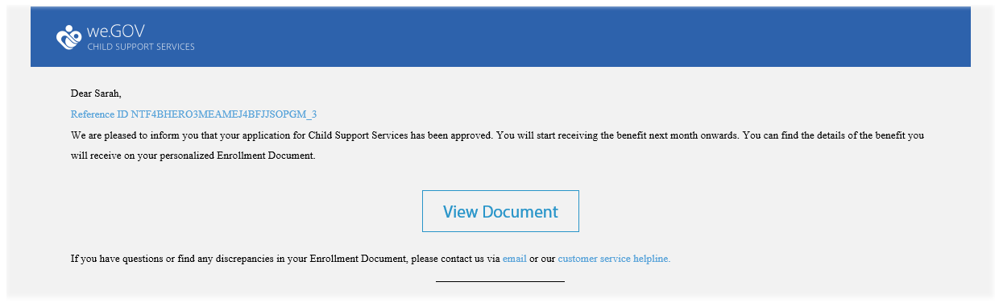
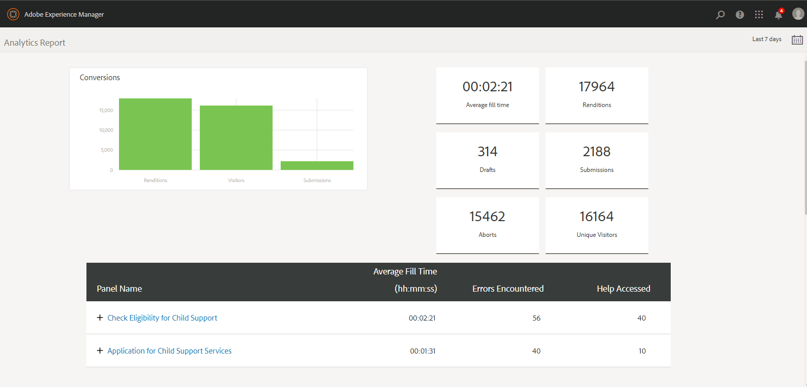

# We.Gov-referentiesite doorloopt {#we-gov-reference-site-walkthrough}

## Voorwaarde {#pre-requisite}

Stel uw Web.Gov-referentiesite in zoals beschreven in de [AEM Forms-referentiesites](/help/forms/using/setup-reference-sites.md)instellen en configureren.

## Referentiescenario {#reference-site-scenario}

We.Gov is een overheidsorganisatie die adoptieve ouders de mogelijkheid biedt om in te schrijven voor kinderopvang als ze een kind adopteren. De site beheert het volgende:

* Subsidiabiliteit van de aanvrager, de adoptiouder
* Persoonlijke en professionele gegevens van de aanvrager (indien de aanvrager in aanmerking komt voor kinderopvang)
* Persoonlijke gegevens van het geadopteerde kind

   De aanvrager kan gegevens verstrekken voor meer dan één kind
* Bankrekeninggegevens van de aanvrager waarin de aanvrager kinderbijslag kan ontvangen
* Terugvordering van aanvraagvergoeding
* Beoordeling van de aanvraag
* Goedkeuring van de aanvraag
* Geautomatiseerde mededeling aan de aanvrager

Zodra de aanvraag is ingediend en de vergoeding ervan is betaald, ontvangt de aanvrager een e-mail van de organisatie met de bevestiging van de ingediende aanvraag.

De organisatie We.Gov ontvangt de toepassing. De organisatie krijgt de aanvraag beoordeeld en keurt de aanvragen goed die authentiek zijn.

Nadat de aanvraag is goedgekeurd, ontvangt de aanvrager een e-mail van de website We.Gov. De optie Document **** weergeven in de e-mail verwijst naar een document met de inschrijvingsgegevens van de aanvrager.

In de onderstaande afbeelding ziet u de stapsgewijze workflow van het Web.Gov-referentiescenario.

Het scenario omvat de volgende personen:

* Sarah Rose, de adoptieouder die om steun voor kinderen vraagt
* Joe, het geadopteerde kind
* Gloria Rios, hoofd van de afdeling Goedkeuring, We.Gov
* Conard Simms, de gebiedsagent die voor toepassingsbeoordeling zorgt

## Sarah start haar toelatingscontrole {#sarah-initiates-her-eligibility-check}

Een aanvrager kan nagaan of hij in aanmerking komt voor kinderbijslag. Op de site kunnen gebruikers vragen beantwoorden, zodat ze kunnen bepalen of hun toepassing in aanmerking komt voor een uitkering. Sarah, een adoptieouder, is een kandidaat-aanvrager. De subsidiabiliteitsvorm is een deel van de Aanvraag voor de diensten van de Steun van het Kind van de plaats Web.Gov. Om haar geschiktheid te controleren, klikt Sarah **[!UICONTROL Child Support]** op de website We.Gov. Sarah klikt op de pagina Onderliggende ondersteuning **[!UICONTROL Check Your Eligibility]**.

In aanvulling op de bovenstaande aanpak kan Sarah klikken **[!UICONTROL Get Started]** op de homepage. Sarah is naar de pagina Alle toepassingen gegaan, waar ze onder Toepassen kan klikken **[!UICONTROL Application for Child Support Services]**. Sarah wordt vervolgens meegenomen naar de toelatingscontrole.

Op de pagina Geschiktheid voor kinderen controleren wordt Sarah een reeks vragen gesteld om te bepalen of ze in aanmerking komt voor kinderbijslag. Aan de hand van de reeks vragen wordt haar gevraagd:

* Als ze de bewaarder van het kind is
* Als zij en het kind in de staat GX leven
* De leeftijdsgroep van het kind en het onderwijs van het kind.

Sarah beantwoordt deze vragen, en haar geschiktheid wordt bevestigd. Haar antwoorden bepalen of ze in aanmerking komt voor kinderopvang.

Sarah wordt ervan in kennis gesteld dat ze in aanmerking komt voor kinderopvang, en de aanvraagkosten bedragen $25.

### Hoe werkt het {#how-it-works}

Sarah&#39;s geschiktheid wordt gevalideerd via een toelatingsbarrière die is gemaakt met een regeleditor. Met de regeleditor kunt u voorwaarden opgeven waaraan moet worden voldaan voordat een aanvrager het aanvraagformulier kan invullen. Wanneer Sarah, de aanvrager, aan alle voorwaarden voldoet om in aanmerking te komen, landt zij op het aanvraagformulier.

De geschiktheidscontrole maakt deel uit van het adaptieve formulier voor de toepassing van de kindondersteuning. De regel valideert geschiktheid wanneer:

* De aanvrager is een bewaarder
* De aanvrager en het kind blijven in de staat GX
* De aanvrager heeft de belangrijkste zorg voor het kind
* De leeftijd van het kind dat een beroep doet op ondersteunende diensten is jonger dan 16 jaar.

### Zie het zelf {#see-it-yourself}

Open deze in uw browser `https://<hostname>:<PublishPort>/content/we-gov/en.html`. Klik op de site Web.Gov op Onderliggende ondersteuning. Klik op de pagina Onderliggende ondersteuning op Uw geschiktheid controleren.

De regels bekijken:

1. Open het formulier in de bewerkingsmodus op het exemplaar van de auteur. URL: `https://<hostname>:<AuthorPort>/editor.html/content/forms/af/we-gov/child-support/css.html`.
1. Selecteer een component en klik op .

   In de Regeleditor worden alle regels weergegeven die in het formulier zijn toegepast.

1. Klik in het linkerpaneel op regels `passMsg` en `failMsg` om te begrijpen hoe de geschiktheidscontrole werkt.

## Sarah start haar aanvraag voor kinderondersteuning {#sarah-starts-her-application-for-child-support}

Sarah klikt **[!UICONTROL Start Application]** nadat ze ervan in kennis is gesteld dat ze in aanmerking komt voor kinderopvang.\
In de Toepassing voor de pagina van de Diensten van de Steun van het Kind, verstrekt Sarah details in de volgende secties:

* **[!UICONTROL About Applicant]**: Laat Sarah haar details in deze sectie verstrekken.

* **[!UICONTROL Child Information]**: Laat Sarah de informatie van het kind verstrekken, die onder de hulpdiensten wordt behandeld.

* **[!UICONTROL Payment]**: Laat Sarah haar bankgegevens verstrekken waarin We.Gov maandelijkse supportcompensatie kan storten.

* **[!UICONTROL Fee Payment]**: Laat Sarah haar creditcardgegevens verstrekken om de aanvraagkosten te betalen.

Standaard wordt Sarah naar de **[!UICONTROL About Applicant]** sectie gebracht.

Sarah kan op elk gewenst moment klikken **[!UICONTROL Come back later]** en hervatten met haar toepassing. Wanneer ze klikt **[!UICONTROL Come back later]**, wordt haar voortgang opgeslagen als een concept en krijgt ze een optie om het concept via e-mail te verzenden.

Als ze klikt **[!UICONTROL Send Email]**, ontvangt ze een e-mail met een koppeling naar het concept van haar formulier.

Het onderliggende ondersteuningsformulier op de website We.Gov gebruikt adaptieve formulieren. Ze kan de koppeling in haar e-mail gebruiken en het formulier op haar mobiele apparaat invullen.

>[!NOTE]
>
>De workflow voor het hervatten van e-mailberichten werkt alleen met aangemelde gebruikers. In het scenario van de verwijzingsplaats, zorg ervoor dat de gebruiker Sarah Rose wordt toegevoegd. Sarah&#39;s aanmeldgegevens zijn `srose/password`.

Sarah kan details in om het even welke sectie verstrekken, maar het aanvraagrecht wordt goedgekeurd slechts nadat zij vereiste informatie in alle secties verstrekt. Een aanvraag is onvolledig zonder betaling van kosten en velden met een sterretje zijn verplicht.

### <strong>Sarah geeft haar informatie</strong> {#strong-sarah-provides-her-information-strong}

Nadat Sarah klikt **[!UICONTROL Start Application]**, wordt zij genomen naar de sectie van de Informatie van de Aanvrager van de pagina van de Diensten van de Steun van het Kind. Onder Informatie van de Aanvrager, navigeert Sarah door de lusjes en verstrekt haar persoonlijke informatie voor de toepassing. Ze klikt **[!UICONTROL Next]** om door de tabbladen te navigeren.

Onder Informatie van de aanvrager wordt haar verzocht nadere informatie te verstrekken onder de volgende tabbladen:

* **[!UICONTROL Basic Information]**

Sarah geeft haar identiteitsbewijs en haar persoonlijke gegevens onder Basic Information. Sarah&#39;s persoonlijke gegevens bevatten haar naam, e-mailadres en socialezekerheidsnummer.

* **[!UICONTROL Relationship]**

   In Relationship voert Sarah informatie in over haar huwelijkse staat.

* **[!UICONTROL Additional Information]**

   Onder Extra Informatie voert Sarah een ID-nummer, haar geboortedatum en het huidige adres en telefoonnummer in.

### Sarah geeft onderliggende informatie {#sarah-provides-child-information}

Nadat Sarah haar persoonlijke informatie verstrekt en klikt **[!UICONTROL Next]**, wordt zij genomen aan de sectie van de Informatie van het Kind.

In de sectie van de Informatie van het Kind, verstrekt zij de volgende details:

* Aantal kinderen dat aanspraak kan maken op kinderbijstands
* Naam van het kind, socialezekerheidsnummer, geboortedatum en geboorteplaats

Als Sarah meer dan één kind kiest, krijgt ze extra vormen toegelaten met de zelfde details om te vullen.\
Sarah kiest haar alleenstaande kind, Joe, en gaat zijn naam in.

### Sarah geeft betalingsgegevens {#sarah-provides-payment-information}

Nadat Sarah informatie verstrekt over het geadopteerde kind (of de kinderen) en klikt **[!UICONTROL Next]**, wordt zij genomen naar de **[!UICONTROL Payment Information]** sectie.

In het gedeelte Betalingsgegevens geeft ze de bankrekeninggegevens op waarmee ze de kinderbijslag kan ontvangen.\
Ze voert haar 10-cijferige bankrekeningnummer in.

## Sarah betaalt de aanvraagkosten en ondertekent het formulier {#sarah-pays-the-application-fee-and-signs-the-form}

Nadat Sarah akkoord gaat met de voorwaarden van de aanvraag, betaalt ze de aanvraagkosten van $25. Voor de verwerking van haar toepassing zijn aanvraagkosten verschuldigd.\
Sarah voert haar creditcardgegevens in en klikt **[!UICONTROL Pay Now]**. Nadat u de kosten hebt betaald, wordt een PDF-versie van de toepassing weergegeven met een handtekeningveld.

Sarah kan kiezen of ze wil intypen, tekenen om te schrijven, een afbeelding van een handtekening in te voegen of het touchscreen van haar mobiele telefoon gebruiken om haar handtekening te tekenen. Sarah typt haar naam en klikt op Ondertekenen.

Haar aanvraag wordt ingediend bij de website We.Gov.

### <strong>Sarah ontvangt een bevestigingsbericht</strong> {#strong-sarah-receives-an-acknowledgement-email-strong}

Nadat Sarah de aanvraagkosten heeft betaald, ontvangt ze een bevestigingsmail van de website We.Gov.\
We.Gov verwerkt de aanvraag en Sarah wordt ervan op de hoogte gesteld dat ze maandelijks een vergoeding ontvangt nadat haar aanvraag is goedgekeurd.

### Hoe werkt het {#how-it-works-1}

De toepassing voor onderliggende ondersteuning gebruikt een combinatie van deelvensterlay-outs zoals de bovenste tab, wizard en accordeon om de ervaring te maken. Er wordt een formuliersjabloon gebruikt met de naam Web.Gov-onderliggend sjabloon.

De aanvrager kan over secties bewegen om verschillende componenten van de vorm te vullen. Wanneer de aanvrager het formulier invult, indient, ermee akkoord gaat en de kosten betaalt, wordt een aangepaste workflow gestart. De aangepaste workflow verzendt een geautomatiseerde e-mail naar de aanvrager die de indiening van de toepassing bevestigt. De aanvraag wordt ter verificatie en goedkeuring aan de betrokken dienst van de organisatie toegezonden.

De indeling van het formulier wordt opgegeven in het thema Onderliggende service van Gov. Stijlen omvat componentstijl, pagina-achtergrond, opmaken van foutstatussen van componenten en lettertypestijlen.

Voor de subsidiabiliteitscontrole worden de in het formulier vermelde regels gebruikt. Hieronder worden geldigheidscontroles beschreven:

`SHOW passMsgWHEN (Does the child live in the state of GX? is equal to Yes) AND (Do you live in the state of GX? is equal to Yes) AND ( (Who has the main day-to-day care of the child? is equal to You) AND (Are you: is equal to The custodial parent) ) AND (Is the child you are applying for: is equal to Under 16 years) ELSE Hide`

`HIDE failMsg WHEN (Does the child lives in the state of GX? is equal to Yes) AND ( (Do you live in the state of GX? is equal to Yes) AND (Who has the main day-to-day care of the child? is equal to You) ) AND (Is the child you are applying for: is equal to Under 16 years) AND (Are you: is equal to The custodial parent) ELSE Show`

### Zie het zelf {#see-it-yourself-1}

Open de vereiste gegevens in uw browser `https://<hostname>:<PublishPort>/content/forms/af/we-gov/child-support/css.html` en vul deze in. Wanneer u de toepassing verzendt nadat u de vereiste informatie hebt ingevuld, de kosten hebt betaald en het document hebt ondertekend, ontvangt u een e-mail met de bevestiging.

Zie de onderliggend sjabloon van Web.Gov hier: `https://<hostname>:<AuthorPort>/editor.html/conf/we-gov/settings/wcm/templates/we-gov-child-template/structure.html`

Bekijk het thema hier: `https://<hostname>:<AuthorPort>/editor.html/content/dam/formsanddocuments-themes/we-gov/we-gov-theme-A/jcr:content`

Voer de volgende stappen uit om alle regels weer te geven:

1. Open het formulier in de ontwerpmodus.

   URL: `https://<hostname>:<AuthorPort>/editor.html/content/forms/af/we-gov/child-support/css.html`

1. Selecteer een component en tik op . Alle regels zijn vermeld in de regelredacteur, met inbegrip van de hierboven vermelde regels.

## Gloria ontvangt de aanvraag {#gloria-receives-the-application}

Gloria, hoofd van de goedkeuringen bij We.Gov, kan ingediende aanvragen bekijken, goedkeuren of afwijzen. AEM Inbox laat haar alle ingediende aanvragen op één plaats zien.

### Hoe werkt het {#how-it-works-2}

Wanneer Sarah de toepassing voor onderliggende ondersteuning invult en verzendt, wordt een PDF- of Document of Record-bestand van de toepassing gemaakt en naar Gloria Rios&#39; inbox verzonden. Gloria kan de ingediende aanvraag bekijken en deze aanvaarden of afwijzen.

### Zie het zelf {#see-it-yourself-2}

Pagina openen `https://<hostname***>:<PublishPort>/content/we-gov/en.html`. Tik op de pagina **[!UICONTROL Sign In]** en schakel het **[!UICONTROL Login as representative]** selectievakje in. Meld u vervolgens aan bij de AEM in het vak met behulp van grios/wachtwoord als gebruikersnaam/wachtwoord voor Gloria Rios. De toepassing voor onderliggende ondersteuning wordt weergegeven. Zie Forms-toepassingen en -taken [beheren in AEM Postvak IN](/help/forms/using/manage-applications-inbox.md)voor informatie over het gebruik van AEM Postvak IN voor op formulieren gerichte workflowtaken.

Gloria kan de aanvraag van het dashboard van de aanvraag zien, goedkeuren of afwijzen.

### Hoe werkt het {#how-it-works-3}

Gloria, hoofd van goedkeuringen bij We.Gov, opent haar AEM inbox. Ze ziet een herzieningstaak in haar takenlijst. Zij opent en bekijkt de overzichtstaak.

Ze ziet een PDF van het formulier gevuld met gegevens die Sarah heeft ingevoerd samen met de documenten die Sarah geüpload heeft.\
Gloria kan de aanvraag goedkeuren of afwijzen. Gloria klikt echter **[!UICONTROL Assessment Required]** om de aanvraag te laten beoordelen.

De toepassing van Sarah is een startpunt in de AEM werkstroom. De AEM wordt gestart wanneer het aanvraagformulier voor onderliggende ondersteuning wordt verzonden. De AEM werkstroom leidt tot een taak voor Gloria, die in haar AEM inbox verschijnt. Wanneer Gloria om onsite beoordeling verzoekt, wordt een nieuwe taak gecreeerd voor de gebiedsagent.

### Zie het zelf {#see-it-yourself-3}

Als de configuratie is voltooid, begint de AEM onmiddellijk nadat het formulier is verzonden. Meld u aan bij de inbox met Gloria&#39; geloofsbrieven.

Ga naar het veld https://&lt;***hostnaam***>:&lt;***PublishPort***>/content/we-gov/en.html. Tik op de pagina **[!UICONTROL Sign In]** en schakel het **[!UICONTROL Login as representative]** selectievakje in met de standaardgegevens van Gloria:

* Gebruikersnaam: griet
* Wachtwoord: password

In haar AEM inbox, wordt de toepassing van Sarah toegevoegd als overzichtstaak. Selecteer de taak en klik op **Beoordeling vereist** om door te gaan naar de volgende stap.

### Conard krijgt de evaluatietaak {#conard-assessment-task}

Wanneer Gloria klikt **[!UICONTROL Assessment Required]**, krijgt Conard de overzichtstaak in zijn AEM Inbox. De taak is de volgende stap in de AEM workflow die in het workflowmodel is gedefinieerd. Hij ziet de herzieningstaak en opent deze.

Conard krijgt de beoordelingstaak van de aanvrager zoals hieronder getoond.

De beoordeling van de kindsteun is een vorm verbonden aan de taak. Hij krijgt de details van Sarah, samen met de bewijsstukken (bijgevoegd in taakomschrijving). Conard vult het beoordelingsformulier in het veld op een apparaat en dient in voor herbeoordeling.

Conard verifieert alle details die Sarah heeft verstrekt, en Sarah ondertekent de beoordeling. AEM Forms kan de locatie en het tijdstempel ophalen en toevoegen aan de handtekening.

Conard klikt **[!UICONTROL Submit For Reevaluation]**, en het AEM werkschema legt de beoordeling aan de organisatie Wij.Gov voor.

### Hoe werkt het {#how-it-works-4}

Wanneer Gloria om beoordeling verzoekt, wordt de volgende stap in AEM werkschema in werking gesteld, en de beoordelingstaak wordt toegevoegd in de Postbus van Conard. Conard is de werknemer persona.

Conard bezoekt Sarah&#39;s plaats, controleert of de informatie die Sarah heeft verstrekt echt is en vult het beoordelingsformulier in. Conard kan een PDF openen van het volledige formulier dat Sarah heeft ingevuld.

### Zie het zelf {#see-it-yourself-4}

Open de AEM inbox op uw tablet en gebruik de referenties van Conard om u aan te melden.

Conard&#39;s standaardgeloofsbrieven zijn:

* Gebruikersnaam: csimms
* Wachtwoord: password

U kunt een nieuwe taak van het Verzoek van de Beoordeling zien die in inbox wordt toegevoegd. Dien de voltooide beoordeling in en ga door naar de volgende stap.

### Gloria evalueert de beoordeling en keurt de aanvraag goed {#gloria-reviews-the-assessment-and-approves-the-application}

Nadat Conard de beoordeling heeft ingediend, ziet Gloria een een herzieningstaak in haar postvak. Ze selecteert en opent **[!UICONTROL Review]**.

Onder Taakdetails ziet Gloria Last Action taken als &quot;Submit for Re-evaluation&quot; (door Conard). Gloria ziet dat Conard Simms de aanvraag heeft beoordeeld.

### Hoe werkt het {#how-it-works-5}

Nadat Conard de beoordeling heeft ingediend, ziet Gloria een een herzieningstaak in haar postvak. Ze selecteert en opent Review. Onder Taakdetails ziet Gloria de beoordelingsopmerking van Conard, die &quot;Alles gevonden in orde&quot; is.

Gloria keurt de aanvraag goed.

### Zie het zelf {#see-it-yourself-5}

Open de inbox en meld u aan met de gegevens van Gloria. In het Postvak IN wordt een nieuwe taak genaamd Review weergegeven.

Open de taak om de status van de laatste actie te zien. De aanvraag goedkeuren op basis van de beoordeling.

## Sarah ontvangt een goedkeuringsbericht {#sarah-receives-an-approval-email}

Nadat Gloria de aanvraag heeft goedgekeurd, ontvangt Sarah van We.Gov een e-mail met de mededeling dat haar aanvraag is goedgekeurd.

De **[!UICONTROL View Document]** knop in de e-mail verwijst naar haar inschrijvingsgegevens. Sarah kliks **[!UICONTROL View Document.]**

In het inschrijvingsdocument worden details vermeld zoals de referentie-id, het gedekte kind, de datum van initiatie, het bankrekeningnummer, de betalingsfrequentie en het betalingsbedrag.

Sarah kan de documenten bekijken die ze op dezelfde pagina heeft geüpload.

### Hoe werkt het {#how-it-works-6}

Als Gloria de aanvraag goedkeurt, ontvangt Sarah een automatische e-mail met een koppeling naar het inschrijvingsdocument.

Het inschrijvingsdocument is een interactieve communicatie en kan op elk apparaat worden weergegeven. Het bevat details van de dienst van de kindsteun, en informatie die Sarah verstrekte.

### Zie het zelf {#see-it-yourself-6}

Controleer de e-mailclient die u hebt geconfigureerd voor de geautomatiseerde e-mail met een koppeling naar het inschrijvingsdocument.

U kunt ook het volgende openen om het document in uw browser te bekijken: `https://<hostname>:<PublishPort>/content/aemforms-refsite/doclink.html?document=/content/forms/af/we-gov/child-support/enrollment-document&referenceId=[reference-id]&channel=web`

## We.Gov analyseert de prestaties van de toepassing {#we-gov-analyzes-the-performance-of-the-application}

Wij.Gov, van tijd tot tijd, herziet de prestaties van hun toepassing van de de diensten van de kindsteun om het even welke kwesties te controleren die klanten zouden kunnen onder ogen zien. Zij gebruiken deze analyse om geïnformeerde besluiten over de veranderingen te nemen die in de toepassing van de diensten van de kindsteun worden vereist om de gebruikerservaring te verbeteren, het afstotingspercentage van vormen te verminderen, en daardoor omzetting te verbeteren. Zij maken gebruik van de integratie van AEM Forms met Adobe Analytics voor hun analyse. In de volgende afbeelding ziet u het dashboard voor de analysemogelijkheden.

### Hoe werkt het {#how-it-works-7}

De prestatiemetriek voor de de toepassingsvorm van de de dienstentoepassing van de kindsteun wordt gevolgd gebruikend Adobe Analytics. Zie Analyses voor formulieren en documenten [configureren voor meer informatie over het configureren van Adobe Analytics en het weergeven van rapporten](/help/forms/using/configure-analytics-forms-documents.md).

### Zie het zelf {#see-it-yourself-7}

Voor u om het analytische rapport te bekijken en te onderzoeken, verstrekken wij zaadgegevens voor de toepassing van de diensten van de kindsteun in de verwijzingsplaats. Alvorens u zaadgegevens gebruikt, zie Analytics vormen. Voer de volgende stappen in auteurinstantie uit om het rapport met de zaadgegevens te bekijken:

1. Ga naar **[!UICONTROL Forms & Documents]** UI op https://&lt;*hostname*>:&lt;*AuthorPort*>/aem/forms.html/content/dam/formsanddocuments.

1. Klik om de map **Web.Gov** te openen.
1. Selecteer het aangepaste formulier en klik op **[!UICONTROL Application for Child Support Services]** **[!UICONTROL Enable Analytics]** de werkbalk.

1. Selecteer het formulier opnieuw en klik op **[!UICONTROL Analytics Report]** de werkbalk om het rapport te genereren. In eerste instantie wordt een leeg rapport weergegeven.

Analytische rapporten genereren met zaadgegevens:

1. Typ in de adresbrowser van de CRXDE-lijst: **/apps/we-gov/demo-artifacts/analyticsTestData/Child support service Analytics Test Data**
1. De zaadgegevens worden geselecteerd in de linkerzijfolderstructuur.
1. Dubbelklik op het geselecteerde bestand om de inhoud ervan in het rechterdeelvenster te openen.
1. Kopieer alle inhoud in het bestand met testgegevens.
1. Navigeer in CRXDE naar: **/content/dam/formsanddocuments/we-gov/child-support/css/jcr:content/analyticsdatanode/lastsevendays**
1. Plak in het veld Analytics Data onder Properties de gekopieerde inhoud van het bestand met testgegevens.
1. Maak nu nogmaals een analyserapport voor **[!UICONTROL Application for Child Support Services]**. U kunt de zaadgegevens in het geproduceerde rapport zien.

