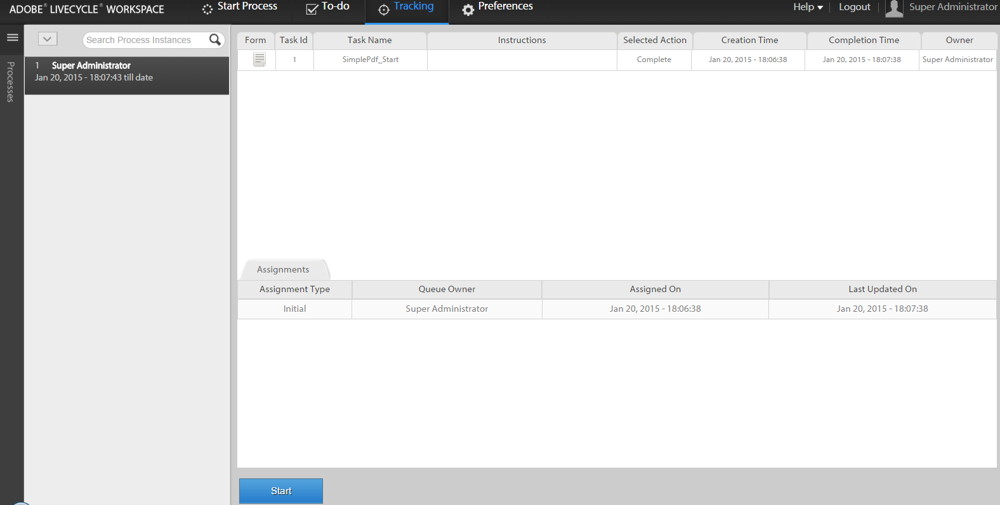

# Een nieuw proces starten met bestaande procesgegevens in de AEM Forms-werkruimte {#initiating-a-new-process-with-existing-process-data-in-aem-forms-workspace}

U kunt een nieuw proces in werking stellen gebruikend de gegevens van een bestaand procesgegeven. De noodzaak om een nieuw proces te starten op basis van bestaande procesgegevens ontstaat wanneer we hetzelfde formulier vaak moeten gebruiken met weinig wijzigingen in de inhoud van betaalformulieren. Met deze functie bespaart u tijd en moeite van gebruikers, vooral als het proces lang moet worden ingevuld.

De volgende stappen zijn nodig om een nieuw proces te starten op basis van bestaande procesgegevens:-

1. Voer een van de volgende handelingen uit:

   * Klik in Bijhouden op de procesinstantie waarvan u de gegevens wilt gebruiken. Klik in de weergave Procesgeschiedenis in het rechterdeelvenster op de taakrij die overeenkomt met het beginpunt.
   * Selecteer bij Tekstspatiëring een zoeksjabloon om een lijst met procesinstanties weer te geven. Selecteer de instantie waarvan u de gegevens wilt gebruiken.
   * Selecteer de taak op het tabblad **[!UICONTROL To-Do]**. Klik op het tabblad **[!UICONTROL History]** en selecteer de taak die de procesinstantie heeft gestart.

    

1. Klik op **[!UICONTROL Start]** op de werkbalk Taakactie. Er wordt een adaptief formulier voor de nieuwe procesinstantie weergegeven met voorgevulde gegevens.

1. Werk de gegevens naar wens bij en klik op **[!UICONTROL Complete]** of een geschikte knop op het formulier.

