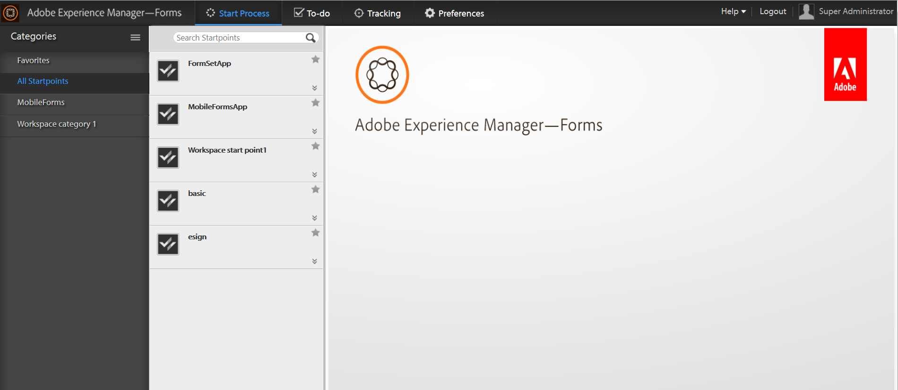

# Inleiding tot de AEM Forms-werkruimte {#introduction-to-aem-forms-workspace}

De Forms-workflow verhoogt de organisatorische efficiëntie door kritieke documenten en aan formulieren gerelateerde bedrijfsprocessen te automatiseren en zichtbaar te maken. Met de module Process Management kunt u gestroomlijnde, end-to-end workflows maken, waaronder mensen, systemen, inhoud en bedrijfsregels, die online of offline toegankelijk zijn. De Forms-workflow omvat de AEM Forms-werkruimte. De werkruimte van AEM Forms voegt nieuwe mogelijkheden toe om werkruimte uit te breiden en te integreren en het gebruikersvriendelijker te maken.

De AEM Forms-werkruimte is compatibel met meer apparaten en formulierfactoren. Hierdoor is taakbeheer mogelijk voor clients zonder Flash® Player en Adobe® Reader®. Het vergemakkelijkt de uitvoering van HTML Forms naast PDF forms.

**Belangrijkste mogelijkheden**:

* Overal deelnemers aan processen inschakelen met dynamische PDF forms, mobiele interfaces en webtoepassingen.
* U kunt de werkruimtecomponenten eenvoudig integreren met uw webtoepassingen. Aangezien de werkruimte van AEM Forms op componenten-gebaseerde software is, kan het gemakkelijk worden aangepast en worden opnieuw gebruikt.
* Breid bedrijfsprocessen uit naar zowel online als offline mobiele workers met de AEM Forms-werkruimte-app.
* De rapporten van de mening om achterstand, werkrijen, en zeer belangrijke prestatiesindicatoren (KPIs) te controleren. U kunt API&#39;s gebruiken om gegevens te extraheren voor verdere analyse met behulp van rapportagetools van derden.
