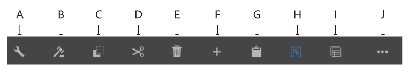

# Inleiding tot Interactieve Communicatie auteursUI {#introduction-to-interactive-communication-authoring-ui}

Een inleiding aan de diverse elementen van de gebruikersinterface u aan auteur Interactieve Communicatie kunt gebruiken

De gebruikersinterface voor creatie [Interactieve Communicatie](/help/forms/using/interactive-communications-overview.md) is intuïtief en verstrekt het volgende voor auteursdruk en Webkanaal van de Interactieve Mededeling:

* WYSIWYG-documenteditor voor slepen en neerzetten
* Geïntegreerde opslagplaats voor middelen - de activa die aan worden geupload en op de server worden gecreeerd zijn beschikbaar in de browser van Activa van Interactive Communication auteursinterface

Wanneer u [nieuw creeert of een bestaande Interactieve Communicatie](/help/forms/using/create-interactive-communication.md) uitgeeft, gebruikt u de volgende elementen van de gebruikersinterface:

* [Zijbalk](#sidebar)
* [Pagina, werkbalk](#page-toolbar)

* [Component, werkbalk](#component-toolbar)
* Inhoudsgebied

**A.** Zijbalk  **B.** Paginawerkbalk  **C.** Inhoudsgebied

## Zijbalk {#sidebar}

[Klik om te vergroten](assets/sidebar-comps-1.png)

**A.** Channel browser  **B.** Content browser  **C.** Properties browser  **D.** Asset browser  **E.** Components browser  ****   **** F.Data Sources browser - Data ModelG.Data Browser - Master inhoud

De zijbalk bevat het volgende:

* **Kanaalbrowser**

   Met de kanaalbrowser kunt u schakelen tussen de afdruk- en webkanalen van de interactieve communicatie. Op basis van het kanaal dat u in de kanaalbrowser hebt geselecteerd, worden de opties weergegeven in browsers zoals Inhoud en Componenten.

* **Inhoudsbrowser**

   In de inhoudbrowser, kunt u objecten hiërarchie van het document voor het geselecteerde kanaal zien. Auteurs kunnen naar een bepaalde component navigeren door op dat element te tikken in de documentobjectenstructuur. Auteurs kunnen objecten zoeken in het webkanaal en ze opnieuw rangschikken vanuit deze structuur.

* **Eigenschappenbrowser**

   Hiermee kunt u de eigenschappen van een component bewerken. De eigenschappen veranderen afhankelijk van de component. Als u bijvoorbeeld de eigenschappen van de documentcontainer wilt zien:

   Selecteer een component en tik  > **Documentcontainer** en tik vervolgens op .

* **Bandenbrowser**

   Hiermee kunt u verschillende typen inhoud segmenteren, zoals lay-outfragmenten, afbeeldingen, documenten, pagina&#39;s, video&#39;s. Auteurs kunnen elementen naar de interactieve communicatie slepen.

* **Browser voor componenten**

   Bevat componenten die u kunt gebruiken om de afdruk- en webkanalen van een document te maken. U kunt componenten aan de Interactieve Mededeling slepen om elementen toe te voegen, en toegevoegde element te vormen zoals aan de vereisten. In de volgende tabel worden de componenten beschreven die in de browser Components worden weergegeven voor afdrukken en webkanalen:

| **Component** | **Afdrukkanaal** | **Webkanaal** | **Functionaliteit** |
|---|---|---|---|
| Diagram | ✓ | ✓ | Hiermee voegt u een grafiek toe die u in een interactieve communicatie kunt gebruiken voor de visuele weergave van tweedimensionale gegevens die zijn opgehaald uit een verzamelitem van een formuliergegevensmodel. |
| Documentfragment | ✓ | ✓ | Staat u toe om een herbruikbare component, een tekst, een lijst, of een voorwaarde, aan een Interactieve Communicatie toe te voegen. De herbruikbare component die u toevoegt aan een interactieve communicatie kan gebaseerd zijn op een formuliergegevensmodel of geen formuliergegevensmodel. |
| Afbeelding | ✓ | ✓ | Hiermee kunt u een afbeelding invoegen. |
| Deelvenster | - | ✓ | De component van het Comité is placeholder voor het groeperen van andere componenten samen en controleert hoe een groep componenten in een Interactieve Mededeling worden uiteengezet. Met een deelvenstercomponent kunt u ook een groep componenten herhaalbaar maken voor de eindgebruiker, bijvoorbeeld in meerdere items die nodig zijn om de gegevens van het onderwijs in te vullen. Het is ook een goede praktijk om een paneel elk voor een lusje van een Interactieve Communicatie met veelvoudige lusjes te gebruiken. |
| Tabel | &amp;ast; | ✓ | Hiermee voegt u een tabel toe waarin u gegevens in rijen en kolommen kunt ordenen. |
| Doelgebied | &amp;ast;&amp;ast; | ✓ | Hiermee voegt u een doelgebied in een webkanaal in om de webkanaalspecifieke componenten te ordenen. |
| Tekst | - | ✓ | Hiermee voegt u tekst toe aan het webkanaal van een interactieve communicatie. Tekst kan formuliergegevensmodelobjecten gebruiken om de inhoud dynamisch te maken. |

&amp;ast; Gebruik Layoutfragmenten in het kanaal Afdrukken om tabellen toe te voegen.

&amp;ast;&amp;ast; In het kanaal van de Druk, zijn de doelgebieden vooraf bepaald in het XDP/drukmalplaatje. U kunt geen nieuwe doelgebieden toevoegen gebruikend Interactieve Communicatie auteursUI.

* **Browser gegevensbronnen**

   Browser van Gegevensbronnen toont de beschikbare gegevensbronnen in het model van vormgegevens u terwijl het creëren van de Interactieve Communicatie selecteerde.

### Belangrijke punten voor het werken met componenten {#key-points-for-working-with-components}

De belangrijkste punten wanneer het werken met interactieve communicatie componenten zijn als volgt:

* Elke component heeft bijbehorende eigenschappen die de weergave en functionaliteit ervan bepalen. Als u de eigenschappen van een component wilt configureren, tikt u op de component en vervolgens op  om de eigenschappen van de component te openen in de eigenschappenbrowser.
* Een component wordt geïdentificeerd met zijn elementnaam. Wanneer u  tikt, kunt u de naam van de component veranderen door de het gebiedswaarde van de Naam van het Element in eigenschappen browser te veranderen. Het veld Elementnaam accepteert alleen letters, cijfers, koppeltekens (-) en onderstrepingstekens (_). Andere speciale tekens zijn niet toegestaan en de elementnaam moet met een letter beginnen.
* U kunt het bezit van de Titel van een Interactieve Component van de Communicatie inline in de redacteur wijzigen zonder browser van Eigenschappen te openen zolang de titel op Interactieve Mededeling zichtbaar is. Daartoe:

   1. Tik om een component te selecteren die een eigenschap Titel heeft en waarvan de eigenschap Titel verbergen is uitgeschakeld.
   1. Tik  om de titel bewerkbaar te maken.
   1. Wijzig de titel en tik op de Return-toets of tik ergens buiten de component om de wijzigingen op te slaan. Tik op Esc om de wijzigingen te verwijderen.

## Component, werkbalk {#component-toolbar}

Wanneer u een component selecteert, ziet u een werkbalk waarmee u ermee kunt werken. U krijgt opties om, eigenschappen van de componenten te snijden te kleven, te bewegen en te specificeren. U kunt kiezen uit de volgende opties:

A. **Configureren**: Wanneer u **Configure** tikt, zijn de componenteneigenschappen zichtbaar in sidebar.

B. **Regels bewerken**: Wanneer u op Regels bewerken tikt, wordt de Regeleditor weergegeven waarin u regels voor de geselecteerde component kunt bewerken en maken. In de Regeleditor kunt u ook andere formulierobjecten (componenten) selecteren en regels voor die formulierobjecten bewerken/maken.

C. **Kopiëren**: Met de kopieeroptie kunt u een component kopiëren en op andere plaatsen in de interactieve communicatie plakken.

D. **Knippen**: U kunt de besnoeiingsoptie gebruiken om een component van één plaats aan een andere in de Interactieve Communicatie te bewegen.

E. **Verwijderen**: Hiermee kunt u de component uit de interactieve communicatie verwijderen.

F. **Component invoegen**: Hiermee kunt u een component invoegen boven de geselecteerde component.

G. **Plakken**: Hiermee kunt u de component die u hebt geknipt of gekopieerd, plakken met de hierboven beschreven opties.

H. **Groep**: Hiermee kunt u meerdere componenten selecteren als u meerdere componenten tegelijk wilt knippen, kopiëren of plakken.

I. **Bovenliggend**: Hiermee kunt u het bovenliggende element van een component selecteren.

J. **Meer**: Biedt meer opties voor het werken met de geselecteerde component.

* SOM-expressie weergeven (alleen voor deelvensters)
* Objecten groeperen in deelvenster (alleen voor deelvensters)
* Fragment bewerken (alleen voor fragmenten)
* Een deelvenster opslaan als fragment (alleen voor deelvensters)
* Onderliggend deelvenster toevoegen (alleen voor deelvensters)
* Deelvensterwerkbalk toevoegen (alleen voor deelvensters)
* Vervangen (niet voor deelvensters)

## Pagina, werkbalk {#page-toolbar}

De werkbalk Pagina bovenaan biedt opties waarmee u een voorvertoning van de interactieve communicatie kunt weergeven en de eigenschappen van de communicatie kunt wijzigen. U kunt een voorvertoning van de interactieve communicatie weergeven wanneer u deze ontwerpt en wijzigingen daarop aanbrengen. In de paginabooltoolbar, ziet u:

* Zijpaneel in-/uitschakelen : Hiermee kunt u Zijbalk tonen of verbergen.
* Pagina-informatie : Hiermee kunt u pagina-eigenschappen weergeven.
* Emulator : Hiermee kunt u het uiterlijk van uw interactieve communicatie emuleren voor verschillende weergavegrootten, zoals tablets en telefoons.
* Bewerken: Hiermee kunt u andere modi selecteren, zoals: Bewerken, Stijl, Ontwikkelaar en Ontwerp.

   * Bewerken: Hiermee kunt u de eigenschappen van de interactieve communicatie en de bijbehorende componenten bewerken. U kunt bijvoorbeeld een component toevoegen, een afbeelding neerzetten en verplichte velden opgeven.
   * Stijl: Hiermee kunt u de vormgeving van componenten van uw interactieve communicatie opmaken. In de stijlmodus kunt u bijvoorbeeld een deelvenster selecteren en de achtergrondkleur ervan opgeven.
   * Ontwikkelaar: Hiermee kan een ontwikkelaar:

      * Ontdek waar Interactieve communicatie uit bestaat.
      * Foutopsporing waar en wanneer gebeurt, wat weer helpt om problemen op te lossen.
   * Doel: Hiermee kunt u aangepaste componenten, of componenten buiten het vak die niet in het zijpaneel staan, in- of uitschakelen.

* Voorvertoning: Hiermee kunt u een voorvertoning weergeven van de Interactieve communicatie wanneer u deze publiceert.

