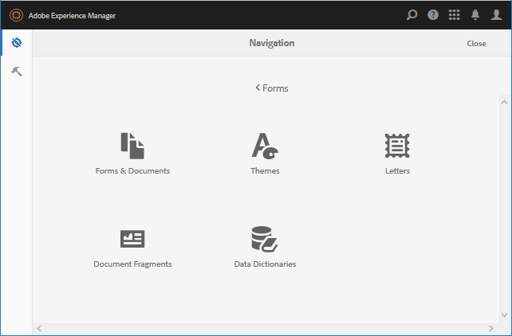

# Inleiding tot het beheren van formulieren {#introduction-to-managing-forms}

>[!CAUTION]
>
>AEM 6.4 heeft het einde van de uitgebreide ondersteuning bereikt en deze documentatie wordt niet meer bijgewerkt. Raadpleeg voor meer informatie onze [technische ondersteuningsperioden](https://helpx.adobe.com/support/programs/eol-matrix.html). Ondersteunde versies zoeken [hier](https://experienceleague.adobe.com/docs/).

AEM Forms biedt een vereenvoudigde maar toch krachtige gebruikersinterface voor het maken en beheren van formulieren, documenten, thema&#39;s, letters, documentfragmenten, gegevenswoordenboeken en verwante elementen. Het helpt de volledige levenscyclus van formulieren, documenten en gerelateerde elementen te beheren - van de desktop van een ontwikkelaar tot de aanbieding\
op een portalserver voor eindgebruikers. U kunt de AEM Forms-gebruikersinterface gebruiken voor:

* AEM Forms-componenten openen
* AEM Forms-configuraties openen

>[!NOTE]
>
>Voor gedetailleerde informatie over andere AEM gereedschappen en opties raadpleegt u [Werken met de ontwerpomgeving](/help/sites-authoring/home.md).

## AEM Forms-componenten openen {#access-aem-forms-components}

AEM biedt naast opties voor het maken van formulieren, documenten en gerelateerde elementen opties voor het maken van sites, elementen, het beheren van een AEM en meer. U kunt op de knop  Het logo van de Experience Manager om naar alle beschikbare gereedschappen te navigeren. Het bevat naast koppelingen naar de consoles van andere componenten ook koppelingen voor AEM Forms. Als u naar AEM Forms wilt navigeren, klikt u op de knop **Logo Experience Manager**  > **navigatie**  > **Forms**. Koppelingen van de volgende consoles worden weergegeven:

* Forms &amp; Documenten
* Thema&#39;s
* Letters
* Documentfragmenten
* Gegevenswoordenboeken

### Forms &amp; Documenten  {#forms-documents}

Forms &amp; Documents biedt opties voor het maken van interactieve communicatie, adaptief formulier, adaptief formulierfragment en formulierset. Alleen voor AEM Forms in JEE biedt Forms en Documenten een optie voor het importeren van bestanden uit lokale opslag en het synchroniseren van AEM Forms-elementen met Workbench.

De knop Maken is het startpunt voor het maken of uploaden van AEM Forms-middelen. U hebt de volgende opties:

* **Interactieve communicatie**: Een interactieve communicatie is een gepersonaliseerde, interactieve, en apparaat-vriendelijke digitale correspondentie op HTML-Gebaseerde, verklaring, of document. De interactieve Mededelingen zijn ontvankelijk in aard en veranderingslay-out en ontwerp automatisch gebaseerd op gebruikersapparaat en montages. Zie voor meer informatie [Interactieve communicatie - overzicht](/help/forms/using/interactive-communications-overview.md).

* **Adaptief formulier:** Een adaptief formulier is een aantrekkelijke en responsieve vorm. U kunt een adaptief formulier ontwerpen om het dynamisch aan te passen aan de invoer van de gebruiker door formuliersecties toe te voegen of te verwijderen op basis van gebruikersreactie, apparaat of werkomgeving. De [Inleiding tot het ontwerpen van adaptieve formulieren](/help/forms/using/introduction-forms-authoring.md) artikel bevat gedetailleerde informatie over de adaptieve formulieren .

* **Adaptief formulierfragment:** Hoewel elk formulier voor een bepaald doel is ontworpen, zijn er in de meeste vormen enkele gangbare segmenten, zoals het verstrekken van persoonlijke gegevens zoals naam en adres, familiedetails, inkomstengegevens enzovoort. U kunt voor dergelijke secties een afzonderlijk element maken. Deze herbruikbare, zelfstandige segmenten worden adaptieve formulierfragmenten genoemd. Zie voor meer informatie [adaptieve formulierfragmenten](/help/forms/using/adaptive-form-fragments.md) artikel.

* **Formulierset:** Een formulierset is een verzameling HTML5-formulieren die zijn gegroepeerd en worden weergegeven als één set formulieren voor eindgebruikers. Wanneer eindgebruikers een formulierset beginnen in te vullen, worden de formulieren naadloos van het ene naar het andere formulier overgebracht. Uiteindelijk kan een gebruiker alle formulieren als één entiteit met één klik verzenden. Zie voor meer informatie [Formulierset in AEM Forms](/help/forms/using/formset-in-aem-forms.md).

* **Map:** De gebruikersinterface van AEM Forms gebruikt omslagen om activa te schikken. Twee soorten mappen worden ondersteund:

   * **Algemene map:** Deze mappen worden gebruikt voor elementen die zijn gemaakt in de gebruikersinterface van AEM Forms. Deze mappen hebben geen strikte mapstructuur. U kunt de namen van submappen wijzigen, submappen maken en adaptieve formulieren, interactieve communicatie, adaptieve formulierfragmenten, formuliersjablonen (XDP&#39;s), PDF forms, documenten en gerelateerde elementen in deze mappen opslaan.
   * **Map Forms Workflow:** Forms-workflowmappen worden gemaakt wanneer Workbench-processen (LiveCycle-archieven) worden gemigreerd en gesynchroniseerd met de AEM Forms-gebruikersinterface. Het is niet toegestaan de naam te wijzigen, een submap te maken, een interactieve communicatie, een adaptief formulierfragment of een interactieve communicatie te maken. Het is ook niet toegestaan om een versiemap te verwijderen of een adaptief formulier, een adaptief formulierfragment of een interactieve communicatie te maken en te uploaden parallel aan de versiemap.

**A.** Algemene map **B.** Map Forms Workflow

Het deelvenster Forms en het deelvenster Document bevatten ook opties voor:

* **Bestanden importeren van lokale opslag:** U kunt PDF forms en documenten, formuliersjablonen (XFA-formulieren) en andere bronnen (Afbeelding en XML-schema voor XSD&#39;s) importeren. Voor stapsgewijze instructies raadpleegt u [Elementen importeren en exporteren naar AEM Forms](/help/forms/using/import-export-forms-templates.md).

* **AEM Forms-middelen synchroniseren met Workbench:** Met de optie Bestanden van Workbench kunt u elementen synchroniseren tussen de AEM Forms-gebruikersinterface en Workbench. Hiermee zorgt u ervoor dat alle middelen beschikbaar zijn in de gebruikersinterface van AEM Forms en de selectie van de crx-repository-middelen van Workbench.

### Thema&#39;s  {#themes}

Een thema bevat opmaakgegevens voor componenten en deelvensters. Thema&#39;s hebben een onafhankelijke identiteit. U kunt een thema dus opnieuw gebruiken op meerdere adaptieve formulieren. U kunt stijlen voor een component opgeven of CSS-eigenschappen wijzigen voor verschillende componenten die in de verschillende formulieren worden gebruikt. Stijlen omvatten eigenschappen zoals achtergrondkleuren, statuskleuren, transparantie en grootte. U kunt aanpassingen in een thema opslaan en deze als een voorinstelling op componenten van het formulier importeren. Wanneer u het thema aan uw formulier toevoegt, weerspiegelt de opgegeven stijl de corresponderende componenten van het formulier. Met AEM 6.2 Forms kunt u thema&#39;s maken en deze toepassen op uw formulieren.

Voor informatie over het maken en gebruiken van thema&#39;s raadpleegt u [Thema&#39;s in AEM Forms](/help/forms/using/themes.md).

### Letters  {#letters}

Een AEM is een veilige, gepersonaliseerde en interactieve correspondentie. Met AEM Forms kunt u snel letters (ook wel correspondentie genoemd) samenstellen op basis van vooraf goedgekeurde en door u aangepaste inhoud in een gestroomlijnd proces.

Voor informatie over het maken en gebruiken van letters raadpleegt u [Letter maken](/help/forms/using/create-letter.md).

### Documentfragmenten {#document-fragments}

Documentfragmenten zijn herbruikbare onderdelen of onderdelen van een correspondentie waarmee u letters kunt samenstellen. De documentfragmenten zijn van het type tekst, lijst, voorwaarde en lay-outfragment. Voor informatie over het maken en gebruiken van documentfragmenten raadpleegt u [maken, documentfragmenten](/help/forms/using/document-fragments.md).

### Gegevenswoordenboeken {#data-dictionaries}

Zakelijke gebruikers hebben doorgaans geen kennis nodig van metagegevensrepresentaties zoals XSD (XML-schema) en Java-klassen. Nochtans, vereisen zij gewoonlijk toegang tot deze gegevensstructuren en attributen om oplossingen te bouwen. AEM Forms gebruikt gegevenswoordenboek bedrijfsgebruikers om informatie van achterste-eindgegevensbronnen te gebruiken zonder technische details over hun onderliggende gegevensmodellen te kennen.

Voor informatie over het creëren van en het gebruiken van gegevenswoordenboeken, zie het creëren [gegevenswoordenboekartikel](/help/forms/using/data-dictionary.md)

## Toegang tot AEM Forms-configuraties {#accessing-aem-forms-configurations}

AEM deelvenster Gereedschappen bevat gereedschappen voor diverse componenten. Als u naar AEM Forms-specifieke gereedschappen wilt navigeren, klikt u op de knop **Logo Experience Manager**  > **gereedschappen**  > **Forms**. De hulpmiddelen om de volgende functies uit te voeren worden getoond:

* **Controlemap configureren:** Een beheerder kan een netwerkmap, ook wel een gecontroleerde map genoemd, zo configureren dat wanneer een gebruiker een bestand (zoals een PDF-bestand) in de gecontroleerde map plaatst, een vooraf geconfigureerde bewerking wordt gestart en het bestand wordt gemanipuleerd. <!-- Fix broken link For detailed information, see Create and Configure a watched folder. -->

* **Forms App Offline Service configureren:** De AEM Forms-app offline service plaatst de paden of URL&#39;s van de bronnen die in een formulier worden gebruikt in cache. Het in cache plaatsen van paden of URL&#39;s van de bronnen die in een formulier worden gebruikt, verbetert de prestaties op de server. Als u de offline servercomponent van de AEM Forms-app wilt configureren, raadpleegt u [Werken in de offlinemodus](/help/forms/using/work-offline-mode.md).

* **PDF Generator configureren:** Een beheerder kan de montages van de Generator van AEM Forms PDF vormen, gebruikersrekeningen toevoegen, en invoer of de uitvoerconfiguratie aan de Generator van PDF invoeren.
* **Correspondentiebeheermiddelen publiceren:** Met AEM Forms kunt u alle letters, documentfragmenten en gegevenswoordenboeken en verwante afhankelijkheden van een auteur tegelijk publiceren. De gepubliceerde activa omvatten alle activa van het Beheer van de Correspondentie en verwante gebiedsdelen. Zie voor meer informatie [Formulieren en documenten publiceren en de publicatie ervan opheffen](/help/forms/using/publishing-unpublishing-forms.md#publishallthecorrespondencemanagementassets).
* **Correspondentenbeheermiddelen exporteren:** U kunt alle Correspondence Management-elementen en gerelateerde afhankelijkheden als een pakket downloaden van een AEM formulierexemplaar. Voor gedetailleerde stappen raadpleegt u [Elementen importeren en exporteren naar AEM Forms](/help/forms/using/import-export-forms-templates.md#importandexportassetsincorrespondencemanagement)

## Algemene elementen van de gebruikersinterface {#commonelements}

* **Linkerspoor:** U kunt op het pictogram van het linkerspoor klikken  om de mogelijkheden van AEM Forms op het gebied van tijdlijn en verwijzingen weer te geven.

   * **Tijdlijn:** U kunt opmerkingen toevoegen aan en weergeven over een element dat beschikbaar is voor revisie in de tijdlijn. Zie voor gedetailleerde instructies [Revisies voor elementen in formulieren maken en beheren](/help/forms/using/create-reviews-forms.md).
   * **Referenties:** Een AEM Forms-element kan worden gebruikt in meerdere AEM Forms-elementen. Een documentfragment kan bijvoorbeeld in meerdere letters worden gebruikt. Verwijzingen zijn een lijst met elementen (andere vormen of bronnen) waarin het geselecteerde element wordt gebruikt en ook de lijst met andere elementen die het geselecteerde element gebruikt.

* **Broodkruimels:** Een broodkruimel vertegenwoordigt de titel van de huidige console of de omslag. U kunt op de optie Breadcrumb klikken om te navigeren tussen het niveau van mappen dat hoger is in de hiërarchie.
* **Weergaveswitcher:** U kunt klikken op het pictogram Weergaveswitcher  of  om snel tussen lijst en kaartmening te schakelen. Voor meer informatie over gemeenschappelijke gebruikersinterfacecomponenten, zie [Werken met de ontwerpomgeving](/help/sites-authoring/basic-handling.md).
* **Zoeken:** De zoekoptie  biedt mogelijkheden om snel naar de gewenste inhoud en gereedschappen te zoeken en deze te gebruiken. Typ de naam van de inhoud of de productmogelijkheden en selecteer een van de suggesties. Typ bijvoorbeeld &quot;Documenten&quot; om snel naar Forms &amp; Documenten of de console Documentfragmenten te zoeken en er naartoe te navigeren. Zie AEM 6.2 voor meer informatie over zoeken. [zoeken](/help/sites-authoring/search.md) artikel
* **Werkbalk Handelingen**: Als u een element selecteert, verschijnt de werkbalk Handelingen boven de lijst met elementen. Het bevat alle beheerhulpmiddelen voor het geselecteerde element. U kunt de muisaanwijzer boven een gereedschapspictogram plaatsen om de knopinfo met een beschrijving van de functionaliteit weer te geven

>[!NOTE]
>
>Wanneer een gebruiker een zoekconsole van Forms &amp; Documents uitvoert, bevat de rail alleen **Filters en opties**. U kunt Filters en Opties gebruiken om geavanceerd zoeken uit te voeren.

* **Werkbalk Handelingen**: Als u een element selecteert, verschijnt de werkbalk Handelingen boven de lijst met elementen. Het bevat alle beheerhulpmiddelen voor het geselecteerde element. U kunt de muisaanwijzer boven een gereedschapspictogram plaatsen om de knopinfo met een beschrijving van de functionaliteit weer te geven

