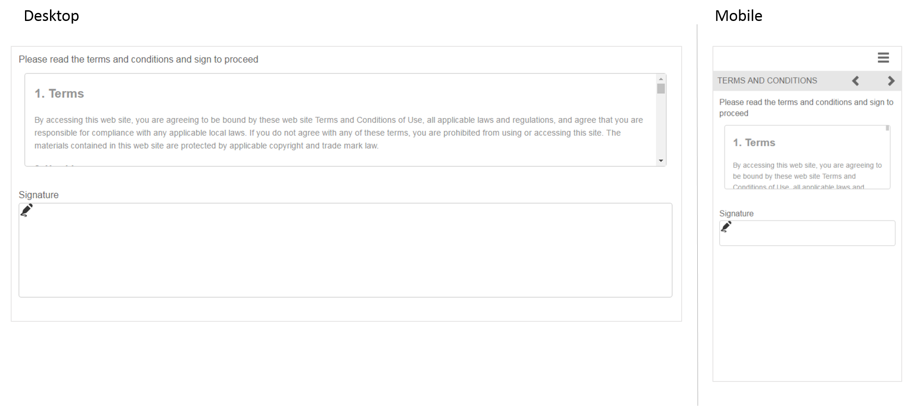

# Referentie adaptieve formulierfragmenten {#reference-adaptive-form-fragments}

[Aangepast formulier ](/help/forms/using/adaptive-form-fragments.md) is een groep velden of een deelvenster met een groep velden die u kunt gebruiken wanneer u een formulier maakt. Hiermee kunt u gemakkelijk en snel een formulier maken. U kunt een adaptief formulierfragment naar een formulier slepen met de middelenbrowser in het zijpaneel en het bewerken in de formuliereditor.

Voor auteurs van adaptieve formulieren worden referentiefragmenten geleverd in het AEM Forms-pakket [AEM-FORMS-6.3-REFERENCE-FRAGMENTS](https://www.adobeaemcloud.com/content/marketplace/marketplaceProxy.html?packagePath=/content/companies/public/adobe/packages/cq630/fd/AEM-FORMS-6.3-REFERENCE-FRAGMENTS). Het bevat de volgende fragmenten:

* Adres
* Contactgegevens
* Creditcardgegevens
* Huidige werkgelegenheid
* Afhankelijke informatie
* Werkgelegenheidsgeschiedenis
* Inkomsten en uitgaven
* Naam
* Voorwaarden en bepalingen
* Voorwaarden en bepalingen met krabbels

Wanneer u het pakket installeert, wordt een map Reference Fragments met verwijzingsfragmenten gemaakt onder Forms &amp; Documents. Zie [Werken met pakketten](/help/sites-administering/package-manager.md) voor het installeren van een pakket.

## Adres {#address}

Bevat velden voor het opgeven van het mailadres. De beschikbare velden zijn adres, postcode, plaats, staat en land. Het omvat ook een vooraf geconfigureerde webservice die de stad en de staat voor een opgegeven Amerikaanse postcode vult.

[Klik om te vergroten](assets/address.png)

## Contactgegevens {#contact-information}

Bevat velden voor het vastleggen van het telefoonnummer en het e-mailadres.

[Klik om te vergroten](assets/contact-info-1.png)

## Creditcardgegevens {#credit-card-information}

Bevat velden voor het vastleggen van creditcardgegevens die kunnen worden gebruikt voor het verwerken van betalingen.

## Huidige werkgelegenheid {#current-employment}

Bevat velden waarin actuele werkgelegenheidsdetails worden opgenomen, zoals arbeidsstatus, werkterrein, aanwijzing, organisatie en datum van toetreding.

[Klik om te vergroten](assets/current-emp-1.png)

## Informatie over afhankelijke personen {#dependents-information}

Omvat gebieden om informatie over één of meerdere gebiedsdelen, zoals hun naam, verhouding, en leeftijd in een tabelvorm te specificeren.

[Klik om te vergroten](assets/dependents-info-1.png)

## Werkgelegenheidsgeschiedenis {#employment-history}

Bevat velden voor het vastleggen van de arbeidsgeschiedenis. Het staat toe toevoegend veelvoudige organisaties.

[Klik om te vergroten](assets/emp-history-1.png)

## Inkomsten en uitgaven {#income-expenditure}

Bevat velden voor het opnemen van maandelijkse kasstroom en uitgaven. Forms die van gebruikers eist dat ze financiële gegevens verstrekken, kan dit fragment gebruiken om inkomsten en uitgaven vast te leggen.

[Klik om te vergroten](assets/income-1.png)

## Naam {#name}

Bevat velden voor het opgeven van de titel, voornaam, middelste naam en achternaam.

[Klik om te vergroten](assets/name-1.png)

## Voorwaarden {#terms-conditions}

Hiermee geeft u aan welke voorwaarden gebruikers moeten accepteren voordat ze een formulier verzenden.

[Klik om te vergroten](assets/tnc-1.png)

## Voorwaarden en bepalingen met krabbels {#terms-conditions-with-scribble}

Hiermee geeft u aan onder welke voorwaarden gebruikers een formulier moeten accepteren en ondertekenen voordat ze het verzenden.

[Klik om te vergroten](assets/tnc-scribble-1.png)
