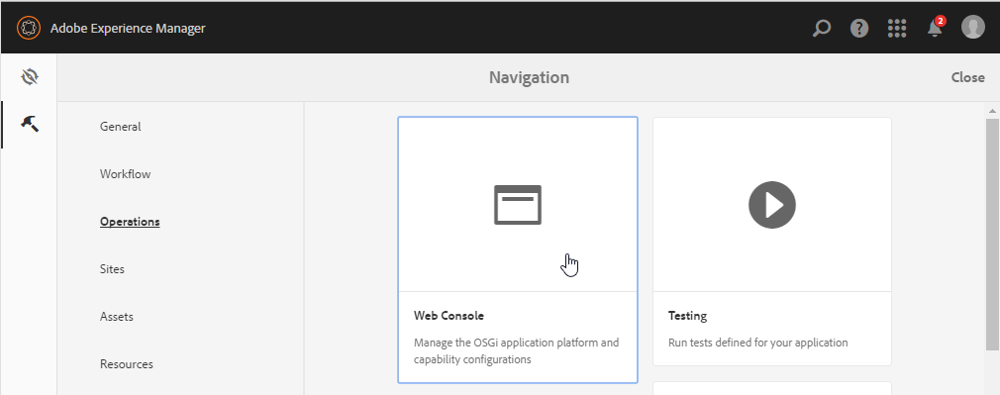
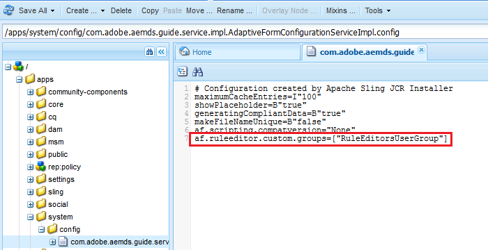

# De toegang van de regelredacteur van de subsidie tot uitgezochte gebruikersgroepen {#grant-rule-editor-access-to-select-user-groups}

## Overzicht {#overview}

U kunt verschillende typen gebruikers hebben met verschillende vaardigheden die werken met Adaptive Forms. Hoewel ervaren gebruikers de juiste kennis hebben om met scripts en complexe regels te werken, kunnen er gebruikers op basisniveau zijn die alleen met de indeling en basiseigenschappen van adaptieve formulieren moeten werken.

AEM Forms staat u toe om de toegang van de regelredacteur tot gebruikers te beperken die op hun rol of functie wordt gebaseerd. In de Adaptive Forms Configuration Service-instellingen kunt u de [gebruikersgroepen](/help/sites-administering/security.md) opgeven die de regeleditor kunnen weergeven en openen.

## Geef gebruikersgroepen op die toegang kunnen krijgen tot de regeleditor {#specify-user-groups-that-can-access-rule-editor}

1. Meld u als beheerder aan bij AEM Forms.
1. Klik in de auteurinstantie op adobeexperienceAdobe Experience Manager >  > Operations > Web Console. De webconsole wordt in een nieuw venster geopend.

   

1. Zoek en klik op **Adaptieve formulierconfiguratieservice** in het venster Webconsole. **Het dialoogvenster Adaptive Form Configuration Service** wordt weergegeven. Wijzig geen waarde en klik op **Opslaan**.

   Het leidt tot een dossier /apps/system/config/com.adobe.aemds.guide.service.impl.AdaptiveFormConfigurationServiceImpl.config in CRX-bewaarplaats.

1. Meld u als beheerder aan bij CRXDE. Open het bestand /apps/system/config/com.adobe.aemds.guide.service.impl.AdaptiveFormConfigurationServiceImpl.config voor bewerking.
1. Gebruik het volgende bezit om de naam van een groep te specificeren die tot regelredacteur (bijvoorbeeld, RuleEditorsUserGroup) kan toegang hebben en klik **sparen allen**.

   `af.ruleeditor.custom.groups=["RuleEditorsUserGroup"]`

   Als u toegang voor meerdere groepen wilt inschakelen, geeft u een lijst op met door komma&#39;s gescheiden waarden:

   `af.ruleeditor.custom.groups=["RuleEditorsUserGroup", "PermittedUserGroup"]`

   

   Nu, wanneer een gebruiker die geen deel van de gespecificeerde gebruikersgroep (hier RuleEditorsUserGroup) uitmaakt een gebied tikt, is het Edit pictogram van de Regel ( ) niet beschikbaar voor haar in de componententoolbar:

   

   De toolbar van componenten zoals zichtbaar aan een gebruiker met de toegang van de regelredacteur

   

   De toolbar van Componenten zoals zichtbaar aan een gebruiker zonder de toegang van de regelredacteur

   Voor instructies bij het toevoegen van gebruikers aan groepen, zie het Beleid van de [Gebruiker en Veiligheid](/help/sites-administering/security.md).

