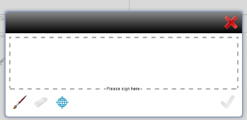

# Elektronische handtekeningen toepassen op een formulier met scripthandtekeningen {#apply-electronic-signatures-to-a-form-using-scribble-signatures}

Met de component **Krabbelhandtekening** en **Handtekeningstap** kunt u een handtekening (Krabbelen) tekenen op een adaptief formulier. In het onderdeel Handtekeningstap wordt een PDF-versie van het adaptieve formulier weergegeven. U hebt een optie Document of Record ingeschakeld of op een formuliersjabloon gebaseerde adaptieve formulieren nodig om de component Handtekeningstap te kunnen gebruiken.

Beide componenten bieden een venster, zoals hieronder wordt weergegeven, om een formulier te ondertekenen. U kunt ook op het geolocatiepictogram  klikken om geolocatie aan de handtekening toe te voegen.

## Een adaptief formulier configureren voor het gebruik van de Krabbelhandtekening {#configure-an-adaptive-form-to-use-scribble-signature}

1. Maak een Document of Record-optie ingeschakeld of een adaptief formulier op basis van een formuliersjabloon. Zie [Een adaptief formulier maken](/help/forms/using/creating-adaptive-form.md) voor stapsgewijze informatie.
1. Sleep de component **Krabbelhandtekening** van de componentbrowser naar het adaptieve formulier.
1. Tik op het pictogram **Configureer** . De eigenschappenbrowser wordt geopend en de eigenschappen van de component Krabbelen handtekening worden weergegeven. Configureer eigenschappen van de component Krabbelhandtekening.
1. Sleep de component Signature Step van de componentbrowser naar het aangepaste formulier.

   >[!NOTE]
   >
   >De component voor de stap Handtekening gebruikt de volledige breedte die beschikbaar is voor het formulier. Het wordt aanbevolen geen andere component op te nemen in de sectie die de component voor de stap Handtekening bevat.

1. Tik in de Inhoudsbrowser op **Formuliercontainer** en tik op het pictogram **Configure** . De eigenschappenbrowser wordt geopend en de eigenschappen van de container Adaptief formulier worden weergegeven. Navigeer naar **Aangepaste formuliercontainer** > **Elektronische handtekening** en schakel de optie **Adobe Sign** inschakelen uit. Tik op het pictogram Gereed  om de wijzigingen op te slaan.

   >[!NOTE]
   >
   >Wanneer u een component Handtekeningstap toevoegt aan een adaptief formulier, wordt de optie Adobe Sign inschakelen automatisch geselecteerd.

1. Tik op het pictogram **Configureer** . De eigenschappenbrowser wordt geopend en de eigenschappen voor stap Handtekening worden weergegeven. Configureer de volgende eigenschappen:

   * **Elementnaam**: Geef de naam van de component op.
   * **Titel:unieke titel van de component** opgeven.
   * **Sjabloonbericht:** Geef het bericht op dat moet worden weergegeven terwijl de PDF van de handtekening wordt geladen. Het voorbereiden en laden van PDF-handtekeningen duurt enige tijd voor Adobe Sign-services.
   * **Ondertekeningsservice:** selecteer de optie  **Krabbelhandtekening** .
   * **CSS-klasse**: Geef eventueel de CSS-klasse van de clientbibliotheek op. Het wordt aanbevolen [thema&#39;s](/help/forms/using/themes.md) en [inline stijlen](/help/forms/using/inline-style-adaptive-forms.md) te gebruiken in plaats van CSS-klasse.

   Tik op het pictogram Gereed  om de wijzigingen op te slaan. De handtekening is geconfigureerd.

   Wanneer u nu een formulier invult, wordt een PDF-versie van het aangepaste formulier weergegeven en worden opties voor de ondertekening van het PDF-document weergegeven. Zie [Een adaptief formulier ondertekenen met de scripthandtekening](/help/forms/using/signing-forms-using-scribble.md#p-sign-an-adaptive-form-using-scribble-signature-p) voor meer informatie.

## Een adaptief formulier ondertekenen met behulp van een scripthandtekening {#sign-an-adaptive-form-using-scribble-signature}

1. Nadat u een adaptief formulier hebt ingevuld en de pagina Stap handtekening hebt bereikt, wordt het handtekeningscherm weergegeven.

   

1. Klik op **[!UICONTROL Sign]**. Het dialoogvenster Scriptteken wordt weergegeven. Onderteken het formulier en klik op het pictogram Gereed  om de handtekening op te slaan.

   

1. Klik op Voltooien om het ondertekeningsproces te voltooien.

   

De handtekeningen worden toegevoegd aan het formulier en het formulierbesturingselement gaat naar het volgende venster.

