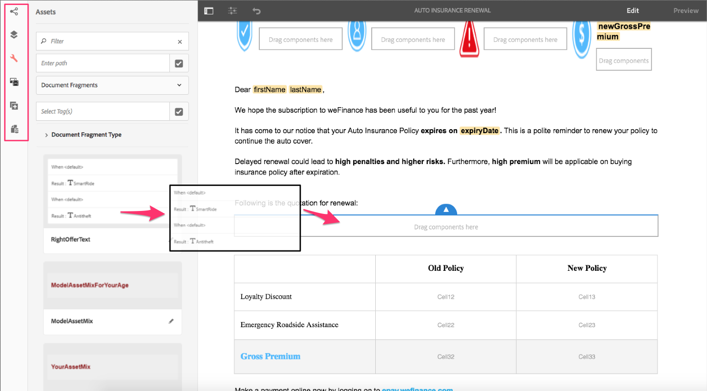

# Overzicht van nieuwe functies | AEM 6.4 Forms {#new-features-summary-aem-forms}

Overzicht van nieuwe functies en verbeteringen in AEM 6.4 Forms.

AEM Forms bevat verschillende nieuwe functies en verbeteringen die het maken, beheren en gebruiken van aangepaste formulieren en interactieve communicatie verder stroomlijnen.

Lees verder voor een snelle inleiding op nieuwe functies en verbeteringen. Raadpleeg de documentatie voor bronnen die informatie bieden. Zie ook AEM 6.4 Forms [releaseopmerkingen](/help/release-notes/forms.md). Voor volledige AEM 6.4 Forms-documentatie gaat u naar [AEM 6.4 Forms Guide](/help/forms/home.md).

## Interactieve communicatie {#interactive-communications}

Interactieve communicatie centraliseert en beheert de verwezenlijking, de assemblage, en de levering van veilige, gepersonaliseerde, en interactieve correspondentie zoals bedrijfscorrespondentie, brieven, documenten, verklaringen, voordeelberichten, het prospectus van het vermogensbeheer, marketing brievenpost, rekeningen, en welkomstkits.

Interactieve communicatie gebruikt dezelfde onderliggende technologie, processen en componenten als adaptieve formulieren om responsieve multikanaalcommunicatie tot stand te brengen, net als responsieve adaptieve formulieren.

Interactieve communicatie biedt aanzienlijke voordelen:

* Biedt OOTB-integratie met het Model van formuliergegevens om eenvoudige en gestroomlijnde toegang mogelijk te maken tot back-end databases en andere CRM-systemen zoals MS Dynamics
* Biedt een geïntegreerde ontwerpinterface voor afdrukken en webkanalen
* Biedt een op slepen en neerzetten gebaseerde ontwerpinterface, vergelijkbaar met Adaptive Forms authoring, voor zowel afdrukken- als webkanalen.

De interactieve mededeling is het gebrek en geadviseerde benadering om klantenmededelingen tot stand te brengen. Als u de letters in AEM 6.3 Forms en AEM 6.2 Forms wilt blijven gebruiken, moet u een compatibiliteitspakket installeren.

### Interactieve communicatie met meerdere kanalen ontwerpen {#multi-channel-interactive-communication-authoring}

Met interactieve communicatie kunt u afdrukken- en webdocumenten vanuit één documenteditor maken en bewerken. Door dezelfde documentfragmenten te gebruiken om uitvoeringen van beide kanalen te maken, kunt u dubbel werk voorkomen.

Voor meer informatie, zie [Interactief Communicatie Overzicht](/help/forms/using/interactive-communications-overview.md).

### WYSIWYG Document Editor {#wysiwyg-document-editor}

De WYSIWYG belemmering-en-dalingsdocumentredacteur is bedrijfsvriendelijk. De intuïtieve interface, functionaliteit voor slepen en neerzetten, standaardcomponenten, gegevensmodellen en geïntegreerde opslagruimte voor elementen maken het snel en eenvoudig maken van interactieve communicatie mogelijk.

Zakelijke gebruikers kunnen de volgende bouwstenen gebruiken om een interactieve communicatie te maken of een bestaande communicatie te bewerken: Kanalen, Inhoud, Eigenschappen, Middelen, Componenten, en Gegevensbronnen.

Voor meer informatie, zie [Inleiding aan creatie Interactieve Communicatie](/help/forms/using/introduction-interactive-communication-authoring.md).

### Automatisch webversie genereren op basis van afdrukinhoud in interactieve communicatie {#auto-generate-web-version-from-print-content-in-interactive-communication}

Auteurs kunnen automatisch webdocumentinhoud genereren van gedrukte documenten naar auteur, afdrukvoorbeeld en zowel afdruk- als webdocumenten in dezelfde editor bewerken. Interactieve auteurs van communicatie kunnen deze eenmaal maken en publiceren naar alle kanalen. Interactieve auteurs van communicatie kunnen dezelfde documentfragmenten in de afdruk en het webkanaal gebruiken om dubbel werk te voorkomen.

Zie [Kanaal en webkanaal afdrukken](/help/forms/using/web-channel-print-channel.md) voor meer informatie.

### Thema&#39;s gebruiken om webkanalen voor interactieve communicatie {#use-themes-to-style-web-channel-of-interactive-communication} op te maken

Interactieve communicatie ondersteunt thema&#39;s. U kunt thema&#39;s maken en deze toepassen op uw interactieve communicatie. Een thema bevat opmaakgegevens voor componenten en deelvensters. U kunt een thema op verschillende interactieve mededelingen opnieuw gebruiken om hen gemeenschappelijke en verenigbare verschijning en branding te geven.

AEM Forms bevat een thema uit het vak voor interactieve communicatie. Met behulp van een thema kunt u ook aanpassen hoe een interactieve communicatie er op een apparaat uitziet.

Zie [Thema&#39;s in AEM Forms](/help/forms/using/themes.md) voor meer informatie.

### Verbeterde agentinterface {#enhanced-agent-interface}

De gebruikersinterface van de Agent steunt nu druk en Webvoorproef van de interactieve mededeling. Vanuit dezelfde gebruikersinterface van de Agent kunt u kiezen of u het afdrukkanaal wilt bewerken en een voorvertoning wilt weergeven van het webkanaal van uw interactieve multikanaalcommunicatie. De gebieden, de variabelen, de elementen FDM, en de documentfragmenten in het drukkanaal kunnen worden gevormd om door de agent in het gebruikersinterface van de Agent worden gewijzigd. Met ondersteuning voor formuliergegevensmodellen kunt u voorvertoningen genereren met vooraf ingevulde voorbeeldgegevens.

Voor meer informatie, zie [Interactieve Mededeling voorbereiden en verzenden gebruikend de Agent UI](/help/forms/using/prepare-send-interactive-communication.md).

### Informatie in grafieken {#present-information-in-charts} presenteren

Interactieve communicatie ondersteunt webgrafieken en het afdrukkanaal voor betere communicatie. Met diagrammen zoals taart, donut, staaf en kolom kunt u grote hoeveelheden informatie comprimeren en visueel presenteren voor eenvoudige interpretatie en analyse.

 

Voor meer informatie, zie [Het gebruiken van grafieken in Interactieve Mededelingen](/help/forms/using/chart-component-interactive-communications.md).

### Out-of-the-box gegevensconnectors to prefill documents {#out-of-the-box-data-connectors-to-prefill-documents}

De interactieve mededeling verstrekt gegevensintegratie met bedrijfshulpmiddelen om met veelvoudige bedrijfssystemen met inbegrip van de Systemen van CRM te verbinden en gegevens in documenten te personaliseren.

Zie [Formuliergegevensmodel gebruiken](/help/forms/using/using-form-data-model.md) voor meer informatie.

### Verbeterde fragmenteditor van document {#enhanced-document-fragment-editor}

U kunt nu FDM-elementen en -regels gebruiken in documentfragmenten van interactieve communicatie.

* Ondersteuning voor formuliergegevensmodelelementen
* Een element/tekstfragment weergeven of verbergen met regels
* Waarde van een element/variabele valideren
* Functies uitvoeren om de waarde van een wiskundige expressie te berekenen

Meer informatie:

* [Teksten in interactieve communicatie](/help/forms/using/texts-interactive-communications.md)
* [Voorwaarden voor interactieve communicatie](/help/forms/using/conditions-interactive-communications.md)

### Compatibiliteitspakket voor bestaande elementen {#compatibility-package-for-existing-assets}

Standaard worden lettermiddelen uit vorige versies van AEM Forms niet ondersteund in deze release. Als u de letters van AEM 6.3 Forms en AEM 6.2 Forms wilt blijven gebruiken, moet u het compatibiliteitspakket installeren.

## Gegevensintegratie {#data-integration}

[Met AEM Forms-](/help/forms/using/data-integration.md) gegevensintegratie kunt u verschillende gegevensbronnen configureren. zoals databases, RESTful- of SOAP-webdiensten, en OData-diensten; om een formuliergegevensmodel te maken dat u kunt gebruiken voor het binden van gegevens, het vooraf invullen en aanroepen van services in adaptieve formulieren en documenten.

Deze release bevat verschillende nieuwe functies en verbeteringen voor gegevensintegratie.

### Formuliergegevensmodel maken zonder gegevensbron {#create-form-data-model-without-data-source}

Zakelijke gebruikers en auteurs van formulieren kunnen nu een formuliergegevensmodel met de entiteiten en eigenschappen maken zonder een gegevensbron te configureren. Ze kunnen ook worden gebruikt om aangepaste formulieren en documenten te maken. U kunt het gegevensmodel van het formulier later binden aan gegevensbronnen. Hiermee worden afhankelijkheden van gegevensbronnen voor het schrijven van formulieren en documenten met behulp van het formuliergegevensmodel verwijderd.

Op dezelfde manier kunt u entiteiten en onderliggende eigenschappen maken in een bestaand formuliergegevensmodel en deze later binden aan corresponderende entiteiten en eigenschappen in een gegevensbron.

Zie [Formuliergegevensmodel maken](/help/forms/using/create-form-data-models.md) voor meer informatie.

### Berekende eigenschappen {#create-computed-properties} maken

Forms-auteurs en -ontwikkelaars kunnen berekende eigenschappen maken in het formuliergegevensmodel. Zij laten u toe om een waarde voor het bezit te berekenen door regels of logica op gegevens te creëren beschikbaar in gevormde gegevensbronnen. Een regel is een expressie die wordt geëvalueerd wanneer de gegevens in het formuliergegevensmodel worden geladen of wanneer de waarden van de eigenschappen in de expressie veranderen. Bijvoorbeeld, berekent een berekende eigenschap met de naam Installaties het maandelijkse bedrag dat voor een lening moet worden betaald op basis van de rentevoet in de gegevensbron en het bedrag en de looptijd van de lening die de gebruiker in het formulier heeft opgegeven.

Een berekende eigenschap bevindt zich lokaal in een formuliergegevensmodel en bestaat niet in een gegevensbron. U kunt berekende eigenschappen gebruiken in adaptieve formulieren en interactieve communicatie.

Zie [Werken met formuliergegevensmodel](/help/forms/using/work-with-form-data-model.md) voor meer informatie.

### Formulieren en documenten voorvertonen met voorbeeldgegevens {#preview-forms-and-documents-with-sample-data}

Met het formuliergegevensmodel kunt u voorbeeldgegevens genereren voor eigenschappen van alle entiteiten in een formuliergegevensmodel. De gegenereerde gegevens komen overeen met de gegevenstypen die voor de eigenschappen zijn geconfigureerd. Als u een voorbeeld weergeeft van een adaptief formulier of document dat is gekoppeld aan het formuliergegevensmodel, worden er vooraf ingevulde voorbeeldgegevens weergegeven.

De voorbeeldgegevens zijn een set willekeurige waarden die telkens worden gewijzigd wanneer u deze genereert. U kunt echter wel de voorbeeldgegevens bewerken en opslaan die blijven bestaan, zelfs als u de gegevens opnieuw genereert. Als u bijvoorbeeld de voorbeeldgegevens bewerkt en opslaat voor de eigenschappen Voornaam en Achternaam en later een andere eigenschap of entiteit toevoegt aan het gegevensmodel van het formulier en de voorbeeldgegevens opnieuw genereert, geven de eigenschappen Voornaam en Achternaam de opgeslagen waarden weer terwijl de waarden voor andere eigenschappen opnieuw worden gegenereerd.

Zie [Formuliergegevensmodel gebruiken](/help/forms/using/using-form-data-model.md) voor meer informatie.

### Gegevensbrondefinities vernieuwen {#refresh-data-source-definitions}

Een update in gegevensbronentiteiten of -eigenschappen wordt niet automatisch weerspiegeld in gekoppelde formuliergegevensmodellen. De redacteur van het gegevensmodel van de vorm nu eigenschappen  (verfrissen de Definities van de Gegevensbron) die het servergeheime voorgeheugen ongeldig maakt en het bijgewerkte schema van de gegevensbron terugkrijgt om in het model van vormgegevens onmiddellijk na te denken.

### Gegevensbronnen configureren met de Touch-gebruikersinterface {#configure-data-sources-using-touch-user-interface}

Met deze release is de configuratie van de cloudservices voor gegevensbronnen beschikbaar in de Touch-gebruikersinterface. Ook is de locatie voor het configureren van cloudservices gewijzigd in **[!UICONTROL Tools > Cloud Services > Data Sources]**. Zie [Gegevensbronnen configureren](/help/forms/using/configure-data-sources.md).

## Adaptieve Forms {#adaptive-forms}

### Prestaties verbeteren van adaptieve formulieren met verbeterde lazy load {#improve-performance-of-adaptive-forms-with-enhanced-lazy-loading}

De lazy laadfunctie in adaptieve formulieren stelt de initialisatie van formulierfragmenten uit totdat deze nodig zijn. Hiermee verbetert u de prestaties van grote formulieren door de tijd die nodig is om een formulier te genereren tot een minimum te beperken. Dit leidt tot een betere gebruikerservaring.

Deze release bevat verschillende verbeteringen voor de lazy-laadfunctie:

* De componenten Bestandsbijlage en Voorwaarden en Voorwaarden worden ondersteund in formulierfragmenten waarvoor het laden is uitgesteld.
* Aangepaste formulierfragmenten waarvoor het laden is uitgeschakeld, worden ondersteund in herhaalbare deelvensters.
* Aangepaste formulieren met uitgestelde laadfragmenten worden ondersteund in de AEM Forms-app.

## Forms-Centric AEM Workflows {#forms-centric-aem-workflows}

Met Forms-Centric AEM Workflows kunt u snel workflows voor verschillende taken op de OSGi-stapel maken en implementeren. U hoeft niet langer de op de JEE-stack beschikbare mogelijkheid voor Process Management te installeren, de implementatie te vereenvoudigen en de kosten van toepassingsservers en -infrastructuren te elimineren. Zie [Forms-centric workflows op OSGi](/help/forms/using/aem-forms-workflow.md) voor meer informatie.

Hier volgen de verbeteringen in Forms-Centric AEM Workflows:・

* De werkstroommodeleditor is beschikbaar in de Touch-gebruikersinterface. Hiermee kunt u de tijd die nodig is om formuliergerichte AEM workflows te maken, verminderen.
* Workflowstap voor het verzenden van e-mails. U kunt de stap E-mail bijvoorbeeld gebruiken om een document met een record te verzenden wanneer een werkstroom is voltooid.
* Workflowstap voor het gebruik van formuliergegevensmodelservices in een workflowmodel. Deze stap staat u toe om de diensten van de gegevensintegratie aan te halen zonder enige douanecode te schrijven. Bijvoorbeeld, kunt u de dienst van de GET aanhalen om werknemersdetails uit een gegevensbestandarchieven te verkrijgen zonder enige douanecode te schrijven.

## AEM Forms-toepassing {#aem-forms-app}

Met de AEM Forms-app kunnen veldwerkers hun mobiele apparaten synchroniseren met een AEM Forms-server en aan hun formulieren werken. De toepassing werkt naadloos wanneer het apparaat offline is door gegevens lokaal op het apparaat op te slaan en de gegevens met de server te synchroniseren wanneer het apparaat weer online is. Zie [AEM Forms app](/help/forms/using/aem-forms-app.md) voor meer informatie.

Hieronder vindt u de verbeteringen in de AEM Forms-app:

* Aangepaste formulieren met uitgestelde laadfragmenten worden ondersteund in de AEM Forms-app.
* Aangepaste formulieren met formuliergegevensmodel worden ondersteund in de AEM Forms-app.

## Documentbeveiliging {#document-security}

Met documentbeveiliging kunt u veilig alle informatie verspreiden die u in een ondersteunde indeling hebt opgeslagen. Documentbeveiliging zorgt ervoor dat alleen geautoriseerde gebruikers uw documenten kunnen gebruiken. Hier volgen de belangrijkste wijzigingen in de documentbeveiliging:

* Documentbeveiliging biedt een [Portable Protection Library (PPL)](/help/forms/using/document-security-offerings.md) om een document lokaal te beschermen, zonder het document naar de AEM Forms-server te verzenden. Alleen beveiligingsgegevens en beleidsgegevens gaan via het netwerk naar de AEM Forms-server. AEM 6.4 Forms heeft de Portable Protection Library (PPL) geïntroduceerd in een OSGi-bundelindeling. Nu kunt u de PPL-bibliotheek rechtstreeks op een AEM Forms-server installeren en de mogelijkheden van AEM en PPL samen gebruiken.
* De veiligheid C++ SDK van het document en C++ bibliotheek PPL kunnen met Microsoft Visual Studio 2013 worden gecompileerd. De eerder ondersteunde versie was Microsoft Visual Studio 2010.

## Ondersteunde Platforms {#supported-platforms}

AEM Forms kan worden ingesteld met elke combinatie van ondersteunde besturingssystemen, toepassingsservers, databases, databasestuurprogramma&#39;s, JDK, LDAP-servers en e-mailservers. De belangrijkste wijzigingen in ondersteunde platforms zijn:

<table> 
 <tbody> 
  <tr> 
   <td>Component</td> 
   <td>Toegevoegde ondersteuning</td> 
   <td>Ondersteuning verwijderd</td> 
  </tr> 
  <tr> 
   <td>Besturingssystemen</td> 
   <td> 
    <ul> 
     <li>Microsoft Windows Server 2016</li> 
     <li>Oracle Linux 7 Update 3</li> 
    </ul> </td> 
   <td> 
    <ul> 
     <li>IBM AIX 7.2 [1]  </li> 
     <li>Solaris 11 [1]</li> 
    </ul> </td> 
  </tr> 
  <tr> 
   <td>Toepassingsservers  </td> 
   <td> 
    <ul> 
     <li>Red Hat JBoss EAP 7</li> 
    </ul> </td> 
   <td> 
    <ul> 
     <li>IBM Weblogic 12.1.3</li> 
     <li>IBM WebSphere 8.5.5</li> 
     <li>Red Hat JBoss EAP 6</li> 
    </ul> </td> 
  </tr> 
  <tr> 
   <td>Databases</td> 
   <td> 
    <ul> 
     <li>Microsoft SQL Server 2016</li> 
     <li>MySQL 5.7.19 en hoger</li> 
     <li>IBM DB2 11.1</li> 
     <li>Oracle Multihuurarchitectuur</li> 
    </ul> </td> 
   <td> 
    <ul> 
     <li>Microsoft SQL Server 2012  </li> 
     <li>Microsoft SQL Server 2014</li> 
     <li>MySQL 5.5</li> 
     <li>IBM DB2 10.5  </li> 
    </ul> </td> 
  </tr> 
  <tr> 
   <td>LDAP-servers</td> 
   <td> 
    <ul> 
     <li>Microsoft Active Directory 2016</li> 
     <li>IBM Tivoli Directory Server 6.4</li> 
    </ul> </td> 
   <td> 
    <ul> 
     <li>Microsoft Active Directory 2008</li> 
     <li>IBM Tivoli Directory Server 6.3</li> 
     <li>Oracle Directory Server Enterprise Edition 7.0</li> 
    </ul> </td> 
  </tr> 
  <tr> 
   <td>E-mailservers</td> 
   <td> 
    <ul> 
     <li>Microsoft Office 365</li> 
    </ul> </td> 
   <td> 
    <ul> 
     <li>Novell Groupsgewijs 7</li> 
    </ul> </td> 
  </tr> 
  <tr> 
   <td>Connectors</td> 
   <td> 
    <ul> 
     <li>Connector voor Microsoft SharePoint 2016</li> 
     <li>Connector voor EMC Documentum 7.3</li> 
    </ul> </td> 
   <td> 
    <ul> 
     <li>Connector voor Microsoft SharePoint 2007</li> 
     <li>Connector voor Microsoft SharePoint 2010</li> 
     <li>Connector voor IBM-filter 5.0</li> 
     <li>Connector voor EMC Documentum 6.7</li> 
    </ul> </td> 
  </tr> 
  <tr> 
   <td>Browsers</td> 
   <td> 
    <ul> 
     <li>Apple Safari 11.x op macOS</li> 
     <li>Apple Safari 11.x op iOS</li> 
    </ul> </td> 
   <td> 
    <ul> 
     <li>Blackberry-browser voor Blackberry Z30- en Q10-apparaten</li> 
    </ul> </td> 
  </tr> 
  <tr> 
   <td>AEM Forms-app  </td> 
   <td> 
    <ul> 
     <li>Android 4.4 of hoger</li> 
     <li>Apple iOS 10 of hoger</li> 
    </ul> </td> 
   <td> </td> 
  </tr> 
 </tbody> 
</table>

1. De werkende systemen van AIX en van Solaris zijn beschikbaar slechts voor verbeteringsklanten.
