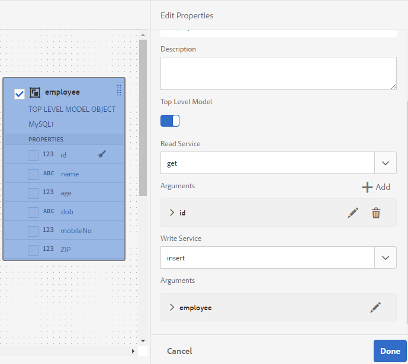
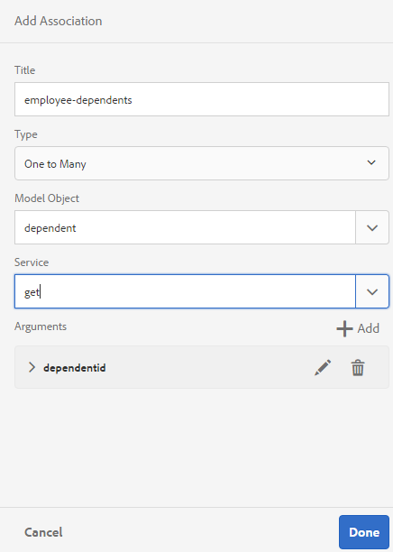

# Werken met formuliergegevensmodel {#work-with-form-data-model}

>[!CAUTION]
>
>AEM 6.4 heeft het einde van de uitgebreide ondersteuning bereikt en deze documentatie wordt niet meer bijgewerkt. Raadpleeg voor meer informatie onze [technische ondersteuningsperioden](https://helpx.adobe.com/support/programs/eol-matrix.html). Ondersteunde versies zoeken [hier](https://experienceleague.adobe.com/docs/).

De Integratie van gegevens verstrekt de modelredacteur van vormgegevens om met de modellen van vormgegevens te vormen en te werken.


De formuliergegevensmodeleditor biedt een intuïtieve gebruikersinterface en hulpmiddelen voor het bewerken en configureren van een formuliergegevensmodel. Met behulp van de editor kunt u gegevensmodelobjecten, eigenschappen en services toevoegen en configureren vanuit gekoppelde gegevensbronnen in het formuliergegevensmodel. Daarnaast kunt u gegevensmodelobjecten en -eigenschappen maken zonder gegevensbronnen en deze later binden met de respectievelijke gegevensmodelobjecten en -eigenschappen. U kunt ook voorbeeldgegevens genereren en bewerken voor objecteigenschappen van gegevensmodellen die u kunt gebruiken om aangepaste formulieren en interactieve communicatie vooraf in te vullen tijdens het weergeven van een voorbeeld. U kunt gegevensmodelvoorwerpen en de diensten testen die in een model van vormgegevens worden gevormd om ervoor te zorgen het behoorlijk met gegevensbronnen wordt geïntegreerd.

Zie de volgende onderwerpen als u nog niet bekend bent met de Forms-gegevensintegratie en geen gegevensbron hebt geconfigureerd of een formuliergegevensmodel hebt gemaakt:

* [AEM Forms-gegevensintegratie](/help/forms/using/data-integration.md)
* [Gegevensbronnen configureren](/help/forms/using/configure-data-sources.md)
* [Formuliergegevensmodel maken](/help/forms/using/create-form-data-models.md)

Lees verder voor meer informatie over verschillende taken en configuraties die u kunt uitvoeren met de formuliergegevensmodeleditor.

>[!NOTE]
>
>U moet lid zijn van beide **fdm-auteur** en **formuliergebruiker** groepen die u wilt maken en werken met het formuliergegevensmodel. Neem contact op met de AEM beheerder om lid te worden van de groepen.

## Objecten en services voor gegevensmodellen toevoegen {#add-data-model-objects-and-services}

Als u een formuliergegevensmodel met gegevensbronnen hebt gemaakt, kunt u de formuliergegevensmodeleditor gebruiken om gegevensmodelobjecten en -services toe te voegen, de eigenschappen ervan te configureren, koppelingen tussen gegevensmodelobjecten te maken en het gegevensmodel en de services van het formulier te testen.

U kunt gegevensmodelvoorwerpen en de diensten van beschikbare gegevensbronnen in het model van vormgegevens toevoegen. Terwijl de toegevoegde voorwerpen van het gegevensmodel op het Modellusje verschijnen, verschijnen de toegevoegde diensten op het lusje van de Diensten.

Objecten en services voor gegevensmodellen toevoegen:

1. Log in de AEM auteur instantie, navigeer naar **[!UICONTROL Forms > Data Integrations]** en opent u het formuliergegevensmodel waarin u gegevensmodelobjecten wilt toevoegen.
1. In de ruit van Gegevensbronnen, breid gegevensbronnen uit om beschikbare voorwerpen en de diensten van het gegevensmodel te bekijken.
1. Selecteer gegevensmodelobjecten en -services die u wilt toevoegen aan het formuliergegevensmodel en tik op **[!UICONTROL Add Selected]**.

   

   Op het tabblad Model wordt een grafische weergave weergegeven van alle gegevensmodelobjecten en de bijbehorende eigenschappen die aan het formuliergegevensmodel zijn toegevoegd. Elk gegevensmodelobject wordt vertegenwoordigd door een vak in het formuliergegevensmodel.

   

   >[!NOTE]
   >
   >U kunt gegevensmodelobjectvakken vastzetten en slepen om ze in het inhoudsgebied te ordenen. Alle gegevensmodelobjecten die in het formuliergegevensmodel worden toegevoegd, worden grijs weergegeven in het deelvenster Gegevensbronnen.

   Het tabblad Services bevat toegevoegde services.

   

   >[!NOTE]
   >
   >Naast gegevensmodelvoorwerpen en de diensten, omvat het document van de de dienstmeta-gegevens OData navigatie eigenschappen die vereniging tussen twee voorwerpen van het gegevensmodel bepalen. Zie voor meer informatie [Werken met navigatie-eigenschappen van OData-diensten](#work-with-navigation-properties-of-odata-services).

1. Tikken **[!UICONTROL Save]** om het formuliermodelobject op te slaan.

   >[!NOTE]
   >
   >U kunt services die u hebt geconfigureerd op het tabblad Services van een formuliergegevensmodel, aanroepen met behulp van de adaptieve formulierregels. De gevormde diensten zijn beschikbaar in de Invoke de dienstenactie van de regelredacteur voor meer informatie over het gebruiken van deze diensten in adaptieve vormregels, zie de Diensten van de Invoke en ReeksWaarde van regels in [regeleditor](/help/forms/using/rule-editor.md).

## Gegevensmodelobjecten en onderliggende eigenschappen maken {#create-data-model-objects-and-child-properties}

### Gegevensmodelobjecten maken {#create-data-model-objects}

Terwijl u gegevensmodelvoorwerpen van gevormde gegevensbronnen kunt toevoegen, kunt u voorwerpen of entiteiten van het gegevensmodel zonder gegevensbronnen ook tot stand brengen. Dit is vooral handig als u geen gegevensbronnen hebt geconfigureerd in het formuliergegevensmodel.

Een gegevensmodelobject maken zonder gegevensbronnen:

1. Log in de AEM auteur instantie, navigeer naar **[!UICONTROL Forms > Data Integrations]** en opent u het formuliergegevensmodel waarin u een gegevensmodelobject of -entiteit wilt maken.
1. Tik op **[!UICONTROL Create Entity]**.
1. Geef in het dialoogvenster Gegevensmodel maken een naam op voor het gegevensmodelobject en tik op **[!UICONTROL Add]**. Er wordt een gegevensmodelobject toegevoegd aan het formuliergegevensmodel. Het nieuwe gegevensmodelobject is niet gebonden aan een gegevensbron en heeft geen eigenschappen zoals in de volgende afbeelding wordt getoond.

   

Vervolgens kunt u onderliggende eigenschappen toevoegen aan niet-gebonden gegevensmodelobjecten.

### Onderliggende eigenschappen toevoegen {#child-properties}

Met de formuliergegevensmodeleditor kunt u onderliggende eigenschappen in een gegevensmodelobject maken. De eigenschap bij het maken is niet gebonden aan een eigenschap in een gegevensbron. U kunt de eigenschap child later binden met een andere eigenschap in het omvattende gegevensmodelobject.

Een onderliggende eigenschap maken:

1. Selecteer in een formuliergegevensmodel een gegevensmodelobject en tik op **[!UICONTROL Create Child Property]**.
1. In de **[!UICONTROL Create Child Property]** een naam en gegevenstype voor de eigenschap op in het dialoogvenster **[!UICONTROL Name]** en **[!UICONTROL Type]** respectievelijk velden. U kunt desgewenst een titel en beschrijving voor de eigenschap opgeven.
1. Schakel Berekend in als de eigenschap een berekende eigenschap is. De waarde van een berekende eigenschap wordt berekend op basis van een regel of expressie. Zie voor meer informatie [Eigenschappen bewerken](#edit-properties).
1. Als het gegevensmodelobject aan een gegevensbron is gebonden, wordt de toegevoegde onderliggende eigenschap automatisch gebonden aan de eigenschap van het bovenliggende gegevensmodelobject met dezelfde naam en hetzelfde gegevenstype.

   Als u een onderliggende eigenschap handmatig wilt binden met een objecteigenschap van het gegevensmodel, tikt u op het bladerpictogram naast de knop **[!UICONTROL Bind Reference]** veld. De **[!UICONTROL Select Object]** bevat alle eigenschappen van het bovenliggende gegevensmodelobject. Selecteer een eigenschap die u wilt binden en tik op het verdeelstreeppictogram. Merk op dat u slechts een bezit van het zelfde gegevenstype zoals het kindbezit kunt selecteren.

1. Tikken **[!UICONTROL Done]** om de eigenschap child op te slaan en te tikken **[!UICONTROL Save]** om het formuliergegevensmodel op te slaan.. De eigenschap child wordt nu toegevoegd aan het gegevensmodelobject.

Nadat u gegevensmodelobjecten en -eigenschappen hebt gemaakt, kunt u doorgaan met het maken van adaptieve formulieren en interactieve communicatie op basis van het formuliergegevensmodel. Als u later gegevensbronnen beschikbaar en geconfigureerd hebt, kunt u het gegevensmodel van het formulier binden met gegevensbronnen. De binding wordt automatisch bijgewerkt in de bijbehorende adaptieve formulieren en interactieve communicatie. Zie voor meer informatie over het maken van adaptieve formulieren en interactieve communicatie met behulp van het formuliergegevensmodel [Formuliergegevensmodel gebruiken](/help/forms/using/using-form-data-model.md).

### Objecten en eigenschappen van gegevensmodellen binden {#bind-data-model-objects-and-properties}

Wanneer de gegevensbronnen die u wilt integreren met het formuliergegevensmodel beschikbaar zijn, kunt u deze toevoegen aan het formuliergegevensmodel zoals beschreven in [Gegevensbronnen bijwerken](/help/forms/using/create-form-data-models.md#update). Voer vervolgens de volgende handelingen uit om de niet-gebonden gegevensmodelobjecten en -eigenschappen te binden:

1. Selecteer in het formuliergegevensmodel de niet-gebonden gegevensbron die u met een gegevensbron wilt binden.
1. Tik op **[!UICONTROL Edit Properties]**.
1. In de **[!UICONTROL Edit Properties]** tikken op het bladerpictogram naast het deelvenster **[!UICONTROL Binding]** veld. Het opent de **[!UICONTROL Select Object]** dialoogvenster met een lijst met gegevensbronnen die zijn toegevoegd aan het formuliergegevensmodel.

   

1. Vouw de gegevensbronstructuur uit en selecteer een gegevensmodelobject om mee te binden en tik op het verdeelstreeppictogram.
1. Tikken **[!UICONTROL Done]** om de eigenschappen op te slaan en vervolgens te tikken **[!UICONTROL Save]** om het formuliergegevensmodel op te slaan. Het gegevensmodelobject is nu gebonden aan een gegevensbron. Het gegevensmodelobject is niet meer gemarkeerd als Niet geconsolideerd.

   

## Services configureren {#configure-services}

Om gegevens voor een voorwerp van het gegevensmodel te lezen en te schrijven, doe het volgende om gelezen te vormen en de diensten te schrijven:

1. Schakel het selectievakje boven aan een gegevensmodelobject in om het te selecteren en te tikken **[!UICONTROL Edit Properties]**.

   

   Eigenschappen bewerken om lees- en schrijfservices voor een gegevensmodelobject te configureren

   Het dialoogvenster Eigenschappen bewerken wordt geopend.

   

   Eigenschappen bewerken, dialoogvenster

   >[!NOTE]
   >
   >Naast gegevensmodelvoorwerpen en de diensten, omvat het document van de de dienstmeta-gegevens OData navigatie eigenschappen die vereniging tussen twee voorwerpen van het gegevensmodel bepalen. Wanneer u een de dienstgegevensbron van OData aan een Model van de Gegevens van de Vorm toevoegt, is er de dienst beschikbaar in het Model van de Gegevens van de Vorm voor alle navigatie eigenschappen in een voorwerp van het gegevensmodel. U kunt deze service gebruiken om de navigatie-eigenschappen van het overeenkomende gegevensmodelobject te lezen.
   >
   >Voor meer informatie die de dienst gebruikt, zie [Werken met navigatie-eigenschappen van OData-diensten](#work-with-navigation-properties-of-odata-services).

1. Schakelen **[!UICONTROL Top Level Object]** om op te geven of het gegevensmodelobject een modelobject op het hoogste niveau is.

   Gegevensmodelobjecten die zijn geconfigureerd in een formuliergegevensmodel, zijn beschikbaar voor gebruik op het tabblad Gegevensmodelobjecten in de inhoudbrowser van een adaptief formulier op basis van het formuliergegevensmodel. Wanneer u een koppeling toevoegt tussen twee gegevensmodelobjecten, wordt het gegevensmodelobject dat u koppelt, genest onder het gegevensmodelobject dat u koppelt op het tabblad Gegevensmodelobjecten. Als het geneste gegevensmodel een object op hoofdniveau is, wordt het ook afzonderlijk weergegeven op het tabblad Objecten gegevensmodel. Daarom ziet u twee items ervan, een binnen en een buiten de geneste hiërarchie, die verwarring kunnen veroorzaken bij auteurs van formulieren. Als u het gekoppelde gegevensmodelobject alleen in de geneste hiërarchie wilt weergeven, schakelt u de eigenschap Object op hoogste niveau uit.

1. Selecteer de Lezen en schrijven diensten voor de geselecteerde voorwerpen van het gegevensmodel. De argumenten voor de services worden weergegeven.

   

   Lees en schrijf de diensten die voor werknemersgegevensbron worden gevormd

1. Tikken  voor het de gelezen dienstargument om het argument aan een Attribuut van het Profiel van de Gebruiker, een Attribuut van het Verzoek, of Letterlijke waarde te binden en de bindende waarde te specificeren. Het bindt het de dienstargument aan de gespecificeerde bindende attributen of letterlijke waarde, die tot de dienst als argument wordt overgegaan om details te halen verbonden aan de gespecificeerde waarde uit de gegevensbron.

   In dit voorbeeld wordt `id` het argument zal de waarde van `empid` van het gebruikersprofiel en geef het als argument aan de gelezen dienst door. Hiermee worden waarden van gekoppelde eigenschappen gelezen en geretourneerd vanuit de `employee` gegevensmodelobject voor het opgegeven `empid`. Dus als u 00250 opgeeft in het dialoogvenster `empid` in het formulier leest de leesservice details van de werknemer met 00250 werknemer id .

   Daarnaast kunt u een argument verplicht of optioneel maken.

   

   Het id-argument binden om kenmerk van AEM gebruikersprofiel leeg te maken

1. Tikken **[!UICONTROL Done]** om het argument op te slaan, **[!UICONTROL Done]** om de eigenschappen op te slaan, en vervolgens **[!UICONTROL Save]** om het formuliergegevensmodel op te slaan.

## Koppelingen toevoegen {#add-associations}

Er zijn doorgaans koppelingen tussen gegevensmodelobjecten in een gegevensbron. De koppeling kan een-op-een of een-op-een zijn. Bijvoorbeeld, kunnen er veelvoudige gebiedsdelen verbonden aan een werknemer zijn. Het wordt bedoeld als één-op-vele vereniging en afgebeeld door `1:n` op de regel die gekoppelde gegevensmodelobjecten verbindt. Nochtans, als een vereniging een unieke werknemersnaam voor een bepaalde werknemersidentiteitskaart terugkeert, wordt het bedoeld als één-op-één vereniging.

Wanneer u gekoppelde gegevensmodelobjecten in een gegevensbron toevoegt aan een formuliergegevensmodel, blijven de koppelingen behouden en worden ze weergegeven als verbonden door pijllijnen. In een formuliergegevensmodel kunt u koppelingen toevoegen tussen gegevensmodelobjecten in verschillende gegevensbronnen.

>[!NOTE]
>
>Vooraf gedefinieerde koppelingen in een JDBC-gegevensbron blijven niet behouden in het formuliergegevensmodel. U moet ze handmatig maken.

Een koppeling toevoegen:

1. Schakel het selectievakje boven aan een gegevensmodelobject in om het te selecteren en te tikken **[!UICONTROL Add Association]**. Het dialoogvenster Koppeling toevoegen wordt geopend.

   

   >[!NOTE]
   >
   >Naast gegevensmodelvoorwerpen en de diensten, omvat het document van de de dienstmeta-gegevens OData navigatie eigenschappen die vereniging tussen twee voorwerpen van het gegevensmodel bepalen. U kunt deze navigatie-eigenschappen gebruiken wanneer u koppelingen toevoegt aan het formuliergegevensmodel. Zie voor meer informatie [Werken met navigatie-eigenschappen van OData-diensten](#work-with-navigation-properties-of-odata-services).

   Het dialoogvenster Koppeling toevoegen wordt geopend.

   

   Dialoogvenster Koppeling toevoegen

1. In de Add ruit van de Vereniging:

   * Geef een titel op voor de koppeling.
   * Selecteer het associatietype — Een-op-een of een-op-een.
   * Selecteer het gegevensmodelobject dat u wilt koppelen.
   * Selecteer de leesservice om gegevens van het geselecteerde modelobject te lezen. Het argument van de leesservice wordt weergegeven. Bewerk het argument om het indien nodig te wijzigen en koppel het aan de eigenschap van het gegevensmodelobject dat u wilt koppelen.

   In het volgende voorbeeld is het standaardargument voor de leesservice van het gegevensmodelobject Afhankelijkheden `dependentid`.

   

   Het standaardargument voor de dienst van het lezen van Afhankelijkheden is afhankelijk

   Het argument moet echter een gemeenschappelijke eigenschap zijn tussen het gekoppelde gegevensmodelobject, die in dit voorbeeld `Employeeid`. Daarom `Employeeid` argument moet gebonden zijn aan de `id` bezit van het de gegevensmodelvoorwerp van de Werknemer om de bijbehorende gebiedsdeeldetails van het het modelvoorwerp van Afhankelijke gegevens te halen.

   

   Bijgewerkt argument en binding

   Tikken **[!UICONTROL Done]** om het argument op te slaan.

1. Tikken **[!UICONTROL Done]** om de vereniging te bewaren en dan **[!UICONTROL Save]** om het formuliergegevensmodel op te slaan.
1. Herhaal de stappen om desgewenst meer koppelingen te maken.

>[!NOTE]
>
>De toegevoegde koppeling wordt in het vak met gegevensmodelobjecten weergegeven met de opgegeven titel en een regel die de bijbehorende gegevensmodelobjecten verbindt.
>
>U kunt een koppeling bewerken door het desbetreffende selectievakje in te schakelen en te tikken **[!UICONTROL Edit Association]**.


## Eigenschappen bewerken {#properties}

U kunt eigenschappen van gegevensmodelobjecten bewerken, de eigenschappen ervan en de services die zijn toegevoegd aan het formuliergegevensmodel.

Eigenschappen bewerken:

1. Schakel het selectievakje in naast een gegevensmodelobject, een eigenschap of een service in het formuliergegevensmodel.
1. Tik op **[!UICONTROL Edit Properties]**. De **[!UICONTROL Edit Properties]** wordt voor het geselecteerde modelobject, de geselecteerde eigenschap of de geselecteerde service geopend.

   * **Object gegevensmodel**: Geef de lees- en schrijfservices op en bewerk argumenten.
   * **Eigenschap**: Geef het type, subtype en de indeling voor de eigenschap op. U kunt ook opgeven of de geselecteerde eigenschap de primaire sleutel voor het gegevensmodelobject is.
   * **Service**: Geef het invoermodelobject, het uitvoertype en de argumenten voor de service op. Voor de Get dienst, kunt u specificeren als het wordt verwacht om een serie terug te keren.

   

   Dialoogvenster Eigenschappen bewerken voor een get-service

1. Tikken **[!UICONTROL Done]** om eigenschappen op te slaan en vervolgens **[!UICONTROL Save]** om het formuliergegevensmodel op te slaan.

### Berekende eigenschappen maken {#computed}

Een berekende eigenschap is de eigenschap waarvan de waarde wordt berekend op basis van een regel of expressie. Met behulp van een regel kunt u de waarde van een berekende eigenschap instellen op een letterlijke tekenreeks, een getal, het resultaat van een wiskundige expressie of de waarde van een andere eigenschap in het formuliergegevensmodel.

U kunt bijvoorbeeld een berekende eigenschap maken **FullName** waarvan de waarde het resultaat is van samenvoegen van de bestaande **FirstName** en **LastName** eigenschappen. Daartoe:

1. Een nieuwe eigenschap met de naam maken `FullName` waarvan het gegevenstype String is.
1. Inschakelen **[!UICONTROL Computed]** en tikken **[!UICONTROL Done]** om de eigenschap te maken.

   

   De berekende eigenschap FullName wordt gemaakt. Let op het pictogram naast de eigenschap om een berekende eigenschap weer te geven.

   

1. Selecteer de eigenschap FullName en tik op **[!UICONTROL Edit Rule]**. Er wordt een regeleditorvenster geopend.
1. Tik in het venster van de regeleditor op **[!UICONTROL Create]**. A **[!UICONTROL Set Value]** regelvenster wordt geopend.

   Selecteer in het keuzemenu Optie selecteren de optie **[!UICONTROL Mathematical Expression]**. Andere beschikbare opties zijn **[!UICONTROL Form Data Model Object]** en **[!UICONTROL String]**.

1. Selecteer in de wiskundige expressie de optie **[!UICONTROL FirstName]** en **[!UICONTROL LastName]** in respectievelijk eerste en tweede object. Selecteren **[!UICONTROL plus]** als de operator.

   Tikken **[!UICONTROL Done]** en tik vervolgens op **[!UICONTROL Close]** om het venster van de regelredacteur te sluiten. De regel ziet er ongeveer als volgt uit.

   

1. Tik in het formuliergegevensmodel op **[!UICONTROL Save]**. Het gegevens verwerkte bezit wordt gevormd.

## Werken met navigatie-eigenschappen van OData-diensten {#work-with-navigation-properties-of-odata-services}

In de diensten van OData, navigatie worden de eigenschappen gebruikt om verenigingen tussen twee voorwerpen van het gegevensmodel te bepalen. Deze eigenschappen worden gedefinieerd op een entiteitstype of een complex type. Bijvoorbeeld in het volgende uittreksel van het meta-gegevensdossier van het steekproef [TripPin](https://www.odata.org/blog/trippin-new-odata-v4-sample-service/) OData-voorbeeldservices bevat de personenentiteit drie navigatie-eigenschappen: Vrienden, BestFriend en Trips.

Zie voor meer informatie over navigatie-eigenschappen [OData-documentatie](https://docs.oasis-open.org/odata/odata/v4.0/errata03/os/complete/part3-csdl/odata-v4.0-errata03-os-part3-csdl-complete.html#_Toc453752536).

```xml
<edmx:Edmx xmlns:edmx="https://docs.oasis-open.org/odata/ns/edmx" Version="4.0">
<script/>
<edmx:DataServices>
<Schema xmlns="https://docs.oasis-open.org/odata/ns/edm" Namespace="Microsoft.OData.Service.Sample.TrippinInMemory.Models">
<EntityType Name="Person">
<Key>
<PropertyRef Name="UserName"/>
</Key>
<Property Name="UserName" Type="Edm.String" Nullable="false"/>
<Property Name="FirstName" Type="Edm.String" Nullable="false"/>
<Property Name="LastName" Type="Edm.String"/>
<Property Name="MiddleName" Type="Edm.String"/>
<Property Name="Gender" Type="Microsoft.OData.Service.Sample.TrippinInMemory.Models.PersonGender" Nullable="false"/>
<Property Name="Age" Type="Edm.Int64"/>
<Property Name="Emails" Type="Collection(Edm.String)"/>
<Property Name="AddressInfo" Type="Collection(Microsoft.OData.Service.Sample.TrippinInMemory.Models.Location)"/>
<Property Name="HomeAddress" Type="Microsoft.OData.Service.Sample.TrippinInMemory.Models.Location"/>
<Property Name="FavoriteFeature" Type="Microsoft.OData.Service.Sample.TrippinInMemory.Models.Feature" Nullable="false"/>
<Property Name="Features" Type="Collection(Microsoft.OData.Service.Sample.TrippinInMemory.Models.Feature)" Nullable="false"/>
<NavigationProperty Name="Friends" Type="Collection(Microsoft.OData.Service.Sample.TrippinInMemory.Models.Person)"/>
<NavigationProperty Name="BestFriend" Type="Microsoft.OData.Service.Sample.TrippinInMemory.Models.Person"/>
<NavigationProperty Name="Trips" Type="Collection(Microsoft.OData.Service.Sample.TrippinInMemory.Models.Trip)"/>
</EntityType>
```

Wanneer u een OData-service in een formuliergegevensmodel configureert, worden alle navigatie-eigenschappen in een entiteitcontainer beschikbaar gesteld via een service in het formuliergegevensmodel. In dit voorbeeld van de TripPin OData-service worden de drie navigatie-eigenschappen in de `Person` entiteitscontainer kan worden gelezen gebruikend één `GET LINK` in het formuliergegevensmodel.

Het volgende benadrukt `GET LINK of Person /People` -service in het formuliergegevensmodel. Dit is een gecombineerde service voor de drie navigatie-eigenschappen in het dialoogvenster `Person` entiteit van de TripPin OData-dienst.


Wanneer u het `GET LINK` De dienst aan het lusje van de Diensten in het Model van de Gegevens van de Vorm, kunt u de eigenschappen uitgeven om het voorwerp van het outputmodel en het navigatie bezit te kiezen in de dienst te gebruiken. Het volgende wordt bijvoorbeeld `GET LINK of Person /People` In het volgende voorbeeld wordt Trip gebruikt als het uitvoermodelobject en de navigatie-eigenschap als Trips.


>[!NOTE]
>
>De waarden die beschikbaar zijn in de **[!UICONTROL Default Value]** van het **NavigationPropertyName** het argument hangt af van de toestand van de **[!UICONTROL Return array?]** schakelknop. Als deze optie is ingeschakeld, worden navigatie-eigenschappen van het type Verzameling weergegeven.

In dit voorbeeld kunt u het uitvoermodelobject ook kiezen als argument voor personen- en navigatie-eigenschappen als Vrienden of als BesteVriend (afhankelijk van of **[!UICONTROL Return array?]** is in- of uitgeschakeld).


Op dezelfde manier kunt u een `GET LINK` de dienst en vormt zijn navigatie-eigenschappen wanneer het toevoegen van verenigingen in het Model van de Gegevens van de Vorm. Als u echter een navigatie-eigenschap wilt selecteren, moet u ervoor zorgen dat de **[!UICONTROL Binding To field]** is ingesteld op **[!UICONTROL Literal]**.


## Voorbeeldgegevens genereren en bewerken {#sample}

Met de formuliergegevensmodeleditor kunt u voorbeeldgegevens genereren voor alle eigenschappen van gegevensmodelobjecten, inclusief berekende eigenschappen, in een formuliergegevensmodel. Het is een reeks willekeurige waarden die met het gegevenstype voldoen dat voor elk bezit wordt gevormd. U kunt ook gegevens bewerken en opslaan. Deze blijven behouden, zelfs als u de voorbeeldgegevens opnieuw genereert.

Ga als volgt te werk om voorbeeldgegevens te genereren en te bewerken:

1. Een formuliergegevensmodel openen en tikken **[!UICONTROL Edit Sample Data]**. De voorbeeldgegevens worden gegenereerd en weergegeven in het venster Voorbeeldgegevens bewerken.

   

1. In **[!UICONTROL Edit Sample Data]** venster, gegevens naar wens bewerken en tikken **[!UICONTROL Save]**.

Vervolgens kunt u de voorbeeldgegevens gebruiken om interactieve communicatie vooraf in te vullen en te testen op basis van het gegevensmodel van het formulier. Zie voor meer informatie [Formuliergegevensmodel gebruiken](/help/forms/using/using-form-data-model.md).

## Objecten en services van gegevensmodellen testen {#test-data-model-objects-and-services}

Uw formuliergegevensmodel is geconfigureerd, maar voordat u het in gebruik neemt, wilt u wellicht testen of de geconfigureerde gegevensmodelobjecten en -services naar behoren werken. Objecten en services van gegevensmodellen testen:

1. Selecteer een gegevensmodelobject of een service in het formuliergegevensmodel en tik op **[!UICONTROL Test Model Object]** of **[!UICONTROL Test Service]**, respectievelijk.

   Het venster Formuliergegevensmodel testen wordt geopend.

   

1. Selecteer in het venster Testformuliergegevensmodel het gegevensmodelobject of de gegevensservice die u wilt testen in het deelvenster Invoer.

1. Geef een argumentwaarde op in de testcode en tik op **[!UICONTROL Test]**. Een geslaagde test retourneert de uitvoer in het deelvenster Uitvoer.

   

U kunt ook andere gegevensmodelobjecten en -services testen in het formuliergegevensmodel.

## Volgende stappen {#next-steps}

U hebt een werkformuliergegevensmodel dat nu klaar is voor gebruik in adaptieve formulieren en interactieve communicatieworkflows. Zie voor meer informatie [Formuliergegevensmodel gebruiken](/help/forms/using/using-form-data-model.md).
