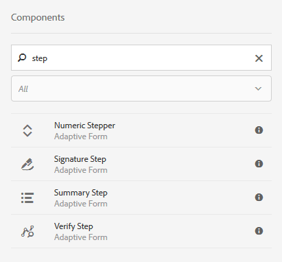

# Adobe Sign gebruiken in een adaptieve vorm {#using-adobe-sign-in-an-adaptive-form}

Workflows voor e-handtekeningen (Adobe Sign) inschakelen voor een adaptief formulier om ondertekeningsworkflows te automatiseren, processen met één en meerdere handtekeningen te vereenvoudigen en formulieren van mobiele apparaten elektronisch te ondertekenen.

Adobe Sign maakt workflows voor e-handtekeningen mogelijk voor adaptieve formulieren. E-handtekeningen verbeteren werkstromen om documenten voor wettig, verkoop, loonlijst, personeelsbeheer, en meer gebieden te verwerken.

In een standaard Adobe Sign- en adaptief formulierscenario vult een gebruiker een adaptief formulier om een service aan te vragen. Een hypotheek- en creditcardaanvraag vereist bijvoorbeeld wettelijke handtekeningen van alle kredietnemers en medekredietnemers. Als u workflows voor elektronische handtekeningen wilt inschakelen voor vergelijkbare scenario&#39;s, kunt u Adobe Sign integreren met AEM Forms. Een paar andere voorbeelden zijn:

* Sluit overeenkomsten van om het even welk apparaat met volledig geautomatiseerde voorstel, citaat, en contractprocessen.
* Voltooi processen voor menselijke hulpbronnen sneller en geef uw werknemers de digitale ervaring.
* Verkort de duur van de contractcyclus en neem sneller aan boord van uw leveranciers.
* Maak digitale workflows waarmee algemene processen worden geautomatiseerd.

Adobe Sign-integratie met AEM Forms ondersteunt:

* Workflows voor ondertekening van enkelvoudige en meervoudige gebruikers
* Workflows voor opeenvolgende en gelijktijdige ondertekening
* In-form en out-of-form ondertekeningservaringen
* Formulieren ondertekenen als anonieme of aangemelde gebruiker
* Dynamische ondertekeningsprocessen (integratie met AEM Forms-workflow)
* Verificatie via een kennisbasis, telefoon en sociale profielen

Leer de [beste praktijken van het gebruiken van Adobe Sign met adaptieve vormen](https://medium.com/adobetech/using-adobe-sign-to-e-sign-an-adaptive-form-heres-the-best-way-to-do-it-dc3e15f9b684) om betere ondertekeningservaringen tot stand te brengen.

## Vereisten {#prerequisites}

Voordat u Adobe Sign in een adaptieve vorm gebruikt:

* Zorg ervoor dat de AEM Forms-cloudservice is geconfigureerd voor gebruik van Adobe Sign. Zie [Adobe Sign integreren met AEM Forms](/help/forms/using/adobe-sign-integration-adaptive-forms.md) voor meer informatie.
* Behoud de lijst met ondertekenaars klaar. U hebt voor elke ondertekenaar ten minste een e-mailadres nodig.

## Adobe Sign configureren voor een adaptief formulier {#configure-adobe-sign-for-an-adaptive-form}

Voer de volgende stappen uit om Adobe Sign voor een adaptief formulier te configureren:

1. [Aangepaste formuliereigenschappen bewerken voor Adobe-teken](#enableadobesign)
1. [Adobe Sign-velden toevoegen aan een adaptief formulier](#addadobesignfieldstoanadaptiveform)
1. [Adobe Sign inschakelen voor een adaptief formulier](#enableadobsignforanadaptiveform)
1. [Adobe Sign-Cloud Service selecteren voor een adaptief formulier](#selectadobesigncloudserviceforanadaptiveform)

1. [Adobe Sign-ondertekenaars toevoegen aan een adaptief formulier](#addsignerstoanadaptiveform)
1. [Selecteer Handeling verzenden voor een adaptief formulier](#selectsubmitactionforanadaptiveform)

### Aangepaste formuliereigenschappen bewerken voor Adobe Sign {#enableadobesign}

Configureer adaptieve formuliereigenschappen voor Adobe Sign voor een bestaand of een nieuw adaptief formulier.

[Maak een adaptief formulier voor Adobe ](/help/forms/using/working-with-adobe-sign.md#create-an-adaptive-form-for-adobe-sign) Signing beschrijft de stappen voor het maken van een adaptief basisformulier. Zie [Een adaptief formulier maken](/help/forms/using/creating-adaptive-form.md) voor andere opties die beschikbaar zijn wanneer u een adaptief formulier maakt.

#### Een adaptief formulier maken voor Adobe Sign {#create-an-adaptive-form-for-adobe-sign}

Voer de volgende stappen uit om een adaptief formulier voor Adobe Sign te maken:

1. Ga naar **[!UICONTROL Adobe Experience Manager]** > **[!UICONTROL Forms]** > **[!UICONTROL Forms & Documents]**.
1. Tik **[!UICONTROL Create]** en selecteer **[!UICONTROL Adaptive Form]**. Er wordt een lijst met sjablonen weergegeven. Selecteer de sjabloon en tik **[!UICONTROL Next]**.
1. Op het tabblad **[!UICONTROL Basic]**:

   1. Geef de **Naam** en **Titel** op voor het adaptieve formulier.
   1. Selecteer [configuratiecontainer](/help/forms/using/adobe-sign-integration-adaptive-forms.md#configure-adobe-sign-with-aem-forms) gecreeerd terwijl het vormen van Adobe Sign met AEM Forms.

      >[!NOTE]
      >
      >De **[!UICONTROL Adobe Sign Cloud Service]** dropdown lijst toont de wolkendiensten die in de configuratiecontainer worden gevormd die u op dit gebied selecteert. De vervolgkeuzelijst **[!UICONTROL Adobe Sign Cloud Service]** is beschikbaar in de sectie **[!UICONTROL Electronic Signature]** van de adaptieve formuliereigenschappen wanneer u de optie **[!UICONTROL Enable Adobe Sign]** selecteert.

1. Selecteer op het tabblad **[!UICONTROL Form Model]** een van de volgende opties:

   * Selecteer de optie **[!UICONTROL Associate form template as the Document of Record template]** en selecteer een Document van het malplaatje van het Verslag. Als u een op een formuliersjabloon gebaseerd adaptief formulier gebruikt, worden alleen de velden weergegeven die zijn gebaseerd op de bijbehorende formuliersjabloon. Niet alle velden van het adaptieve formulier worden weergegeven.
   * Selecteer de optie **[!UICONTROL Generate Document of Record]**. Als u een adaptief formulier met de optie Document of Record gebruikt, worden in het document dat wordt verzonden voor ondertekening alle velden van het adaptieve formulier weergegeven.

1. Tik **[!UICONTROL Create.]** Er wordt een adaptief formulier voor gebarentaal gemaakt, dat kan worden gebruikt om Adobe Sign-velden toe te voegen.

#### Een adaptief formulier bewerken voor Adobe Sign {#editafsign}

Voer de volgende stappen uit om Adobe Sign in een bestaande adaptieve vorm te gebruiken:

1. Ga naar **[!UICONTROL Adobe Experience Manager]** > **[!UICONTROL Forms]**> **[!UICONTROL Forms & Documents]**.
1. Selecteer het adaptieve formulier en tik **[!UICONTROL Properties]**.
1. Selecteer op het tabblad **[!UICONTROL Basic]** de [configuratiecontainer](/help/forms/using/adobe-sign-integration-adaptive-forms.md#configure-adobe-sign-with-aem-forms) die is gemaakt tijdens het configureren van Adobe Sign met AEM Forms.
1. Selecteer op het tabblad **[!UICONTROL Form Model]** een van de volgende opties:

   * Selecteer de optie **[!UICONTROL Associate form template as the Document of Record template]** en selecteer een Document van het malplaatje van het Verslag. Als u een op een formuliersjabloon gebaseerd adaptief formulier gebruikt, worden alleen de velden weergegeven die zijn gebaseerd op de bijbehorende formuliersjabloon. Niet alle velden van het adaptieve formulier worden weergegeven.
   * Selecteer de optie **[!UICONTROL Generate Document of Record]**. Als u een adaptief formulier met de optie Document of Record gebruikt, worden in het document dat wordt verzonden voor ondertekening alle velden van het adaptieve formulier weergegeven.

1. Tik op **[!UICONTROL Save & Close]**. Het adaptieve formulier is ingeschakeld voor Adobe Sign.

### Adobe Sign-velden toevoegen aan een adaptief formulier {#addadobesignfieldstoanadaptiveform}

Adobe Sign heeft verschillende velden die op een adaptief formulier kunnen worden geplaatst. Deze velden accepteren verschillende gegevenstypen, zoals handtekeningen, initialen, bedrijf of titel, en helpen bij het verzamelen van extra informatie tijdens het ondertekenen, samen met de handtekeningen. Met de Adobe Sign Block-component kunt u Adobe Sign-velden op verschillende locaties in een adaptief formulier plaatsen.

Voer de volgende stappen uit om velden toe te voegen aan een adaptief formulier en verschillende opties aan te passen met betrekking tot deze velden:

1. Sleep de component **Adobe Sign Block** van de componentbrowser naar het adaptieve formulier. De Adobe Sign Block-component heeft alle ondersteunde Adobe Sign-velden. Standaard wordt het veld **Handtekening** toegevoegd aan het aangepaste formulier.

   

   Het Adobe Sign Block is standaard niet zichtbaar in het gepubliceerde adaptieve formulier. Deze is alleen zichtbaar in de ondertekenende documenten. U kunt de zichtbaarheid van Adobe Sign Block wijzigen vanuit de eigenschappen van de Adobe Sign Block-component.

   >[!NOTE]
   >
   >* Het gebruik van een Adobe Sign-blok is niet verplicht om Adobe Sign in een adaptieve vorm te gebruiken. Als u geen Adobe Sign-blok gebruikt en geen velden toevoegt voor de ondertekenaars, wordt het standaardhandtekeningveld onder aan de ondertekenende documenten weergegeven.
   >* Gebruik Adobe Sign-blok alleen voor aanvullende formulieren die automatisch Document of Record genereren. Als u een aangepaste XDP gebruikt voor het genereren van een Document of een op een formuliersjabloon gebaseerd adaptief formulier, is een Adobe Sign-blok niet vereist.

1. Selecteer de **Adobe Sign Block** component en tik op het **Edit**  pictogram. Er worden opties weergegeven voor het toevoegen van velden en het opmaken van de weergave van een veld.

   

   **A.** Selecteer en voeg Adobe Sign-velden toe. **B.** Breid het blok van Adobe Sign tot het volledige schermmening uit

1. Tik op het **Adobe Sign-veld** -pictogram. Er worden opties weergegeven voor het selecteren en toevoegen van Adobe Sign-velden.

   Vouw het vervolgkeuzeveld **Type** uit om een Adobe Sign-veld te selecteren en tik op het pictogram Gereed  om het geselecteerde veld toe te voegen aan het Adobe Sign-blok. Het vervolgkeuzeveld **Type** bevat de typen Handtekening, Ondertekenaarinformatie en Gegevensveld. Adobe Sign-integratie met AEM Forms-ondersteuningsvelden die alleen in de keuzelijst Type worden weergegeven. Zie [Adobe Sign-documentatie](https://helpx.adobe.com/sign/help/field-types.html) voor meer informatie over Adobe Sign-velden.

   

   U moet een unieke naam opgeven voor een veld. U kunt ook de vereiste optie selecteren om een verplicht veld te markeren. Naast de optie **Naam** en **Vereist**, hebben sommige Adobe Sign-velden meer opties. Bijvoorbeeld masker en meerdere regels. Geef bovendien voor elk Adobe Sign-veld een unieke naam, ongeacht of de velden zich in dezelfde of in verschillende Adobe Sign-blokken bevinden.

### Adobe Sign inschakelen voor een adaptief formulier {#enableadobsignforanadaptiveform}

Adobe Sign is niet ingeschakeld voor een adaptief formulier. Voer de volgende stappen uit om het in te schakelen:

1. Tik in de Inhoudsbrowser op **Formuliercontainer** en tik op het pictogram **Configure** . De eigenschappenbrowser wordt geopend en de eigenschappen van de container Adaptief formulier worden weergegeven.
1. Vouw in de eigenschappenbrowser de accordeon **Elektronische handtekening** uit en selecteer de optie **Adobe Sign inschakelen**. Hiermee wordt Adobe Sign ingeschakeld voor een adaptief formulier.

### Adobe Sign-Cloud Service en -handtekeningvolgorde selecteren {#selectadobesigncloudserviceforanadaptiveform}

U kunt meerdere Adobe Sign-services configureren voor een exemplaar van AEM Forms. Het is raadzaam voor elke functie een aparte reeks diensten te hebben (Human Resource, Finance, enzovoort). Hierdoor wordt het bijhouden en rapporteren van ondertekende documenten eenvoudiger. Een bank heeft bijvoorbeeld meerdere afdelingen. U kunt een afzonderlijke configuratie voor elke afdeling hebben voor het beter volgen van de documenten.

Een document kan ook meerdere ondertekenaars hebben. Een creditcardtoepassing kan bijvoorbeeld meerdere aanvragers hebben. Een bank vereist handtekeningen van alle aanvragers voordat de aanvraag wordt verwerkt. Voor scenario&#39;s met meerdere ondertekenaars kunt u ervoor kiezen het document in volgorde van opeenvolgende of gelijktijdige ondertekening te ondertekenen.

Voer de volgende stappen uit om een cloudservice en de volgorde van ondertekening te selecteren:

1. Tik in de Inhoudsbrowser op **Formuliercontainer** en tik op het pictogram **Configure** . De eigenschappenbrowser wordt geopend en de eigenschappen van de container Adaptief formulier worden weergegeven.
1. Vouw in de eigenschappenbrowser de accordeon **Elektronische handtekening** uit en selecteer de optie **Adobe Sign inschakelen**. Hiermee wordt Adobe Sign ingeschakeld voor een adaptief formulier.
1. Selecteer een cloudservice in de lijst met Adobe Sign-Cloud Services die al is geconfigureerd.

   Als de **Adobe Sign-Cloud Service**-lijst leeg is, volgt u het [Adobe Sign configureren met AEM Forms](/help/forms/using/adobe-sign-integration-adaptive-forms.md)-artikel om de service te configureren.

   In het vervolgkeuzemenu worden de cloudservices weergegeven die in de map `global` in Gereedschappen > **[!UICONTROL Cloud Services]** > **[!UICONTROL Adobe Sign]** staan. Daarnaast bevat het vervolgkeuzemenu ook een lijst met de cloudservices die aanwezig zijn in de map die u selecteert in het veld **[!UICONTROL Configuration Container]** wanneer u een adaptief formulier maakt.

1. Selecteer de ondertekeningsvolgorde in het dialoogvenster **Ondertekenaars kunnen ondertekenen**. Adobe Sign-zangers kunnen een adaptief formulier **Sequentiaal** - één na een andere ondertekenaar of **Gelijktijdig** - in willekeurige volgorde ondertekenen.

   Eén ondertekenaar ontvangt het formulier voor ondertekening achtereenvolgens in de volgorde. Nadat een ondertekenaar het ondertekenen van het document heeft voltooid, wordt het formulier verzonden naar de volgende ondertekenaar, enzovoort.

   Meerdere ondertekenaars kunnen tegelijkertijd een formulier ondertekenen.

1. [Voeg ondertekenaars toe aan een aangepast ](#addsignerstoanadaptiveform) formulier en tik op het pictogram Done om de wijzigingen op te slaan.

### Ondertekenaars toevoegen aan een adaptief formulier {#addsignerstoanadaptiveform}

U kunt slechts één ondertekenaar of meerdere ondertekenaars hebben voor een adaptief formulier. Wanneer u een ondertekenaar toevoegt, kunt u ook verificatiedetails voor de ondertekenaar configureren. U kunt ook selecteren of de invuller en zanger van het formulier dezelfde persoon zijn. Voer de volgende stappen uit om diverse details over een ondertekenaar toe te voegen en te verstrekken:

1. Tik in de Inhoudsbrowser op **Formuliercontainer** en tik op het pictogram **Configure** . De eigenschappenbrowser wordt geopend met de eigenschappen van de container Adaptief formulier.
1. Vouw in de eigenschappenbrowser de accordeon **Elektronische handtekening** uit en selecteer de optie **Adobe Sign inschakelen**. Hiermee wordt Adobe Sign ingeschakeld voor een adaptief formulier.
1. Tik **Ondertekenaar toevoegen** onder **Configuratie ondertekenaar.** Er wordt een ondertekenaar toegevoegd aan het adaptieve formulier. U kunt meerdere Adobe Sign-ondertekenaars toevoegen aan een adaptief formulier.
1. 

   Klik op het pictogram **Bewerken**  om de volgende informatie over de ondertekenaar op te geven:

   * **Titel:** Geef een titel op om een ondertekenaar op unieke wijze te identificeren.
   * **Is de ondertekenaar en de persoon die het formulier invult hetzelfde?:** Selecteer  **Ja** als de invuller en de eerste ondertekenaar dezelfde persoon zijn. Als de optie is ingesteld op **Nee,**, gebruikt u de component voor de handtekeningstap niet in het adaptieve formulier. Als het formulier een component Handtekeningstap bevat, wordt het veld automatisch ingesteld op Ja.
   * **E-mailadres ondertekenaar:e-mailadres van ondertekenaar** opgeven. Ondertekenaar ontvangt om ondertekende documenten/formulier te zijn op het opgegeven e-mailadres. U kunt een e-mailadres gebruiken dat wordt opgegeven in een formulierveld, in AEM gebruikersprofiel van de aangemelde gebruiker, of handmatig een e-mailadres invoeren. Het is een verplichte stap. Houd er ook rekening mee dat als u slechts één ondertekenaar hebt geconfigureerd, het e-mailadres van de ondertekenaar niet hetzelfde is als het Adobe Sign-account dat wordt gebruikt om AEM-cloudservices te configureren.
   * **Verificatiemethode ondertekenaar:** geef de methode op om een gebruiker te verifiëren voordat u een formulier voor ondertekening opent. U kunt tussen telefoon, kennisbasis, en sociale op identiteit-gebaseerde authentificatie kiezen.

   >[!NOTE]
   >
   >* Standaard biedt verificatie op basis van sociale identiteiten een optie voor verificatie via Facebook, Google en LinkedIn. U kunt contact opnemen met Adobe Sign-ondersteuning om andere providers van sociale verificatie in te schakelen.

   * **Adobe Sign-velden die moeten worden ingevuld of ondertekend:Adobe Sign-velden** selecteren voor de ondertekenaar. Een adaptief formulier kan meerdere Adobe Sign-velden hebben. U kunt specifieke velden inschakelen voor een ondertekenaar. In het veld worden alle beschikbare Adobe Sign-blokken weergegeven. Wanneer u een blok selecteert, worden alle velden van het blok geselecteerd. U kunt het X-pictogram gebruiken om de selectie van een veld op te heffen.

   

   De bovenstaande afbeelding heeft twee voorbeelden van Adobe Sign Blocks: Persoonlijke gegevens en kantoorgegevens

   Tik op het pictogram Gereed . De ondertekenaar wordt toegevoegd en geconfigureerd.

### Selecteer Handeling verzenden voor een adaptief formulier {#selectsubmitactionforanadaptiveform}

Nadat u Adobe Sign-velden hebt toegevoegd aan een adaptief formulier, Adobe Sign inschakelen vanuit formuliercontainer, Adobe Sign-Cloud Service selecteren en Adobe Sign-ondertekenaars toevoegen, selecteert u een geschikte verzendactie voor het adaptieve formulier. Zie [De handeling Verzenden configureren](/help/forms/using/configuring-submit-actions.md) voor gedetailleerde informatie over adaptieve formulieren die handelingen verzenden.

Bovendien wordt een adaptief formulier dat geschikt is voor Adobe Sign alleen verzonden nadat alle ondertekenaars het formulier hebben ondertekend. Gedeeltelijk ondertekend formulier vindt u in de sectie Ondertekenen in behandeling van de portal Formulieren. Adobe Sign Configuration Service houdt de Adobe Sign-server op [regelmatige intervallen](/help/forms/using/adobe-sign-integration-adaptive-forms.md) om de status van handtekeningen te controleren. Als alle ondertekenaars het ondertekenen van het formulier hebben voltooid, wordt de verzendactieservice gestart en wordt het formulier verzonden. Als u een aangepaste verzendactie gebruikt en het formulier Adobe Sign gebruikt, werkt u de aangepaste verzendactie bij om de verzendactieservice te gebruiken.

>[!NOTE]
>
>Gegevens van het adaptieve formulier worden tijdelijk opgeslagen op Forms Portal. Het wordt aanbevolen [aangepaste opslag te gebruiken voor Forms Portal](/help/forms/using/configuring-draft-submission-storage.md). Het zorgt ervoor dat PII (persoonlijk identificeerbare informatie) gegevens niet op AEM servers wordt opgeslagen.

Uw ervaring voor het ondertekenen van formulieren is gereed. U kunt een voorbeeld van het formulier bekijken om de ondertekeningservaring te verifiëren. Op het gepubliceerde formulier worden de velden Adobe Sign Block weergegeven wanneer een ondertekenaar het formulier voor ondertekening via een e-mail ontvangt. Deze ervaring wordt ook wel bekend als een ondertekeningservaring in de vorm van een out-of-form. U kunt ook een ondertekeningservaring in formulieren configureren voor de eerste ondertekenaar. Zie [In-form ondertekeningservaring maken](/help/forms/using/working-with-adobe-sign.md#create-in-form-signing-experience) voor gedetailleerde stappen.

## Cloud-handtekeningen configureren voor een adaptief formulier {#configure-cloud-signatures-for-an-adaptive-form}

Digitale handtekeningen op basis van cloud of externe handtekeningen zijn een nieuwe generatie digitale handtekeningen die op verschillende computers, mobiele apparaten en het web werken en voldoen aan de hoogste standaarden en waarborgen voor ondertekenaarsverificatie. U kunt een adaptief formulier ondertekenen met digitale handtekeningen op basis van de cloud.

Nadat [adaptieve formuliereigenschappen voor Adobe sign](#enableadobesign) is bewerkt, voert u de volgende stappen uit om een veld voor een cloudhandtekening toe te voegen aan een adaptief formulier:

1. Sleep de component **Adobe Sign Block** van de componentbrowser naar het adaptieve formulier. De Adobe Sign Block-component heeft alle ondersteunde Adobe Sign-velden. Standaard wordt het veld **Handtekening** toegevoegd aan het aangepaste formulier.

   

1. Selecteer de **Adobe Sign Block** component en tik op het **Edit**  pictogram. Er worden opties weergegeven voor het toevoegen van velden en het opmaken van de weergave van een veld.

   

   **A.** Selecteer en voeg Adobe Sign-velden toe. **B.** Breid het blok van Adobe Sign tot het volledige schermmening uit

1. Tik op het **Adobe Sign-veld** -pictogram. Er worden opties weergegeven voor het selecteren en toevoegen van Adobe Sign-velden.

   Vouw het vervolgkeuzeveld **Type** uit om **Digitale handtekening** te selecteren en tik op het pictogram Gereed  om het geselecteerde veld toe te voegen aan het Adobe Sign-blok.

   

   U moet een unieke naam opgeven voor een veld.

   Digitale handtekeningen toepassen op het adaptieve formulier met:

   * Wolkhandtekeningen: Onderteken met een [digitale id](https://helpx.adobe.com/sign/kb/digital-certificate-providers.html) die wordt gehost door een vertrouwde serviceprovider.
   * Adobe Acrobat of Reader: Download en open het document met Adobe Acrobat of Reader om het te ondertekenen met behulp van een smartcard, USB-token of een op een bestand gebaseerde digitale id.

   Nadat u het handtekeningveld voor de cloud aan het adaptieve formulier hebt toegevoegd, voert u de volgende stappen uit om het configuratieproces te voltooien:

   * [Adobe Sign inschakelen voor een adaptief formulier](#enableadobsignforanadaptiveform)
   * [Adobe Sign-Cloud Service selecteren voor een adaptief formulier](#selectadobesigncloudserviceforanadaptiveform)
   * [Adobe Sign-ondertekenaars toevoegen aan een adaptief formulier](#addsignerstoanadaptiveform)
   * [Selecteer Handeling verzenden voor een adaptief formulier](#selectsubmitactionforanadaptiveform)

## Ondertekeningservaring in formulieren maken {#create-in-form-signing-experience}

Een gebruiker kan ook een adaptief formulier ondertekenen terwijl het formulier wordt ingevuld. Deze ervaring wordt ook wel &#39;in-form signing experience&#39; genoemd. De ondertekeningservaring in formulieren is alleen beschikbaar voor de eerste ondertekenaar in een omgeving met meerdere ondertekenaars. Voer de volgende stappen uit om een ondertekeningservaring in formulieren te maken voor een adaptief formulier:

1. [Voeg en vorm de component](#add-and-configure-the-signature-step-component) van de Stap van de Handtekening toe.
1. [Voeg de component](#configure-the-thank-you-page-or-summary-step-component) Samenvattingsstap toe.

### De component voor de stap Handtekening toevoegen en configureren {#add-and-configure-the-signature-step-component}

Gebruik de component Handtekeningstap om een gebied op te geven voor de elektronische ondertekening van het ingevulde formulier. Wanneer de sectie met de component Signature Step wordt weergegeven, wordt een ondertekenbare PDF-versie van het ingevulde formulier weergegeven. De component voor de stap Handtekening gebruikt de volledige breedte die beschikbaar is voor het formulier. Het wordt aanbevolen geen andere component op te nemen in de sectie die de component voor de stap Handtekening bevat.

Voer de volgende stappen uit om de component van de Stap van de Handtekening te vormen:

1. Sleep de component **Handtekeningstap** van de browser Components naar het formulier.
1. Selecteer de zojuist toegevoegde component van de Handtekeningstap en tik **Configure**  pictogram. De eigenschappenbrowser wordt geopend en de eigenschappen voor stap Handtekening worden weergegeven. Configureer de volgende eigenschappen:

   * **Elementnaam**: Geef de naam van de component op.
   * **Titel:** geef de unieke titel van de component op.
   * **Sjabloonbericht:** Geef het bericht op dat moet worden weergegeven terwijl de PDF van de handtekening wordt geladen. Het voorbereiden en laden van PDF-handtekeningen duurt enige tijd voor Adobe Sign-services.
   * **Ondertekeningsservice:** selecteer de optie  **Adobe** ondertekenen.
   * **Verouderde E-sign component** gebruiken: Als u het respectieve adaptieve formulier in de  [AEM Forms Workspace](/help/forms/using/introduction-html-workspace.md), de AEM Forms-app of het onderliggende adaptieve formulier een verouderde e-sign component gebruikt, selecteert u de  **Oudere E-sign** component gebruiken.
   * **Configuratie**: Selecteer een configuratie (Adobe Sign Cloud Service). De vervolgkeuzelijst is alleen beschikbaar als de optie **Use legacy E-sign component** is ingeschakeld.

   Tik op het pictogram Gereed  om de wijzigingen op te slaan.

   

   >[!NOTE]
   >
   >* Wanneer u de **[!UICONTROL Signature Step]**-component naar het formulier sleept, wordt de optie **[!UICONTROL Is the signer and the person filling the form same?]** automatisch ingesteld op **Yes**. U moet het formulier blijven gebruiken.
   >* Aangepaste formulieren die zijn ingeschakeld in Adobe Sign, ondersteunen niet het gebruik van de knop Verzenden in de sectie of het deelvenster met de component Stap handtekening. U kunt een summiere stap toevoegen nadat de stap van de Handtekening voor de handindiening of een automatische voorlegging wordt teweeggebracht na het interval dat wordt geplaatst gebruikend [de Dienst van de Configuratie van Adobe Sign](/help/forms/using/adobe-sign-integration-adaptive-forms.md#configure-adobe-sign-scheduler-to-sync-the-signing-status).

### De component {#configure-the-thank-you-page-or-summary-step-component} voor de pagina Hartelijk dank of de overzichtsstap configureren

Met de component **Summiere stap** wordt het formulier automatisch verzonden, wordt de informatie binnen de aangepaste overzichtspagina gevuld en wordt de samenvatting van het verzonden formulier weergegeven. Het krijgt ook de vereiste informatie in de terugkeerkaart. De component SummaryStep gebruikt de volledige breedte die beschikbaar is voor het formulier. Men adviseert om geen andere component op de sectie te hebben die de Summiere component van de Stap bevat.

De ervaring voor het ondertekenen van formulieren is nu gereed. U kunt een voorbeeld van het formulier bekijken om de ondertekeningservaring te verifiëren.

## Veelgestelde vragen {#frequently-asked-questions}

**V: U kunt een adaptief formulier insluiten in een ander adaptief formulier. Kan het ingesloten adaptieve formulier Adobe Sign ingeschakeld zijn?**

**Ans:** Nee, AEM Forms biedt geen ondersteuning voor het gebruik van een adaptief formulier waarmee een adaptief formulier dat geschikt is voor Adobe Sign wordt ingesloten voor ondertekening.

**V: Wanneer ik een adaptief formulier maak met de geavanceerde sjabloon en dit open voor bewerking, wordt het foutbericht &quot;Elektronische handtekeningen of ondertekenaars zijn niet correct geconfigureerd&quot; weergegeven. wordt weergegeven. Hoe kan ik het foutbericht oplossen?**

**Ans:** Adaptief formulier dat is gemaakt met de geavanceerde sjabloon is geconfigureerd voor gebruik van Adobe Sign. U lost de fout op door een Adobe Sign-cloudconfiguratie te maken en te selecteren en een Adobe Sign-ondertekenaar voor het aangepaste formulier te configureren.

**V: Kan ik Adobe Sign-tekstcodes gebruiken in een statisch tekstonderdeel van een adaptief formulier?**

**Ans:** Ja, u kunt tekstmarkeringen in een tekstcomponent gebruiken om de gebieden van Adobe Sign aan een  [Document van het Verslag](/help/forms/using/generate-document-of-record-for-non-xfa-based-adaptive-forms.md)  (Auto geproduceerde document van verslagoptie slechts) toe te voegen toegelaten adaptieve vorm. Zie [Adobe Sign Documentation](https://helpx.adobe.com/sign/help/text-tags.html) voor meer informatie over de procedure en regels voor het maken van een tekstcode. Houd er rekening mee dat adaptieve formulieren beperkte ondersteuning bieden voor tekstcodes. Met de tekstcodes kunt u alleen die velden maken die door Adobe Sign Block worden ondersteund.

**V: AEM Forms biedt zowel Adobe Sign-onderdelen voor blok- als handtekeningstappen. Kunnen deze gelijktijdig in een adaptieve vorm worden gebruikt?**

**Ans:** U kunt beide componenten tegelijkertijd in een formulier gebruiken. Hier volgen enkele aanbevelingen voor het gebruik van deze componenten:

**Adobe Sign Block:** u kunt het Adobe Sign Block gebruiken om Adobe Sign-velden overal op het adaptieve formulier toe te voegen. Het helpt ook om specifieke gebieden aan ondertekenaars toe te wijzen. Wanneer een adaptief formulier wordt voorvertoond of gepubliceerd, is Adobe Sign Block standaard niet zichtbaar. Deze blokken zijn alleen beschikbaar in het ondertekenende document. In het ondertekenende document worden alleen de velden ingeschakeld die zijn toegewezen aan een ondertekenaar. Adobe Sign-blok kan worden gebruikt met eerste en volgende ondertekenaars.

**Ondertekeningsstap, component:** u kunt de component Handtekeningstap gebruiken om in formulieren te ondertekenen. Hiermee kan alleen de eerste ondertekenaar ondertekenen terwijl het formulier wordt ingevuld. Wanneer de sectie met de component Signature Step wordt weergegeven, wordt een ondertekenbare PDF-versie van het formulier weergegeven. Het is doorgaans de laatste of voorlaatste sectie, gevolgd door een overzichtscomponent van een formulier.

