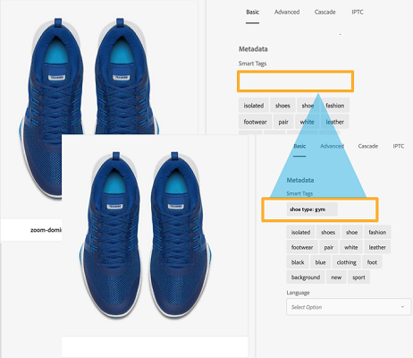

# Algemene opmerkingen bij de release van Adobe Experience Manager 6.4 {#general-release-notes-for-adobe-experience-manager}

>[!CAUTION]
>
>AEM 6.4 heeft het einde van de uitgebreide ondersteuning bereikt en deze documentatie wordt niet meer bijgewerkt. Raadpleeg voor meer informatie onze [technische ondersteuningsperioden](https://helpx.adobe.com/support/programs/eol-matrix.html). Ondersteunde versies zoeken [hier](https://experienceleague.adobe.com/docs/).

## Geen informatie {#release-information}

| Product | Adobe Experience Manager |
|---|---|
| Versie | 6.4 |
| Type | Grote release |
| Algemene beschikbaarheidsdatum | 4 april 2018 |
| Aanbevolen updates | Zie [AEM releases en updates](https://helpx.adobe.com/experience-manager/aem-releases-updates.html) |

### Trivia {#trivia}

De releasecyclus voor deze versie van Adobe Experience Manager is op 27 april 2017 gestart, heeft 22 versies van de kwaliteitsborging en de functie voor het corrigeren van fouten doorlopen en is op 22 maart 2018 afgelopen. Het totale aantal klantgerelateerde problemen, inclusief verbeteringen en nieuwe functies die in deze release zijn opgelost, is 704.

Adobe Experience Manager 6.4 is over het algemeen beschikbaar sinds 4 april 2018.

>[!NOTE]
>
>Adobe raadt u aan het nieuwste servicepakket te installeren, aangezien alle nieuwe functiepakketten alleen via [Servicepacks](https://helpx.adobe.com/experience-manager/maintenance-releases-roadmap.html).

## Wat is er nieuw {#what-s-new}

Adobe Experience Manager 6.4 is een upgrade-release naar de Adobe Experience Manager 6.3-codebasis. Het verstrekt nieuwe en verbeterde functionaliteit, zeer belangrijke klantenmoeilijke situaties, de verhogingen van de hoge prioriteit van de klant en algemene insectenmoeilijke situaties die op productstabilisatie gericht zijn. Het omvat ook de meerderheid van alle Adobe Experience Manager 6.3 eigenschapspakketten, hotfix, en de versies van het de dienstpak.

De onderstaande lijst biedt een overzicht, terwijl op de volgende pagina&#39;s alle details worden weergegeven.

### Experience Manager Foundation {#experience-manager-foundation}

Volledige lijst met wijzigingen in [AEM stichting](wcm-platform.md).

Het platform van Adobe Experience Manager 6.4 bouwt voort op de bijgewerkte versies van het op OSGi gebaseerde framework (Apache Sling en Apache Felix) en de Java Content Repository: Apache Jackrabbit Oak 1.8.2.

De QuickStart gebruikt Eclipse Jetty 9.3.22 als servlet-engine.

#### Gebruikersinterface {#user-interface}

Er zijn verschillende verbeteringen aangebracht in de interface om deze productiever en gebruiksvriendelijker te maken.

* [Nieuwe contentboom](/help/sites-authoring/basic-handling.md#content-tree) om snel door een hiërarchie te navigeren. In combinatie met de lijstmening, herstelt dit het Klassieke UI interactiemodel.
* Verbeterde schuifervaring in kaart- en lijstweergave van grote mappen.
* [Verbeterde interactie met de zoekresultaten](/help/sites-authoring/search.md) - Met de knop Vorige herstelt u het vorige zoekresultaat.
* [Extra sneltoetsen](/help/sites-authoring/keyboard-shortcuts.md)voor de meeste algemene handelingen, zoals het openen van een bepaalde spoorstaaf, het bewerken, verplaatsen en verwijderen van een item of het openen van eigenschappen.
* [Mogelijkheid om sneltoetsen uit te schakelen](/help/sites-authoring/user-properties.md) (in-/uitschakelen in Voorkeuren).
* [Stoppen met tijdstempels weergeven in alle UI](/help/sites-authoring/user-properties.md) relatief na 7 dagen (standaard ingesteld in Voorkeuren).

Zie de [Ontwerpdocumentatie](/help/sites-authoring/home.md) voor meer informatie over deze functies.

>[!CAUTION]
>
>Adobe is niet van plan om verdere verhogingen aan Klassieke UI te maken. AEM 6.4 heeft de klassieke gebruikersinterface inbegrepen, en klanten die van vroegere versies bevorderen kunnen het blijven gebruiken zoals is. Merk op dat Klassieke UI volledig wordt gesteund terwijl wordt afgekeurd. [Meer informatie](/help/sites-deploying/ui-recommendations.md).

#### Content-repository {#content-repository}

* Snellere en efficiëntere compressie door online revisie opschonen. Interne tests tonen aan dat de nieuwe staartverbinding tot 10 keer sneller is en meer schijfruimte kan terugwinnen met minder IOPS in vergelijking met AEM 6.3. Dit heeft minder invloed op de prestaties als de Online revisie Cleanup wordt uitgevoerd. Zie voor meer informatie [de documentatiepagina](/help/sites-deploying/revision-cleanup.md#full-and-tail-compaction-modes).

* Continuous Revision Cleanup for MongoMK vervangt gepland onderhoud voor opschonen
* Verbeterde efficiëntie voor het opschonen van revisies in documentknooppunten

#### Zoeken en indexeren {#search-indexing}

* Verbeterde ondersteuning voor indexeringsbewerkingen via &#39;ak-run&#39; (CLI):

   * Indexconsistentiecontrole
   * Indexeringsstatistieken
   * Indexconfiguratie importeren of exporteren
   * Opnieuw indexeren

* Verminderde groei van de Luceen-gerelateerde opslagplaats voor een algemene verbeterde systeemprestaties

Ga voor meer informatie naar [deze documentatiepagina](/help/sites-deploying/indexing-via-the-oak-run-jar.md).

#### Bewaking {#monitoring}

* Een nieuwe [Systeemoverzicht](/help/sites-administering/operations-dashboard.md#system-overview) verstrekt een momentopnamemening over alle prestaties-verwante systeemstatus en activiteiten.
* Een nieuwe set [Gezondheidscontroles](/help/sites-administering/operations-dashboard.md#health-checks) rond Indexering, Vragen en Onderhoud

#### Projecten en workflows {#projects-and-workflows}

* Alles-nieuw [Workfloweditor om workflowmodellen te maken en te bewerken](/help/sites-developing/workflows-models.md).

#### Upgrade uitvoeren vanaf eerdere versie {#upgrade-from-earlier-version}

* [Achterwaartse compatibiliteit](/help/sites-deploying/backward-compatibility.md): De achterwaartse compatibele eigenschappen in 6.4, helpen uw douanecode in de meeste gevallen compatibel blijven en verminderen verbeteringsinspanning.
* [Complexiteit-evaluatie van upgrade](/help/sites-deploying/pattern-detector.md): Het nieuwe gereedschap Patroondetector om de complexiteit van upgrades te beoordelen voordat u een upgrade uitvoert.
* [Repositoregeling](/help/sites-deploying/repository-restructuring.md): aanzienlijke herstructurering ( hoofdzakelijk / enz . ) om verbeteringen te vergemakkelijken en de toepassing van beste praktijken te bevorderen ;
* Voor meer algemene informatie over upgrades raadpleegt u de [deze pagina](/help/sites-deploying/upgrade.md) voor meer informatie .

### Experience Manager Sites {#experience-manager-sites}

Volledige lijst met wijzigingen in [AEM Sites en invoegtoepassingen](sites.md).

#### Vloeiende ervaringen {#fluid-experiences}

De introductie van Fluid Ervaring begin 2017, gesteund door de Fragments van de Inhoud, de Fragments van de Ervaring en de Diensten van de Inhoud waren het begin om aan een multi-kanaal-eerste inhoudsbeheer te evolueren. AEM 6.4 breidt elk van de gebieden aanzienlijk uit:

**[Contentfragmenten](/help/assets/content-fragments.md)**

Nieuw in 6.4 is visueel [inhoudsmodel](/help/assets/content-fragments-models.md) editor en een nieuwe [configureerbare component](https://experienceleague.adobe.com/docs/experience-manager-core-components/using/components/content-fragment-component.html) om flexibele HTML-uitvoer en JSON te bieden die kunnen worden opgenomen in Content Services.

**Ervaringsfragmenten**

Het maken van variaties in een fragment met dezelfde inhoud maar verschillende lay-outs is nu efficiënter dankzij de mogelijkheid Bouwstenen te maken. Naast het verzenden van Experience Fragments naar Facebook en Pinterest, is het nu mogelijk om ze naar Adobe Target te verzenden als aanbod.

**Inhoudsservices**

Er zijn verschillende verbeteringen aangebracht in Sling Model Exporter en de Core Components om een robuuste JSON-uitvoer te bieden voor het insluiten van inhoud in mobiele apps en ervaringen met apps van één pagina.

#### Sites sneller samenstellen {#gettings-sites-built-quicker}

AEM 6.4 voltooit de transformatie naar het volgende generatie componentenmodel. Het concept van de Componenten van de Kern dat in AEM 6.3 wordt geïntroduceerd, en nu door het Systeem van de Stijl wordt aangesloten, verstrekt een efficiënte manier om nieuwe te bouwen en bestaande plaatsen uit te breiden.

Aanbevolen zelfstudie voor meer informatie over hoe u het nieuwe componentmodel het beste kunt gebruiken: [Aan de slag met AEM Sites - WKND-zelfstudie](https://experienceleague.adobe.com/docs/experience-manager-learn/getting-started-wknd-tutorial-develop/overview.html)

#### Scherminvoegtoepassing {#screens-add-on}

AEM Screens staat voor een consistente boodschap via alle marketingkanalen, inclusief Digital Signage en kiosk-netwerken. AEM 6.4 biedt extra ondersteuning voor het uitvoeren van de Sigage Player op Microsoft Windows- en Google Chrome OS-hardware. Bovendien zijn verbeteringen op het gebied van extern apparaatbeheer en programma&#39;s (groepen kanalen) beschikbaar.

Zie voor meer informatie over de updates voor schermen [AEM Screens-gebruikershandleiding](https://experienceleague.adobe.com/docs/experience-manager-screens/user-guide/aem-screens-introduction.html).

### Experience Manager {#experience-manager-communities}

AEM 6.4 voegt veel nieuwe functies en verbeteringen toe aan de Gemeenschappen. Volledige lijst met wijzigingen is beschikbaar in [AEM Communities](communities-release-notes.md). De belangrijkste kenmerken van deze release zijn:

#### Verbeteringen voor modernisering {#enhancements-to-moderation}

**Automatische spamdetectie**

Er is een nieuwe spamdetectieengine beschikbaar waarmee ongewenste door de gebruiker gegenereerde inhoud op sites en groepen in de gebruikersgemeenschap kan worden uitgefilterd. Zodra toegelaten van systeem/console/configMgr, merkt het een stuk van gebruiker geproduceerde inhoud als spam die op een vooraf bepaalde reeks spamwoorden wordt gebaseerd. Raadpleeg voor meer informatie over de spamdetectieengine [content voor gebruikersproductie in de gebruikersgemeenschap automatiseren](/help/communities/moderate-ugc.md#spam-detection).

**Nieuwe filters voor QnA**

De nieuwe filters, genoemd Beantwoord en niet Beantwoord, zijn toegevoegd aan bulkmoderatieconsole om vragen te filtreren QnA. Als u wilt weten hoe de statusfilters Beantwoord en Onbeantwoord werken, raadpleegt u [door de gebruiker gegenereerde inhoud in bulk modereren](/help/communities/moderation.md#main-pars-note-521961797).

**Filters voor bladwijzermodernisering**

De capaciteit om referentie de vooraf bepaalde matigingsfilters op moderatieconsole is verstrekt. Deze filters worden toegevoegd aan het einde van de URL-tekenreeks en kunnen daarom later worden gedeeld, opnieuw worden gebruikt en herzien. Zoekt naar bladwijzerfilters in [bulkmoderniseringsconsole](/help/communities/moderation.md#main-pars-note-429176623).

#### UGC- en gebruikersprofielen verwijderen {#delete-ugc-and-user-profiles}

AEM 6.4. [out-of-the-box API&#39;s](/help/communities/user-ugc-management-service.md) en monster nemen [servlet](https://github.com/Adobe-Marketing-Cloud/aem-communities-ugc-migration/tree/master/bundles/communities-ugc-management-servlet) om eindgebruikers de controle over hun gegevens te geven. Deze API&#39;s stellen organisaties voor gegevensverwerking en gegevenscontrole ook in staat EU-aanvragen voor naleving van de GDPR-richtlijn in te dienen.

#### Verbeteringen voor site- en groepsbeheer {#enhancements-to-site-and-group-management}

**Groepen met meerdere landinstellingen maken in één stap**

Er is voorzien in de mogelijkheid om meertalige groepen te maken in één enkele bewerking. Om dergelijke groepen tot stand te brengen, kunnen de gebruikers aan de Inzameling van de Groep van de gewenste communautaire plaats van de console van Plaatsen navigeren. Maak een groep en geef de gewenste talen op op de pagina Sjabloon voor communautaire groep. Raadpleeg voor meer informatie over deze functionaliteit [communitygroepenconsole](/help/communities/groups.md).

**[Websites en groepen van gemeenschappen met één klik verwijderen](/help/communities/groups.md)**

Het pictogram Verwijderen is nu beschikbaar op de respectievelijke sites en groepen en navigeert bij globale navigatie. Met dit pictogram worden alle items en inhoud van de site of groep verwijderd en worden alle gebruikerskoppelingen verwijderd. Raadpleeg voor meer informatie over deze functionaliteit [beheren van gemeenschapssites](/help/communities/create-site.md#main-pars-text-fe17) en [beheren van groepen van gemeenschappen](/help/communities/groups.md#main-pars-text-5e8c).

#### Verbeteringen in Enablement {#enhancements-to-enablement}

De functies Toewijzing en Catalogus zijn nu beschikbaar in groepen. Op deze manier kunt u leerinhoud maken, beheren en publiceren voor een specifieke set doelgroepsleden. Voor meer informatie over het inschakelen van groepen uit de gebruikersgemeenschap raadpleegt u [het beheren van enabalans](/help/communities/resource.md).

### Experience Manager Assets {#experience-manager-assets}

AEM 6.4 bevat verschillende nieuwe functies en verbeteringen voor Middelen, waaronder nieuwe, verbeterde CreativeCloud-integratie, belangrijke vernieuwingen op het gebied van kunstmatige intelligentie, verbeterd metagegevensbeheer, verbeterde rapportering en algemene verbeteringen voor de gebruikerservaring. De volledige lijst van veranderingen beschikbaar in [AEM Assets](assets.md). De belangrijkste punten van de release zijn:

**Adobe-itemkoppeling**

Adobe Asset Link in Creative Cloud for Enterprise stroomlijnt de samenwerking tussen ontwerpers en marketers in het proces voor het maken van inhoud. Het is een nieuwe inheemse capaciteit in Creative Cloud voor onderneming die Photoshop, Illustrator, en InDesign met AEM verbindt — zonder dat de creatieven hun instrumenten van keus moeten verlaten.

Ga voor meer informatie over deze mogelijkheid, voorwaarden en toegang tot de functie naar [Adobe-itemkoppeling](https://www.adobe.com/creativecloud/business/enterprise/adobe-asset-link.html).

**Bureaubladapp AEM**

AEM bureaubladtoepassing is bijgewerkt naar versie 1.8, die compatibel is met AEM 6.4. De volledige lijst met wijzigingen voor AEM bureaubladtoepassing vindt u in een speciale [Opmerkingen bij de release AEM bureaublad](https://experienceleague.adobe.com/docs/experience-manager-desktop-app/using/release-notes.html) document.

De verbeteringen die sinds AEM 6.3 versie worden geïntroduceerd omvatten de capaciteit om hiërarchische omslagen op de achtergrond te uploaden, een nieuwe UI om activa achtergrondverrichtingen te controleren, verbeterde caching, voorzien van een netwerk en login, evenals algemene stabiliteitsverbeteringen. De documentatie bevat ook een [handleiding voor best practices](https://experienceleague.adobe.com/docs/experience-manager-desktop-app/using/using.html).

**Adobe Sensei Services**

De nieuwe mogelijkheden omvatten Verbeterde Slimme Markeringen, met de capaciteit om klantenbedrijfsconomie te leren, automatisch etiketteren digitale activa met klant-specifieke markeringen en Slimme Vertaal Onderzoek, die ontdekkingsbaarheid in veelvoudige talen door onderzoekstermijnen te vertalen op de vlucht verbetert. Voor meer informatie over deze functie raadpleegt u [Verbeterde slimme tags](/help/assets/enhanced-smart-tags.md).

**Metagegevens**

Tot de verbeteringen behoren het gelijktijdig importeren en exporteren van metagegevens voor een groot aantal elementen en geavanceerde metagegevensconstructies, zoals [Trapsgewijze metagegevens](/help/assets/cascading-metadata.md).

**Rapporten**

In AEM 6.4 is de rapportage van bedrijfsmiddelen grondig herzien met een nieuw rapportagekader, gebruikerservaring en meer OOTB-rapporten voor gevallen waarin de klant gebruikmaakt. Zie voor meer informatie over het genereren van verschillende rapporten [Elementrapporten](/help/assets/asset-reports.md).

**Gebruikerservaring**

Meerdere verbeteringen om het bladeren, zoeken en beheren van middelen voor gebruikers te verbeteren, zoals schuiven, terugzoeken, verbeterde zoekfilters en nog veel meer. De volledige lijst is beschikbaar in [AEM Assets](assets.md).

**Brand Portal**

Verschillende verbeteringen op het gebied van metagegevens, rapportage, digitale rechten, aanmeldingservaring en publicatieprestaties voor middelendistributie. Ga voor meer informatie over de nieuwe verbeteringen en functies naar [Nieuwe functies in AEM Assets Brand Portal](https://experienceleague.adobe.com/docs/experience-manager-brand-portal/using/introduction/whats-new.html).

#### Dynamic Media-invoegtoepassing {#dynamic-media-add-on}

AEM 6.4 bevat veel nieuwe functies en verbeteringen voor Dynamic Media. De volledige lijst is beschikbaar in [AEM Assets](assets.md). De belangrijkste hoogtepunten omvatten het volgende:

**Slim uitsnijden**

Smart Crop, aangedreven door Adobe Sensei, biedt automatisch niet-destructieve bijsnijdingen van afbeeldingen, waarbij het interessepunt voor responsief ontwerp behouden blijft. U kunt een voorbeeld van bijgesneden afbeeldingssuggesties bekijken en deze indien nodig handmatig aanpassen. Met deze functie kunt u ook automatische stalen genereren voor productafbeeldingen.

Zie [Afbeeldingsprofielen](/help/assets/image-profiles.md) documentatie voor meer informatie over het gebruik van SmartCrop.

Zie [Dynamic Media-elementen toevoegen aan pagina&#39;s](/help/assets/adding-dynamic-media-assets-to-pages.md) voor meer informatie over het werken met SmartCrop in de Dynamic Media-component.

**Smart Imaging**

Slimme beeldverwerking maakt gebruik van de unieke weergavekenmerken van elke gebruiker, zodat deze automatisch afbeeldingen levert die zijn geoptimaliseerd voor zijn of haar ervaring, wat resulteert in betere prestaties en betrokkenheid.

Zie [Slimme afbeeldingen](/help/assets/imaging-faq.md) documentatie voor meer informatie.

**Verbeteringen voor media en viewer**

Met nieuwe viewers, zoals Panorama&#39;s en VR, kunt u een indrukwekkende ervaring bieden.

Zie [Panoramische afbeeldingen](/help/assets/panoramic-images.md) documentatie voor meer informatie.

### Experience Manager Forms {#experience-manager-forms}

AEM 6.4 Forms biedt verschillende nieuwe functies en verbeteringen. De hooglichten omvatten:

* Interactieve communicatie via meerdere kanalen
* Prefill Interactieve Mededelingen van bedrijfstoepassingen
* Workflowmodernisering en ondersteuning voor mobiele werknemers
* Lazy laadfragmenten
* Eén-hopupgrade van LiveCycle naar Experience Manager Forms 6.4

Meer informatie over [AEM Forms](forms.md) releasepagina voor notities. Zie ook de [Overzicht van nieuwe functies en verbeteringen in AEM 6.4 Forms](/help/forms/using/whats-new.md) voor informatie over nieuwe en verbeterde functies en documentatiebronnen.

### Experience Manager Livefyre {#experience-manager-livefyre}

U kunt Livefyre met uw AEM 6.4 instantie integreren. Hier vindt u informatie over de integratie van Livefyre met AEM:

* [Integratie van Livefyre](https://experienceleague.adobe.com/docs/experience-manager-64/administering/integration/livefyre.html)

### Gebruik klantgerichte ontwikkeling {#leverage-customer-focused-development}

Adobe gebruikt een klantgericht ontwikkelingsmodel dat klanten toestaat om aan alle stadia van het ontwikkelingsproces, tijdens specificatie, ontwikkeling en het testen bij te dragen. Onze dank gaat uit naar alle klanten en partners die een bijdrage leveren aan dit proces.

Adobe heeft de procedures en de processen op zijn plaats om inzameling, prioritering, en het volgen van klant gerichte insectenresolutie en de ontwikkeling van verbeteringsverzoeken toe te laten. De [Adobe Marketing Cloud Support Portal](https://helpx.adobe.com/nl/contact/enterprise-support.ec.html) is geïntegreerd met het Adobe-systeem voor verbetering en foutopsporing. De vragen van de klant worden geïdentificeerd en opgelost met de Zorg van de Klant waar mogelijk. Bij doorverwijzing naar O&amp;O wordt alle klantinformatie vastgelegd en gebruikt voor prioritering en rapportage. Prioriteit wordt gegeven in ontwikkeling aan betaalde steun en garantiekwesties en betaalde klantenverhogingen.

Dit proces van prioritering heeft meer dan 500 klant gerichte veranderingen opgeleverd die in AEM 6.4 worden bevestigd.

## Lijst met bestanden die deel uitmaken van de release {#list-of-files-that-are-part-of-the-release}

**Stichting**

* Standalone QuickStart: cq-quickstart-6.4.0.jar
* Quickstart toepassingsserver: cq-quickstart-6.4.0.war
* Dispatcher 4.3.1 of hoger voor verschillende webservers en -platforms. Zie [downloadkoppeling](https://experienceleague.adobe.com/docs/experience-manager-dispatcher/using/getting-started/release-notes.html).
* Plug-in voor Eclipse IDE. [Lees meer en download](/help/sites-developing/aem-eclipse.md).

* Extension for Brackets Code Editor. [Lees meer en download](/help/sites-developing/aem-brackets.md).
* GeMaven/Gradle afhankelijkheden. Zie [downloadkoppeling](https://repo.adobe.com/nexus/content/repositories/releases/com/adobe/aem/uber-jar/6.1.0/).

**Sites**

* Kerncomponenten ([GitHub-project](https://github.com/Adobe-Marketing-Cloud/aem-core-wcm-components))
* We.Retail Reference Implementation ([meer lezen](/help/sites-developing/we-retail.md))
* Project Blueprint Archetype ([GitHub-project](https://github.com/Adobe-Marketing-Cloud/aem-project-archetype))
* AEM Screens Players voor diverse doelplatforms ([downloaden](https://download.macromedia.com/screens/))
* Smart Content Language Models. Engels is vooraf geïnstalleerd - meer talen kunnen worden gedownload

   * [Duits](https://experience.adobe.com/#/downloads/content/software-distribution/en/aem.html?package=/content/software-distribution/en/details.html/content/dam/aem/public/adobe/packages/cq630/product/smartcontent-model-de)
   * [Spaans](https://experience.adobe.com/#/downloads/content/software-distribution/en/aem.html?package=/content/software-distribution/en/details.html/content/dam/aem/public/adobe/packages/cq630/product/smartcontent-model-es)
   * [Italiaans](https://experience.adobe.com/#/downloads/content/software-distribution/en/aem.html?package=/content/software-distribution/en/details.html/content/dam/aem/public/adobe/packages/cq630/product/smartcontent-model-it)
   * [Frans](https://experience.adobe.com/#/downloads/content/software-distribution/en/aem.html?package=/content/software-distribution/en/details.html/content/dam/aem/public/adobe/packages/cq630/product/smartcontent-model-fr)

* [AEM moderniseringsinstrumenten](/help/sites-developing/modernization-tools.md) om klassieke UI-componenten te migreren naar koraal 3

**Assets**

* Adobe Experience Manager-bureaubladtoepassing ([meer lezen](https://experienceleague.adobe.com/docs/experience-manager-desktop-app/using/using.html) en [downloaden](https://experienceleague.adobe.com/docs/experience-manager-desktop-app/using/release-notes.html))

* Pakket maken om verbeterde PDF Rasterizer toe te voegen ([meer lezen](/help/assets/aem-pdf-rasterizer.md) en [downloaden](https://experience.adobe.com/#/downloads/content/software-distribution/en/aem.html?package=/content/software-distribution/en/details.html/content/dam/aem/public/adobe/packages/cq640/product/assets/aem-assets-pdf-rasterizer-pkg))

* Pakket maken om uitgebreide ondersteuning voor RAW-afbeeldingen toe te voegen ([meer lezen](/help/assets/camera-raw.md))

**Forms**

* Pakketten voor AEM Forms-mogelijkheden:

   * [adobe-aemfd-aix-pkg](https://experienceleague.adobe.com/docs/experience-manager-release-information/aem-release-updates/forms-updates/aem-forms-releases.html)
   * [adobe-aemfd-linux-pkg](https://experienceleague.adobe.com/docs/experience-manager-release-information/aem-release-updates/forms-updates/aem-forms-releases.html)
   * [adobe-aemfd-solaris-pkg](https://experienceleague.adobe.com/docs/experience-manager-release-information/aem-release-updates/forms-updates/aem-forms-releases.html)
   * [adobe-aemfd-win-pkg](https://experienceleague.adobe.com/docs/experience-manager-release-information/aem-release-updates/forms-updates/aem-forms-releases.html)
   * [adobe-aemfd-osx-pkg](https://experienceleague.adobe.com/docs/experience-manager-release-information/aem-release-updates/forms-updates/aem-forms-releases.html)

## Talen {#languages}

De gebruikersinterface is beschikbaar in de volgende talen:

* Engels
* Duits
* Frans
* Spaans
* Italiaans
* Braziliaans Portugees
* Japans
* Vereenvoudigd Chinees
* Traditioneel Chinees (beperkte ondersteuning)
* Koreaans

Experience Manager 6.4 is gecertificeerd voor GB18030-2005 CITS om de Chinese coderingsstandaard te gebruiken.

## Installeren en bijwerken {#install-update}

Zie [installatie-instructies](/help/sites-deploying/custom-standalone-install.md) voor installatievereisten.

Zie [upgradedocumentatie](/help/sites-deploying/upgrade.md) voor gedetailleerde instructies.

## Ondersteunde Platforms {#supported-platforms}

Hier vindt u de volledige matrix met ondersteunde platforms, inclusief. Ondersteuning op [AEM 6.4 Technische voorschriften](/help/sites-deploying/technical-requirements.md).

>[!NOTE]
>
>Oracle is overgestapt op een LTS-model (Long Term Support) voor Oracle Java SE-producten. Java 9 en 10 zijn niet-LTS versies per Oracle (zie [Ondersteuning voor roadmap voor oracle Java SE](https://www.oracle.com/technetwork/java/eol-135779.html)). Adobe biedt alleen ondersteuning voor LTS-releases van Java om AEM in productie te houden. Daarom is Java 8 de aanbevolen versie voor gebruik met AEM 6.4.

## Verouderde en verwijderde functies {#deprecated-and-removed-features}

Adobe evalueert constant mogelijkheden in het product en in tijd plannen om mogelijkheden met krachtigere versies te vervangen, of besluit om geselecteerde delen opnieuw uit te voeren om beter voor toekomstige verwachtingen of uitbreidingen worden voorbereid.

Voor Adobe Experience Manager 6.4: [lees de lijst met afgekeurde en verwijderde mogelijkheden](deprecated-removed-features.md). De pagina bevat ook een vooraankondiging van wijzigingen in 2019 en een belangrijke kennisgeving voor klanten die een update uitvoeren van eerdere releases.

## Lijsten met gedetailleerde wijzigingen {#detailed-changes-lists}

[AEM Sites](sites.md)

[AEM Assets](assets.md)

[AEM Communities](communities-release-notes.md)

[AEM Forms](forms.md)

[AEM stichting](wcm-platform.md)

## Bekende problemen {#known-issues}

[Lijst met bekende problemen](known-issues.md)

### Productdownload en -ondersteuning (beperkt aantal sites) {#product-download-and-support-restricted-sites}

Deze sites zijn alleen beschikbaar voor klanten. Neem contact op met uw Adobe-accountmanager als u een klant bent en toegang nodig hebt.

* [Product downloaden op licensing.adobe.com](https://licensing.adobe.com/).
* Productupdates, patches en pakketten voor extra functionaliteit op [Softwaredistributie](https://experience.adobe.com/#/downloads/content/software-distribution/en/aem.html).
* [Klantenondersteuning via Admin Console](https://adminconsole.adobe.com/). Zie voor meer informatie [Nieuwe Adobe Customer Support-ervaring](https://experienceleague.adobe.com/docs/customer-one/using/home.html).
