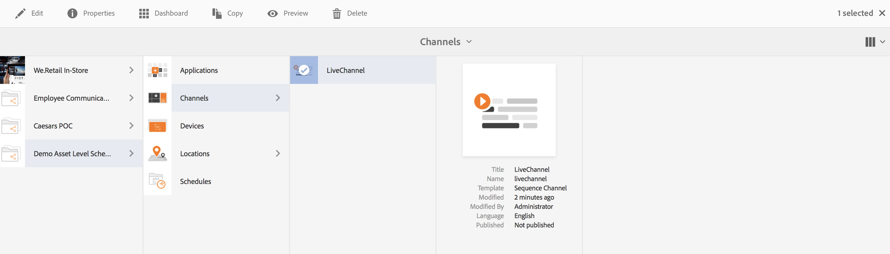
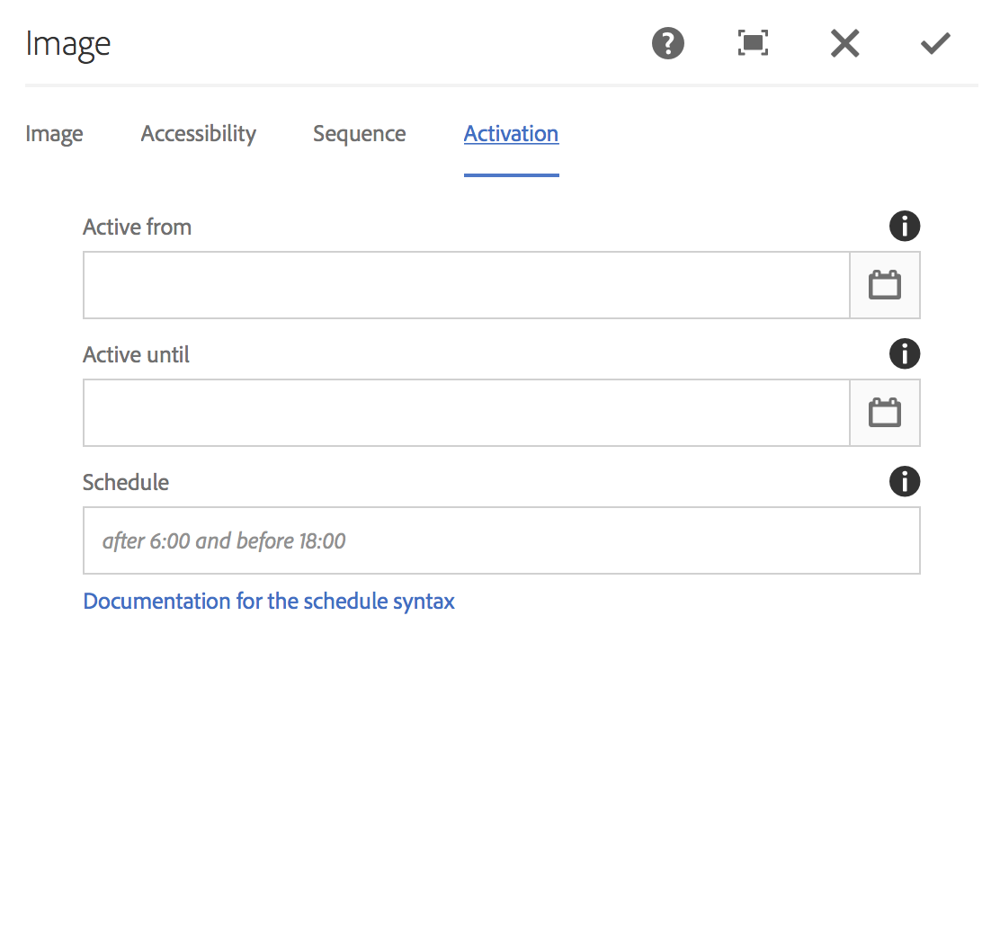

# Elementenniveauplanning {#asset-level-scheduling}

In deze sectie wordt de middelenniveauplanning voor de middelen beschreven die in Kanalen worden gebruikt.

De volgende onderwerpen worden behandeld in deze sectie:

* Overzicht
* Asset Level Scheduling gebruiken
* Herhaling van activa afhandelen
* Meerdere bedrijfsmiddelen plannen

>[!CAUTION]
>
>Deze AEM-schermfunctionaliteit is alleen beschikbaar als u AEM 6.3 Feature Pack 3 of AEM 6.4 Screens Feature Pack 1 hebt geïnstalleerd.
>
>Neem contact op met de ondersteuning van Adobe om toegang te krijgen tot dit onderdeel. Als u beschikt over de juiste machtigingen, kunt u deze downloaden via Pakket delen.

## Overzicht {#overview}

***Met Asset Level Scheduling*** kunt u een specifiek middel in een kanaal activeren voor een gepland tijdframe in de lokale tijdzone van de speler. Dit is beschikbaar voor afbeeldingen, video&#39;s, overgangen, pagina&#39;s en ingesloten kanalen (dynamisch of statisch).

*U wilt bijvoorbeeld* dat een speciale promotie alleen gedurende een gelukkig uur (2.00 tot 17.00 uur) op maandag en woensdag wordt weergegeven.

Met deze functie kunt u niet alleen de begin- en einddatum en -tijd opgeven, maar ook een herhalingspatroon.

## Asset Level Scheduling gebruiken {#using-asset-level-scheduling}

Asset Level Scheduling wordt uitgevoerd door het tabblad **Activering** te configureren en tegelijk de eigenschappen van een element te openen.

Voer de onderstaande stappen uit om de middelenplanning uit te voeren:

1. Selecteer een kanaal en klik op **Bewerken** op de actiebalk om inhoud aan uw kanaal toe te voegen of te bewerken.

   

   >[!NOTE]
   >
   >Meer informatie over hoe u
   >
   >* Creeer een project, zie het [Creëren van een nieuw Project](creating-a-screens-project.md).
   >* Zie Kanalen [beheren voor informatie over het maken en toevoegen van inhoud aan een kanaal](managing-channels.md).

1. Klik op **Bewerken** om de kanaaleditor te openen en selecteer een element waarop u de planning wilt toepassen.

   

1. Selecteer het element en klik op het **** configuratiepictogram linksboven om de eigenschappen van de afbeelding te openen.

   Klik op het tabblad **Activering** .

   

1. U kunt de datum van de datumkiezer van **Actief van** en **Actief tot** gebieden specificeren.

   Als u ** Actief van ** en **Actief tot** datum en tijd selecteert, zal het element tonen en slechts lijn tussen die begindatum/tijd en einddatum/tijd respectievelijk.

   

## Herhaling van activa afhandelen {#handling-recurrence-in-assets}

U kunt ook bepalen dat de middelen elke dag, week of maand opnieuw worden uitgevoerd, afhankelijk van uw vereisten.

Stel dat u een afbeelding alleen op vrijdag van 13.00 tot 19.00 uur wilt weergeven. U kunt het tabblad Activering gebruiken om het gewenste herhalingsinterval voor uw element in te stellen.

### Een terugkerende gebeurtenis toevoegen voor uw element {#adding-a-recurring-event-for-your-asset}

1. Selecteer het element en klik op het pictogram **Configureren** om het dialoogvenster Eigenschappen te openen.
1. Nadat u de begindatum/tijd en de einddatum/datumtijd hebt ingevoerd, kunt u een uitsnijdexpressie of een natuurlijke tekstversie gebruiken om uw terugkeringsschema op te geven.

   U kunt op het web zoeken naar een generator van een vrije uitsnijdexpressie en vervolgens de uitsnijdexpressie kopiëren en plakken in het **schema** en uw element wordt weergegeven voor het specifieke interval van de dag en tijd.

   *U kunt ook* de natuurlijke tekstversie, zoals *na 6:00 en voor 18:00* op vrijdag, gebruiken in plaats van de expressie voor bijsnijden. Voer de tekst in het **schema** in om uw element weer te geven.

## Meerdere bedrijfsmiddelen plannen {#multi-asset-scheduling}

>[!CAUTION]
>
>De functie **Multi-Asset Scheduling** is alleen beschikbaar als u AEM 6.3 Feature Pack 5 of AEM 6.4 Feature Pack 3 hebt geïnstalleerd.

***Met planning*** voor meerdere elementen kan de gebruiker meerdere elementen selecteren en een afspeelschema toepassen op alle geselecteerde elementen.

### Vereisten {#prerequisites}

Als u planningen op meerdere niveaus voor uw elementen wilt gebruiken, maakt u een AEM-schermproject met een volgnummer. In het volgende voorbeeld wordt de implementatie van de functie getoond:

* Een AEM-schermproject maken met de naam **MultiAssetDemo**
* Maak een kanaal met de naam **MultiAssetChannel** en voeg inhoud toe aan het kanaal, zoals in de onderstaande afbeelding wordt getoond

Voer de onderstaande stappen uit om meerdere elementen te selecteren en de weergave ervan in een AEM-rasterproject te plannen:

1. Selecteer **MultiAssetChannel** en klik op **Bewerken** op de actiebalk om de editor te openen.

   

1. Selecteer meerdere elementen in de editor en klik op Activering **** bewerken (pictogram linksboven).

   

1. Selecteer de datum en de tijd in **Actief van** en **Actief tot **van de de dialoogdoos van de Activering **van de** Component. Klik op het pictogram van het vinkje wanneer u klaar bent met het selecteren van de schema&#39;s.

   

1. Klik verfrissen om de activa te controleren waarop multi-activa programma wordt toegepast.

   >[!NOTE]
   >
   >Het planningspictogram is in de rechterbovenhoek zichtbaar voor die elementen die meerdere elementen plannen.

   

