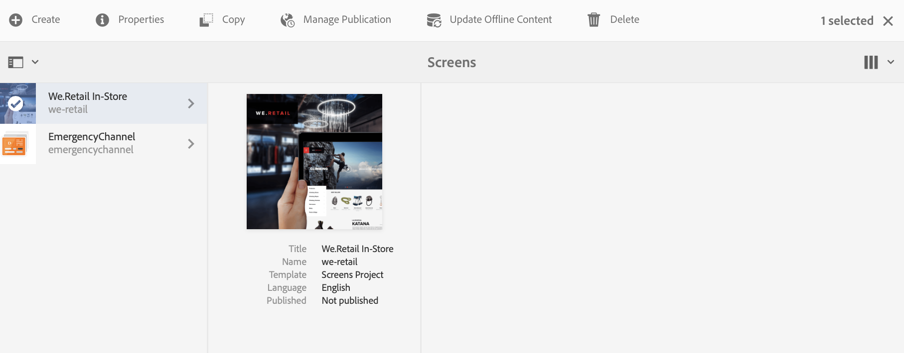
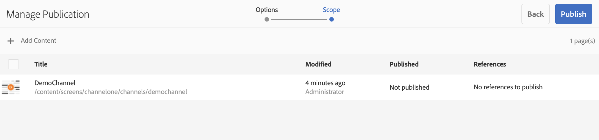

# Auteur en publicatie configureren in AEM-schermen{#configuring-author-and-publish-in-aem-screens}

Deze pagina benadrukt de volgende onderwerpen:

* **Auteur- en publicatie-instanties configureren**
* **Publicatietopologie instellen**
* **Publicatie beheren: Inhoud-updates leveren van auteur voor publicatie op apparaat**

## Vereisten {#prerequisites}

Voordat u aan de slag gaat met auteur- en publicatieservers, hebt u eerst kennis van:

* **AEM-topologie**
* **AEM-schermproject maken en beheren**
* **Registratieproces van apparaat**

>[!NOTE]
>
>Deze AEM-schermfunctionaliteit is alleen beschikbaar als u AEM 6.4 Screens Feature Pack 2 hebt geïnstalleerd. Neem contact op met de ondersteuning van Adobe om toegang te krijgen tot dit onderdeel. Als u beschikt over de juiste machtigingen, kunt u deze downloaden via Pakket delen.

## Instanties voor auteur en publiceren configureren {#configuring-author-and-publish-instances}

>[!NOTE]
>
>Als u meer wilt weten over de auteur en het architecturale overzicht wilt publiceren en wilt weten hoe de inhoud is geschreven op een AEM-auteurinstantie en vervolgens naar meerdere publicatieinstanties moet worden gerepliceerd, raadpleegt u het Overzicht [van de](author-publish-architecture-overview.md)auteur- en publicatiearchitectuur.

De volgende sectie verklaart hoe te om replicatieagenten op auteur te plaatsen en topologie te publiceren.

U kunt een eenvoudig voorbeeld instellen, waarin u een auteur en twee publicatie-instanties host:

* Auteur —> localhost:4502
* Publiceren 1 (pub1) —> localhost:4503
* Publiceren (pub2) —> localhost:4504

### Replication Agents instellen op auteur {#setting-up-replication-agents-on-author}

Om replicatieagenten tot stand te brengen, moet u leren hoe te om een standaardreplicatieagent tot stand te brengen.

Er zijn 3 replicatiemiddelen nodig voor de Schermen:

1. **Default Replication Agent ***(opgegeven als***Standard Replication Agent**)

1. **Screens Replication Agent**
1. **Replicatieagent omkeren**

Volg de zelfde stappen om een omgekeerde replicatieagent tot stand te brengen.

1. Navigeer naar uw AEM-instantie —> hamerpictogram —> **Bewerkingen** —> **Configuratie**.

   

1. Selecteer de **replicatie** in de linkernavigatiestructuur.

   

1. Selecteer de **Agenten op auteur** van de omslag van de **Replicatie** en klik **Nieuw** om een nieuwe standaardreplicatieagent tot stand te brengen.

   

1. Ga de **Titel** en de **Naam** in om de replicatieagent tot stand te brengen en te klikken **creeert**.

   

1. Klik met de rechtermuisknop op de replicatieagent en klik op **Openen** om de instellingen te bewerken.

   

1. Klik op **Bewerken** om het dialoogvenster **Agent-instellingen** te openen en de details in te voeren.

   

1. Navigeer naar het tabblad **Vervoer** en voer de **URI**, de **Gebruiker** en het **Wachtwoord** in.

   

   >[!NOTE]
   >
   >U kunt een bestaande standaardreplicatieagent ook kopiëren en anders noemen.

#### Standaardreplicatieagents maken {#creating-standard-replication-agents}

1. Creeer standaard replicatieagent voor pub1 (uit-van-de-doos standaardagent zou reeds moeten worden gevormd) (bijvoorbeeld, *https://&lt;hostname>:4503/bin/receive?sling:authRequestLogin=1*)

1. Creeer standaard replicatieagent voor pub2. U kunt rep agent voor pub1 kopiëren en het vervoer bijwerken dat voor pub2 moet worden gebruikt door de haven in de vervoerconfiguratie te veranderen. (bijvoorbeeld *https://&lt;hostname>:4504/bin/receive?sling:authRequestLogin=1*)

#### Schermreplicatieagents maken {#creating-screens-replication-agents}

1. Maak AEM-rasterreplicatieagent voor pub1. Buiten-de-doos, is er één genoemde Agent van de Replicatie van het Scherm die aan haven 4503 richt. Dit moet worden ingeschakeld.
1. Maak AEM-rasterreplicatieagent voor pub2. Kopieer de de replicatieagent van Schermen voor pub1 en verander de haven aan punt 4504 voor pub2.

#### Screens Reverse Replication Agents maken {#creating-screens-reverse-replication-agents}

1. Creeer standaard omgekeerde replicatieagent voor pub1.
1. Creeer standaard omgekeerde replicatieagent voor pub2. U kunt omgekeerde rep agent voor pub1 kopiëren en het vervoer bijwerken dat voor pub2 moet worden gebruikt door de haven in de vervoerconfiguratie te veranderen.

## Publicatietopologie instellen {#setting-up-publish-topology}

### Stap 1: Detectie op basis van Apache Sling-eiken configureren {#step-configure-apache-sling-oak-based-discovery}

Apache Sling Oak-Gebaseerde Ontdekking voor alle Publish instanties in de topologie opzetten

Voor elke publicatie-instantie:

1. Ga naar https://&lt;host>:&lt;port>/system/console/configMgr
1. Selecteer **Apache Sling Oak-Based Discovery Service** Configuration.
1. Update Topology schakelaar-URL&#39;s: Voeg URL&#39;s toe van alle publicatieinstanties voor deelname, namelijk [http://localhost:4502/libs/sling/topology/connector](http://localhost:4502/libs/sling/topology/connector)
1. Whitelist van de schakelaar van de topologie: aanpassen aan IPs of subnets die het ontleden publicatieinstanties behandelen
1. Lokale **lussen automatisch stoppen inschakelen**

De configuratie moet identiek zijn voor elke publicatie-instantie en de Local-loop met de auto-stop voorkomt een oneindige lus.

### Stap 2: Publicatietopologie verifiëren {#step-verify-publish-topology}

Voor om het even welke Publish instanties navigeer aan https://&lt;host>:&lt;port>/system/console/topologie. U zou elke te zien publiceren instantie in de topologie wordt vertegenwoordigd.

### Stap 3: ActiveMQ Artemis-cluster instellen {#step-setup-activemq-artemis-cluster}

Met deze stap kunt u een gecodeerd wachtwoord maken voor de ActiveMQ Artemis-cluster.\
De clustergebruiker en het wachtwoord van alle publiceer instanties in de topologie moeten identiek zijn. Het wachtwoord van de configuratie van de Artemis ActiveMQ moet worden gecodeerd. Aangezien elke instantie zijn eigen coderingssleutel heeft, is het nodig om Crypto Support te gebruiken om een gecodeerde wachtwoordtekenreeks te maken. Dan zal het gecodeerde wachtwoord in OSGi config voor ActiveMQ worden gebruikt.

Op elke publicatie-instantie:

1. Navigeer in de OSGi-console naar **MAIN** —> **Crypto Support** (*https://&lt;host>:&lt;port>/system/console/crypto*).

1. Typ het gewenste wachtwoord voor normale tekst (voor alle instanties hetzelfde) in **Onbewerkte tekst**
1. Klik op **Beveiligen**.
1. Kopieer de waarde **Beveiligde tekst** naar het aantekenblok of de teksteditor. Deze waarde zal in OSGi config voor ActiveMQ worden gebruikt.

Aangezien elke publicatieinstantie door gebrek unieke crypto sleutels heeft moet u deze stap op elke pub instantie uitvoeren en de unieke sleutel voor de volgende configuratie opslaan.

*Bijvoorbeeld*,

Pub1 - {1ec346330f1c26b5c48255084c3b7272a5e85260322edd59119828d1fa0a6 10e}\
Pub2 - {8d3d113c834cc4f52c2daee0da3cb0a21122a31f0138bfe4b70c9ead79415f41}

### Stap 4: ActiveMQ-artemiscluster activeren {#step-activate-activemq-artemis-cluster}

Op elke publicatie-instantie:

1. Navigeer naar de OSGi Config manager *https://&lt;host>:&lt;port>/system/console/configMgr*
1. Configuratie **Apache ActiveMQ Artemis JMS Provider** selecteren
1. Werk het volgende bij:

* ***Clusterwachtwoord***: (gebruik gecodeerde waarde uit vorige stap per instantie)
* ***Onderwerpen***: {name: &#39;commands&#39;, adres: &#39;com.adobe.cq.screens.commands&#39;, maxConsumers: 50}

### ActiveMQ Artemis-cluster verifiëren {#verify-activemq-artemis-cluster}

Voer de onderstaande stappen uit voor elke instantie Publiceren:

1. Navigeer naar de OSGi-console -> Hoofd > ActiveMQ-artemis ([http://localhost:4505/system/console/mq](http://localhost:4505/system/console/mq)).
1. Verifieer en controleer om de havens van andere instanties onder de Informatie van de Cluster te bekijken > Topology > knopen=2, members=2.
1. Een testbericht verzenden (boven aan het scherm onder Informatie over kiezer)
1. Voer de volgende wijzigingen in velden in:

   1. **Doel**: /com.adobe.cq.screens/devTestTopic
   1. **Tekst**:Hallo wereld
   1. Bekijk error.log van elke instantie om te zien dat het bericht over de cluster werd verzonden en werd ontvangen

>[!NOTE]
>
>Het navigeren aan console OSGI, kan een paar seconden na het bewaren van de configuratie in de voorafgaande stap vergen. U kunt error.log voor meer details ook controleren.

Als voorbeeld, toont het volgende beeld op succesvolle configuratie van de Server van Artemis ActiveMQ.

Als de volgende configuratie niet wordt weergegeven vanuit */systeem/console/mq*, navigeert u naar */systeem/console/mq* en klikt u op **Opnieuw starten** om de makelaar opnieuw te starten.

### Vereiste koptekst verwijzing verwijderen {#remove-referrer-header-requirement}

Voer de stappen uit op elke instantie Publiceren:

1. Navigeer naar **Configuratiebeheer** vanuit **OSGi Console**.
1. Selecteer **het filter** Apache-schuifverwijzing.
1. Werk config bij en **controleer Lege** toestaan.

## Instantie voor auteur en publicatie configureren {#configuring-author-and-publish-instance}

Nadat u de publicatietoepassing hebt ingesteld, moet u de auteur configureren en instanties publiceren om de praktische resultaten van de implementatie weer te geven:

>[!NOTE]
>
>**Vereisten**
>
>Om met dit voorbeeld te beginnen, creeer een nieuw project van het Scherm AEM door een plaats, een vertoning, en een kanaal in uw project te creëren. Voeg inhoud aan uw kanaal toe en wijs het kanaal aan een vertoning toe.

### Stap 1: AEM Screens Player (apparaat) starten {#step-starting-an-aem-screens-player-device}

1. Open een apart browservenster.
1. Ga naar de schermspeler met de [webbrowser](http://localhost:4502/content/mobileapps/cq-screens-player/firmware.html) of start de app AEM Screens. Wanneer u het apparaat opent, zult u merken dat de status van het apparaat niet is geregistreerd.

>[!NOTE]
>
>U kunt een AEM Screens speler openen gebruikend AEM Schermen app u of Webbrowser downloadde.

### Stap 2: Een apparaat registreren bij auteur {#step-registering-a-device-on-author}

1. Ga naar [http://localhost:4502/screens.html/content/screens/we-retail](http://localhost:4502/screens.html/content/screens/we-retail) of selecteer uw project en navigeer naar Apparaten > Apparaatbeheer.
1. Selecteer **Apparaat** registreren.
1. Klik op **Apparaatregistratie** om het apparaat weer te geven.
1. Selecteer het apparaat dat u wilt registreren en klik op **Apparaat** registreren.
1. Controleer de registratiecode en klik **bevestigen**.
1. Voer een titel voor het apparaat in en klik op **Registreren**.

#### Stap 3: Apparaat toewijzen aan weergave {#step-assigning-the-device-to-display}

1. Klik in de voorgaande stap in het dialoogvenster op Weergave **** toewijzen.
1. Selecteer het weergavepad voor uw kanaal in de map **Locations** .
1. Klik op **Toewijzen**.
1. Klik op **Voltooien** om het proces te voltooien en nu wordt het apparaat toegewezen.

Controleer de speler en u ziet de inhoud die u in het kanaal hebt toegevoegd.

### Stap 4: Apparaatconfiguratie publiceren om instanties te publiceren {#step-publishing-device-configuration-to-publish-instances}

**Het apparaat controleren**

Voer voordat u de onderstaande stappen uitvoert, de apparaat-id controleren. Zoek naar de apparaat-id in CRXDELite met het pad als */home/users/screens/{project}/devices* om dit te verifiëren.

Voer de onderstaande stappen uit om de gebruiker van het apparaat te repliceren:

1. Navigeer naar de pagina voor gebruikersbeheer (bijvoorbeeld: [http://localhost:4502/useradmin](http://localhost:4502/useradmin)).
1. Zoeken naar de **screens-devices-master** groep
1. Klik met de rechtermuisknop op de groep en klik op **Activeren**

>[!CAUTION]
>
>Activeer de auteur-publish-screens-service niet omdat dit een systeemgebruiker is, die wordt gebruikt door de Auteur-taak.

U kunt het apparaat ook activeren via de apparaatbeheerconsole. Voer de onderstaande stappen uit:

1. Navigeer naar uw project Schermen —> **Apparaten**.
1. Klik op **Apparaatbeheer** op de actiebalk.
1. Selecteer het apparaat en klik op **Activeren** in de actiebalk, zoals in de onderstaande afbeelding.

>[!NOTE]
>
>Als u het apparaat hebt geactiveerd, kunt u ook de URL van de server bewerken of bijwerken door te klikken op Server-URL **** bewerken in de actiebalk, zoals in de onderstaande afbeelding wordt getoond. De wijzigingen worden doorgegeven aan de AEM Screens-speler.

## Lijst met publicatiecontrole {#publishing-check-list}

De volgende punten geven een overzicht van de lijst Publishing Check:

* *Scherm Apparaatgebruiker* - Dit wordt opgeslagen als een AEM-gebruiker en wordt geactiveerd via **Gereedschappen** > **Beveiliging** > **Gebruikers**. De gebruiker zal met &quot;schermen&quot;met een lange geserialiseerde koord worden vooraf bepaald.

* *Project* - Het AEM Screens-project.

* *Locatie* - locatie waarmee het apparaat is verbonden.
* *Kanaal* - een of meer kanalen die op de locatie worden weergegeven
* *Plan* - als het gebruiken van een programma ervoor zorgt dit wordt gepubliceerd
* *Locatie, Planningen en Kanaalmap* - als de bijbehorende bronnen zich in een map bevinden.

Nadat u de controlelijst hebt geverifieerd, moet u de volgende wijzigingen/het volgende gedrag in uw kanaal verifiëren:

* Na publicatie van de apparaatconfiguratie opent u de schermspeler en wijst u deze naar de instantie Publish. Ook, kunt u het apparaat van de console van het apparatenbeheer ook activeren.
* Werk kanaalinhoud bij op Auteur en publiceer de inhoud en controleer of het bijgewerkte kanaal nu wordt weergegeven op de AEM Screens player.
* Sluit de Schermspeler aan op een andere publicatie-instantie en controleer bovenstaande functionaliteit.

### Stap 5: Het apparaat aanwijzen om een instantie te publiceren in het deelvenster Beheer {#step-pointing-the-device-to-publish-instance-in-the-admin-panel}

1. Bekijk de interface voor beheerders vanuit de schermspeler, druk lang linksboven om het menu Admin te openen, op de AEM Screens player met aanraakbediening of met een muis.
1. Klik op de optie **Configuratie **van het zijpaneel.
1. Schrijverinstantie wijzigen om instantie in **Server** te publiceren.

Bekijk de wijzigingen in uw AEM Screens player.

U kunt de URL van de server ook bijwerken/bewerken vanuit de apparaatbeheerconsole met de volgende stappen:

1. Navigeer naar het AEM-schermproject en selecteer de map **Devices** .
1. Klik op **Apparaatbeheer** op de actiebalk.
1. Selecteer het apparaat en klik op Server-URL **** bewerken op de actiebalk, zoals in de onderstaande afbeelding wordt getoond. De wijzigingen worden doorgegeven aan de AEM-schermspeler.

## Publicatie beheren: Inhoud-updates leveren van auteur voor publicatie op apparaat {#managing-publication-delivering-content-updates-from-author-to-publish-to-device}

U kunt inhoud publiceren en de publicatie ervan ongedaan maken vanuit AEM-schermen. Met de functie Publicatie beheren kunt u inhoud-updates van de auteur leveren en op het apparaat publiceren. U kunt inhoud publiceren/unpublish voor uw volledige project van het Scherm AEM of slechts voor één van uw kanaal, plaats, apparaat, toepassing, of een programma.

### Publicatie beheren voor een AEM-schermproject {#managing-publication-for-an-aem-screens-project}

Voer de onderstaande stappen uit om inhoudsupdates van auteur te leveren voor publicatie naar apparaat voor een AEM-schermproject:

1. Navigeer naar uw AEM-rasterproject.
1. Klik op Publicatie **** beheren op de actiebalk om het project te publiceren dat u wilt publiceren.

   

1. De wizard **Publicatie** beheren wordt geopend. U kunt de **actie** selecteren en ook de publicatietijd voor nu of later plannen. Click **Next**.

   

1. Schakel het selectievakje in om het volledige project te selecteren vanuit de wizard **Publicatie** beheren.

   

1. Klik op **+ Inclusief onderliggende items** op de actiebalk en schakel alle opties uit om alle modules in uw project te publiceren. Klik vervolgens op **Toevoegen** om te publiceren.

   >[!NOTE]
   >
   >Door gebrek, zullen alle dozen worden gecontroleerd en u zult manueel uncheck de dozen moeten om alle modules in uw project te publiceren.

   

1. Klik op **Publiceren** in de wizard ****** Publicatie beheren.

   

   >[!NOTE]
   >
   >Wacht een paar seconden/minuten, zodat de inhoud de instantie publish bereikt.
   >
   >De **publicatie** beheren met bijgewerkte offline inhoud bestaat uit twee stappen en de stappen moeten in de juiste volgorde worden uitgevoerd.
   >
   > 1. De workflow werkt niet als Offlineinhoud **** bijwerken wordt geactiveerd voordat deze wordt gepubliceerd met **Publicatie** beheren.
   > 1. De workflow werkt niet als het project geen wijzigingen bevat en niets voor Offlineinhoud **** bijwerken.
   > 1. De workflow werkt niet als de auteur het replicatieproces niet voltooit (inhoud wordt nog geüpload naar een publicatieexemplaar) nadat deze in de publicatieworkflow op de knop **Publiceren** heeft geklikt.

1. Nadat u de publicatieworkflow voor het beheren van publicaties hebt voltooid, moet u de update offline-inhoud in de auteur activeren. Hiermee wordt de update offline op de instantie van de auteur gemaakt.

   Navigeer naar het project en klik op Offlineinhoud **** bijwerken op de actiebalk. Deze handeling stuurt dezelfde opdracht door naar de publicatie-instantie, zodat de offline ritten ook in de publicatie-instantie worden gemaakt.

   

   >[!CAUTION]
   >
   >U moet eerst de update offline inhoud publiceren en vervolgens activeren, zoals samengevat in de voorgaande stappen.

### Publicatie voor een kanaal beheren {#managing-publication-for-a-channel}

Voer de onderstaande stappen uit om inhoudsupdates van auteur te leveren voor publicatie naar apparaat voor een Kanaal in een AEM-schermproject:

>[!NOTE]
>
>Volg deze sectie alleen als er wijzigingen zijn in een kanaal. Als er na de vorige update geen wijzigingen zijn aangebracht in een kanaal, werkt de publicatieworkflow voor een afzonderlijk kanaal niet.

1. Navigeer naar het project Schermen en selecteer het kanaal.
1. Klik op Publicatie **** beheren op de actiebalk om het kanaal te publiceren dat u wilt publiceren.

   

1. De wizard **Publicatie** beheren wordt geopend. U kunt de **actie** selecteren en ook de publicatietijd voor nu of later plannen. Click **Next**.

   

1. Klik op **Publiceren **via de wizard** Publicatie beheren **.**

   

   >[!NOTE]
   >
   >Wacht een paar seconden/minuten, zodat de inhoud de instantie publish bereikt.

1. Nadat u de publicatieworkflow voor het beheren van publicaties hebt voltooid, moet u de update offline-inhoud in de auteur activeren. Hiermee wordt de update offline op de instantie van de auteur gemaakt.

   Navigeer naar het kanaaldashboard en klik op Offlineinhoud **** bijwerken. Deze handeling stuurt dezelfde opdracht door naar de publicatie-instantie, zodat de offline ritten ook in de publicatie-instantie worden gemaakt.

   

   >[!CAUTION]
   >
   >U moet eerst de update offline inhoud publiceren en vervolgens activeren, zoals samengevat in de voorgaande stappen.

### Opnieuw toewijzen kanaal en apparaat: {#channel-and-device-re-assignment}

Als u een apparaat opnieuw hebt toegewezen, moet u zowel de eerste weergave als de nieuwe weergave publiceren zodra het apparaat opnieuw is toegewezen aan de nieuwe weergave.

Als u een kanaal opnieuw hebt toegewezen, moet u ook zowel de eerste weergave als de nieuwe weergave publiceren zodra het kanaal opnieuw is toegewezen aan de nieuwe weergave.
