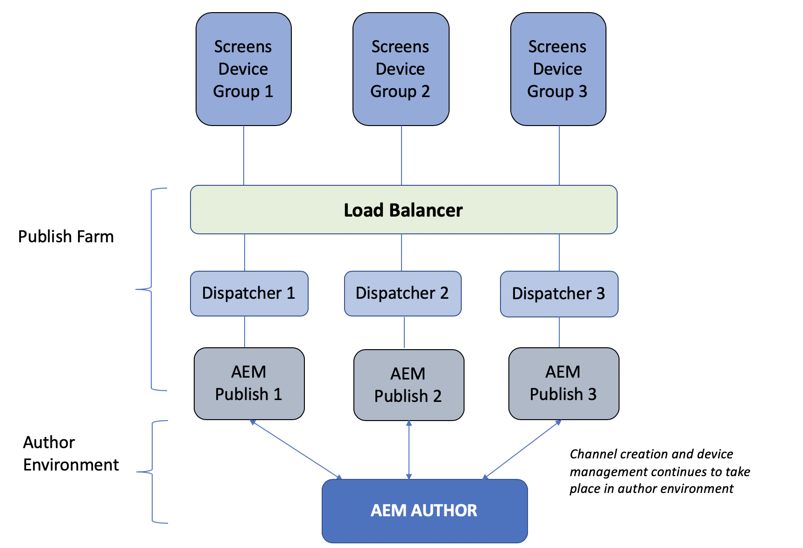

# Overzicht van auteur- en publicatiearchitectuur{#author-and-publish-architectural-overview}

Deze pagina benadrukt de volgende onderwerpen:

* **Inleiding tot publicatieservers**
* **Overzicht van architectuur**
* **Registratieproces**

## Vereisten {#prerequisites}

Voordat u aan de slag gaat met auteur- en publicatieservers, hebt u eerst kennis van:

* **AEM-topologie**
* **AEM-schermproject maken en beheren**
* **Registratieproces van apparaat**

>[!NOTE]
>
>Deze AEM-schermfunctionaliteit is alleen beschikbaar als u AEM 6.4 Screens Feature Pack 2 hebt geïnstalleerd. Neem contact op met de ondersteuning van Adobe om toegang te krijgen tot dit onderdeel. Als u beschikt over de juiste machtigingen, kunt u deze downloaden via Pakket delen.

## Inleiding {#introduction}

AEM-schermarchitectuur lijkt op een traditionele AEM-sitearchitectuur. Inhoud wordt gemaakt op een instantie van een AEM-auteur en wordt vervolgens doorgestuurd naar meerdere publicatie-instanties. AEM-rasterapparaten kunnen nu verbinding maken met een AEM-publicatiefarm via een taakverdelingsmechanisme. Meerdere AEM-publicatieexemplaren kunnen worden toegevoegd om door te gaan met het schalen van het publicatiebedrijf.

*Bijvoorbeeld*, geeft een AEM de inhoudauteur van Schermen een bevel op het auteurssysteem voor een bepaald apparaat uit dat wordt gevormd om met een publicatielandbouwbedrijf of een AEM de inhoudsauteur van Schermen in wisselwerking te staan die informatie over apparaten verkrijgt die worden gevormd om met publicatielandbouwbedrijven in wisselwerking te staan.

Het volgende diagram illustreert de auteur en publicatiemilieu&#39;s.

## Architecturaal ontwerp {#architectural-design}

Er zijn vijf architecturale componenten, die deze oplossing vergemakkelijken:

* ***Inhoud van auteur wordt gerepliceerd*** om te publiceren voor weergave door apparaten
* ***De herhalende*** binaire inhoud van publicatie (ontvangen van apparaten) omkeren naar de auteur
* ***Opdrachten van auteurs verzenden*** om te publiceren via specifieke REST API&#39;s
* ***Berichten*** tussen publicatieinstanties om updates en opdrachten voor apparaatinformatie te synchroniseren
* ***Opiniepeiling*** door de auteur van publicatie-instanties om apparaatinformatie via specifieke REST API&#39;s te verkrijgen

### Replicatie (vooruit) van inhoud en configuraties {#replication-forward-of-content-and-configurations}

De standaard replicatieagenten worden gebruikt om de inhoud van het het schermkanaal, locatieconfiguraties en apparatenconfiguraties te herhalen. Op deze manier kunnen auteurs de inhoud van een kanaal bijwerken en desgewenst een goedkeuringswerkstroom doorlopen voordat ze kanaalupdates publiceren. Een replicatieagent moet voor elke publicatieinstantie in publicatielandbouwbedrijf worden gecreeerd.

Het volgende diagram illustreert het replicatieproces:

>[!NOTE]
>
>Een replicatieagent moet voor elke publicatieinstantie in publicatielandbouwbedrijf worden gecreeerd.

### Screens Replication Agents and Commands {#screens-replication-agents-and-commands}

Er worden aangepaste schermspecifieke replicatiemiddelen gemaakt om opdrachten van de instantie Auteur naar het AEM-rasterapparaat te verzenden. De publicatie-instanties van AEM fungeren als tussenpersoon om deze opdrachten naar het apparaat door te sturen.

Hierdoor kunnen auteurs het apparaat blijven beheren, zoals apparaatupdates verzenden en screenshots nemen van de auteursomgeving. De AEM de replicatieagenten van het Scherm hebben een configuratie van het douanetransport, als standaardreplicatieagenten.

### Berichten tussen publicatie-instanties {#messaging-between-publish-instances}

In veel gevallen is een opdracht slechts bedoeld om één keer naar een apparaat te worden verzonden. In een publicatiearchitectuur met taakverdeling is het echter onbekend met welke instantie het apparaat verbinding maakt.

Daarom verzendt de auteurinstantie het bericht naar alle Publish instanties. Nochtans zou slechts één enkel bericht dan aan het apparaat moeten worden afgelost. Om correct overseinen te verzekeren moet één of andere mededeling plaatsvinden tussen publiceer instanties. Dit wordt bereikt met *Apache ActiveMQ Artemis. *Elke publicatie-instantie wordt in een los gekoppelde Toplogie geplaatst met behulp van de Eak-based Sling Discovery-service en ActiveMQ is geconfigureerd, zodat elke publicatie-instantie één berichtwachtrij kan communiceren en maken. Het apparaat van het Scherm opiniepeilt het publicatielandbouwbedrijf via het ladingsverdelingsmechanisme en neemt het bevel van de bovenkant van de rij op.

### Replicatie omkeren {#reverse-replication}

In veel gevallen, na een bevel, wordt één of andere soort reactie verwacht van het apparaat van het Scherm om aan de instantie van de Auteur door:sturen. Voor dit doel wordt ***omgekeerde replicatie*** van AEM gebruikt.

* Creeer een omgekeerde replicatieagent voor elke publiceer instantie, zoals aan de standaardreplicatieagenten en de agenten van de het schermreplicatie.
* Een configuratie van de werkschemaopstarter luistert naar knopen die op de publicatieinstantie worden gewijzigd en brengt beurtelings een werkschema teweeg om de reactie van het Apparaat in de Publish outbox van de instantie te plaatsen.
* Een omgekeerde replicatie in deze context wordt slechts gebruikt voor binaire gegevens (zoals, logboekdossiers en screenshots) die door de apparaten worden verstrekt. Niet-binaire gegevens worden opgehaald door polling.
* De omgekeerde replicatie die van de auteur AEM wordt gepolled wint de reactie terug en bewaart het aan de auteursinstantie.

### Opiniepeiling van publicatie-instanties {#polling-of-publish-instances}

De auteurinstantie moet de apparaten kunnen opiniepeilen om een hartslag te krijgen en de gezondheidsstatus van een aangesloten apparaat te kennen.

Apparaten pingelen het taakverdelingsmechanisme en worden gerouteerd naar een publicatie-instantie. De status van het apparaat wordt vervolgens vrijgegeven door de publicatie-instantie via een publicatie-API die @ **api/screens-dcc/devices/stati** voor alle actieve apparaten en **api/screens-dcc/devices/&lt;device_id>/status.json** voor één apparaat aanbiedt.

De instantie van de auteur opiniepeilt alle publicatieinstanties en voegt de reacties van de apparatenstatus in één enkele status samen. De geplande taak die opiniepeilt bij de auteur is *com.adobe.cq.screens.impl.jobs.DistributedDevicesStatusUpdateJob* en kan worden geconfigureerd op basis van een uitsnijdexpressie.

## Registratie {#registration}

Registratie blijft voortkomen uit de instantie van de AEM-auteur. AEM-rasterapparaat wordt naar de auteurinstantie verwezen en de registratie wordt voltooid.

Zodra een apparaat op het auteursmilieu is geregistreerd worden de apparatenconfiguratie en kanaal/planningtoewijzingen herhaald aan AEM publiceert instanties. De configuratie van het Apparaat van de Schermen AEM wordt dan bijgewerkt om aan de Balancer van de Lading vóór AEM te richten publiceert landbouwbedrijf. Dit is bedoeld om eenmalig te zijn, zodra het Schermapparaat met succes met het publicatiemilieu wordt verbonden kan het bevelen van het auteursmilieu blijven ontvangen en er zou geen behoefte moeten zijn om het apparaat van Schermen aan het auteursmilieu direct aan te sluiten.

### De volgende stappen {#the-next-steps}

Zodra u het architecturale ontwerp van auteur begrijpt en opstelling in de Schermen publiceert AEM, verwijs naar het [**Vormen Auteur en publiceren voor de Schermen **](author-and-publish.md)van AEM voor meer details.
