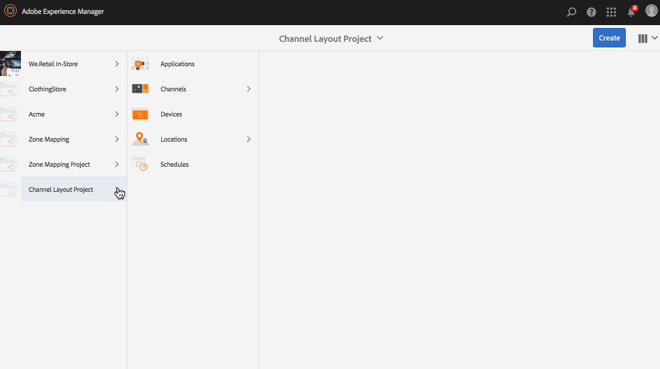

# Kanaalindelingseditor{#channel-layout-editor}

***Met de Kanaalindelingseditor*** kunt u inhoud met meerdere zones maken en verschillende elementen gebruiken, zoals video&#39;s, afbeeldingen en tekst die op contextafhankelijke manieren in één scherm kunnen worden gecombineerd. U kunt afbeeldingen, video&#39;s en teksten opnemen en deze allemaal laten overvloeien en een intuïtieve en interactieve digitale ervaring creëren.

Zoals bij de projectvereisten, soms hebt u veelvoudige streken in een kanaal nodig en geeft hen uit als één uitvoerige eenheid. Bijvoorbeeld, een productopeenvolging met een verwante sociale media voer die in drie afzonderlijke streken op één enkel kanaal loopt.

## Overzicht {#overview}

Tijdens het maken van een kanaal kunt u verschillende sjablonen gebruiken om zones in uw kanaal te maken. U kunt een afbeelding, video of een ingesloten kanaal toevoegen om de inhoud naar wens van uw project te benutten.

### Omschrijving hoofdletter gebruiken {#use-case-description}

In het volgende gebruiksgeval wordt beschreven hoe u meerdere zones in een kanaal maakt.

1. ***Schermproject maken***

   1. Selecteer de koppeling Adobe Experience Manager (linksboven) en vervolgens **Schermen**. U kunt ook rechtstreeks naar: http://localhost:4502/screens.html/content/screens.
   1. Klik op **Maken** om een nieuw project voor schermen te maken.
   1. Selecteer **Schermen** van de **Create tovenaar van het Project** van Schermen en klik **daarna**.
   1. Voer de titel in als **Kanaalindelingsproject** en klik op **Maken**.
   

1. ***Een kanaal maken***

   1. Navigeer naar **Kanaalindelingsproject**.
   1. Klik op **Maken** op de actiebalk. Er wordt een wizard geopend.
   1. Kies **1x2 Gesplitst het Kanaal** van het Scherm en klik **daarna**.
   1. Voer de **titel** in als **Gesplitste horizontale** titel en klik op **Maken**.
   

1. ***Inhoud toevoegen aan uw kanaal***

   1. Navigeer naar het **Kanaalindelingsproject** dat u hebt gemaakt en selecteer het kanaal (**Kanaal** splitsen).
   1. Klik op **Bewerken** op de actiebalk en de editor voor het **gesplitste kanaal** wordt geopend.
   1. Klik op het pictogram dat het zijpaneel links van de actiebalk in- en uitschakelt om de elementen en componenten te openen. Sleep de componenten die u aan het kanaal wilt toevoegen en zet deze neer.
   

   >[!NOTE]
   >
   >De volgende twee afbeeldingen worden bijvoorbeeld toegevoegd aan het kanaal in de editor.

   

1. ***Een locatie maken***

   1. Navigeer naar de map Locaties waar u de weergave wilt maken (**Kanaallay-outproject**> **Locaties**).
   1. Klik op **Maken** op de actiebalk.
   1. Selecteer **Locatie** in de wizard **Maken** en klik op **Volgende**.
   1. Voer **Titel** voor uw locatie in als **San Jose**.
   1. Klik op **Maken**.
   

1. ***Een nieuwe weergave maken***

   1. Navigeer naar de locatie waar u uw beeldscherm wilt maken (**Acme** —> **Locaties** —> **San Jose**) en selecteer **San Jose**.
   1. Klik op **Maken** op de actiebalk. Selecteer **Weergave** in de wizard **Maken** en klik op **Volgende**.
   1. Voer **Titel** in voor uw weergavelocatie (voer de titel in als **Gesplitste weergave)**.
   1. Kies onder het tabblad **Weergave** de details van de layout. Kies de **resolutie** als **Full HD**. Kies **Aantal apparaten horizontaal** als 1 en **Aantal apparaten verticaal** als **1**.
   1. Klik op **Maken**.
   

1. ***Een kanaal toewijzen***

   1. Navigeer naar de weergave via **Channel Layout Project** —> **Locaties** —> **San Jose** —> **Gesplitste weergave**.
   1. Selecteer Weergave **splitsen en tik/klik op Kanaal** **** toewijzen op de actiebalk of
   1. Klik op **dashboard** en selecteer **+Kanaal** toewijzen rechtsboven in het deelvenster **TOEGEWEZEN KANALEN EN SCHADUWEN** . **Het dialoogvenster Kanaaltoewijzing** wordt geopend.
   1. Voer de rol **** Kanaal in als **Gesplitst**.
   1. Selecteer **Referentiekanaal** op pad. Selecteer het pad van de kanaalmap (**Kanaalindelingsproject** —> **Kanalen** —> Horizontaal **** splitsen) in het kanaal.
   1. Selecteer **Prioriteit** voor dit kanaal als **1**.
   1. Kies de **Ondersteunde gebeurtenissen** als **Eerste Laden** en **Niet actief scherm**.
   1. Click **Save**.
   

1. ***Het apparaat registreren en toewijzen***

   1. Open een apart browservenster. Ga naar de schermspeler met de webbrowser of start de app AEM Screens.
   1. Wanneer u het apparaat opent, zult u merken dat de status van het apparaat niet is geregistreerd. Navigeer vanaf het AEM-dashboard naar **Channel Layout Project** —> **Apparaten**.
   1. Klik op **Apparaatbeheer** op de actiebalk.
   1. Klik op **Apparaatregistratie** en u ziet de apparaten die in behandeling zijn. Selecteer het apparaat dat u wilt registreren en klik op **Apparaat** registreren.
   1. U moet de code valideren door de code te controleren vanuit de webbrowser of AEM Screens player. Klik op **Valideren** om naar het scherm **Apparaatregistratie** te navigeren.
   1. Voer Titel in als **NieuwD** en klik op **Registreren** en het apparaat wordt geregistreerd.
   1. Klik op Weergave **** toewijzen om naar de volgende stap te gaan waar u het apparaat aan een weergave toewijst.
   1. Klik op Apparaat toewijzen en selecteer het weergavepad voor uw kanaal () als /content/screens/Test_Project/Locations/TestLocation/TestDisplay. Klik op **Toewijzen**.
   1. Klik op **Voltooien** om het proces te voltooien en nu wordt het apparaat toegewezen.
   

#### Inhoud weergeven in AEM Screens Player {#viewing-content-in-aem-screens-player}

Laad de AEM Screens Player of gebruik de webbrowser. De inhoud van het kanaal wordt weergegeven in de schermspeler. De inhoud wordt weergegeven als sjabloon voor 1x2 gesplitst schermkanaal.

### Opkomst {#inference}

Als u de beschikbare sjablonen gebruikt terwijl u een kanaal maakt, kunt u de inhoud in verschillende zones optimaliseren en weergeven. In het bovenstaande voorbeeld wordt het gebruik van de sjabloon 2x2 getoond.

In de volgende afbeeldingen ziet u de lay-out die met verschillende sjablonen kan worden bereikt.
