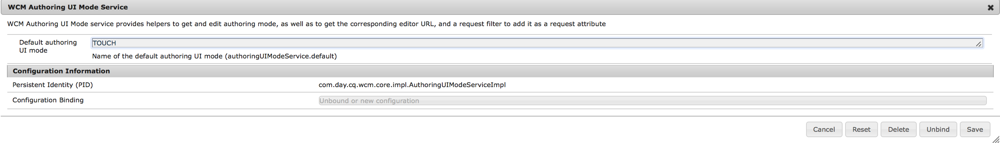

# AEM-schermen configureren en implementeren{#configuring-and-deploying-aem-screens}

Op deze pagina ziet u hoe u de schermspelers op uw apparaten kunt installeren en configureren. De pagina behandelt de volgende onderwerpen:

* AEM Screens Player installeren
* Serverconfiguratie
* Richtlijnen voor hardwareselectie voor afspeelapparaat
* De volgende stappen

## AEM Screens Player installeren {#installing-aem-screens-player}

De AEM-schermspeler is beschikbaar voor Android, Chrome OS, iOS en Windows.

Ga naar de pagina **AEM 6.4 Player Downloads** om AEM Screens Player [****](https://download.macromedia.com/screens/)te downloaden.

>[!NOTE]
>
>Nadat u de nieuwste Player (*.exe*) hebt gedownload, voert u de stappen op de speler uit om de ad-hocinstallatie te voltooien:
>
>1. Druk op de linkerbovenhoek om het beheerpaneel te openen.
>1. Navigeer naar **Configuratie** van het linkeractiemenu en ga het plaatsadres van de instantie AEM in **Server** in en klik **sparen**.
   >
   >
1. Klik op de koppeling **Registratie** in het actiemenu aan de linkerkant en voer de onderstaande stappen uit om het registratieproces van het apparaat te voltooien.
>

### Additional Resources {#additional-resources}

Raadpleeg de volgende onderwerpen voor diepgaande informatie:

* Ga naar **Google Play** om Android Player te downloaden. Raadpleeg Android-speler ****implementeren voor meer informatie over het implementeren van Android Watchdog.

* Raadpleeg de [Chrome Management Console](implementing-chrome-os-player.md) voor meer informatie als u Chrome OS Player wilt implementeren.
* Om AEM Schermen de speler van Vensters te vormen, gelieve te verwijzen naar het [Uitvoeren van de Speler](implementing-windows-player.md)van Vensters.

## Serverconfiguratie {#server-configuration}

>[!NOTE]
>
>**Belangrijk**:
>
>De AEM Screens-speler maakt geen gebruik van de token Cross-Site Request-smeedmachine (CSRF). Om de AEM-server te configureren en klaar te maken voor gebruik voor AEM-schermen, slaat u het verwijzingsfilter over door lege referenties toe te staan.

### Vereisten {#prerequisites}

De volgende belangrijke punten hieronder helpen om server te vormen en AEM klaar voor gebruik voor Schermen te zijn AEM:

#### Lege verwijzingsverzoeken toestaan {#allow-empty-referrer-requests}

Voer de onderstaande stappen uit om het filter Leeg toestaan van de Apache-schuifverwijzing in te schakelen. Dit is vereist voor een optimale werking van het controleprotocol tussen AEM Screens Player en AEM Screens server.

1. Ga naar **Adobe Experience Manager Web Console Configuration **via AEM instance —> hammer icon —> **Operations** —> **Web Console**.

   

1. **Configuratie** van de webconsole van Adobe Experience Manager wordt geopend. Zoeken naar de referentie van de sling.

   Voor het zoeken van het het rangschikken verwijzend bezit, druk **Command+F** voor **MAC** en **Control+F** voor **Vensters**.

   

1. Schakel de optie Lege **** waarden toestaan in, zoals in de onderstaande afbeelding.

   

1. Klik op **Opslaan** om het filter Leeg toestaan voor Apache-schuifverwijzing in te schakelen.

#### Aanraakinterface inschakelen voor AEM-schermen {#enable-touch-ui-for-aem-screens}

Voor AEM-schermen is een TOUCH-gebruikersinterface vereist en deze werken niet met de CLASSIC-gebruikersinterface van Adobe Experience Manager (AEM).

1. Navigeer naar *&lt;yourAuthorInstance>/system/console/configMgr/com.day.cq.wcm.core.impl.AuthoringUIModeServiceImpl*
1. Zorg ervoor dat de **standaardontwerpmodus** is ingesteld op **TOUCH**, zoals in de onderstaande afbeelding wordt getoond

U kunt ook dezelfde instelling uitvoeren met de gereedschappen*&lt;yourAuthorInstance> *->* (hamerpictogram)* -> **Bewerkingen** ->**Webconsole** en zoeken naar de Modus **voor** WCM-authoring.

>[!NOTE]
>
>Met de gebruikersvoorkeuren kunt u altijd de klassieke gebruikersinterface voor specifieke gebruikers inschakelen.

#### AEM in de runmode NOSAMPLECONTENT {#aem-in-nosamplecontent-runmode}

Bij het uitvoeren van AEM in productie wordt de **runmode NOSAMPLECONTENT** gebruikt. Verwijder de *X-Frame-Options=SAMEORIGIN* -header (in de extra sectie voor de responsheader)

[http://localhost:4502/system/console/configMgr/org.apache.sling.engine.impl.SlingMainServlet](http://localhost:4502/system/console/configMgr/org.apache.sling.engine.impl.SlingMainServlet).

Dit is vereist voor AEM Screens Player om online kanalen te spelen.

#### Wachtwoordbeperkingen {#password-restrictions}

Met de recentste veranderingen in ***DeviceServiceImpl***, moet u niet de wachtwoordbeperkingen verwijderen.

U kunt ***DeviceServiceImpl*** vanuit de onderstaande koppeling configureren om wachtwoordbeperking in te schakelen bij het maken van het wachtwoord voor schermapparaatgebruikers:

[http://localhost:4502/system/console/configMgr/com.adobe.cq.screens.device.impl.DeviceService](http://localhost:4502/system/console/configMgr/com.adobe.cq.screens.device.impl.DeviceService)

Voer de onderstaande stappen uit om ***DeviceServiceImpl*** te configureren:

1. Navigeer naar de webconsoleconfiguratie **van** Adobe Experience Manager via AEM-instantie —> hamerpictogram —> **Bewerkingen** —> **Webconsole**.

1. **Configuratie** van de webconsole van Adobe Experience Manager wordt geopend. Zoeken naar apparaatservice. Voor het zoeken van het bezit, druk **Command+F** voor **MAC** en **Control+F** voor **Vensters**.

#### Dispatcher Configuration {#dispatcher-configuration}

Voor **Dispatcher, **voeg cliëntkopballen aan .any dossier toe. Laat de volgende kopteksten door:

* &quot;x-requested-with&quot;
* &quot;X-SET-HEARTBEAT&quot;
* &quot;X-REQUEST-COMMAND&quot;

#### Java-codering {#java-encoding}

Stel de ***Java-codering*** in op Unicode. Dfile. *encoding=Cp1252* werkt bijvoorbeeld niet.

>[!NOTE]
>
>**Aanbeveling:**
>
>Het wordt aanbevolen HTTPS te gebruiken voor AEM Screens Server in productie.

## Richtlijnen voor hardwareselectie voor afspeelapparaat {#hardware-selection-guidelines-for-player-device}

In de volgende sectie vindt u de richtlijnen voor hardwareselectie voor een rasterproject:

* Bron altijd ***commerciële*** of ***industriële*** componenten voor zowel de speler van PC als van het Comité van de Vertoning of Projector.

* Neem altijd contact op met leveranciers die de markt voor digitale handtekeningen bedienen.
* Houd altijd rekening met omgevingsfactoren zoals omgevingstemperatuur en relatieve vochtigheid.
* Controleer altijd de stroomvereisten en de conditionering van het energieverbruik.
* Controleer zorgvuldig de prestatiebehoeften en I/O-poorten die vereist zijn voor de toepassing.

De volgende tabel geeft een overzicht van de hardwareconfiguraties met standaardgebruiksscenario&#39;s voor een AEM-schermproject:

<table> 
 <tbody> 
  <tr> 
   <td>Configuratie van speler</td> 
   <td>Processor</td> 
   <td>Geheugen</td> 
   <td>OpslagSSD</td> 
   <td>GPU</td> 
   <td>Weergave</td> 
   <td>I/O</td> 
   <td>Gebruiksscenario's</td> 
  </tr> 
  <tr> 
   <td>Basis</td> 
   <td>Dual Core, i3 of quad core Intel® Atom processor op instapniveau</td> 
   <td>
4 GB geheugen
 
2 MB cache
 </td> 
   <td>
・ChromeOS 32 GB
 
・Windows 128 GB
 </td> 
   <td>onBoard</td> 
   <td>1920 x 1080</td> 
   <td>DVI,   Ethernet/Wireless,  2 x USB</td> 
   <td> 
    <ul> 
     <li>Standaardherhaling op volledig scherm   </li> 
     <li>Dagverdeling</li> 
    </ul> </td> 
  </tr> 
  <tr> 
   <td>Standaard</td> 
   <td>Quad Core, Intel® Core i5 processor</td> 
   <td>
8 GB geheugen
 
4 MB cache
 </td> 
   <td>128 GBB</td> 
   <td>onBoard</td> 
   <td>3840x2160 (4K)</td> 
   <td>DVI, HDMI  Ethernet/Wireless,  2 x USB</td> 
   <td> 
    <ul> 
     <li>Dynamische inhoud van één bron </li> 
     <li>Eenvoudig interactief</li> 
     <li> 1-3 Zone-indelingen</li> 
    </ul> </td> 
  </tr> 
  <tr> 
   <td>Geavanceerd</td> 
   <td>Quad Core met hyperthreading, Intel® Core i7 processor</td> 
   <td>
16 GB geheugen
 
8 MB cache
 </td> 
   <td>256 GB</td> 
   <td>Discrete GPU</td> 
   <td>3840x2160 (4K)</td> 
   <td>DVI, HDMI  Ethernet/Wireless,  4x USB</td> 
   <td> 
    <ul> 
     <li>4 of meer inhoudszones, gelijktijdig afspelen van video</li> 
     <li> Interactief meerdere pagina's</li> 
     <li>Multi-Source Data Triggers</li> 
    </ul> </td> 
  </tr> 
 </tbody> 
</table>

## De volgende stappen {#the-next-steps}

Nadat u de schermspeler hebt geïnstalleerd en geconfigureerd, volgt u de onderstaande onderwerpen om aan de slag te gaan:

1. [Schermproject maken en beheren](creating-a-screens-project.md)
1. [Kanalen maken en beheren](managing-channels.md)
1. [Locaties maken en beheren](managing-locations.md)
1. [Weergaven maken en beheren](managing-displays.md)
1. [Kanalen toewijzen](channel-assignment.md)
1. [Apparaten beheren](managing-devices.md)
1. [Een apparaat registreren](device-registration.md)
1. [Apparaten toewijzen](managing-devices.md)
1. [Planningen maken en beheren](managing-schedules.md)
1. [AEM-schermspeler](working-with-screens-player.md)
1. [Apparaatbesturingscentrum problemen oplossen](monitoring-screens.md)

