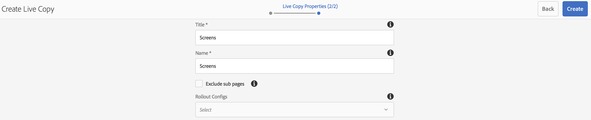

# Ervaringsfragmenten gebruiken{#using-experience-fragments}

Het gebruiken van de Fragmenten van de Ervaring behandelt de volgende onderwerpen:

* **Overzicht**
* **Experience Fragments gebruiken in AEM-schermen**
* **Wijzigingen doorgeven vanaf de stramienpagina**

## Overzicht {#overview}

Een fragment ***van de*** Ervaring is een groep van één of meerdere componenten met inbegrip van inhoud en lay-out die binnen pagina&#39;s van verwijzingen kunnen worden voorzien. De fragmenten van de ervaring kunnen om het even welke component, zoals, één of veelvoudige componenten bevatten die om het even wat binnen een paragraafsysteem kunnen bevatten, die in de volledige ervaring zullen worden van verwijzingen voorzien of door een derde eindpunt gevraagd.

## Experience Fragments gebruiken in AEM-schermen {#using-experience-fragments-in-aem-screens}

>[!NOTE]
>
>Het volgende voorbeeld gebruikt **We.Retail** als demoproject van waar het Fragment van de Ervaring van een pagina van **Plaatsen** aan een project van het Scherm AEM wordt gebruikt.

Als voorbeeld, toont het volgende werkschema het gebruik van ervaringsfragmenten van We.Retail in Plaatsen. U kunt een webpagina kiezen en die inhoud gebruiken in uw AEM-rasterkanaal op een van uw projecten.

### Voorwaarden {#pre-requisites}

**Een demoproject maken met een kanaal**

***Een project maken***

1. Klik op Schermen en selecteer **Maken** —> **Project maken **om een nieuw project te maken.

1. Selecteer **Schermen **van **Create het Project van Schermen **tovenaar.

1. Voer de titel in als **DemoProject**.
1. Klik op **Maken**.

Er wordt een **DemoProject** toegevoegd aan uw AEM-schermen.  ***Een kanaal maken***

1. Navigeer naar het **DemoProject** dat u hebt gemaakt en selecteer de map **Kanalen** .

1. Klik op **Maken** op de actiebalk (zie de onderstaande afbeelding). Er wordt een wizard geopend.
1. Kies het kanaal **van de** Reeks en klik **daarna**.

1. Voer de **titel** in als **TestChannel** en klik op **Maken**.

Er wordt een **TestChannel** toegevoegd aan uw **DemoProject**.\

>[!NOTE]
>
>Zie [Een project](creating-a-screens-project.md) maken en Kanalen [beheren voor meer informatie over het maken van een project en het](managing-channels.md) maken van een kanaal.

### Een ervaringsfragment maken {#creating-an-experience-fragment}

Volg de onderstaande stappen om de inhoud van **We.Retail** naar uw **TestChannel** in **DemoProject** te gebruiken.

1. **Navigeer aan een pagina van Plaatsen in Wij.Retail**

   1. Navigeer naar Sites en selecteer **We.Retail **->** Verenigde Staten **->**English **and selecteer **Equipment** page om dit als ervaringsfragment voor uw kanaal van het Scherm te gebruiken.
   1. Klik op **Bewerken** op de actiebalk om de pagina te openen die u wilt gebruiken als ervaringsfragment voor het kanaal Schermen.
   

1. **De inhoud opnieuw gebruiken**

   1. Selecteer het fragment dat u in het kanaal wilt opnemen.
   1. Klik op het laatste pictogram aan de rechterkant om het dialoogvenster **Omzetten in ervaring met fragmenten** te openen.
   

1. **Experience-fragment maken**

   1. Kies de **handeling** als **Een nieuw ervaringsfragment** maken.
   1. Selecteer het **bovenliggende pad**.
   1. Select the **Template**. Kies hier de sjabloon **We.Retail** .
   1. Voer de **Fragmenttitel **in als **ScreensFragment**.
   1. Klik op het vinkje om het maken van een nieuw ervaringsfragment te voltooien.
   

1. **Actieve kopie van ervaringsfragment maken**

   1. Navigeer naar de AEM-startpagina.
   1. Selecteer Fragmenten **van de** Ervaring en benadruk het **Schermfragment** en klik **Variatie als levende Exemplaar**, zoals aangetoond in het hieronder cijfer:
   

   c. Selecteer de wizard* ScreensFragment **van** Create Live Copy** en klik op **Volgende**.

   d. Voer de **titel** en de **naam** in als **schermen**.

   e. Klik op **Maken** om de actieve kopie te maken.

   

1. **Experience Fragment gebruiken in Schermkanaal**

   1. Navigeer naar het kanaal Schermen waar u het fragment **Screens** wilt gebruiken.
   1. Selecteer **TestChannel** en klik **uitgeven** van de bar.
   1. Klik op het componentpictogram op het zijtabblad.
   1. Sleep de **ingesloten pagina** naar het kanaal.
   

   e. Selecteer het onderdeel **Ingesloten pagina** en selecteer het pictogram linksboven om het dialoogvenster **Pagina** te openen.

   f. Selecteer de live **kopie van het fragment dat u hebt gemaakt in** stap 3 *in het veld **Path *** .

   

   h. Voer de seconden in het veld** Duur** in.

   
i. Klik op het vinkje om het proces te voltooien.

   

### Het resultaat valideren {#validating-the-result}

Nadat de voorafgaande stappen zijn voltooid, kunt u het ervaringsfragment in **TestChannel** valideren door:

1. Navigeer naar **TestChannel**.
1. De **voorvertoning** selecteren in de actiebalk.

U geeft de inhoud van de pagina **Sites** (live kopie van het ervaringsfragment) in uw kanaal weer, zoals in de onderstaande afbeelding wordt getoond:\

## Wijzigingen doorgeven vanaf de stramienpagina {#propagating-changes-from-the-master-page}

***Live Copy*** verwijst naar de kopie (van de bron), onderhouden door synchronisatiehandelingen zoals gedefinieerd door de rollout-configuraties.

Aangezien het fragment van de Ervaring, wij tot stand gebrachte een levende kopie van de pagina&#39;s van **Plaatsen** zijn, zodat als u veranderingen in dat specifieke fragment van de hoofdpagina aanbrengt, zult u de veranderingen in uw kanaal of de bestemming bekijken waar u het Fragment van de Ervaring hebt gebruikt.

>[!NOTE]
>
>Zie Inhoud [opnieuw gebruiken voor meer informatie over Live Copy: Beheer van meerdere sites en Live kopie](/help/sites-administering/msm.md).

Voer de onderstaande stappen uit om wijzigingen van het hoofdkanaal naar het doelkanaal door te geven:

1. Selecteer het fragment van de Ervaring van de pagina van **Plaatsen** (Hoofd) en klik het potloodpictogram om de punten in het Fragment van de Ervaring uit te geven.

   

1. Selecteer het fragment van de Ervaring en klik het moersleutelpictogram om de dialoogdoos te openen om de beelden uit te geven.

   

1. Het dialoogvenster **Productraster** wordt geopend.

   

1. U kunt alle afbeeldingen bewerken. Hier wordt bijvoorbeeld de eerste afbeelding in dit fragment vervangen.

   

1. Selecteer het fragment van de Ervaring en klik het pictogram van de Uitvoer om veranderingen in het fragment door te geven dat in uw kanaal wordt gebruikt.

   

1. Klik op Uitvoeren om de wijzigingen te bevestigen.

   U zult zien dat de wijzigingen zijn geïmplementeerd.

   

### De wijzigingen valideren {#validating-the-changes}

Voer de onderstaande stappen uit om de wijzigingen in uw kanaal te bevestigen:

1. Navigeer naar de **rasters** -> **Kanalen** -> **TestChannel**.

1. Klik op **Voorvertoning** op de actiebalk om de wijzigingen te bevestigen.

De volgende afbeelding illustreert de wijzigingen in uw **TestChannel**:\

