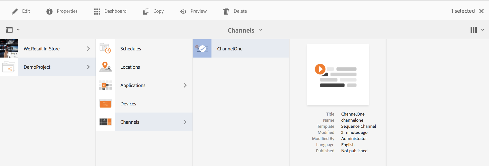
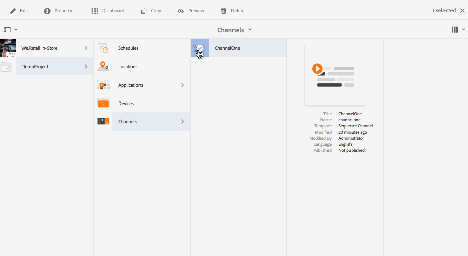
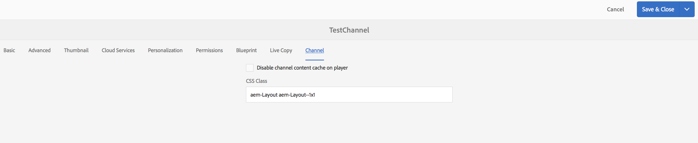

# Kanalen maken en beheren{#creating-and-managing-channels}

Een kanaal geeft een reeks van inhoud weer en geeft afbeeldingen en video&#39;s weer, maar ze kunnen ook een website of een toepassing van één pagina weergeven.

Op deze pagina ziet u hoe u kanalen voor schermen maakt en beheert.

**Voorwaarden**:

* [Schermen configureren en implementeren](configuring-screens-introduction.md)
* [Schermproject maken en beheren](creating-a-screens-project.md)

## Een nieuw kanaal maken {#creating-a-new-channel}

Nadat u een project voor schermen hebt gemaakt, volgt u de onderstaande stappen om een nieuw kanaal voor een project Screens te maken:

1. Selecteer de koppeling Adobe Experience Manager (linksboven) en klik op Schermen. U kunt ook rechtstreeks navigeren vanuit `http://localhost:4502/screens.html/content/screens`
1. Navigeer naar het project Schermen en klik op **Kanalen**.
1. Klik op **Maken** naast het plusteken op de actiebalk. Een tovenaar zal openen (*zie de Types van Kanaal voor meer informatie*).

1. Selecteer de sjabloon in de wizard en klik op **Volgende**.
1. Voer de eigenschappen in voor **Titel en tags**, **Meer titels en beschrijving**, **Aan/Uit-tijd** en **Vanity-URL**.

1. Klik op **Maken** en het kanaal wordt gemaakt en toegevoegd aan de map met kanalen.

### Kanaaltypen {#channel-types}

De volgende sjabloonopties zijn beschikbaar wanneer u de wizard gebruikt, zoals:

| **Sjabloon, optie** | **Beschrijving** |
|---|---|
| Map Kanalen | Hiermee kunt u een map maken waarin de verzameling kanalen wordt opgeslagen. |
| Volgekanaal | Hiermee kunt u een kanaal maken waarmee de componenten opeenvolgend worden afgespeeld (een voor een in een presentatie). |
| Toepassingskanaal | Hiermee kunt u uw aangepaste webtoepassing weergeven in de schermspeler. |
| 1 x 1 gesplitst schermkanaal | Hiermee kunt u de component in één zone weergeven. |
| 1 x 2 gesplitst schermkanaal | Hiermee kunt u de elementen weergeven in twee zones (horizontaal gesplitst). |
| 2 x 2 gesplitst schermkanaal | Hiermee kunt u de elementen weergeven in vier zones (horizontaal en verticaal in een matrix). |
| 2 tot 3 gesplitste schermkanaal | Hiermee kunt u de elementen weergeven in twee zones (horizontaal gesplitst) waarbij een van de zones groter is dan de andere. |

>[!NOTE]
>
>De gesplitste kanalen van het Scherm verdelen de vertoning in veelvoudige streken zodat kunt u verscheidene ervaringen tezelfdertijd, zij aan zij spelen. De ervaringen kunnen statische elementen/tekst of ingesloten reeksen zijn.

Het volgende voorbeeld toont de verwezenlijking van een Kanaal **ChannelOne** van de Opeenvolging voor een project **DemoProject** van het Scherm.

>[!NOTE]
>
>U kunt verschillende zones maken met behulp van de sjabloonopties, zoals 1x2, 2x2 of 2 tot 3 gesplitste schermkanalen die hierboven zijn vermeld.

***Belangrijk***:

Als u eenmaal inhoud aan uw kanaal hebt gemaakt en toegevoegd, bestaat de volgende stap uit het maken van een locatie, gevolgd door het maken van een weergave. Bovendien moet u dat kanaal aan een vertoning toewijzen. Zie de bronnen hieronder aan het einde van de sectie voor meer informatie.

## Werken met kanalen {#working-with-channels}

U kunt een kanaal bewerken, weergeven, eigenschappen en dashboard, kopiëren, voorvertonen en verwijderen.

>[!NOTE]
>
>Klik op het pictogram aan de linkerkant om een item te selecteren. Klik bijvoorbeeld op het pictogram voor het kanaal en voer de volgende handelingen uit, zoals in de onderstaande afbeelding wordt getoond.

### Inhoud toevoegen aan of bewerken in een kanaal {#adding-editing-content-to-a-channel}

Ga als volgt te werk om inhoud aan een kanaal toe te voegen of te bewerken:

1. Klik op het Kanaal u (zoals aangetoond in het hierboven cijfer) wilt uitgeven.
1. Klik in de linkerbovenhoek van de actiebalk op **Bewerken** om de kanaaleigenschappen te bewerken. De redacteur opent die u toestaat om activa/componenten aan uw kanaal toe te voegen die u wilt publiceren.

**Video&#39;s uploaden naar het kanaal** Voer de onderstaande stappen uit om video&#39;s te uploaden naar uw kanaal:

1. Selecteer het kanaal waar u de video wilt uploaden.
1. Klik op **Bewerken** op de actiebalk om de editor te openen.
1. Selecteer **Video&#39;s** onder Elementen en sleep de vereiste video&#39;s.

>[!NOTE]
>
>Zie [Problemen met het uploaden van video&#39;s in uw kanaal oplossen onder Beheren van schermen](troubleshoot-videos.md) .

### Eigenschappen weergeven {#viewing-properties}

Volg onderstaande stappen om de eigenschappen van een kanaal weer te geven of te bewerken:

1. Klik op het kanaal u wilt uitgeven.
1. Klik op **Eigenschappen **op de actiebalk om de kanaaleigenschappen weer te geven of te bewerken. Met de volgende tabbladen kunt u de opties wijzigen.

### Het dashboard weergeven {#viewing-dashboard}

Voer de volgende stappen uit om het dashboard van een kanaal weer te geven:

1. Klik op het kanaal u wilt uitgeven.
1. Klik op Dashboard **** weergeven op de actiebalk om de dashobard weer te geven. Het deelvenster **KANAALINFORMATIE** en **TOEGEWEZEN WEERGAVEN** wordt geopend, zoals in de onderstaande afbeelding wordt getoond:

### Kanaalgegevens {#channel-information}

In het deelvenster Kanaalgegevens worden de kanaaleigenschappen beschreven, samen met de voorvertoning naar het kanaal. Ook, verstrekt het u de informatie over of het kanaal off-line of online is.

Klik op de (**...**) in de **actiebalk Kanaalgegevens** om eigenschappen weer te geven, de inhoud te bewerken of de cache (offlineinhoud) voor het kanaal bij te werken.

### Online en offline kanalen {#online-and-offline-channels}

>[!NOTE]
>
>Wanneer u een kanaal maakt, is het kanaal standaard offline.

Wanneer u een kanaal maakt, kan dit worden gedefinieerd als een online- of een offlinekanaal.

Met een ***onlinekanaal*** wordt de bijgewerkte inhoud weergegeven in de real-time omgeving, terwijl met een ***offlinekanaal*** de inhoud in de cache wordt weergegeven.

Volg de onderstaande stappen om het kanaal online te maken:

1. Navigeer naar het kanaal **TestChannel** van de omslag van **Kanalen** in uw **TestProject**.

   Selecteer het kanaal.

   

   Klik op Dashboard **** weergeven op de actiebalk om de status van de speler weer te geven. Het venster **CHANNEL-INFORMATIE **bevat informatie over de vraag of het kanaal online of offline is.

   

1. Klik op **Eigenschappen** op de actiebalk en navigeer naar het tabblad **Kanaal** , zoals hieronder wordt weergegeven:

   

1. Schakel het kanaal online **** maken in om het kanaal online te maken.

   Klik op **Opslaan en sluiten** om de optie op te slaan.

   

   In het dashboard voor het kanaal wordt de status van de speler online weergegeven en in het venster **CHANNEL-INFORMATIE** wordt de status van de speler weergegeven.

   

#### Automatische versus handmatige updates van het apparaatdashboard {#automatic-versus-manual-updates-from-the-device-dashboard}

De volgende tabel geeft een overzicht van de gebeurtenissen die zijn gekoppeld aan de automatische en handmatige updates van het apparaatdashboard.

<table> 
 <tbody> 
  <tr> 
   <td><strong>Gebeurtenis</strong></td> 
   <td><strong>Automatisch bijwerken van apparaat</strong></td> 
   <td><strong>Handmatige update van apparaat</strong></td> 
  </tr> 
  <tr> 
   <td>Wijzigen in onlinekanaal</td> 
   <td>Inhoud automatisch bijgewerkt</td> 
   <td>
Inhoud bijgewerkt op "Apparaat: Push Config"
 
Of
 
Inhoud bijgewerkt op <strong><i>apparaat:Opnieuw starten</i></strong>
 </td> 
  </tr> 
  <tr> 
   <td>Wijziging in offlinekanaal, maar Channel "Push Content" wordt NIET geactiveerd (geen offlinepakket wordt opnieuw gemaakt)</td> 
   <td>Geen inhoud bijwerken</td> 
   <td>Geen inhoud bijwerken</td> 
  </tr> 
  <tr> 
   <td>Wijziging in offlinekanaal en Kanaal wordt "pushinhoud" geactiveerd (nieuw offlinepakket)</td> 
   <td>Inhoud automatisch bijgewerkt</td> 
   <td>
Inhoud bijgewerkt op <strong><i>apparaat: Push Config</i></strong>
 
Of
 
Inhoud bijgewerkt op <strong><i>apparaat:Opnieuw starten</i></strong>
 </td> 
  </tr> 
  <tr> 
   <td>
Wijzigen in configuratie
 
    <ul> 
     <li>Weergave (geforceerd kanaal)</li> 
     <li>Apparaat</li> 
     <li>Kanaaltoewijzingen (nieuw kanaal, verwijderd kanaal)</li> 
     <li>Kanaaltoewijzing (rol, gebeurtenis, planning)</li> 
    </ul> </td> 
   <td>Configuratie automatisch bijgewerkt</td> 
   <td>
Configuratie bijgewerkt op <strong><i>apparaat: Push Config</i></strong>
 
Of
 
Configuratie bijgewerkt op <strong><i>apparaat:Opnieuw starten</i></strong>
 </td> 
  </tr> 
 </tbody> 
</table>

### Toegewezen beeldschermen {#assigned-displays}

In het toegewezen deelvenster wordt de weergave weergegeven die aan het kanaal is gekoppeld. Het verstrekt een momentopname van de toegewezen vertoning samen met de resolutie.

De bijbehorende weergaven worden weergegeven in het deelvenster **Toegewezen beeldschermen** , zoals hieronder wordt getoond:

>[!NOTE]
>
>Raadpleeg de volgende bronnen voor meer informatie over het maken van een weergave op een locatie:
>
>* [Locaties maken en beheren](managing-locations.md)
>* [Weergaven maken en beheren](managing-displays.md)
>

Klik bovendien op de weergave in het deelvenster **TOEGEWEZEN WEERGAVEN** om de weergaveinformatie weer te geven, zoals hieronder wordt getoond:

### De volgende stappen {#the-next-steps}

De volgende stap na het maken van een kanaal en het toevoegen/bewerken van inhoud in uw kanaal is te leren hoe u een locatie en weergave kunt maken. Vervolgens wijst u een kanaal aan dat beeldscherm toe.

Zie de volgende bronnen voor de volgende stappen:

* [Kanalen maken en beheren](managing-channels.md)
* [Locaties maken en beheren](managing-locations.md)
* [Weergaven maken en beheren](managing-displays.md)