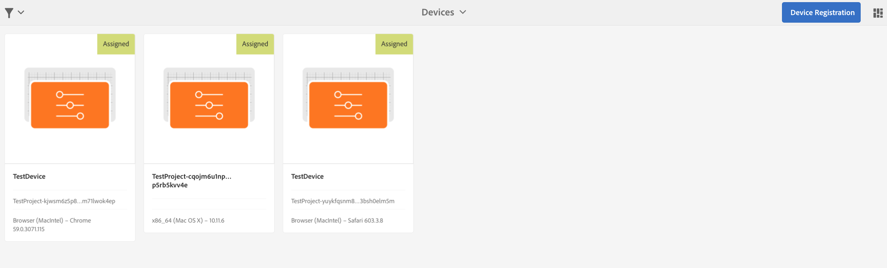

# Problemen oplossen in Device Control Center{#troubleshooting-device-control-center}

U kunt de prestaties voor de activiteit en het apparaat van de Schermspeler controleren en problemen oplossen gebruikend het dashboard van het Apparaat. Deze pagina biedt informatie over hoe u waargenomen prestatieproblemen voor de schermspeler en de toegewezen apparaten kunt controleren en oplossen.

## Monitor en problemen oplossen vanuit Device Control Center {#monitor-and-troubleshoot-from-device-control-center}

U kunt de activiteit controleren en zo uw speler van de Schermen problemen oplossen, gebruikend het Dashboard van het Apparaat.

### Apparaatdashboard {#device-dashboard}

Ga als volgt te werk om naar het dashboard van het apparaat te navigeren:

1. Navigeer naar het apparaatdashboard van uw project, bijvoorbeeld ***Test Project*** —> ***Apparaten***.

   Selecteer **Apparaten** en **Apparaatbeheer** in de actiebalk.

   

1. Selecteer het apparaat dat u wilt controleren.

   

1. De pagina bevat de apparaatinformatie, de activiteit en de apparaatdetails waarmee u de activiteiten en functies van het apparaat kunt controleren.

   

### Apparaatactiviteit controleren {#monitor-device-activity}

In het deelvenster **Activiteiten** wordt voor het laatst een tijdstempel van de schermspeler weergegeven. Laatste pingel beantwoordt aan de laatste tijd het apparaat met de server contacteerde.

Klik bovendien in de rechterbovenhoek van het deelvenster **Activiteit** op Logboeken **** verzamelen om de logbestanden voor uw speler weer te geven.

### Apparaatdetails bijwerken {#update-device-details}

Controleer het deelvenster **Apparaatdetails** om de IP van het apparaat, het opslaggebruik, de firmware-versie en de uptime van de speler voor het apparaat weer te geven.

Daarnaast klikt u op **Cache** wissen en **Bijwerken** om de cache van uw apparaat te wissen en de [firmware](screens-glossary.md) -versie in dit deelvenster bij te werken.

**Klik ook op de knop**... in de rechterbovenhoek van het deelvenster **Apparaatdetails** om de status van uw speler opnieuw te starten of te vernieuwen.

### Apparaatgegevens bijwerken {#update-device-information}

Controleer het deelvenster **APPARAATINFORMATIE** om de configuratieupdate, het apparaat, het platform, de versie en de weergave van het apparaat weer te geven.

Klik bovendien in de rechterbovenhoek van het deelvenster Apparaatinformatie op de knop (**...**) om eigenschappen weer te geven of het apparaat bij te werken.

Klik op **Eigenschappen** om het dialoogvenster **Apparaateigenschappen** weer te geven. U kunt de titel van het apparaat bewerken of de optie voor configuratie-updates kiezen als **Handmatig** of **Automatisch**.

>[!NOTE]
>
>Voor meer informatie over de gebeurtenissen verbonden aan de automatische of handupdates van het apparaat, zie de sectie ***Automatische versus Handmatige Updates van het Dashboard*** van het Apparaat in het [Leiden Kanalen](managing-channels.md).

### Schermafbeelding van speler weergeven {#view-player-screenshot}

U kunt de schermafbeelding van de speler bekijken vanaf het apparaat vanuit het deelvenster **PLAYER SCREENSHOT **.

Klik (**...**) op de hoogste juiste hoek van het paneel van het Schermafbeelding van de Speler en selecteer **vernieuwen Screenshot **om de momentopname van de lopende speler te bekijken.

### Voorkeuren beheren {#manage-preferences}

In het deelvenster **VOORKEUREN** kan de gebruiker voorkeuren wijzigen voor **Admin UI**, **Channel Switcher** en **Foutopsporing** op afstand voor het apparaat.

>[!NOTE]
>
>Zie [AEM Screens Player](working-with-screens-player.md)voor meer informatie over deze optie.

Klik bovendien in de rechterbovenhoek op **Weergavevoorkeuren** om de URL van de server en de resolutie bij te werken.

## OSGI-instellingen oplossen {#troubleshoot-osgi-settings}

U moet de lege referentie inschakelen zodat het apparaat gegevens op de server kan plaatsen. Als de lege referentie-eigenschap bijvoorbeeld is uitgeschakeld, kan het apparaat geen schermafbeelding terugplaatsen.

Sommige van deze functies zijn momenteel alleen beschikbaar als het filter *Apache Sling Reference Allow Empty* is ingeschakeld in de OSGI-configuratie. Op het dashboard kan een waarschuwing worden weergegeven dat bepaalde functies mogelijk niet kunnen worden gebruikt door beveiligingsinstellingen.

Voer de onderstaande stappen uit om het filter Leeg toestaan van Apache-verwijzing in te schakelen

1. Navigeer naar de webconsoleconfiguratie [van](http://localhost:4502/system/console/configMgr/org.apache.sling.security.impl.ReferrerFilter)Adobe Experience Manager.
1. Controleer de optie **allow.empty **option.
1. Click **Save**.

### Aanbevelingen {#recommendations}

In de volgende sectie wordt aangeraden de netwerkkoppelingen, de server en de spelers te controleren om de status te begrijpen en op problemen te reageren.

AEM biedt ingebouwde bewaking voor:

* *De hartslag* om de 5 seconden geeft aan dat de AEM Screens Player wordt uitgevoerd.
* *Screenshot* van de Player die toont wat momenteel wordt weergegeven op de Player.
* De *AEM schermt Player Firmware* -versie die op de speler is geïnstalleerd.
* *Vrije opslagruimte* op de speler.

Aanbevelingen voor externe controle met software van derden:

* CPU-gebruik op afspeelapparatuur.
* Controleer of het AEM-schermPlayer-proces wordt uitgevoerd.
* Extern opnieuw opstarten/opnieuw opstarten van de Player.
* Real-time meldingen.

Het wordt aanbevolen de Player-hardware en het besturingssysteem zodanig te implementeren dat externe aanmelding problemen kan opsporen en de Player opnieuw kan starten.

#### Additional Resources {#additional-resources}

Zie Configuratie en het Oplossen van problemen bij het afspelen van [video](troubleshoot-videos.md) om fouten op te sporen in video&#39;s die in uw kanaal worden afgespeeld en problemen op te lossen.
