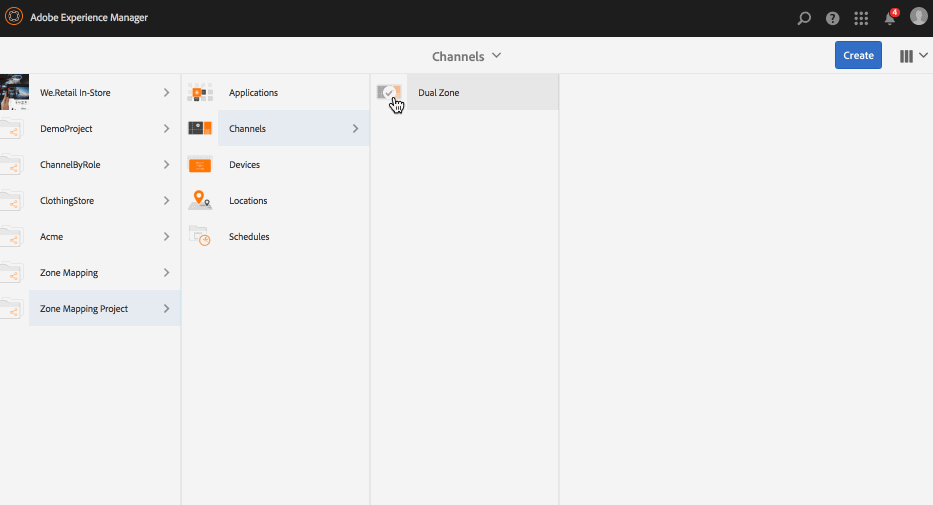

# Indelingseditor weergeven{#display-layout-editor}

***Met Zone Mapping*** kunt u verschillende zones maken en verschillende elementen gebruiken, zoals video&#39;s, afbeeldingen en tekst die op contextafhankelijke manieren in één scherm kunnen worden gecombineerd. U kunt afbeeldingen, video&#39;s en teksten opnemen en deze allemaal laten overvloeien en een intuïtieve en interactieve digitale ervaring creëren. Zoals per de projectvereisten, soms hebt u veelvoudige streken in een vertoning nodig.

Bijvoorbeeld, een productopeenvolging met een verwante sociale media voer die in twee afzonderlijke streken op één enkele vertoning loopt.

## Overzicht {#overview}

Tijdens het maken van een weergave voor uw kanaal kunt u verschillende sjabloonopties kiezen om inhoud in uw kanaal weer te geven/te beheren.

De volgende sjablonen zijn beschikbaar tijdens het maken van zones voor weergave:

* 2x1
* 2x2
* 3x1
* 4x1
* 5x1

Met een van deze sjablonen kunt u een intuïtieve en interactieve digitale handtekening maken, waarbij verschillende inhoud op één scherm kan worden gebruikt.

>[!NOTE]
>
>Zie Kanalen [beheren en Weergaven](managing-channels.md) beheren in [Ontwerpschermen voor meer informatie over het maken van kanalen en weergaven](managing-displays.md) .

## Omschrijving hoofdletter gebruiken {#use-case-description}

Met dit gebruiksgeval kunt u een AEM-schermproject maken met een kanaal dat inhoud gebruikt en dat in meerdere zones op het scherm wordt weergegeven.

>[!NOTE]
>
>De inhoud wordt niet geschaald door zones en dat moet gebeuren voordat de inhoud op uw kanalen wordt ingevoegd.

### Stappen voor het maken van een project {#steps-for-creating-a-project}

Voer de onderstaande stappen uit om een AEM Screens-project te maken dat laat zien hoe u zone mapping voor uw AEM Screens-project kunt maken:

1. ***Een nieuw schermproject maken***

   1. Selecteer de koppeling Adobe Experience Manager (linksboven) en klik op Schermen. U kunt ook rechtstreeks naar: [http://localhost:4502/screens.html/content/screens](http://localhost:4502/screens.html/content/screens).
   1. Klik op **Maken** om een nieuw project voor schermen te maken.
   1. Selecteer **Schermen** van de **Create tovenaar van het Project** van Schermen en klik **daarna**.
   1. Voer de titel in als **Demo Mapping Project** en klik op **Maken**.
   

1. ***Nieuwe map voor kanalen maken***

   1. Ga naar** Zone Mapping Project**.
   1. Klik op **Maken** op de actiebalk. Er wordt een wizard geopend.
   1. Kies de map **Kanalen **en klik op **Volgende**.
   1. Voer de titel in als **Dubbele zone **en klik op **Maken**.
   

1. ***Een nieuw kanaal maken***

   1. Navigeer naar het project **voor** toewijzing van zones dat u hebt gemaakt en selecteer de map Kanalen (**dubbele zone**).
   1. Klik op **Maken** op de actiebalk. Er wordt een wizard geopend.
   1. Kies het kanaal **Volgorde **en klik **daarna**.
   1. Voer de **titel** in als **Links** en klik op **Maken**.
   Maak op dezelfde manier een ander volgnummer als **Rechts** in het **project** voorToewijzing van zones.

   

1. ***Inhoud toevoegen aan de kanalen***

   1. Navigeer naar het project **voor** toewijzing van zones dat u hebt gemaakt en selecteer het **kanaal** dat u hebt gemaakt.
   1. Klik op **Bewerken** op de actiebalk.
   1. De editor voor **links** wordt geopend. Klik op het pictogram dat het zijpaneel links van de actiebalk in- en uitschakelt om de elementen en componenten te openen.
   1. Sleep de componenten die u aan het kanaal wilt toevoegen en zet deze neer.
   Voeg op dezelfde manier ook inhoud toe aan het **rechterkanaal** .

   

   >[!NOTE]
   >
   >U kunt de inhoud in uw kanalen vullen met verschillende elementen (afbeeldingen, video&#39;s), afhankelijk van uw projectvereisten.

1. ***Een nieuwe locatie maken***

   1. Navigeer naar het project** Zone Mapping Project** en selecteer de map **Locations** .
   1. Klik op **Maken** naast het plusteken op de actiebalk. Er wordt een wizard geopend.
   1. Selecteer **Locatie** in de wizard en klik op **Volgende**.
   1. Voer de **titel** voor uw locatie in (voer de titel in als **San Jose**) en klik op **Maken**.
   

1. ***Een nieuwe weergave maken voor San Jose***

   1. Navigeer naar de locatie waar u uw beeldscherm wilt maken (**Demo Mapping Project** —> **Locations** —> **San Jose**) en selecteer **San Jose**.
   1. Klik op **Maken** op de actiebalk. Selecteer **Weergave** in de wizard **Maken** en klik op **Volgende**.
   1. Voer **Titel** in voor uw weergavelocatie (voer de titel in als **Dubbele zone**).
   1. Kies onder het tabblad **Weergave** de details van de layout. Kies de resolutie als **Full HD**.
   1. Kies het **aantal apparaten horizontaal** als **2**. Kies het **aantal apparaten verticaal** als **1**.
   1. Klik op **Maken**.
   

1. ***Een kanaal toewijzen***

   1. Navigeer naar de weergave vanuit **Zone Mapping Project** —> **Locations** —> **San Jose** —> **Weergave** van twee zones.
   1. Selecteer **Weergave van twee zones **en tik op Kanaal **** toewijzen/klik op de actiebalk of
   1. Klik op **dashboard** en selecteer **+Kanaal** toewijzen rechtsboven in het deelvenster **TOEGEWEZEN KANALEN EN SCHADUWEN** , zoals in de onderstaande afbeelding wordt getoond. **Kanaaltoewijzing **dialoogvenster wordt geopend.
   1. Voer de rol **** Kanaal in als **zone**.
   1. Selecteer Referentiekanaal op pad. Selecteer het pad naar de kanaalmap (**Zone Mapping Project **—> **Kanalen** —> **Dubbele zone** ) in het kanaal.
   1. Selecteer **Prioriteit** voor dit kanaal als **1**. Kies de **Ondersteunde gebeurtenissen** als **Eerste Laden** en **Niet actief scherm**.
   1. Click **Save**.
   

1. ***Het apparaat registreren en toewijzen***

   1. Open een apart browservenster. Ga naar de schermspeler met de webbrowser of start de app AEM Screens. Wanneer u het apparaat opent, zult u merken dat de status van het apparaat niet is geregistreerd.
   1. Navigeer vanaf het AEM-dashboard naar **Zone Mapping Project** —> **Devices**.
   1. Klik op** Apparaatbeheer** op de actiebalk.
   1. Klik op **Apparaatregistratie** en u ziet de apparaten die in behandeling zijn.
   1. Selecteer het apparaat dat u wilt registreren en klik op **Apparaat** registreren.
   1. U moet de code valideren door de code te controleren vanuit de webbrowser of AEM Screens player. Klik op **Valideren** om naar het scherm **Apparaatregistratie** te navigeren.
   1. Voer **Titel** in als **Zone-apparaat** en klik op **Registreren** en het apparaat wordt geregistreerd.
   1. Klik op Weergave **** toewijzen om naar de volgende stap te gaan waar u het apparaat aan een weergave toewijst.
   1. Klik op Apparaat **** toewijzen en selecteer het weergavepad voor uw kanaal () als */content/screens/Test_Project/Locations/TestLocation/TestDisplay*. Klik op **Toewijzen**.
   1. Klik op **Voltooien** om het proces te voltooien en nu wordt het apparaat toegewezen.
   

1. ***Weergave van meerdere zones maken***

   1. Navigeer en selecteer de vertoning van het Project **van de Toewijzing van de** Zone -> **Plaatsen** -> **San Jose **—> **Dubbele Zone **vertoning en klik **Dashboard** van de actiebar.
   1. Selecteer het pictogram links van de Configuratie **van het** Apparaat van uw speler van het paneel van **APPARATEN** en klik **eigenschappen**.
   1. Navigeer naar het tabblad **Apparaatconfiguratie** en vul de velden **Toewijzing** en **Sjabloon** in. Ga *{&quot;a1&quot;:&quot;${display.channel}/left&quot;, &quot;a2&quot; in: &quot;${display.channel}/right&quot;}* in het veld **Toewijzen** en de sjabloon als *raster-2x1*.
   1. Klik op **Opslaan en sluiten** en laad de speler opnieuw.
   >[!NOTE]
   >
   >***Werken met toewijzen en sjabloon in apparaatconfiguratie:***
   >
   >* de identificatiecodes &quot;a1&quot; en &quot;a2&quot; komen overeen met de zones die in de sjabloon zijn gedefinieerd, namelijk &quot;screens-zone-a1&quot; en &quot;screens-zone-a2&quot;.
   >* ${display.channel}/left&quot;richt aan het kanaal om in de streek in te bedden, waar &quot;display.channel&quot;aan de huidige kanaalweg in de vertoning richt. Hierdoor worden de onderliggende elementen &quot;links&quot; en &quot;rechts&quot; van het kanaal ingesloten.

   

#### Inhoud weergeven in AEM Screens Player {#viewing-content-in-aem-screens-player}

Laad de AEM Screens Player of gebruik de webbrowser.

U ziet de inhoud van zowel het kanaal (links als rechts) dat wordt weergegeven in de schermspeler. De inhoud wordt weergegeven als een 2x1-weergavezone.

### Opkomst {#inference}

Met Zone Mapping (toewijzen van zones) die een van de beschikbare sjablonen gebruikt tijdens het maken van een kanaal in AEM-schermen, kunt u afvlakken aan de clientzijde uitvoeren. U kunt verschillende zones op uw scherm maken en de zones verder vullen met video&#39;s, afbeeldingen en andere beschikbare elementen.
